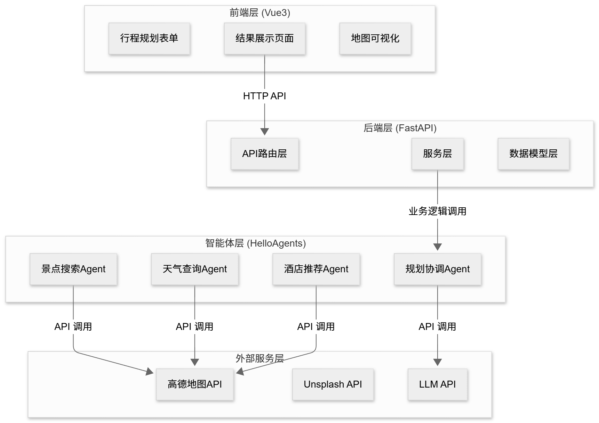
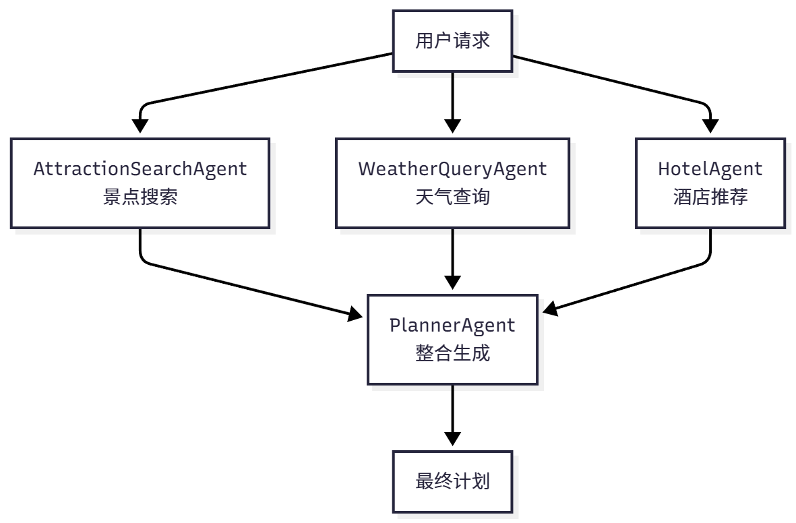

# 第十三章 智能旅行助手

核心功能：

（1）智能行程规划：用户输入目的地、日期、偏好等信息，系统自动生成包含景点、餐饮、酒店的完整行程计划。

（2）地图可视化：在地图上标注景点位置、绘制游览路线，让行程一目了然。

（3）预算计算：自动计算门票、酒店、餐饮、交通费用，显示预算明细。

（4）行程编辑：支持添加、删除、调整景点，实时更新地图。

（5）导出功能：支持导出为 PDF 或图片，方便保存和分享。

## 13.1 项目概述与架构设计

### 13.1.1 技术架构概览



（1）前端层 (Vue3+TypeScript)：负责用户交互和数据展示，包括表单输入、结果展示、地图可视化。

（2）后端层 (FastAPI)：负责 API 路由、数据验证、业务逻辑。

（3）智能体层 (HelloAgents)：负责任务分解、工具调用、结果整合。包含 4 个专门的 Agent。

（4）外部服务层：提供数据和能力，包括高德地图 API、Unsplash API、LLM API。

数据流转过程如下：用户在前端填写表单 → 后端验证数据 → 调用智能体系统 → 智能体依次调用景点搜索、天气查询、酒店推荐、行程规划 Agent → 每个 Agent 通过 MCP 协议调用外部 API → 整合结果返回前端 → 前端渲染展示。

```bash
helloagents-trip-planner/
├── backend/                    # 后端代码
│   ├── app/
│   │   ├── agents/            # 智能体实现
│   │   ├── api/               # API路由
│   │   ├── models/            # 数据模型
│   │   ├── services/          # 服务层
│   │   └── config.py          # 配置文件
│   └── requirements.txt       # Python依赖
│
└── frontend/                   # 前端代码
    ├── src/
    │   ├── views/             # 页面组件
    │   ├── services/          # API服务
    │   ├── types/             # 类型定义
    │   └── router/            # 路由配置
    └── package.json           # npm依赖
```

## 13.2 数据模型设计
### 13.2.1 Web应用中的数据流转

数据经历了多次转换：前端表单 → HTTP 请求 → 后端 Python 对象 → 外部 API 响应 → 后端 Python 对象 → HTTP 响应 → 前端 TypeScript 对象 → 页面展示。

### 13.2.2 从字典到Pydantic模型

Pydantic 提供了一个解决方案。它是 Python 的数据验证库，可以让我们用类来定义数据结构，并自动处理验证、转换和序列化。简单的例子：
```python
from pydantic import BaseModel,Field

class Location(BaseModel):
    longitude: float = Field(...,description="经度")
    latitude: float = Field(...,description="纬度")

class Attraction(BaseModel):
    name: str
    location: Location
    ticket_price: int = 0

# 创建对象
attraction = Attraction(
    name="故宫",
    location=Location(longitude=116.397128,latitude=39.916527),
    ticket_price=60
)

# 类型安全的访问
lng = attraction.location.longitude  # IDE会提供代码补全
```

### 13.2.3 Pydantic的核心概念
```python
from pydantic import BaseModel,Field
from typing import Optional,List

class Attraction(BaseModel):
    name: str = Field(...,description="景点名称")  # 必填
    rating: float = Field(default=0.0,ge=0,le=5)  # 默认值,范围验证
    visit_duration: int = Field(default=60,gt=0)  # 大于0
    description: Optional[str] = None  # 可选字段

class DayPlan(BaseModel):
    date: str
    attractions: List[Attraction]  # 景点列表
    hotel: Optional[Hotel] = None  # 可选的酒店信息


# 自定义验证器
from pydantic import field_validator

class WeatherInfo(BaseModel):
    temperature: int
    
    @field_validator('temperature',mode='before')
    def parse_temperature(cls,v):
        """解析温度字符串："16°C" -> 16"""
        if isinstance(v,str):
            v = v.replace('°C','').replace('℃','').strip()
            return int(v)
        return v

```

### 13.2.4 自底向上的模型设计

```python

class Location(BaseModel):
    """位置信息(经纬度坐标)"""
    longitude: float = Field(...,description="经度",ge=-180,le=180)
    latitude: float = Field(...,description="纬度",ge=-90,le=90)

class Attraction(BaseModel):
    """景点信息"""
    name: str = Field(...,description="景点名称")
    address: str = Field(...,description="地址")
    location: Location = Field(...,description="经纬度坐标")
    visit_duration: int = Field(...,description="建议游览时间(分钟)",gt=0)
    description: str = Field(...,description="景点描述")
    category: Optional[str] = Field(default="景点",description="景点类别")
    rating: Optional[float] = Field(default=None,ge=0,le=5,description="评分")
    image_url: Optional[str] = Field(default=None,description="图片URL")
    ticket_price: int = Field(default=0,ge=0,description="门票价格(元)")


class Meal(BaseModel):
    """餐饮信息"""
    type: str = Field(...,description="餐饮类型：breakfast/lunch/dinner/snack")
    name: str = Field(...,description="餐饮名称")
    address: Optional[str] = Field(default=None,description="地址")
    location: Optional[Location] = Field(default=None,description="经纬度坐标")
    description: Optional[str] = Field(default=None,description="描述")
    estimated_cost: int = Field(default=0,description="预估费用(元)")

class Hotel(BaseModel):
    """酒店信息"""
    name: str = Field(...,description="酒店名称")
    address: str = Field(default="",description="酒店地址")
    location: Optional[Location] = Field(default=None,description="酒店位置")
    price_range: str = Field(default="",description="价格范围")
    rating: str = Field(default="",description="评分")
    distance: str = Field(default="",description="距离景点距离")
    type: str = Field(default="",description="酒店类型")
    estimated_cost: int = Field(default=0,description="预估费用(元/晚)")

    
class Budget(BaseModel):
    """预算信息"""
    total_attractions: int = Field(default=0,description="景点门票总费用")
    total_hotels: int = Field(default=0,description="酒店总费用")
    total_meals: int = Field(default=0,description="餐饮总费用")
    total_transportation: int = Field(default=0,description="交通总费用")
    total: int = Field(default=0,description="总费用")

    
class DayPlan(BaseModel):
    """单日行程"""
    date: str = Field(...,description="日期")
    day_index: int = Field(...,description="第几天(从0开始)")
    description: str = Field(...,description="当日行程描述")
    transportation: str = Field(...,description="交通方式")
    accommodation: str = Field(...,description="住宿安排")
    hotel: Optional[Hotel] = Field(default=None,description="酒店信息")
    attractions: List[Attraction] = Field(default_factory=list,description="景点列表")
    meals: List[Meal] = Field(default_factory=list,description="餐饮安排")

    
class WeatherInfo(BaseModel):
    """天气信息"""
    date: str = Field(...,description="日期")
    day_weather: str = Field(...,description="白天天气")
    night_weather: str = Field(...,description="夜间天气")
    day_temp: int = Field(...,description="白天温度(摄氏度)")
    night_temp: int = Field(...,description="夜间温度(摄氏度)")
    wind_direction: str = Field(...,description="风向")
    wind_power: str = Field(...,description="风力")
    
    @field_validator('day_temp','night_temp',mode='before')
    def parse_temperature(cls,v):
        """解析温度字符串："16°C" -> 16"""
        if isinstance(v,str):
            v = v.replace('°C','').replace('℃','').replace('°','').strip()
            try:
                return int(v)
            except ValueError:
                return 0  # 容错处理
        return v

class TripPlan(BaseModel):
    """旅行计划"""
    city: str = Field(...,description="目的地城市")
    start_date: str = Field(...,description="开始日期")
    end_date: str = Field(...,description="结束日期")
    days: List[DayPlan] = Field(default_factory=list,description="每日行程")
    weather_info: List[WeatherInfo] = Field(default_factory=list,description="天气信息")
    overall_suggestions: str = Field(...,description="总体建议")
    budget: Optional[Budget] = Field(default=None,description="预算信息")
```

### 13.2.5 数据模型在Web应用中的应用
```python
from fastapi import FastAPI
from app.models.schemas import TripPlanRequest,TripPlan

app = FastAPI()

@app.post("/api/trip/plan",response_model=TripPlan)
async def create_trip_plan(request: TripPlanRequest) -> TripPlan:
    """
    创建旅行计划
    
    FastAPI自动：
    1. 验证请求数据(TripPlanRequest)
    2. 验证响应数据(TripPlan)
    3. 生成OpenAPI文档
    """
    trip_plan = await generate_trip_plan(request)
    return trip_plan

```

## 13.3 多智能体协作设计
### 13.3.2 Agent角色设计



+ AttractionSearchAgent(景点搜索专家)专注于搜索景点信息。它只需要理解用户的偏好(比如"历史文化"、"自然风光")，然后调用高德地图的 POI 搜索工具，返回相关的景点列表。它的提示词很简单，只需要说明如何根据偏好选择关键词，如何调用工具。

+ WeatherQueryAgent(天气查询专家)专注于查询天气信息。它只需要知道城市名称，然后调用天气查询工具，返回未来几天的天气预报。它的任务非常明确，几乎不会出错。

+ HotelAgent(酒店推荐专家)专注于搜索酒店信息。它需要理解用户的住宿需求(比如"经济型"、"豪华型")，然后调用 POI 搜索工具，返回符合要求的酒店列表。

+ PlannerAgent(行程规划专家)负责整合所有信息。它接收前三个 Agent 的输出，加上用户的原始需求(日期、预算等)，然后生成完整的旅行计划。它不需要调用任何外部工具，只需要专注于信息的整合和行程的安排。

**提示词：**
```python
ATTRACTION_AGENT_PROMPT = """你是景点搜索专家。

**工具调用格式:**
`[TOOL_CALL:amap_maps_text_search:keywords=景点,city=城市名]`

**示例:**
- `[TOOL_CALL:amap_maps_text_search:keywords=景点,city=北京]`
- `[TOOL_CALL:amap_maps_text_search:keywords=博物馆,city=上海]`

**重要:**
- 必须使用工具搜索,不要编造信息
- 根据用户偏好({preferences})搜索{city}的景点
"""

WEATHER_AGENT_PROMPT = """你是天气查询专家。

**工具调用格式:**
`[TOOL_CALL:amap_maps_weather:city=城市名]`

请查询{city}的天气信息。
"""

HOTEL_AGENT_PROMPT = """你是酒店推荐专家。

**工具调用格式:**
`[TOOL_CALL:amap_maps_text_search:keywords=酒店,city=城市名]`

请搜索{city}的{accommodation}酒店。
"""

PLANNER_AGENT_PROMPT = """你是行程规划专家。

**输出格式:**
严格按照以下JSON格式返回:
{
  "city": "城市名称",
  "start_date": "YYYY-MM-DD",
  "end_date": "YYYY-MM-DD",
  "days": [...],
  "weather_info": [...],
  "overall_suggestions": "总体建议",
  "budget": {...}
}

**规划要求:**
1. weather_info必须包含每天的天气
2. 温度为纯数字(不带°C)
3. 每天安排2-3个景点
4. 考虑景点距离和游览时间
5. 包含早中晚三餐
6. 提供实用建议
7. 包含预算信息
"""
```

### 13.3.3 Agent协作流程

```python
class TripPlannerAgent:
    def __init__(self):
        self.attraction_agent = SimpleAgent(name="景点搜索", prompt=ATTRACTION_PROMPT)
        self.weather_agent = SimpleAgent(name="天气查询", prompt=WEATHER_PROMPT)
        self.hotel_agent = SimpleAgent(name="酒店推荐", prompt=HOTEL_PROMPT)
        self.planner_agent = SimpleAgent(name="行程规划", prompt=PLANNER_PROMPT)

    def plan_trip(self, request: TripPlanRequest) -> TripPlan:
        # 步骤1: 景点搜索
        attraction_response = self.attraction_agent.run(
            f"请搜索{request.city}的{request.preferences}景点"
        )

        # 步骤2: 天气查询
        weather_response = self.weather_agent.run(
            f"请查询{request.city}的天气"
        )

        # 步骤3: 酒店推荐
        hotel_response = self.hotel_agent.run(
            f"请搜索{request.city}的{request.accommodation}酒店"
        )

        # 步骤4: 整合生成计划
        planner_query = self._build_planner_query(
            request, attraction_response, weather_response, hotel_response
        )
        planner_response = self.planner_agent.run(planner_query)

        # 步骤5: 解析JSON
        trip_plan = self._parse_trip_plan(planner_response)
        return trip_plan

def _build_planner_query(
    self,
    request: TripPlanRequest,
    attraction_response: str,
    weather_response: str,
    hotel_response: str
) -> str:
    """构建规划Agent的查询"""
    return f"""
请根据以下信息生成{request.city}的{request.days}日旅行计划:

**用户需求:**
- 目的地: {request.city}
- 日期: {request.start_date} 至 {request.end_date}
- 天数: {request.days}天
- 偏好: {request.preferences}
- 预算: {request.budget}
- 交通方式: {request.transportation}
- 住宿类型: {request.accommodation}

**景点信息:**
{attraction_response}

**天气信息:**
{weather_response}

**酒店信息:**
{hotel_response}

请生成详细的旅行计划,包括每天的景点安排、餐饮推荐、住宿信息和预算明细。
"""

```

## 13.4 MCP工具集成详解

### 13.4.1 高德地图MCP集成


