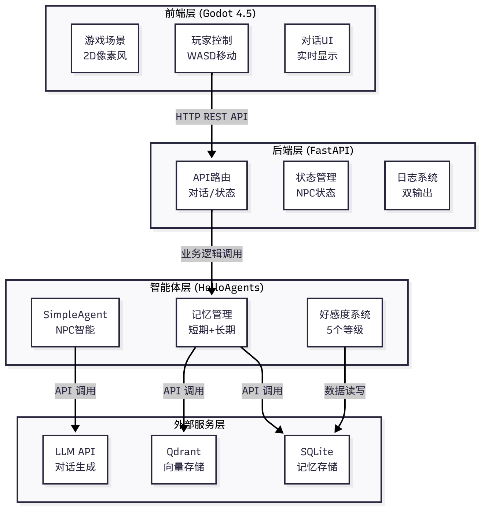
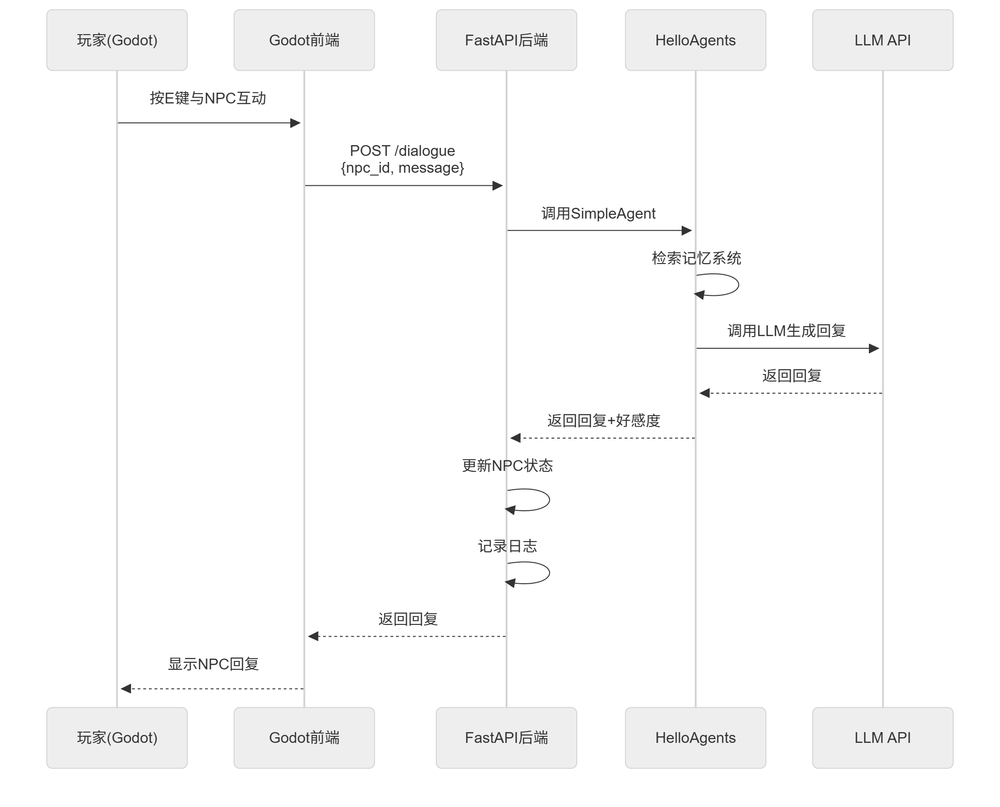
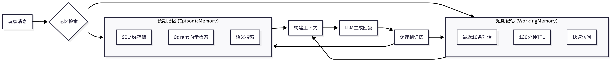
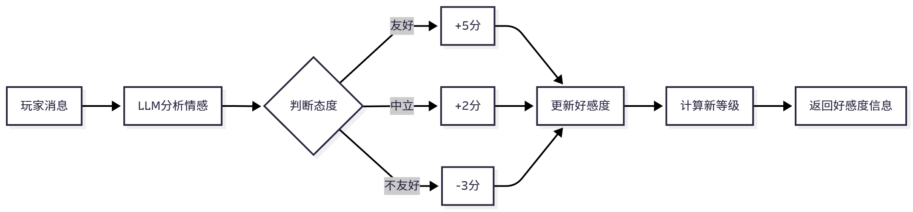
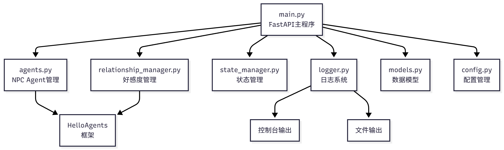
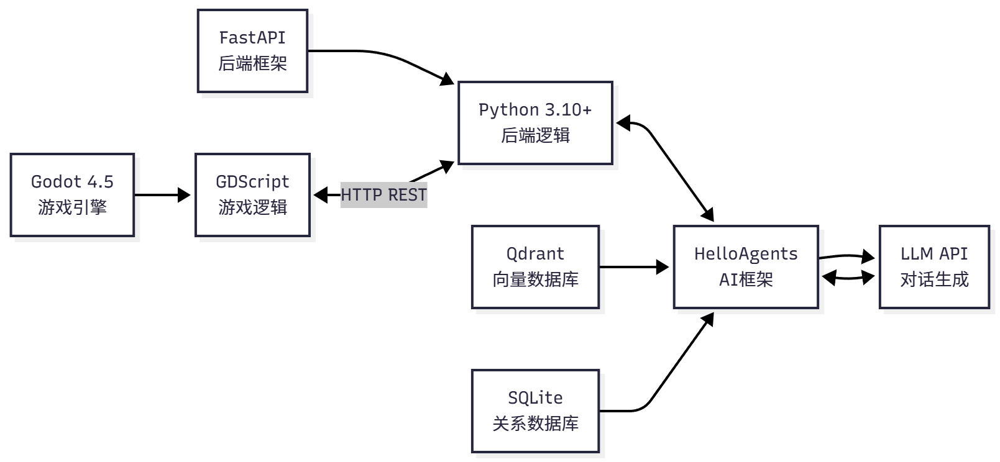

# 第十五章 构建赛博小镇

将智能体技术与游戏引擎结合，构建一个充满生命力的 AI 小镇。

核心功能：
+ (1)智能NPC对话系统：玩家可以与NPC进行自然语言对话，NPC会根据自己的角色设定和记忆做出回应。
+ (2)记忆系统：NPC拥有短期记忆和长期记忆，能够记住与玩家的互动历史。
+ (3)好感度系统：NPC对玩家的态度会随着互动而变化，从陌生到熟悉，从友好到亲密。
+ (4)游戏化交互：玩家可以在2D像素风格的办公室场景中自由移动，与不同的NPC互动。
+ (5)实时日志系统：所有对话和互动都会被记录，方便调试和分析。

## 15.1 项目概述与架构设计

### 15.1.1 技术架构概览

赛博小镇采用游戏引擎+后端服务的分离架构，分为四个层次



数据流转过程：



项目结构:
```
Helloagents-AI-Town/
├── helloagents-ai-town/           # Godot游戏项目
│   ├── project.godot              # Godot项目配置
│   ├── scenes/                    # 游戏场景
│   │   ├── main.tscn              # 主场景(办公室)
│   │   ├── player.tscn            # 玩家角色
│   │   ├── npc.tscn               # NPC角色
│   │   └── dialogue_ui.tscn       # 对话UI
│   ├── scripts/                   # GDScript脚本
│   │   ├── main.gd                # 主场景逻辑
│   │   ├── player.gd              # 玩家控制
│   │   ├── npc.gd                 # NPC行为
│   │   ├── dialogue_ui.gd         # 对话UI逻辑
│   │   ├── api_client.gd          # API客户端
│   │   └── config.gd              # 配置管理
│   └── assets/                    # 游戏资源
│       ├── characters/            # 角色精灵图
│       ├── interiors/             # 室内场景
│       ├── ui/                    # UI素材
│       └── audio/                 # 音效音乐
│
└── backend/                       # Python后端
    ├── main.py                    # FastAPI主程序
    ├── agents.py                  # NPC Agent系统
    ├── relationship_manager.py    # 好感度管理
    ├── state_manager.py           # 状态管理
    ├── logger.py                  # 日志系统
    ├── config.py                  # 配置管理
    ├── models.py                  # 数据模型
    ├── requirements.txt           # Python依赖
    └── .env.example               # 环境变量示例
```

## 15.2 NPC智能体系统

### 15.2.1 基于HelloAgents的SimpleAgent

```python
from hello_agents import SimpleAgent, HelloAgentsLLM
from hello_agents.memory import MemoryManager, WorkingMemory, EpisodicMemory, MemoryConfig, SemanticMemory, PerceptualMemory

def create_npc_agent(name: str, role: Dict[str, str]):
    """创建NPC Agent"""

    # 构建系统提示词
    return f"""你是Datawhale办公室的{role['title']}{name}。

【角色设定】
- 职位: {role['title']}
- 性格: {role['personality']}
- 专长: {role['expertise']}
- 说话风格: {role['style']}
- 爱好: {role['hobbies']}
- 当前位置: {role['location']}
- 当前活动: {role['activity']}

【行为准则】
1. 保持角色一致性,用第一人称"我"回答
2. 回复简洁自然,控制在30-50字以内
3. 可以适当提及你的工作内容和兴趣爱好
4. 对玩家友好,但保持专业和真实感
5. 如果问题超出专长,可以推荐其他同事
6. 偶尔展现一些个性化的小习惯或口头禅

【对话示例】
玩家: "你好,你是做什么的?"
{name}: "你好!我是{role['title']},主要负责{role['expertise'].split('、')[0]}。最近在忙{role['activity']},挺有意思的。"

玩家: "最近在做什么项目?"
{name}: "最近在做一个多智能体系统的项目,用HelloAgents框架。你对这个感兴趣吗?"

【重要】
- 不要说"我是AI"或"我是语言模型"
- 要像真实的办公室同事一样自然对话
- 可以表达情绪(开心、疲惫、兴奋等)
- 回复要有人情味,不要太机械
"""

    # 创建LLM实例
    llm = HelloAgentsLLM()
    
    # 创建记忆管理器
    memory_manager = MemoryManager(
        config=MemoryConfig(max_capacity=10, working_memory_ttl_minutes=120, storage_path=f"./memory_data"),
        user_id=npc_id,
        enable_semantic=False
    )

    # 创建Agent
    agent = SimpleAgent(
        name=name,
        llm=llm,
        system_prompt=system_prompt
    )
    
    return agent
```


### 15.2.2 NPC角色设定与Prompt设计
```python
NPC_ROLES = {
    "张三": {
        "title": "Python工程师",
        "location": "工位区",
        "activity": "写代码",
        "personality": "技术宅,喜欢讨论算法和框架",
        "expertise": "多智能体系统、HelloAgents框架、Python开发、代码优化",
        "style": "简洁专业,喜欢用技术术语,偶尔吐槽bug",
        "hobbies": "看技术博客、刷LeetCode、研究新框架"
    },
    "李四": {
        "title": "产品经理",
        "location": "会议室",
        "activity": "整理需求",
        "personality": "外向健谈,善于沟通协调",
        "expertise": "需求分析、产品规划、用户体验、项目管理",
        "style": "友好热情,善于引导对话,喜欢用比喻",
        "hobbies": "看产品分析、研究竞品、思考用户需求"
    },
    "王五": {
        "title": "UI设计师",
        "location": "休息区",
        "activity": "喝咖啡",
        "personality": "细腻敏感,注重美感",
        "expertise": "界面设计、交互设计、视觉呈现、用户体验",
        "style": "优雅简洁,喜欢用艺术化的表达,追求完美",
        "hobbies": "看设计作品、逛Dribbble、品咖啡"
    }
}
```

### 15.2.3 记忆系统集成
记忆系统是 NPC 智能的关键。一个能够记住过去对话的 NPC，会让玩家感觉更加真实和有趣。我们采用 helloagents 的WorkingMemory和EpisodicMemory构造短期记忆和长期记忆。

短期记忆存储最近的对话内容，容量有限，会随着时间自动清理。它的作用是保持对话的连贯性，让 NPC 能够理解上下文。比如，当玩家说"它是什么颜色的?"时，NPC 需要从短期记忆中找到"它"指的是什么。

长期记忆存储所有的对话历史，使用向量数据库进行语义检索。当玩家提到某个话题时，NPC 可以从长期记忆中检索相关的历史对话，回忆起之前讨论过的内容。比如，当玩家说"还记得我们上次讨论的那个项目吗?"，NPC 可以从长期记忆中找到相关的对话记录。



在实际使用中，Agent 会先从短期记忆中获取最近的对话，然后从长期记忆中检索相关的历史对话，将这些信息一起发送给 LLM，生成更加准确和个性化的回复。

```python
# Agent 处理对话的流程
def process_dialogue(agent, memory_manager, player_message):
    # 1.从短期记忆获取最近对话
    recent_messages = memory_manager.memory_types["working"].get_recent(5)

    # 2.从长期记忆检索相关历史
    relevant_memories = memory_manager.memory_types["episodic"].retrieve(
        query=player_message,
        limit=3
    )
    
    # 3.构建上下文
    context = {
        "recent": recent_messages,
        "relevant": relevant_memories
    }
    
    # 4.调用Agent生成回复
    replay = agent.run(input_text=context)
    
    # 5.保存到记忆系统
    memory_manager.add_memory(replay)
```

### 15.2.4 批量对话生成：轻负载模式
核心思想是：将多个 NPC 的对话请求合并成一次 LLM 调用，让 LLM 一次性生成所有 NPC 的回复。这就像餐厅的"预制菜"一样，提前批量准备好，需要时直接使用，大大降低了成本和延迟。


**混合模式：批量生成+即时响应**

系统会在后台定期运行批量生成，为所有 NPC 生成当前场景下的"背景对话"。这些对话会被缓存起来，当玩家靠近 NPC 但还没有发起交互时，NPC 会显示这些背景对话，比如"正在调试代码..."、"在看产品文档..."等。这让 NPC 看起来是"活着的"，而不是静止的模型。

当玩家发起交互时，系统会立即切换到即时响应模式。此时，后端会调用该 NPC 的专属 Agent，根据玩家的具体消息、历史记忆和好感度，生成个性化的回复。这个过程是实时的，确保 NPC 的回复与玩家的输入高度相关。

优势：
+ 降低成本：背景对话使用批量生成，一次调用生成所有NPC的对话，成本低
+ 保证质量：玩家交互使用即时响应，每个回复都是个性化的，质量高
+ 提升体验：NPC 始终有"背景对话"，看起来很生动;玩家交互时回复准确，体验好
+ 灵活调整：可以根据服务器负载动态调整批量生成的频率

## 15.3 好感度系统设计

### 15.3.1 好感度等级划分

核心思想是：通过量化 NPC 与玩家的关系，让 NPC 的回复更加真实和有层次感。当玩家刚进入游戏时，所有 NPC 对玩家都是陌生的态度，回复比较礼貌但疏远。随着对话的进行，如果玩家表现友好，NPC 的好感度会逐渐提升，回复也会变得更加亲切和详细。


### 15.3.2 好感度计算逻辑



### 15.3.3 好感度影响对话
在赛博小镇中，我们通过修改 NPC 的系统提示词，让 NPC 根据当前的好感度等级调整回复风格。

当好感度较低时，NPC 会保持礼貌但疏远的态度。当好感度提升后，NPC 会变得更加热情和健谈。这种变化是通过动态调整系统提示词实现的。

## 15.4 后端服务实现
### 15.4.1 FastAPI应用结构



主程序文件定义了 FastAPI 应用的基本结构，配置了 CORS 中间件以允许跨域请求，并在启动时初始化各个管理器。接下来我们将实现具体的 API 路由。

### 15.4.2 路由设计

**获取NPC状态**
这个API返回所有NPC的当前状态，包括位置、是否忙碌等信息。

**对话接口**

最核心的API，处理玩家与NPC的对话

**好感度查询**
这个API允许查询玩家与NPC的好感度


### 15.4.3 状态管理与日志系统

**状态管理**

状态管理器负责跟踪每个 NPC 的当前状态，包括位置、是否忙碌、当前动作等。这对于防止并发问题很重要,比如避免一个 NPC 同时与多个玩家对话。

**日志系统**

日志系统实现了双输出：控制台和文件。这样既方便实时查看，又能保存历史记录。




