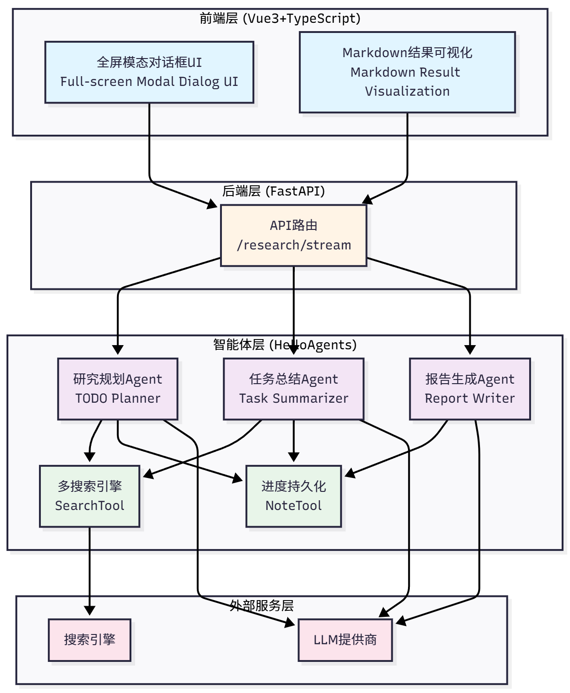
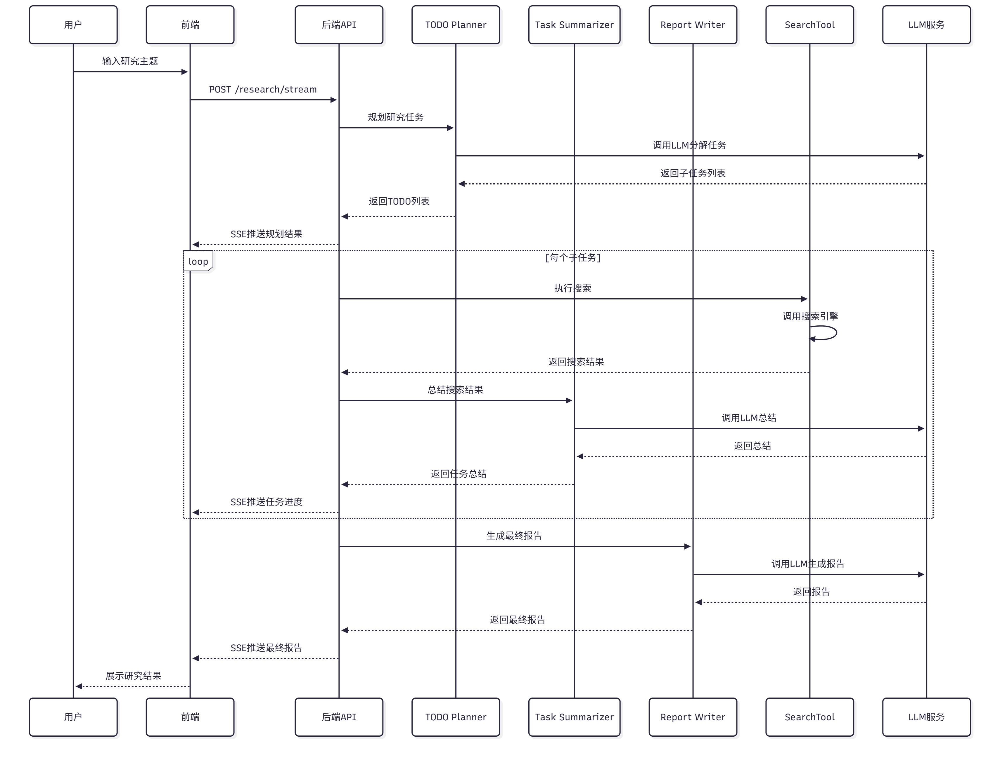
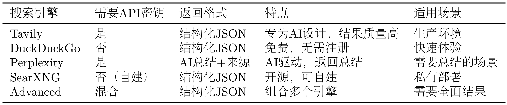

from hello_agents import HelloAgentsLLM

# 第十四章 自动化深度研究智能体

深度研究的难点在于信息的不断发散、事实的快速更新以及用户对引用来源的高要求。为了交付可信的研究报告，我们需要让智能体具备三个核心能力：

（1）问题剖析：将用户的开放主题拆解为可检索的查询语句。

（2）多轮信息采集：结合不同搜索 API 持续挖掘资料，并去重整合。

（3）反思与总结：依据阶段结果识别知识空白，决定是否继续检索，并生成结构化总结。

## 14.1 项目概述与架构设计

### 14.1.1 深度研究助手的价值

核心价值：
+ 节省时间
+ 提高质量
+ 可追溯
+ 可扩展

### 14.1.2 技术架构概览



请求在系统中的流转过程


项目结构：
``` 
helloagents-deepresearch/
├── backend/                    # 后端代码
│   ├── src/
│   │   ├── agent.py           # 核心协调器
│   │   ├── main.py            # FastAPI入口
│   │   ├── models.py          # 数据模型
│   │   ├── prompts.py         # Prompt模板
│   │   ├── config.py          # 配置管理
│   │   └── services/          # 服务层
│   │       ├── planner.py     # 规划服务
│   │       ├── summarizer.py  # 总结服务
│   │       ├── reporter.py    # 报告服务
│   │       └── search.py      # 搜索服务
│   ├── .env                   # 环境变量
│   ├── pyproject.toml         # 依赖管理
│   └── workspace/             # 研究笔记
│
└── frontend/                   # 前端代码
    ├── src/
    │   ├── App.vue            # 主组件
    │   ├── components/        # UI组件
    │   │   └── ResearchModal.vue
    │   └── composables/       # 组合式函数
    │       └── useResearch.ts
    ├── package.json           # npm依赖
    └── vite.config.ts         # 构建配置
```

## 14.2 TODO驱动的研究范式

### 14.2.1 什么是TODO驱动的研究

核心思想：**将"研究"这个复杂任务转化为"规划→执行→整合"的流程**

**TODO 驱动方式：系统化研究**
``` 
用户输入：Datawhale是一个什么样的组织？

系统规划：
  ├─ TODO 1：Datawhale的基本信息（组织定位）
  ├─ TODO 2：Datawhale的主要项目（核心内容）
  ├─ TODO 3：Datawhale的社区文化（价值观）
  └─ TODO 4：Datawhale的影响力（社会贡献）

系统执行：
  对每个TODO：
    1. 搜索相关资料
    2. 总结关键信息
    3. 记录来源引用

系统整合：
  生成结构化报告：
    ├─ 第一部分：组织定位（来自TODO 1）
    ├─ 第二部分：核心内容（来自TODO 2）
    ├─ 第三部分：价值观（来自TODO 3）
    ├─ 第四部分：社会贡献（来自TODO 4）
    └─ 参考文献：所有来源引用
```

一个完整的 TODO 驱动研究系统包含三个核心要素：
+ 智能规划器：负责将研究主题分解为子任务。
+ 任务执行器：负责执行每个子任务。
+ 报告生成器：负责整合所有子任务的结果。


### 14.2.2 三阶段研究流程

TODO 驱动的研究流程分为三个阶段:规划（Planning）、执行（Execution）、报告（Reporting）。每个阶段都有专门的 Agent 负责。

#### (1) 阶段1:规划
```json
[
  {
    "title": "Datawhale的基本信息",
    "intent": "了解Datawhale的组织定位、成立时间、发展历程",
    "query": "Datawhale organization introduction history 2024"
  },
  {
    "title": "Datawhale的主要项目",
    "intent": "了解Datawhale的核心开源项目和教程",
    "query": "Datawhale projects tutorials open source 2024"
  }
]
```

#### (2) 阶段2: 执行
**1.搜索资料：使用配置的搜索引擎执行搜索**
```python
search_results = search_tool.run({
    "input": task.query,
    "backend": "tavily",
    "mode": "structured",
    "max_results": 5
})
```

**2.获取搜索结果：提取标题、URL、摘要**
```json
{
  "results": [
    {
      "title": "What is a Multimodal Model?",
      "url": "https://example.com/multimodal-model",
      "snippet": "A multimodal model is an AI model that can process multiple types of data..."
    },
    ...
  ]
}
```

**3.调用总结Agent：总结搜索结果**
```python
summary = summarizer_agent.run(
    task=task,
    search_results=search_results
)
```

**4.记录总结和来源：保存到NoteTool**
```python
note_tool.run({
    "action": "create",
    "title": task.title,
    "content": f"## {task.title}\n\n{summary}\n\n## 来源\n{sources}",
    "tags": ["research", "summary"]
})
```

#### (3) 阶段3: 报告

## 14.3 智能体系统设计

### 14.3.1 Agent职责划分


**Agent1: 研究规划专家(TODO Planner)**

职责：将研究主题分解为3-5任务
设计理念：研究规划专家的核心任务是理解用户的研究主题，分析主题的关键方面，然后生成一系列子任务。
Prompt设计：
```python
todo_planner_instructions = """
你是一个研究规划专家。你的任务是将用户的研究主题分解为3-5个子任务。

当前日期：{current_date}

研究主题：{research_topic}

请分析这个研究主题，将其分解为3-5个子任务。每个子任务应该：
1. 涵盖主题的一个重要方面
2. 有明确的研究目标
3. 可以通过搜索引擎找到相关资料

请以JSON格式返回子任务列表，每个子任务包含：
- title：任务标题（简洁明了）
- intent：任务意图（为什么要研究这个）
- query：搜索查询（用于搜索引擎的查询字符串，可以使用英文以获得更好的搜索结果）

示例输出：
[
  {{
    "title": "什么是多模态模型",
    "intent": "了解多模态模型的基础概念，为后续研究打下基础",
    "query": "multimodal model definition concept 2024"
  }},
  ...
]

请确保：
1. 子任务数量在3-5个之间
2. 子任务之间有逻辑关系（如从基础到应用，从现状到趋势）
3. 搜索查询能够准确找到相关资料
4. 只返回JSON，不要包含其他文本
"""
```

**关键设计点**：提示词包含当前日期以获取最新信息，明确要求 JSON 格式输出便于解析，通过示例帮助 Agent 理解期望输出，并强调子任务数量、逻辑关系等约束。

**实现代码**：

这里的 ToolAwareSimpleAgent 是根据 SimpleAgent 拓展实现

```python
import re


class PlanningService:
    def __init__(self, llm: HelloAgentsLLM):
        self._agent = ToolAwareSimpleAgent(
            name="TODO Planner",
            system_prompt="你是一个研究规划专家",
            llm=llm,
            tool_call_listener=self._on_tool_call
        )

    def plan_todo_list(self, state: SummaryState) -> List[TodoItem]:
        prompt = todo_planner_instructions.format(
            current_date=get_current_date(),
            research_topic=state.research_topic
        )

        response = self._agent.run(prompt)
        tasks_payload = self._extract_tasks(response)

        todo_items = []
        for idx, item in enumerate(tasks_payload, start=1):
            task = TodoItem(
                id=idx,
                title=item["title"],
                intent=item["intent"],
                query=item["query"]
            )

        return todo_items

    def _extract_tasks(self, response: str) -> List[dict]:
        """从Agent响应中提取JSON"""
        # 使用正则表达式提取JSON部分
        json_match = re.search(r'\[.*\]', response, re.DOTALL)
        if json_match:
            json_str = json_match.group(0)
            return json.loads(json_str)
        else:
            raise ValueError("无法从响应中提取JSON")
```

**Agent2：任务总结专家(Task Summarizer)**
职责：总结搜索结果，提取关键信息

设计理念：任务总结专家的核心任务是阅读搜索结果，提取关键信息，并以结构化的方式呈现。这个过程类似于人类研究者在阅读文献后做笔记的过程。

Prompt设计：
```python
task_summarizer_instructions = """
你是一个任务总结专家。你的任务是总结搜索结果，提取关键信息。

任务标题：{task_title}
任务意图：{task_intent}
搜索查询：{task_query}

搜索结果：
{search_results}

请仔细阅读以上搜索结果，提取关键信息，并以Markdown格式返回总结。

总结应该包含：
1. **核心观点**：搜索结果中的核心观点和结论
2. **关键数据**：重要的数字、日期、名称等
3. **来源引用**：为每个观点添加来源引用（使用[1]、[2]等标记）

请确保：
1. 总结简洁明了，避免冗余
2. 保留重要的细节和数据
3. 为每个观点添加来源引用
4. 使用Markdown格式（标题、列表、加粗等）

示例输出：
## 核心观点

多模态模型是一种能够处理多种类型数据的AI模型[1]。与传统的单模态模型不同，多模态模型可以同时理解文本、图像、音频等[2]。

**关键特点：**
- 跨模态理解[1]
- 统一表示[3]
- 端到端训练[2]

## 来源

[1] https://example.com/source1
[2] https://example.com/source2
[3] https://example.com/source3
"""
```

**关键设计点**：提示词包含任务标题、意图、查询等上下文帮助 Agent 理解任务，明确要求输出包含核心观点、关键数据、来源引用，强调为每个观点添加来源引用，并通过示例帮助 Agent 理解期望的输出格式。

**实现代码**：
```python
class SummarizationService:
    def __init__(self, llm: HelloAgentsLLM):
        self._agent = ToolAwareSimpleAgent(
            name="Task Summarizer",
            system_prompt="你是一个任务总结专家",
            llm=llm,
            tool_call_listener=self._on_tool_call
        )

    def summarize_task(
        self,
        task: TodoItem,
        search_results: List[Dict]
    ) -> str:
        # 格式化搜索结果
        formatted_sources = self._format_sources(search_results)
        
        prompt = task_summarizer_instructions.format(
            task_title=task.title,
            task_intent=task.intent,
            task_query=task.query,
            search_results=formatted_sources
        )

        summary = self._agent.run(prompt)
        return summary

    def _format_sources(self, search_results: List[dict]) -> str:
        """格式化搜索结果"""
        formatted = []
        for idx, result in enumerate(search_results, start=1):
            formatted.append(
                f"[{idx}] {result['title']}\n"
                f"URL: {result['url']}\n"
                f"摘要: {result['snippet']}\n"
            )

        return "\n".join(formatted)
```

**Agent3**: 报告撰写专家(Report Writer)

职责：整合所有子任务的总结，生成最终报告

设计理念：报告撰写专家的核心任务是将所有子任务的总结整合成一份结构化的报告。这个过程类似于人类研究者在完成所有调研后撰写研究报告的过程。

Prompt 设计：
```python
report_writer_instructions = """
你是一个报告撰写专家。你的任务是整合所有子任务的总结，生成一份结构化的研究报告。

研究主题：{research_topic}

子任务总结：
{task_summaries}

请整合以上所有子任务的总结，生成一份结构化的研究报告。

报告应该包含：
1. **标题**：研究主题
2. **概述**：简要介绍研究主题和报告结构（2-3段）
3. **各个子任务的详细分析**：按照逻辑顺序组织（使用二级标题）
4. **总结**：总结研究的主要发现（1-2段）
5. **参考文献**：所有来源引用（按照子任务分组）

请确保：
1. 报告结构清晰，逻辑连贯
2. 消除重复的信息
3. 保留所有来源引用
4. 使用Markdown格式

示例输出：
# 多模态大模型的最新进展

## 概述

本报告系统地研究了多模态大模型的最新进展...

## 1. 什么是多模态模型

（此处插入子任务1的总结）

## 2. 最新的多模态模型有哪些

（此处插入子任务2的总结）

...

## 总结

通过本次研究，我们了解了...

## 参考文献

### 任务1：什么是多模态模型
[1] https://example.com/source1
...
"""
```

**关键设计点**：提示词明确要求报告包含标题、概述、详细分析、总结、参考文献等结构，强调按逻辑顺序组织内容，要求合并重复信息消除冗余，并保留所有来源引用。

实现代码：
```python
class ReportingService:
    def __init__(self, llm: HelloAgentsLLM):
        self._agent = ToolAwareSimpleAgent(
            name="Report Writer",
            system_prompt="你是一个报告撰写专家",
            llm=llm,
            tool_call_listener=self._on_tool_call
        )
    
    def generate_report(
        self,
        research_topic: str,
        task_summaries: List[Tuple[TodoItem, str]]
    ) -> str:
        # 格式化子任务总结
        formatted_summaries = self._format_summaries(task_summaries)
        
        prompt = report_writer_instructions.format(
            research_topic=research_topic,
            task_summaries=formatted_summaries,
        )
        
        report = self._agent.run(prompt)
        return report
    
    def _format_summaries(
        self,
        task_summaries: List[Tuple[TodoItem, str]]
    ) -> str:
        """格式化子任务总结"""
        formatted = []
        for idx, (task, summary) in enumerate(task_summaries, start=1):
            formatted.append(
                f"## 任务{idx}：{task.title}\n"
                f"意图：{task.intent}\n\n"
                f"{summary}\n"
            )
        return "\n".join(formatted)
```

### 14.3.2 ToolAwareSimpleAgent的设计

记录工具调用的Agent。

用于： 调试、日志、分析、进度展示

```python
from hello_agents import ToolAwareSimpleAgent

def tool_listener(call_info):
    print(f"Agent: {call_info['agent_name']}")
    print(f"工具: {call_info['tool_name']}")
    print(f"参数: {call_info['parsed_parameters']}")
    print(f"结果: {call_info['result']}")

agent = ToolAwareSimpleAgent(
    name="研究助手",
    system_prompt="你是一个研究助手",
    llm=llm,
    tool_call_listener=tool_listener
)


class ToolAwareSimpleAgent(SimpleAgent):
    def __init__(
        self,
        name: str,
        system_prompt: str,
        llm: HelloAgentsLLM,
        tool_registry: Optional[ToolRegistry] = None,
        tool_call_listener: Optional[Callable] = None,
    ):
        super().__init__(
            name=name,
            system_prompt=system_prompt,
            llm=llm,
            tool_registry=tool_registry,
        )
        self._tool_call_listener = tool_call_listener
    
    def _execute_tool_call(self, tool_name: str, parameters: str) -> str:
        """执行工具调用，并通知监听器"""
        # 解析参数
        parsed_parameters = self._parse_parameters(parameters)
        
        # 调用工具
        result = super()._execute_tool_call(tool_name, parameters)
        
        # 通知监听器
        if self._tool_call_listener:
            self._tool_call_listener({
                "agent_name": self.name,
                "tool_name": tool_name,
                "parsed_parameters": parsed_parameters,
                "result": result,
            })
        
        return result

class DeepResearchAgent:
    def __init__(self, config: Configuration):
        self.config = config
        self.llm = HelloAgentsLLM(...)
        
        # 创建工具调用监听器
        def tool_listener(call_info):
            self._emit_event({
                "type": "tool_call",
                "agent": call_info["agent_name"],
                "tool": call_info["tool_name"],
                "parameters": call_info["parsed_parameters"],
            })
        
        # 创建三个Agent，都使用相同的监听器
        self.planner = PlanningService(self.llm, tool_listener)
        self.summarizer = SummarizationService(self.llm, tool_listener)
        self.reporter = ReportingService(self.llm, tool_listener)
```

### 14.3.3 Agent协作模式


顺序协作模式的特点是：
+ 线性流程：Agent按照固定的顺序执行
+ 明确的输入输出：每个Agent的输入来自上一个Agent的输出
+ 无并发：同一时间只有同一个Agent在工作

DeepResearchAgent是整个系统的核心协调器，负责调度三个 Agent：
```python
class DeepResearchAgent:
    def run(self, research_topic: str) -> str:
        # 1. 规划阶段
        self._emit_event({"type": "status", "message": "正在规划研究任务..."})
        todo_list = self.planner.plan_todo_list(research_topic)
        self._emit_event({"type": "tasks", "tasks": todo_list})
        
        # 2. 执行阶段
        task_summaries = []
        for task in todo_list:
            self._emit_event({
                "type": "status",
                "message": f"正在研究：{task.title}"
            })
            
            # 搜索
            search_results = self.search_service.search(task.query)
            
            # 总结
            summary = self.summarizer.summarize_task(task, search_results)
            task_summaries.append((task, summary))
            
            self._emit_event({
                "type": "task_completed",
                "task_id": task.id
            })
        
        # 3. 报告阶段
        self._emit_event({"type": "status", "message": "正在生成报告..."})
        report = self.reporter.generate_report(research_topic, task_summaries)
        self._emit_event({"type": "report", "content": report})
        
        return report
```

## 14.4 工具系统集成

### 14.4.1 SearchTool扩展



```python
# config.py
class SearchAPI(str, Enum):
    TAVILY = "tavily"
    DUCKDUCKGO = "duckduckgo"
    PERPLEXITY = "perplexity"
    SEARXNG = "searxng"
    ADVANCED = "advanced"

class Configuration(BaseModel):
    search_api: SearchAPI = SearchAPI.DUCKDUCKGO
    # ...

```

SearchTool返回的结果是一个字典，包含：

+ results：搜索结果列表，每个结果包含标题、URL、摘要
+ backend：使用的搜索引擎
+ answer：AI 生成的答案（仅 Perplexity）
+ notices：通知信息（如 API 限制、错误等

### 14.4.2 NoteTool使用

```
workspace/
├── notes/
│   ├── 1.md  # 任务1的笔记
│   ├── 2.md  # 任务2的笔记
│   ├── 3.md  # 任务3的笔记
│   └── ...
└── reports/
    └── final_report.md  # 最终报告
```
NoteTool记录每个子任务的研究进度：
```python
class NotesService:
    def __init__(self, workspace: str):
        self.note_tool = NoteTool(workspace=workspace)

    def save_task_summary(
        self,
        task: TodoItem,
        search_results: List[dict],
        summary: str
    ):
        """保存任务总结"""
        # 格式化笔记内容
        content = self._format_note_content(
            task=task,
            search_results=search_results,
            summary=summary
        )

        # 创建笔记
        self.note_tool.run({
            "action": "create",
            "title": f"任务{task.id}: {task.title}",
            "content": content,
            "tags": ["search", "summary"]
        })

    def _format_note_content(
        self,
        task: TodoItem,
        search_results: List[dict],
        summary: str
    ):
        """格式化笔记内容"""
        content = f"# 任务{task.id}: {task.title}\n\n"
        content += f"## 任务信息\n\n"
        content += f"- **意图**: {task.intent}\n"
        content += f"- **查询**: {task.query}\n\n"

        content += f"## 搜索结果\n\n"

        for idx, result in enumerate(search_results, start=1):
            content += f"[{idx}] {result['title']}\n"
            content += f"URL: {result['url']}\n"
            content += f"摘要: {result['snippet']}\n\n"

        content += f"## 总结\n\n{summary}\n"
        return content
```

### 14.4.3 ToolRegistry工具管理

```python
from hello_agents import ToolAwareSimpleAgent
from hello_agents.tools import ToolRegistry
from hello_agents.tools import SearchTool
from hello_agents.tools import NoteTool

# 创建工具
search_tool = SearchTool(backend="hybrid")
note_tool = NoteTool(workspace="./workspace/notes")

# 创建注册表
registry = ToolRegistry()

# 注册工具
registry.register_tool(search_tool)
registry.register_tool(note_tool)

# 创建Agent
agent = ToolAwareSimpleAgent(
    name="研究助手",
    system_prompt="你是一个研究助手",
    llm=llm,
    tool_registry=registry
)
```


**工具调用流程**：

+ Agent 生成指令：Agent 生成工具调用指令，如[TOOL_CALL:search_tool:{"input": "Datawhale组织", "backend": "tavily"}]
+ 解析指令：ToolRegistry解析指令，提取工具名称和参数
+ 查找工具：ToolRegistry根据工具名称查找对应的工具
+ 调用工具：调用工具的run方法，传入参数
+ 返回结果：工具返回执行结果
+ 格式化结果：将结果格式化为字符串，返回给 Agent


