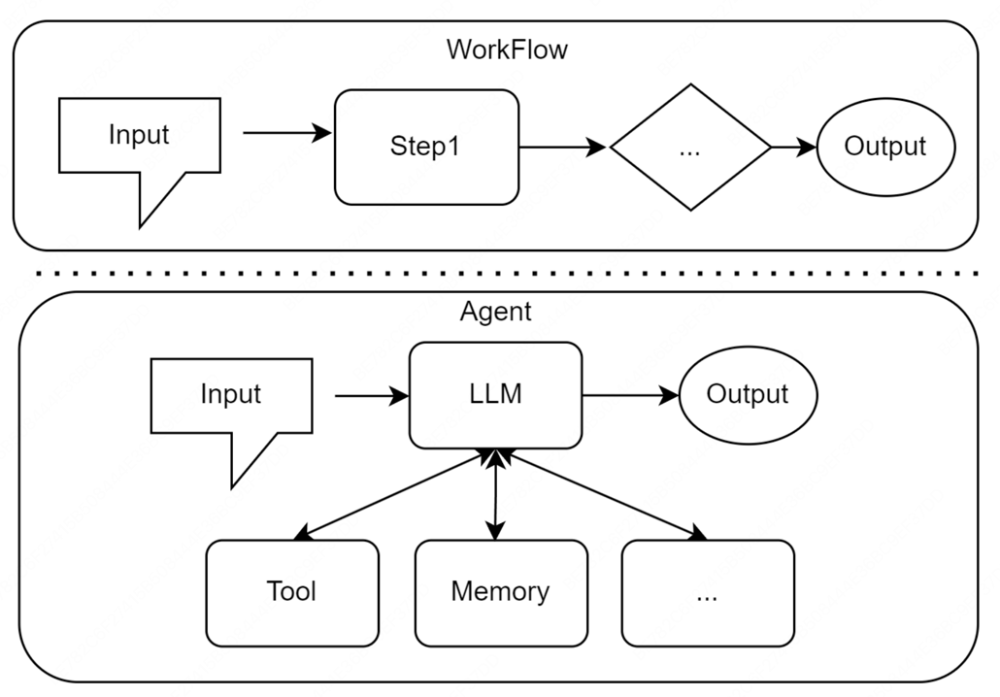

# 1.3 智能体应用的协作模式

## 1.3.1作为开发者工具的智能体

+ GitHubCopilot
+ Claude Code
+ Trae
+ Cursor

## 1.3.2 作为自主协作者的智能体

+ 单智能体自主循环：AgentGPT，核心 - "思考-规划-执行-反思"
+ 多智能体协作：模拟人类团队的协作模式来解决复杂问题，可细分为：
  + 角色扮演式对话：CAMEL框架，通过为两个智能体设定明确的角色和沟通协议，让它们在一个结构化的对话中协同完成任务
  + 组织化工作流：MetaGPT和CrewAI，模拟一个分工明确的虚拟团队。每个智能体都有预设的职责和工作流程SOP，通过层级化或顺序化的方式协作，产出最高质量的成果
    AutoGen和AgentScope提供了更灵活的对话模式，允许开发者自定义智能体间的复杂交互网络
  + 高级控制流架构：LangGraph，更侧重于为智能体提供更强大的底层工程基础。它将智能体的执行过程建模为状态图，从而能更灵活、更可靠地实现循环、分支、回溯以及人工介入等

## 1.3.3 Workflow和Agent的差异

+ Workflow：是让AI按部就班执行命令
+ Agent：是赋予AI自由度去自主达成目标
+ 
+ 