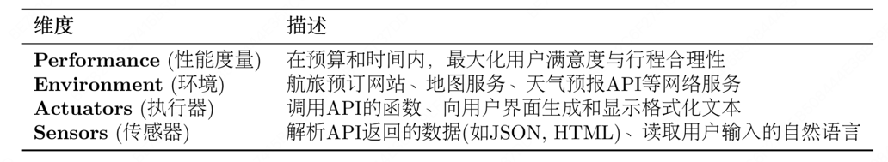
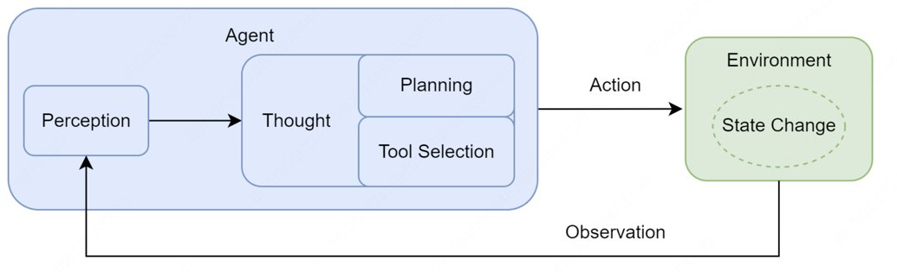

# 1.1 Composition and Operating Principles of Agents

## 1.1.1 任务环境定义
+ 

## 1.1.2 智能体的运行机制
+ 核心机制：智能体循环，描述了智能体与环境之间的动态交互过程
  + 
+ 相互关联的阶段：
  + 感知：循环的起点，智能体通过其传感器(API的监听端口、用户输入接口)接收来自环境的输入信息
  + 思考：接收到观察信息后，智能体进入其核心决策阶段。对于LLM智能体而言，这通常是由大语言模型驱动的内部推理过程。
    + 规划：智能体基于当前的观察和其内部记忆，更新对任务和环境的理解，并制定或调整一个行动计划。可能涉及将复杂目标分解为一系列更具体的子任务
    + 工具选择：根据当前计划，智能体从其可用的工具库中，选择最适合执行下一步骤的工具，并确定该工具所需的具体参数
  + 行动：决策完成后，智能体的行动会引起环境的状态变化，环境会产生一个新的观察作为结果反馈。这个观察会在下一轮循环中被智能体感知

## 1.1.3 智能体的感知与行动
通过交互协议来规范其与环境之间的信息交换
+ 思考：智能体内部决策的快照。它以自然语言形式阐述了智能体如何分析当前情境、回顾上一步的观察结果、进行自我反思与问题分解，并最终规划出下一步的具体行动
+ 行动：智能体基于思考后，决定对环境施加的具体操作，通常以函数调用的形式表示。