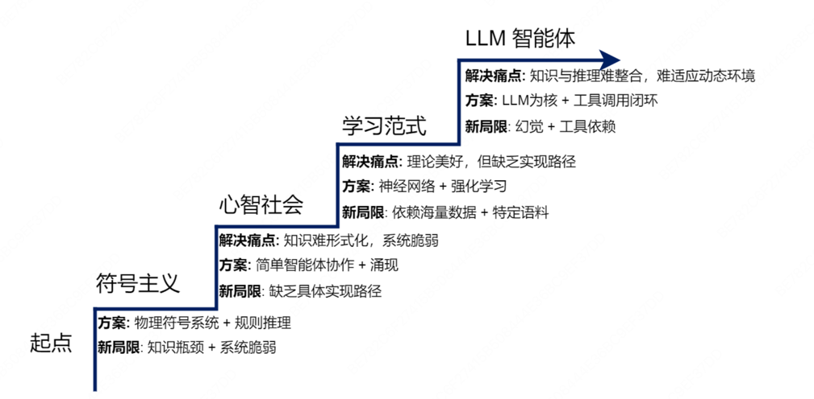
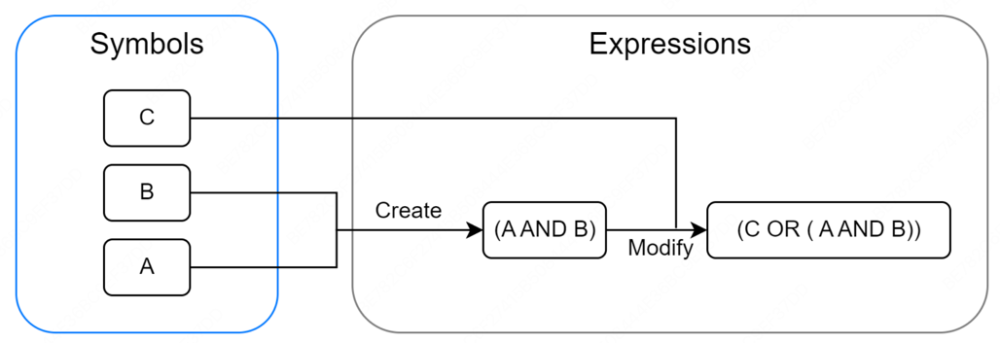
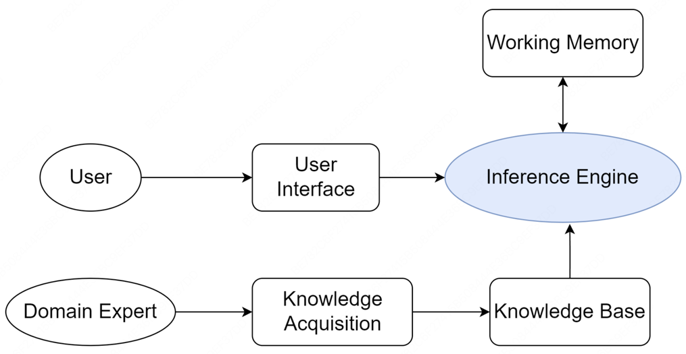
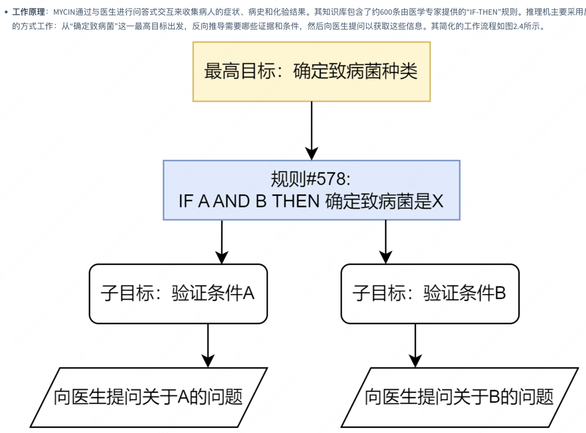
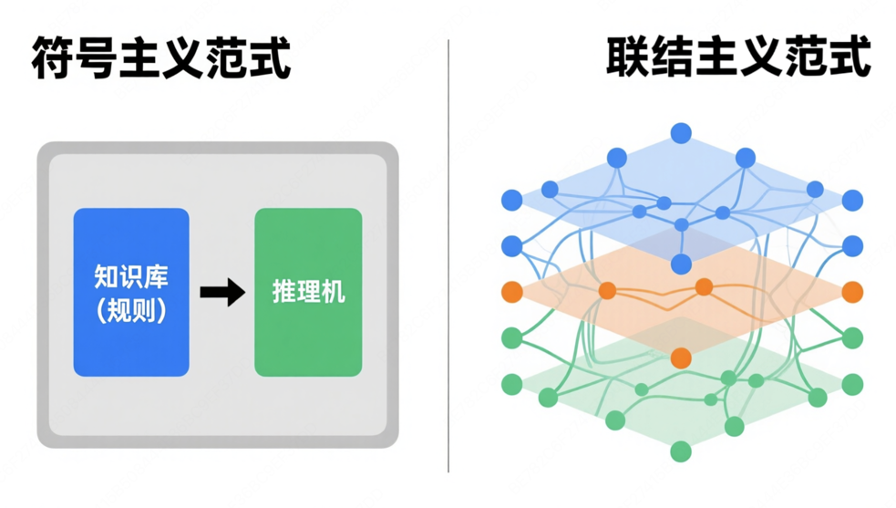
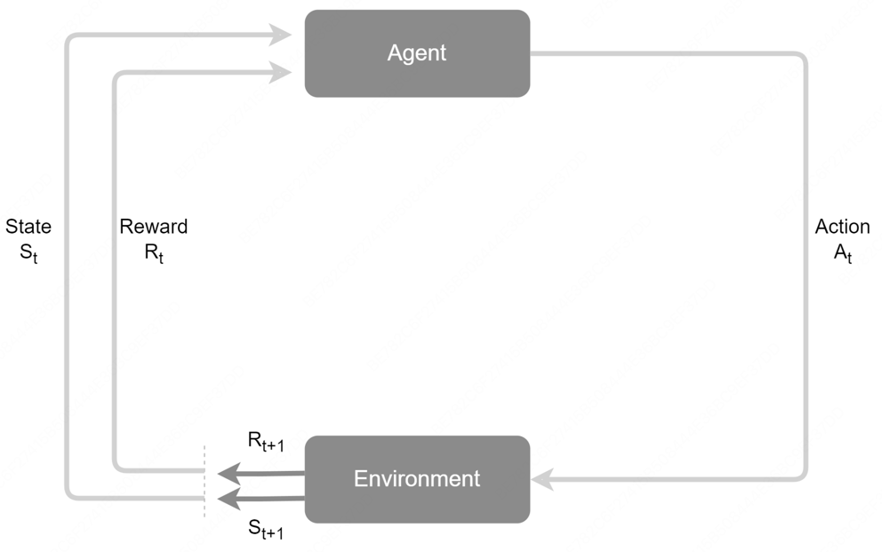
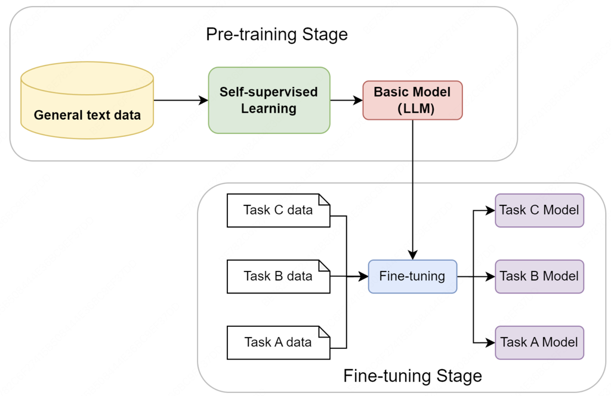
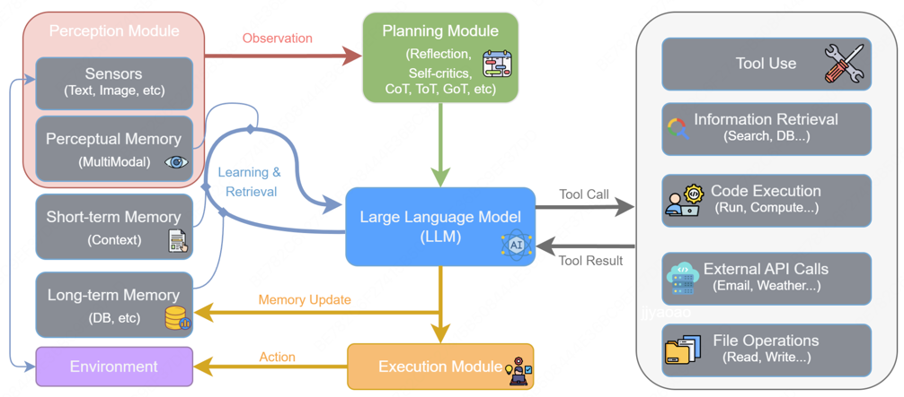
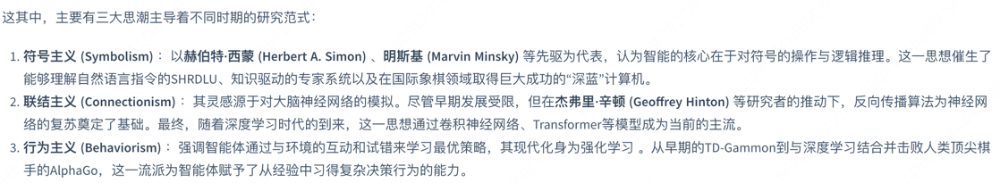
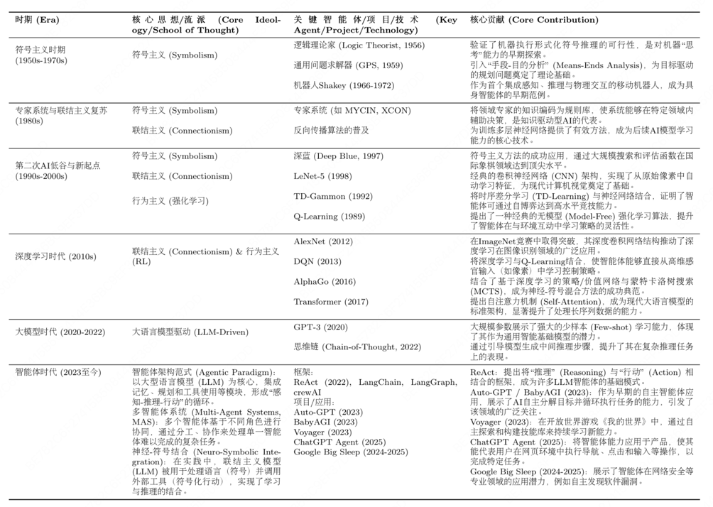

# 2 智能体发展史

## 2.1 基于符号与逻辑的早起智能体

### 2.1.1 物理符号系统假说

包含两个核心论断：
+ 充分性论断：任何一个物理符号系统，都具备产生通用智能行为的充分手段
+ 必要性论断：任何一个能够展现通用智能行为的系统，其本质必然是一个物理符号系统

### 2.1.2 专家系统

一个典型的专家系统通常由知识库、推理机、用户界面等几个核心部分构成，通用架构图

专家系统的智能主要源于两大核心组件：
+ 知识库：专家系统的知识存储中心，用于存放领域专家的知识和经验。知识表示是构建知识库的关键
+ 推理机：专家系统的核心计算引擎。它是一个通用程序，其任务是根据用户提供的事实，在知识库中寻找并应用相关的规则，从而推导出新的结论。推理机的工作方式主要有两种：
  + 正向链：从已知事实出发，不断匹配规则的IF部分，触发THEN部分的结论，并将新结论加入事实库，直到最终推导出目标或无新规则可匹配。这是一种数据驱动的推理方式。
  + 反向链：从一个假设的目标出发，寻找能够推导出该目标的规则，然后将该规则的IF部分作为新的子目标，直到所有子目标都能被已知事实所证明。这是一种目标驱动的推理方式。

+ 应用案例:MYCIN系统
  + 

## 2.2 学习范式的演进与现代智能体

### 2.2.1 从符号到联结

### 2.2.2 基于强化学习的智能体

联结主义主要解决了感知问题，但是智能体更核心的任务是进行决策。强化学习是专注于解决决策问题的学习范式。
强化学习的框架核心：
+ 智能体Agent：学习者和决策者
+ 环境：智能体外部的一切，是智能体与之交互的对象。
+ 状态：对环境在某一时刻的特定描述，是智能体做出决策的依据。
+ 行动：智能体根据当前状态所能采取的操作。
+ 奖励：环境在智能体执行一个行动后，反馈给智能体的一个标量信号，用于评价该行动在特定状态下的好坏。
+ 强化学习智能体在一个感知-行动-学习的闭环中持续迭代
+ 

### 2.2.3 基于大规模数据的预训练

### 2.2.4 基于大语言模型的智能体

### 2.2.5 智能体发展概览

