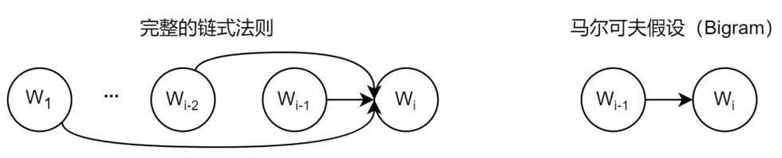

# 大语言模型基础

## 3.1 语言模型与Transformer架构

### 3.1.1 从N-gram到RNN

语言模型是自然语言处理的核心，其根本任务是计算一个词序列出现的概率。

+ (1) 统计语言模型与N-gram的思想

正在深度学习兴起之前，统计方法是语言模型的主流。核心思想是，一个句子出现的概率，等于该句子中每个词出现的条件概率的连乘。对于一个由词w1，w2,...,w<sub>m</sub>
构成的句子S，其概率P(S)可以表示为： 

P(S)=P(w1,w2,...,wm)=P(w1)*P(w2|w1)*P(w3|w1,w2)•••P(wm|w1,...,$w_{m-1}$)   概率的链式法则



核心思想是：我们不必回溯一个词的全部历史，一个词的出现概率只与它前面有限的n-1个词有关基于这个假设建立的语言模型，我们称之为N-gram模型

+ Bigram(当N=2时)：
P($w_{i}$|$w_{1}$,...,$w_{i-1}$)≈P($w_{i}$|$w_{i-1}$)      一个词的出现与它前面的一个词有关

+ Trigram(当N=3时)：
P($w_{i}$|$w_{1}$,...,$w_{i-1}$)≈P($w_{i}$|$w_{i-2}$,$w_{i-1}$)   一个词的出现与它前面的两个词有关

这些概率可以通过在大型语料库中进行最大似然MLE估计来计算
P($w_{i}$|$w_{i-1}$)=Count($w_{i-1}$, $w_{i}$) / Count($w_{i-1}$)

这里的Count()函数就代表计数：
+ Count($w_{i-1}$, $w_{i}$): 表示词对($w_{i-1}$, $w_{i}$)在语料库中连续出现的总次数
+ Count($w_{i-1}$): 表示单个词$w_{i-1}$在语料库中出现的总次数

```python
import collections

# 示例语料库，与上方案例讲解中的语料库保持一致
corpus = "datawhale agent learns datawhale agent works"
tokens = corpus.split()
total_tokens = len(tokens)

# --- 第一步：计算 P(datawhale) ---
count_datawhale = tokens.count("datawhale")
p_datawhale = count_datawhale / total_tokens
print(f"第一步: P(datawhale) = {count_datawhale}/{total_tokens} = {p_datawhale:.3f}")

# --- 第二步:计算 P(agent|datawhale) ---
# 先计算 bigrams 用于后续步骤
bigrams = zip(tokens, tokens[1:])
bigrams_counts = collections.Counter(bigrams)
count_datawhale_agent = bigrams_counts[("datawhale", "agent")]
# count_datawhale 已在第一步计算
p_agent_given_datawhale = count_datawhale_agent / count_datawhale
print(f"第二步: P(agent|datawhale) = {count_datawhale_agent}/{count_datawhale} = {p_agent_given_datawhale:.3f}")

# --- 第三步:计算 P(learns|agent) ---
count_agent_learns = bigrams_counts[("agent", "learns")]
count_agent = tokens.count("agent")
p_learns_given_agent = count_agent_learns / count_agent
print(f"第三步: P(learns|agent) = {count_agent_learns}/{count_agent} = {p_learns_given_agent:.3f}")

# --- 最后:将概率连乘 ---
p_sentence = p_datawhale * p_agent_given_datawhale * p_learns_given_agent
print(f"最后: P('datawhale agent learns') ≈ {p_datawhale:.3f} * {p_agent_given_datawhale:.3f} * {p_learns_given_agent:.3f} = {p_sentence:.3f}")
```

N-gram简单有效，但是有两个致命的缺陷：
+ 数据稀疏性：如果一个词从未在语料库中出现，其概率估计就为0，这是不合理的。
+ 泛化能力差：模型无法理解词与词之间的语义相似性。例如，即使模型在语料库中见过很多次 agent learns，它也无法将这个知识泛化到语义相似的词上。当我们计算 robot learns 的概率时，如果 robot 这个词从未出现过，或者 robot learns 这个组合从未出现过，模型计算出的概率也会是零。模型无法理解 agent 和 robot 在语义上的相似性。


