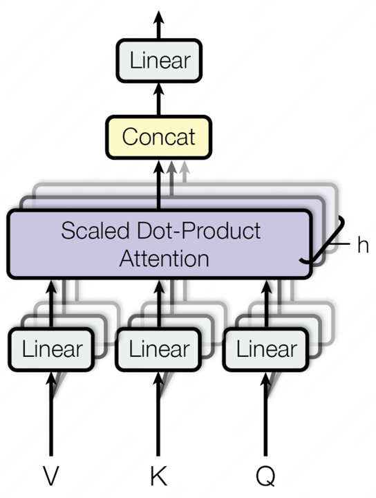

# 大语言模型基础

## 3.1 语言模型与Transformer架构

### 3.1.1 从N-gram到RNN

语言模型是自然语言处理的核心，其根本任务是计算一个词序列出现的概率。

#### (1) 统计语言模型与N-gram的思想

正在深度学习兴起之前，统计方法是语言模型的主流。核心思想是，一个句子出现的概率，等于该句子中每个词出现的条件概率的连乘。对于一个由词w1，w2,...,w<sub>m</sub>
构成的句子S，其概率P(S)可以表示为： 

P(S)=P(w1,w2,...,wm)=P(w1)*P(w2|w1)*P(w3|w1,w2)•••P(wm|w1,...,$w_{m-1}$)   概率的链式法则


核心思想是：我们不必回溯一个词的全部历史，一个词的出现概率只与它前面有限的n-1个词有关基于这个假设建立的语言模型，我们称之为N-gram模型

+ Bigram(当N=2时)：
P($w_{i}$|$w_{1}$,...,$w_{i-1}$)≈P($w_{i}$|$w_{i-1}$)      一个词的出现与它前面的一个词有关

+ Trigram(当N=3时)：
P($w_{i}$|$w_{1}$,...,$w_{i-1}$)≈P($w_{i}$|$w_{i-2}$,$w_{i-1}$)   一个词的出现与它前面的两个词有关

这些概率可以通过在大型语料库中进行最大似然MLE估计来计算
P($w_{i}$|$w_{i-1}$)=Count($w_{i-1}$, $w_{i}$) / Count($w_{i-1}$)

这里的Count()函数就代表计数：
+ Count($w_{i-1}$, $w_{i}$): 表示词对($w_{i-1}$, $w_{i}$)在语料库中连续出现的总次数
+ Count($w_{i-1}$): 表示单个词$w_{i-1}$在语料库中出现的总次数

```python
import collections

# 示例语料库，与上方案例讲解中的语料库保持一致
corpus = "datawhale agent learns datawhale agent works"
tokens = corpus.split()
total_tokens = len(tokens)

# --- 第一步：计算 P(datawhale) ---
count_datawhale = tokens.count("datawhale")
p_datawhale = count_datawhale / total_tokens
print(f"第一步: P(datawhale) = {count_datawhale}/{total_tokens} = {p_datawhale:.3f}")

# --- 第二步:计算 P(agent|datawhale) ---
# 先计算 bigrams 用于后续步骤
bigrams = zip(tokens, tokens[1:])
bigrams_counts = collections.Counter(bigrams)
count_datawhale_agent = bigrams_counts[("datawhale", "agent")]
# count_datawhale 已在第一步计算
p_agent_given_datawhale = count_datawhale_agent / count_datawhale
print(f"第二步: P(agent|datawhale) = {count_datawhale_agent}/{count_datawhale} = {p_agent_given_datawhale:.3f}")

# --- 第三步:计算 P(learns|agent) ---
count_agent_learns = bigrams_counts[("agent", "learns")]
count_agent = tokens.count("agent")
p_learns_given_agent = count_agent_learns / count_agent
print(f"第三步: P(learns|agent) = {count_agent_learns}/{count_agent} = {p_learns_given_agent:.3f}")

# --- 最后:将概率连乘 ---
p_sentence = p_datawhale * p_agent_given_datawhale * p_learns_given_agent
print(f"最后: P('datawhale agent learns') ≈ {p_datawhale:.3f} * {p_agent_given_datawhale:.3f} * {p_learns_given_agent:.3f} = {p_sentence:.3f}")
```

N-gram简单有效，但是有两个致命的缺陷：
+ 数据稀疏性：如果一个词从未在语料库中出现，其概率估计就为0，这是不合理的。
+ 泛化能力差：模型无法理解词与词之间的语义相似性。例如，即使模型在语料库中见过很多次 agent learns，它也无法将这个知识泛化到语义相似的词上。当我们计算 robot learns 的概率时，如果 robot 这个词从未出现过，或者 robot learns 这个组合从未出现过，模型计算出的概率也会是零。模型无法理解 agent 和 robot 在语义上的相似性。

#### (2)神经网络语言模型与词嵌入

+ 前馈神经网络语言模型，核心思想分为两步：
  + 构建一个语义空间：创建一个高维的连续向量空间，然后将词汇表中的每个词都映射为该空间中的一个点。这个点-向量被称为词嵌入或词向量，在这个空间里，语义上相近的词，它们对应的向量在空间中的位置也相近
  + 学习从上下文到下一个词的映射：利用神经网络的强大拟合能力，来学习一个函数。这个函数的输入是前n-1个词的词向量，输出是词汇表中每个词在当前上下文后出现的概率分布。
  + 
+ 在这个架构中，词嵌入是在模型训练过程中自动学习得到的。模型为了完成预测下一个词这个任务，会不断调整每个词的向量位置，最终使这些向量能蕴含丰富的语义信息。一旦我们将词转换成了向量，我们就可以用数学工具来度量它们之间的关系。最常用的方法是余弦相似度，通过计算两个向量的夹角的余弦值来衡量它们的相似性
  + similarity(a,b)=cos(θ)=(a\*b) / (|a|\*|b|)
  + 公式含义：
    + 如果两个向量方向完全相同，夹角为0，余弦值为1，表示完全相关
    + 如果两个向量方向正交，夹角为90，余弦值为0，表示毫无关系
    + 如果两个向量方向完全相反，夹角为180，余弦值为-1，表示完全负相关
  + 代码：
    + ```python
      import numpy as np
      
      def cosine_similarity(vec1, vec2):
        dot_product = np.dot(vec1, vec2)
        norm_product = np.linalg.norm(vec1) * np.linalg.norm(vec2)
        return dot_product / norm_product
      
      # 假设已经有简化的二维词向量
      embeddings = {
        "king": np.array([0.9, 0.8]),
        "queen": np.array([0.9, 0.2]),
        "man": np.array([0.7, 0.9]),
        "woman": np.array([0.7, 0.3])
      }
      # king - man + woman
      result_vec = embeddings["king"] - embeddings["man"] + embeddings["woman"]
      
      # 计算结果向量与"queen"的相似度
      sim = cosine_similarity(result_vec, embeddings["queen"])
      print(f"king - man + woman 的结果向量: {result_vec}")
      print(f"该结果与 'queen' 的相似度: {sim:.4f}")
    ```
+ 成功解决了N-gram模型的泛化能力差的问题，但是上下文窗口是固定的，智能考虑固定数量的前文

#### (3) 循环神经网络(RNN)与长短时记忆网络(LSTM)

核心思想：为网络增加记忆能力
RNN的设计引入了一个隐藏状态向量，可以理解为短期记忆，在处理序列的每一步，网络都会读取当前的输入词，并结合它上一刻的记忆(上个时间步的隐藏状态)，然后生成一个新的记忆(当前时间步的隐藏状态)传递给下一刻，使得信息可以在序列中不断向后传递


+ 标准的RNN在实践中存在一个严重的问题：长期依赖问题。在训练过程中，模型需要通过反向传播算法根据输出端的误差来调整网络深处的权重。对于RNN，序列的长度就是网络的深度，
  当序列很长时，梯度在从后向前传播的过程中会经过中会经过多次连乘，这回导致梯度值快速趋向于零(梯度消失)或变的极大(梯度爆炸)。
  梯度消失使得模型无法有效学习到序列早期信息对后期输出的影响,即难以捕捉长距离的依赖关系。

+ 为了解决长依赖问题，长短时记忆网络LSTM被设计出来。LSTM是特殊的RNN，核心是引入了细胞状态和一套精密的门控机制。细胞状态可以看作是一条独立于隐藏状态的信息通路，允许信息在时间步之间更顺畅地传递。
  门控机制则是由几个神经网络构成，它们可以学习如何有选择地让信息通过，从而控制细胞状态中信息的增加与移除
  + 遗忘门：决定从上一时刻的细胞状态中丢弃哪些信息
  + 输入门：决定将当前输入中的哪些新信息存入细胞状态
  + 输出门：决定根据当前的细胞状态，输出哪些信息到隐藏状态

### 3.1.2 Transformer架构解析

RNN与LSTM的瓶颈是必须按顺序处理数据，第t个时间步的计算，必须等待第t-1个时间步完成后才能开始。RNN无法进行大规模的并行计算，在处理长序列时效率低下，
即大地限制了模型规模和训练速度的提升。Transformer抛弃了循环结构，引入了***注意力Attention***的机制来捕捉序列内的依赖关系

#### (1) Encoder-Decoder整体结构

最初的Transformer模型是为了端到端任务机器翻译而设计的，宏观上遵循了经典的***编码器-解码器***架构


+ 编码器：任务是***理解***输入的整个句子。它会读取所有输入词元，最终为每个词元生成一个富含上下文信息的向量表示
+ 解码器：任务是***生成***目标句子。它会参考自己已生成的前文，并咨询编码器的理解结果，来生成下一个词。

```python
import torch
import torch.nn as nn
import math

# --- 占位符模块 ---

class PositionalEncoding(nn.Module):
    """位置编码模块"""
    def forward(self, x):
        pass

class MultiHeadAttention(nn.Module):
    """多头注意力机制模块"""
    def forward(self, query, key, value, mask):
        pass
    
class PositionWiseFeedForward(nn.Module):
    """位置前馈网络模块"""
    def forward(self, x):
        pass

# --- 编码器核心层 ---

class EncoderLayer(nn.Module):
    def __init__(self, d_model, num_heads, d_ff, dropout):
        super(EncoderLayer, self).__init__()
        self.self_attn = MultiHeadAttention()  # 待实现
        self.feed_forward = PositionWiseFeedForward()  # 待实现
        self.norm1 = nn.LayerNorm(d_model)
        self.norm2 = nn.LayerNorm(d_model)
        self.dropout = nn.Dropout(dropout)

    def forward(self, x, mask):
        # 残差连接与层归一化
        # 1、多头自注意力
        attn_output = self.self_attn(x, x, x, mask)
        x = self.norm1(x + self.dropout(attn_output))

        # 2、前馈网络
        ff_output = self.feed_forward(x)
        x = self.norm2(x + self.dropout(ff_output))
        return x

# --- 解码器核心层 ---
class DecoderLayer(nn.Module):
    def __init__(self, d_model, num_heads, d_ff, dropout):
        super(DecoderLayer, self).__init__()
        self.self_attn = MultiHeadAttention()
        self.cross_attn = MultiHeadAttention()
        self.feed_forward = PositionWiseFeedForward()
        self.norm1 = nn.LayerNorm(d_model)
        self.norm2 = nn.LayerNorm(d_model)
        self.norm3 = nn.LayerNorm(d_model)
        self.dropout = nn.Dropout(dropout)


    def forward(self, x, encoder_output, src_mask, tgt_mask):
        # 1、掩码多头自注意力(对自己)
        # 先残差，后归一化 可能会训练不稳定、需要学习率预热、梯度可能爆炸
        attn_output = self.self_attn(x, x, x, tgt_mask)
        x = self.norm1(x + self.dropout(attn_output))
        
        # 先归一化，后残差  
        attn_output = self.self_attn(self.norm1(x), self.norm1(x), self.norm1(x), mask)
        x = x + self.dropout(attn_output)

        # 2、交叉注意力(对编码器输出)
        cross_attn_output = self.cross_attn(x, encoder_output, encoder_output, src_mask)
        x = self.norm2(x + self.dropout(cross_attn_output))
        
        # 3、前馈网络
        ff_output = self.feed_forward(x)
        x = self.norm3(x + self.dropout(ff_output))

        return x
```

#### (2) 从自注意力到多头注意力

自注意力机制：允许模型在处理序列中的每一个词时，都能兼顾句子中的所有其他词，并为这些词分配不同的注意力权重。权重越高的词，代表其与当前词的关联性越强，
            其信息也应该在当前词的表示中占据更大的比重

自注意力机制为每个输入的词元向量引入了三个可学习的角色：
+ 查询(Query, Q): 代表当前词元，它正在主动地查询其他词元以获取信息。
+ 键(Key, K): 代表句子中可被查询的词元标签或索引
+ 值(Value, V): 代表词元本身所携带的内容或信息

这三个向量都是由原始的词嵌入向量乘以三个不同的、可学习的权重矩阵($W^Q$, $W^K$, $W^V$)得到的。
+ 对于句子中的每个词，都通过权重矩阵生成其Q，K，V向量
+ 计算相关性得分：要计算词A的新表示，就用词A的Q向量，去和句子中所有词(包括A自己)的K向量进行点积运算。这个得分反映了其他词对于理解词A的重要性
+ 稳定化与归一化：将得到的所有分数除以一个缩放因子$\sqrt{d_k}$ (${d_k}$是K向量的维度)，以防止梯度过小，然后用softmax函数将分数转换成总和为1的权重，
                也就是归一化的过程。
+ 加权求和：将上一步得到的权重分别乘以每个词对应的V向量，然后将所有结果相加。最终得到的向量，就是词A融合了全局上下文信息后的新表示。
    
$$
\text{Attention}(Q,K,V)=\text{softmax}\left(\frac{QK^T}{\sqrt{d_k}}\right)\text{V}
$$

如果只进行一次上述的注意力计算(即单头)，模型可能会只学会关注一种类型的关联。所以产生了多头注意力机制。思想：把一次做完变成分成几组，分开做，再合并。
它将原始的Q，K，V向量在维度上切分成H份(H就是头数)，每一份都独立进行一次单头注意力计算。每个头都能捕捉到一种不同的特征关系。最后将这h个输出向量拼接起来，
再通过一个线性变换进行整合，就得到了最终的输出。



+ ```python
  class MultiHeadAttention(nn.Module):
    """多头注意力机制模块"""
    def __init__(self, d_model, num_heads):
        super(MultiHeadAttention, self).__init__()
        assert d_model % num_heads == 0, "d_model 必须能被num_heads整除"
        
        self.d_model = d_model
        self.num_heads = num_heads
        self.d_k = d_model // num_heads
  
        # 定义Q，K，V和输出的线性变换层
        self.W_q = nn.Linear(d_model, d_model)
        self.W_k = nn.Linear(d_model, d_model)
        self.W_v = nn.Linear(d_model, d_model)
        self.W_o = nn.Linear(d_model, d_model)
  
    def scaled_dot_product_attention(self, Q, K, V, mask=None):
        # 1、计算注意力得分(QK^T)
        attn_scores = torch.matmul(Q, K.transpose(-2, -1)) / math.sqrt(self.d_k)
        
        # 2、应用掩码
        if mask is not None:
            # 将掩码中为0的位置设置为一个非常小的负数，这样softmax后会接近0
            attn_scores = attn_scores.masked_fill(mask == 0, -1e9)
  
        # 3、计算注意力权重(Softmax)
        attn_probs = torch.softmax(attn_scores, dim=-1)
        
        # 4、加权求和(权重*V)
        output = torch.matmul(attn_probs, V)
        return output
  
    def split_heads(self, x):
        # 将输入x的形状从(batch_size, seq_length, d_model)
        # 变为(batch_size, num_heads, seq_length, d_k)
        batch_size, seq_length, d_model = x.size()
        return x.view(batch_size, seq_length, self.num_heads, self.d_k).transpose(1, 2)
  
    def combine_heads(self, x):
        # 将输入x的形状(batch_size, num_heads, seq_length, d_k)
        # 变为(batch_size, seq_length, d_model)
        batch_size, num_heads, seq_length, d_k = x.size()
        return x.transpose(1, 2).contiguous().view(batch_size, seq_length, self.d_model)
  
    def forward(self, Q, K, V, mask=None):
        # 1、对Q、K、V进行线性变换
        Q = self.split_heads(self.W_q(Q))
        K = self.split_heads(self.W_k(K))
        V = self.split_heads(self.W_v(V))
        
        # 2. 计算缩放点积注意力
        attn_output = self.scaled_dot_product_attention(Q, K, V, mask)

        # 3. 合并多头输出并进行最终的线性变换
        output = self.W_o(self.combine_heads(attn_output))
        return output
  ```

#### (3)前馈神经网络

在每个Encoder和Decoder层中，多头注意力子层之后都跟着一个逐位置前馈网络FFN，注意力层的作用是从整个序列中动态的聚合相关信息，前馈网络的作用是从
这些聚合后的信息中提取更高阶的特征。

前馈网络会独立地作用于序列中的每一个词元向量。对于一个长度为seq_len的序列，FFN会被调用seq_len次，每次处理一个词元。重要的是，所有位置共享的是
同一组网络权重。这种设计既保持了对每个位置进行独立加工的能力，又大大减少了模型的参数量。由两个线性变换和一个ReLU激活函数组成：
$$
\text{FFN(x)}=max(0,x{W_1}+{b_1}){W_2}+{b_2}
$$

其中，x是注意力子层的输出。${W_1}$,${b_1}$,${W_2}$,${b_2}$是可学习的参数。通常，第一个线性层的输出为度d_ff会远大于输入的维度d_model，经过
ReLU激活后再通过第二个线性层映射回d_model维度。先扩大再缩小的模式，有助于模型学习更丰富的特征表示。

```python
class PositionWiseFeedForward(nn.Module):
    """位置前馈网络模块"""
    def __init__(self, d_model, d_ff, dropout=0.1):
        super(PositionWiseFeedForward, self).__init__()
        self.linear1 = nn.Linear(d_model, d_ff)
        self.dropout = nn.Dropout(dropout)
        self.linear2 = nn.Linear(d_ff, d_model)
        self.relu = nn.ReLU()
        
    def forward(self, x):
        # x形状: (batch_size, seq_len, d_model)
        x = self.linear1(x)
        x = self.relu(x)
        x = self.dropout(x)
        x = self.linear2(x)
        # 最终输出形状：(batch_size, seq_len, d_model)
        return x
```

#### (4)残差连接与层归一化

在Transformer的每个编码器和解码器中，所有子模块都被一个Add & Norm操作包裹，这个组合是为了保证Transformer能够稳定训练。
这个操作由两个部分组成：
+ 残差连接(Add): 将子模块的输入x直接加到该子模块的输出Sublayer(x)上。解决了深度神经网络中的梯度消失问题。在反向传播时，梯度可以绕过子模块直接向前传播，
                从而保证了即使网络层数很深，模型也能得到有效的训练。公式为：Output = x + Sublayer(x)
+ 层归一化(Norm): 对单个样本的所有特征进行归一化，使其均值为0，方差为1。解决了模型训练过程中的内部协变量偏移问题，加速模型收敛并提高训练的稳定性。

#### (5) 位置编码

自注意力机制只关心词元之间的关系，忽略了它们的排列。为了解决这个问题引入了位置编码

核心思想：为输入序列中的每个词元嵌入向量，都额外加上一个能代表其绝对位置和相对位置信息的位置向量。这个位置向量不是通过学习得到的，而是通过固定的
        数学公式计算出来的。

公式：
$$
\begin{aligned}
\text{PE}_{(pos, 2i)}=\sin\left(\frac{pos}{10000^{2i/d_\text{model}}}\right), \\
\text{PE}_{(pos, 2i+1)}=\cos\left(\frac{pos}{10000^{2i/d_\text{model}}}\right)
\end{aligned}
$$

其中：
+ pos是词元在序列中的位置(例如：0，1，2,...)
+ i是位置向量中的维度索引(从0到$d_\text{model}$/2)
+ $d_\text{model}$是词嵌入向量的维度

```python
class PositionalEncoding(nn.Module):
    """
    为了输入序列的词嵌入向量天假位置编码
    """
    def __init__(self, d_model: int, dropout: float = 0.1, max_len: int = 5000):
        super().__init__()
        self.dropout = nn.Dropout(p=dropout)
        
        # 创建一个足够长的位置编码矩阵
        position = torch.arange(max_len).unsqueeze(1)
        div_term = torch.exp(torch.arange(0, d_model, 2) * (-math.log(10000.0) / d_model))

        # pe的大小为(max_len, d_model)
        pe = torch.zeros(max_len, d_model)

        # 偶数维度使用sin，奇数维度使用cos
        pe[:, 0::2] = torch.sin(position * div_term)
        pe[:, 1::2] = torch.cos(position * div_term)

        # 将pe注册为buffer，这样就不会被视为模型参数，但会随模型移动(to(device))
        self.register_buffer('pe', pe.unsqueeze(0))

    def forward(self, x: torch.Tensor) -> torch.Tensor:
        # x.size(1)是当前输入的序列长度
        # 将位置编码加到输入向量上
        x = x + self.pe[:, :x.size(1)]
        return self.dropout(x)
```

Dropout 的核心思想： 在训练时随机丢弃一部分神经元，强迫网络不依赖特定的神经元。
Dropout的作用：防止过拟合(模型在训练集上表现很好，在测试集上表现很差)

### 3.1.3 Decoder-Only架构

Transformer是先理解再生成。
工作模式：自回归，过程：
+ 给模型一个起始文本
+ 模型预测出下一个最有可能的词
+ 模型将自己刚刚生成的词a添加到输入文本的末尾，形成新的输入
+ 模型基于这个新输入，再次预测下一个词
+ 不断重复这个过程，直到生成完整的句子或达到停止条件

掩码自注意力机制：保证在预测第t个词时，不去偷看第t+1个词的答案
工作原理：
+ 在自注意力机制计算出注意力分数矩阵（即每个词对其他所有词的关注度得分）之后，但在进行 Softmax 归一化之前，模型会应用一个“掩码”。
    这个掩码会将所有位于当前位置之后（即目前尚未观测到）的词元对应的分数，替换为一个非常大的负数。当这个带有负无穷分数的矩阵经过 Softmax 函数时，
    这些位置的概率就会变为0。这样一来，模型在计算任何一个位置的输出时，都从数学上被阻止了去关注它后面的信息。这种机制保证了模型在预测下一个词时，
    能且仅能依赖它已经见过的、位于当前位置之前的所有信息，从而确保了预测的公平性和逻辑的连贯性。

优势：
+ 训练目标统一：模型的唯一任务就是预测下一个词，非常适合在海量的无标注文本数据上进行预训练
+ 结构简单，易于扩展：更少的组件意味着更容易进行规模化扩展。
+ 天然适合生成任务：其自回归的工作模式与所有生成式任务(对话、写作、代码生成等)完美契合，这也是它能成为构建通用智能体基础的核心原因

## 3.2 与大语言模型交互

### 3.2.1 提示工程

#### (1) 模型采样参数

+ temperature：温度时控制模型输出随机性与确定性的关键参数。其原理是引入温度系数T>0，将Softmax改写为$$p_i^{(T)}=\frac{e^{z_i/T}}{\sum_{j=1}^{k}e^{z_j/T}}$$
               当T变小时，分布更加陡峭，高概率项权重进一步放大，生成更保守且重复率更高的文本。当T变大时，分布更加平坦，低概率项权重提升，生成更多样，可能不连贯的内容
  + 低温度(0<=Temperature<0.3)输出更精准、确定。适用场景：事实性任务(问答、数据计算、代码生成)，严谨性场景(法律条文解读、技术文档撰写、学术概念解释)
  + 中温度(0.3<=Temperature<0.7)输出平衡、自然。适用场景：日常对话(客服交互、聊天机器人)，常规创作(邮件撰写、产品文案、简单故事创作)
  + 高温度(0.7<=Temperature<1)输出创新、发散。适用场景：创意性任务(诗歌创作、科幻故事构思、广告、艺术灵感启发)，发散性思考。
+ Top-k: 其原理是将所有token按概率从高到低排序，取排名前k个的token组成候选集，随后对筛选出的k个token的概率进行归一化：$$\hat{p}=\frac{p_i}{\sum_{j∈候选集}p_j}$$
+ Top-p: 其原理是将所有token概率从高到低排序，从排序后的第一个token开始，逐步累加概率，直到累积和首次达到或超过阈值p:$$\sum_{i∈S}p_{(i)} \geq p$$，
         此时累加过程中包含的所有token组成核集合，最后对核集合进行归一化。
+ Top-k与Temperature的区别与联系：温度采样通过温度T调整所有token的概率分布(平滑或陡峭)，不改变候选token的数量(全部N个)。
                               Top-k采样通过k值限制候选token的数量(只保留前k个高概率token)，再从其中采样，当k=1时输出完全确定，退化为贪心采样
+ Top-p与Top-k的区别与联系：相对于固定截断大小的Top-k，Top-p能动态适应不同分布的长尾特性，对概率分布不均匀的极端情况的适应性更好。

同时设置这些参数时，优先级顺序为：Temperature->Top-k->Top-p。T调整整体分布的陡峭程度，Top-k先保留概率最高的k个候选，然后Top-p会从Top-k的结果中选取累积概率>=p的最小集合作为最终的候选集。

如果T设置为0，Top-k和Top-p会失效，如果将Top-k设置为1，T和Top-p会失效
当Top-k保留的结果中累积概率不会大于p，Top-p会失效，最终候选集 = min(Top-k 候选数, Top-p 所需候选数)，取两者中更严格的限制
注意：最终的候选集中的token，是通过加权后随机采样的，概率高的token更容易被采样

#### (2) 零样本、单样本与少样本提示

+ 零样本提示：不给模型任何示例，直接让它更具指令完成任务。
+ 单样本提示：给模型一个完整的示例
+ 少样本提示：给模型提供多个示例，让模型更准确理解任务的细节、边界和细微差别，从而获得更好的性能。

#### (3) 指令调优的影响

+ 对文本补全模型的提示
+ 对指令调优模型的提示

#### (4) 基础提示技巧

+ 角色扮演：通过赋予模型一个特定的角色，引导它的回答风格、语气和知识范围，使其输出更符合特定场景的需求。 
  +     你现在是一位资深的Python编程专家。请解释一下Python中的GIL（全局解释器锁）是什么，要让一个初学者也能听懂。
+ 上下文示例：提供清晰的输入输出示例

#### (5) 思维链

对于需要逻辑推理、计算或多步骤思考的复杂问题，直接让模型给出答案往往容易出错。思维链 (Chain-of-Thought, CoT) 是一种强大的提示技巧，它通过引导模型“一步一步地思考”，提升了模型在复杂任务上的推理能力。

实现 CoT 的关键，是在提示中加入一句简单的引导语，如“请逐步思考”或“Let's think step by step”。

### 3.2.2 文本分词

分词：将文本序列转为数字序列的过程。分词器：定义一套规则，将原始文本切分成一个个最小的单元-词元

#### 3.2.2.1 为何需要分词

+ 按词分词：直接用空格或标点符号将句子切分成单词。
  + 词表爆炸与未登录词(OOV)：一个语言的词汇量是巨大的，如果每个词都作为一个独立的词元，词表会变得难以管理。模型将无法处理任何未在词表中出现过的词
  + 语义关联的缺失：模型难以捕捉词型相近的词之间的语义关系。例如：look、looks、looking会被视为三个完全不同的词元，同样，训练数据中的低频词由于出现次数少，其语义也难以被模型充分学习
+ 按字符分词：将文本切分成单个字符。不存在OOV，缺点是：单个字符大多不具备独立的语义，模型需要花费更多的精力去学习如何将字符组合成有意义的词，导致学习效率低下。

现代大模型普遍采用子词分词，核心思想：将常见的词保留为完整的词元，同时将不常见的词拆分成多个有意义的子词片段，这样既控制了词表的大小，又能让模型通过组合子词来理解和生成新词。

#### 3.2.2.2 字节对编码算法解析


