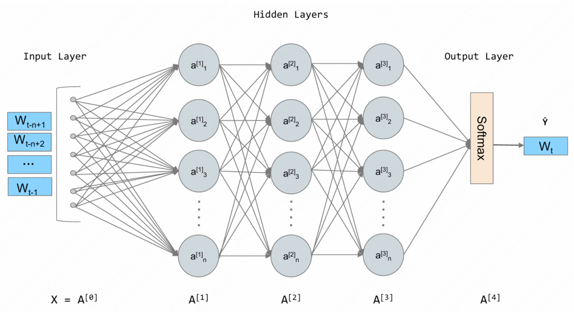

# 大语言模型基础

## 3.1 语言模型与Transformer架构

### 3.1.1 从N-gram到RNN

语言模型是自然语言处理的核心，其根本任务是计算一个词序列出现的概率。

#### (1) 统计语言模型与N-gram的思想

正在深度学习兴起之前，统计方法是语言模型的主流。核心思想是，一个句子出现的概率，等于该句子中每个词出现的条件概率的连乘。对于一个由词w1，w2,...,w<sub>m</sub>
构成的句子S，其概率P(S)可以表示为： 

P(S)=P(w1,w2,...,wm)=P(w1)*P(w2|w1)*P(w3|w1,w2)•••P(wm|w1,...,$w_{m-1}$)   概率的链式法则


核心思想是：我们不必回溯一个词的全部历史，一个词的出现概率只与它前面有限的n-1个词有关基于这个假设建立的语言模型，我们称之为N-gram模型

+ Bigram(当N=2时)：
P($w_{i}$|$w_{1}$,...,$w_{i-1}$)≈P($w_{i}$|$w_{i-1}$)      一个词的出现与它前面的一个词有关

+ Trigram(当N=3时)：
P($w_{i}$|$w_{1}$,...,$w_{i-1}$)≈P($w_{i}$|$w_{i-2}$,$w_{i-1}$)   一个词的出现与它前面的两个词有关

这些概率可以通过在大型语料库中进行最大似然MLE估计来计算
P($w_{i}$|$w_{i-1}$)=Count($w_{i-1}$, $w_{i}$) / Count($w_{i-1}$)

这里的Count()函数就代表计数：
+ Count($w_{i-1}$, $w_{i}$): 表示词对($w_{i-1}$, $w_{i}$)在语料库中连续出现的总次数
+ Count($w_{i-1}$): 表示单个词$w_{i-1}$在语料库中出现的总次数

```python
import collections

# 示例语料库，与上方案例讲解中的语料库保持一致
corpus = "datawhale agent learns datawhale agent works"
tokens = corpus.split()
total_tokens = len(tokens)

# --- 第一步：计算 P(datawhale) ---
count_datawhale = tokens.count("datawhale")
p_datawhale = count_datawhale / total_tokens
print(f"第一步: P(datawhale) = {count_datawhale}/{total_tokens} = {p_datawhale:.3f}")

# --- 第二步:计算 P(agent|datawhale) ---
# 先计算 bigrams 用于后续步骤
bigrams = zip(tokens, tokens[1:])
bigrams_counts = collections.Counter(bigrams)
count_datawhale_agent = bigrams_counts[("datawhale", "agent")]
# count_datawhale 已在第一步计算
p_agent_given_datawhale = count_datawhale_agent / count_datawhale
print(f"第二步: P(agent|datawhale) = {count_datawhale_agent}/{count_datawhale} = {p_agent_given_datawhale:.3f}")

# --- 第三步:计算 P(learns|agent) ---
count_agent_learns = bigrams_counts[("agent", "learns")]
count_agent = tokens.count("agent")
p_learns_given_agent = count_agent_learns / count_agent
print(f"第三步: P(learns|agent) = {count_agent_learns}/{count_agent} = {p_learns_given_agent:.3f}")

# --- 最后:将概率连乘 ---
p_sentence = p_datawhale * p_agent_given_datawhale * p_learns_given_agent
print(f"最后: P('datawhale agent learns') ≈ {p_datawhale:.3f} * {p_agent_given_datawhale:.3f} * {p_learns_given_agent:.3f} = {p_sentence:.3f}")
```

N-gram简单有效，但是有两个致命的缺陷：
+ 数据稀疏性：如果一个词从未在语料库中出现，其概率估计就为0，这是不合理的。
+ 泛化能力差：模型无法理解词与词之间的语义相似性。例如，即使模型在语料库中见过很多次 agent learns，它也无法将这个知识泛化到语义相似的词上。当我们计算 robot learns 的概率时，如果 robot 这个词从未出现过，或者 robot learns 这个组合从未出现过，模型计算出的概率也会是零。模型无法理解 agent 和 robot 在语义上的相似性。

#### (2)神经网络语言模型与词嵌入

+ 前馈神经网络语言模型，核心思想分为两步：
  + 构建一个语义空间：创建一个高维的连续向量空间，然后将词汇表中的每个词都映射为该空间中的一个点。这个点-向量被称为词嵌入或词向量，在这个空间里，语义上相近的词，它们对应的向量在空间中的位置也相近
  + 学习从上下文到下一个词的映射：利用神经网络的强大拟合能力，来学习一个函数。这个函数的输入是前n-1个词的词向量，输出是词汇表中每个词在当前上下文后出现的概率分布。
  + 
+ 在这个架构中，词嵌入是在模型训练过程中自动学习得到的。模型为了完成预测下一个词这个任务，会不断调整每个词的向量位置，最终使这些向量能蕴含丰富的语义信息。一旦我们将词转换成了向量，我们就可以用数学工具来度量它们之间的关系。最常用的方法是余弦相似度，通过计算两个向量的夹角的余弦值来衡量它们的相似性
  + similarity(a,b)=cos(θ)=(a\*b) / (|a|\*|b|)
  + 公式含义：
    + 如果两个向量方向完全相同，夹角为0，余弦值为1，表示完全相关
    + 如果两个向量方向正交，夹角为90，余弦值为0，表示毫无关系
    + 如果两个向量方向完全相反，夹角为180，余弦值为-1，表示完全负相关
  + 代码：
    + ```python
      import numpy as np
      
      def cosine_similarity(vec1, vec2):
        dot_product = np.dot(vec1, vec2)
        norm_product = np.linalg.norm(vec1) * np.linalg.norm(vec2)
        return dot_product / norm_product
      
      # 假设已经有简化的二维词向量
      embeddings = {
        "king": np.array([0.9, 0.8]),
        "queen": np.array([0.9, 0.2]),
        "man": np.array([0.7, 0.9]),
        "woman": np.array([0.7, 0.3])
      }
      # king - man + woman
      result_vec = embeddings["king"] - embeddings["man"] + embeddings["woman"]
      
      # 计算结果向量与"queen"的相似度
      sim = cosine_similarity(result_vec, embeddings["queen"])
      print(f"king - man + woman 的结果向量: {result_vec}")
      print(f"该结果与 'queen' 的相似度: {sim:.4f}")
    ```
+ 成功解决了N-gram模型的泛化能力差的问题，但是上下文窗口是固定的，智能考虑固定数量的前文

#### (3) 循环神经网络(RNN)与长短时记忆网络(LSTM)

核心思想：为网络增加记忆能力
RNN的设计引入了一个隐藏状态向量，可以理解为短期记忆，在处理序列的每一步，网络都会读取当前的输入词，并结合它上一刻的记忆(上个时间步的隐藏状态)，然后生成一个新的记忆(当前时间步的隐藏状态)传递给下一刻，使得信息可以在序列中不断向后传递


+ 标准的RNN在实践中存在一个严重的问题：长期依赖问题。在训练过程中，模型需要通过反向传播算法根据输出端的误差来调整网络深处的权重。对于RNN，序列的长度就是网络的深度，
  当序列很长时，梯度在从后向前传播的过程中会经过中会经过多次连乘，这回导致梯度值快速趋向于零(梯度消失)或变的极大(梯度爆炸)。
  梯度消失使得模型无法有效学习到序列早期信息对后期输出的影响,即难以捕捉长距离的依赖关系。

+ 为了解决长依赖问题，长短时记忆网络LSTM被设计出来。LSTM是特殊的RNN，核心是引入了细胞状态和一套精密的门控机制。细胞状态可以看作是一条独立于隐藏状态的信息通路，允许信息在时间步之间更顺畅地传递。
  门控机制则是由几个神经网络构成，它们可以学习如何有选择地让信息通过，从而控制细胞状态中信息的增加与移除
  + 遗忘门：决定从上一时刻的细胞状态中丢弃哪些信息
  + 输入门：决定将当前输入中的哪些新信息存入细胞状态
  + 输出门：决定根据当前的细胞状态，输出哪些信息到隐藏状态

### 3.1.2 Transformer架构解析

RNN与LSTM的瓶颈是必须按顺序处理数据，第t个时间步的计算，必须等待第t-1个时间步完成后才能开始。RNN无法进行大规模的并行计算，在处理长序列时效率低下，
即大地限制了模型规模和训练速度的提升。Transformer抛弃了循环结构，引入了***注意力Attention***的机制来捕捉序列内的依赖关系

#### (1) Encoder-Decoder整体结构

最初的Transformer模型是为了端到端任务机器翻译而设计的，宏观上遵循了经典的***编码器-解码器***架构


+ 编码器：任务是***理解***输入的整个句子。它会读取所有输入词元，最终为每个词元生成一个富含上下文信息的向量表示
+ 解码器：任务是***生成***目标句子。它会参考自己已生成的前文，并咨询编码器的理解结果，来生成下一个词。

```python
import torch
import torch.nn as nn
import math

# --- 占位符模块 ---

class PositionalEncoding(nn.Module):
    """位置编码模块"""
    def forward(self, x):
        pass

class MultiHeadAttention(nn.Module):
    """多头注意力机制模块"""
    def forward(self, query, key, value, mask):
        pass
    
class PositionWiseFeedForward(nn.Module):
    """位置前馈网络模块"""
    def forward(self, x):
        pass

# --- 编码器核心层 ---

class EncoderLayer(nn.Module):
    def __init__(self, d_model, num_heads, d_ff, dropout):
        super(EncoderLayer, self).__init__()
        self.self_attn = MultiHeadAttention()  # 待实现
        self.feed_forward = PositionWiseFeedForward()  # 待实现
        self.norm1 = nn.LayerNorm(d_model)
        self.norm2 = nn.LayerNorm(d_model)
        self.dropout = nn.Dropout(dropout)

    def forward(self, x, mask):
        # 残差连接与层归一化
        # 1、多头自注意力
        attn_output = self.self_attn(x, x, x, mask)
        x = self.norm1(x + self.dropout(attn_output))

        # 2、前馈网络
        ff_output = self.feed_forward(x)
        x = self.norm2(x + self.dropout(ff_output))
        return x

# --- 解码器核心层 ---
class DecoderLayer(nn.Module):
    def __init__(self, d_model, num_heads, d_ff, dropout):
        super(DecoderLayer, self).__init__()
        self.self_attn = MultiHeadAttention()
        self.cross_attn = MultiHeadAttention()
        self.feed_forward = PositionWiseFeedForward()
        self.norm1 = nn.LayerNorm(d_model)
        self.norm2 = nn.LayerNorm(d_model)
        self.norm3 = nn.LayerNorm(d_model)
        self.dropout = nn.Dropout(dropout)


    def forward(self, x, encoder_output, src_mask, tgt_mask):
        # 1、掩码多头自注意力(对自己)
        attn_output = self.self_attn(x, x, x, tgt_mask)
        x = self.norm1(x + self.dropout(attn_output))

        # 2、交叉注意力(对编码器输出)
        cross_attn_output = self.cross_attn(x, encoder_output, encoder_output, src_mask)
        x = self.norm2(x + self.dropout(cross_attn_output))
        
        # 3、前馈网络
        ff_output = self.feed_forward(x)
        x = self.norm3(x + self.dropout(ff_output))

        return x
```


