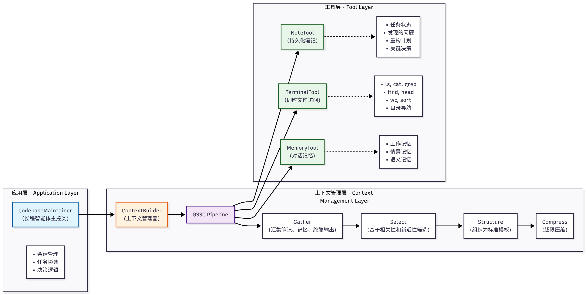

# 第九章 上下文工程

在每一次模型调用前，如何以可复用、可度量、可演进的方式，拼装并优化输入上下文，从而提升正确性、鲁棒性与效率

**ContextBuilder**：上下文构建器
**NoteTool**：结构化笔记工具，支持智能体进行持久化记忆管理
**TerminalTool**：终端工具，支持智能体进行文件系统操作和即时上下文检索

## 9.1 什么是上下文工程


## 9.2 为什么上下文工程重要

**上下文腐蚀**：随着上下文窗口中的tokens增加，模型从上下文中准确回忆信息的能力反而下降。

### 9.2.1 有效上下文的解刨学

上下文工程的目标：用尽可能少、但高信号密度的tokens，最大化获得期望结果的概率。

+ **系统提示**：语言清晰、直白，信息层级把握在刚刚好的高度。常见两级误区：
  + 过度硬编码：在提示中写入复杂、脆弱的if-else逻辑，长期维护成本高、易碎。
  + 过于空泛：只给出宏观目标与泛化指引，缺少对期望输出的具体信号或假定了错误的共享上下文。
            建议将提示分区组织（如 、、工具指引、输出描述等），用 XML/Markdown 分隔。
            无论格式如何，追求的是能完整勾勒期望行为的“最小必要信息集”（“最小”并不等于“最短”）。
            先用最好的模型在最小提示上试跑，再依据失败模式增补清晰的指令与示例。
+ **工具：工具定义了智能体与信息/行动空间的契约，必须促进效率：既要返回token 友好的信息，又要鼓励高效的智能体行为。工具应当：
  + 职责单一、相互低重叠，接口语义清晰
  + 对错误鲁棒
  + 入参描述明确、无歧义，充分发挥模型擅长的表达与推理能力。 常见失败模式是“臃肿工具集”：功能边界模糊，导致“选哪个工具”这一决策本身就含混不清。
    如果人类工程师都说不准用哪个工具，别指望智能体做得更好。精心甄别一个“最小可行工具集（MVTS）”往往能显著提升长期交互中的稳定性与可维护性。
+ 示例：始终推荐提供示例。精挑出一组多样且典型的示例


### 9.2.2上下文检索与智能体式搜索

工程实践正在从推理前一次性检索逐步过渡到及时上下文。后者不再预先加载所有相关数据，而是维护轻量化引用，在运行时通过工具动态加载所需数据。

除了存储效率，引用的元数据本身也能帮助精化行为：目录层级、命名约定、时间戳等都在隐含地传达目的与时效。

**渐进式披露**：每一步交互都会产生新的上下文，反过来指导下一步决策--文件大小暗示复杂度、命名暗示用途、时间戳暗示相关性。

### 9.2.3 面向长时程任务的上下文工程

长时程任务要求智能体在超出上下文窗口的长序列行动中，仍能保持连贯性、上下文一致与目标导向。

约束这些的工程手段：
+ **压缩整合**：
  + 定义：当对话接近上下文上限时，对其进行高保真总结，并用该摘要重启一个新的上下文窗口，以维持长程连贯性
  + 实践：让模型压缩并保留架构性决策、未解决缺陷、实现细节，丢弃重复的工具输出与噪声，新窗口携带压缩摘要+最近少量高相关工件
  + 调参建议：先优化召回(确保不遗漏关键信息)，再优化精确度(剔除冗余内容)，一种安全的轻触式压缩是对深历史中的工具调用与结果进行清理。

+ **结构化笔记**：
  + 定义：智能体记忆。智能体以固定频率将关键信息写入上下文外的持久化存储，在后续阶段按需拉回。
  + 价值：以极低的上下文开销维持持久状态与依赖关系。
  + 说明：在非编码场景中同样有效(如长期策略性任务、游戏/仿真中的目标管理与统计计数)。
+ **子代理架构**：
  + 思想：由主代理负责高层规划与综合，多个专长子代理在干净的上下文窗口中各自深挖、调用工具并探索，最后仅回传凝练摘要。
  + 好处：实现关注点分离。庞杂的搜索上下文留在子代理内容，主代理专注于整合与推理，适合需要并行探索的复杂研究/分析任务。
  + 经验：公开的多智能体研究系统显示，该模式在复杂研究任务上相较单代理基线具有显著优势。

方法取舍可以遵循以下经验法则：
+ **压缩整合**：适合需要长对话连续性的任务，强调上下文的“接力”。
+ **结构化笔记**：适合有里程碑/阶段性成果的迭代式开发与研究。
+ **子代理架构**：适合复杂研究与分析，能从并行探索中获益。

## 9.3 ContextBuilder

### 9.3.1 设计动机与目标

上下文管理系统应该解决的几个关键问题：

+ **统一入口**：将  获取(Gather) - 选择(Select) - 结构化(Structure) - 压缩(Compress) 抽象为可复用流水线，减少在Agent实现中的重复模板代码。
+ **稳定形态**：输出固定骨架的上下文模板，便于调试、A/B测试与评估。采用了分区组织的模板结构：
  + [Role & Policies]：明确 Agent 的角色定位和行为准则
  + [Task]：当前需要完成的具体任务
  + [State]：Agent 的当前状态和上下文信息
  + [Evidence]：从外部知识库检索的证据信息
  + [Context]：历史对话和相关记忆
  + [Output]：期望的输出格式和要求
+ **预算守护**：在token预算内尽量保留高价值信息，对超限上下文提供兜底压缩策略。
+ **最小规则**：不引入来源/优先级等分类维度，避免复杂度增长。

### 9.3.2 核心数据结构

#### (1) ContextPacket：候选信息包

```python
from dataclasses import dataclass
from typing import Optional, Dict, Any
from datetime import datetime

@dataclass
class ContextPacket:
    """候选信息包

    Attributes:
        content: 信息内容
        timestamp: 时间戳
        token_count: Token 数量
        relevance_score: 相关性分数(0.0-1.0)
        metadata: 可选的元数据
    """
    content: str
    timestamp: datetime
    token_count: int
    relevance_score: float = 0.5
    metadata: Optional[Dict[str, Any]] = None

    def __post_init__(self):
        """初始化后处理"""
        if self.metadata is None:
            self.metadata = {}
        # 确保相关性分数在有效范围内
        self.relevance_score = max(0.0, min(1.0, self.relevance_score))
```

#### (2) ContextConfig：配置管理

```python
@dataclass
class ContextConfig:
    """上下文构建配置

    Attributes:
        max_tokens: 最大 token 数量
        reserve_ratio: 为系统指令预留的比例(0.0-1.0)
        min_relevance: 最低相关性阈值
        enable_compression: 是否启用压缩
        recency_weight: 新近性权重(0.0-1.0)
        relevance_weight: 相关性权重(0.0-1.0)
    """
    
    max_tokens: int = 3000
    reserve_ratio: float = 0.2
    min_relevance: float = 0.1
    enable_compression: bool = True
    recency_weight: float = 0.3
    relevance_weight: float = 0.7

    def __post_init__(self):
        """验证配置参数"""
        assert 0.0 <= self.reserve_ratio <= 1.0, "reserve_ratio 必须在 [0, 1] 范围内"
        assert 0.0 <= self.min_relevance <= 1.0, "min_relevance 必须在 [0, 1] 范围内"
        assert abs(self.recency_weight + self.relevance_weight - 1.0) < 1e-6, \
            "recency_weight + relevance_weight 必须等于 1.0"

"""
reserve_ratio确保系统指令等关键信息始终有足够的空间，不会被其他信息挤占。
"""
```

### 9.3.3 GSSC流水线详解

GSSC(Gather-Select-Structure-Compress): 将上下文构建过程分解为四个清晰的阶段

#### (1) Gather: 多源信息汇集

```python
def _gather(
    self,
    user_query: str,
    conversation_history: Optional[List[Message]] = None,
    system_instructions: Optional[str] = None,
    custom_packets: Optional[List[ContextPacket]] = None
) -> List[ContextPacket]:
    """汇集所有候选信息

    Args:
        user_query: 用户查询
        conversation_history: 对话历史
        system_instructions: 系统指令
        custom_packets: 自定义信息包

    Returns:
        List[ContextPacket]: 候选信息列表
    """
    packets = []

    # 1.添加系统指令(最高优先级，不参与评分)
    if system_instructions:
        packets.append(ContextPacket(
            content=system_instructions,
            timestamp=datetime.now(),
            token_count=self._count_tokens(system_instructions),
            relevance_score=1.0,  # 系统指令始终保留
            metadata={"type": "system_instructions", "priority": "high"}
        ))

    # 2.从记忆系统检索相关记忆
    if self.memory_tool:
        try:
            memory_results = self.memory_tool.run({
                "action": "search",
                "query": user_query,
                "limit": 10,
                "min_importance": 0.3
            })
            # 解析记忆结果并转为ContextPacket
            memory_packets = self._parse_memory_results(memory_results, user_query)
            packets.extend(memory_packets)
        except Exception as e:
            print(f"[WARNING] 记忆检索失败: {e}")

    # 3.从RAG系统检索相关知识
    if self.rag_tool:
        try:
            rag_results = self.rag_tool.run({
                "action": "search",
                "query": user_query,
                "limit": 5,
                "min_score": 0.3
            })
            # 解析RAG结果并转换为ContextPacket
            rag_packets = self._parse_rag_results(rag_results, user_query)
            packets.extend(rag_packets)
        except Exception as e:
            print(f"[WARNING] RAG检索失败：{e}")

    # 4. 添加对话历史(仅保留最近的 N 条)
    if conversation_history:
        recent_history = conversation_history[-5:]  # 默认保留最近 5 条
        for msg in recent_history:
            packets.append(ContextPacket(
                content=f"{msg.role}: {msg.content}",
                timestamp=msg.timestamp if hasattr(msg, 'timestamp') else datetime.now(),
                token_count=self._count_tokens(msg.content),
                relevance_score=0.6,  # 历史消息的基础相关性
                metadata={"type": "conversation_history", "role": msg.role}
            ))

    # 5. 添加自定义信息包
    if custom_packets:
        packets.extend(custom_packets)

    print(f"[ContextBuilder] 汇集了 {len(packets)} 个候选信息包")
    return packets
```

实现了：
**容错机制**：每个外部数据源的调用都被 try-except 包裹，确保单个源的失败不会影响整体流程
**优先级处理**：系统指令被标记为高优先级，确保始终被保留
**历史限制**：对话历史只保留最近的几条，避免上下文窗口被历史信息占据

#### (2) Select：智能信息选择

```python
def _select(
    self,
    packets: List[ContextPacket],
    user_query: str,
    available_tokens: int
) -> List[ContextPacket]:
    """选择最相关的信息包

    Args:
        packets: 候选信息包列表
        user_query: 用户查询(用于计算相关性)
        available_tokens: 可用的 token 数量

    Returns:
        List[ContextPacket]: 选中的信息包列表
    """

    # 1.分离系统指令和其他信息
    system_packets = [p for p in packets if p.metadata.get("type") == "system_instruction"]
    other_packets = [p for p in packets if p.metadata.get("type") != "system_instruction"]

    # 2.计算系统指令占用的token
    system_tokens = sum(p.token_count for p in system_packets)
    remaining_tokens = available_tokens - system_tokens

    if remaining_tokens <= 0:
        print("[WARNING] 系统指令已占满所哟token预算")
        return system_packets

    # 3.为其他信息计算综合分数
    scored_packets = []
    for packet in other_packets:
        # 计算相关性分数(如果尚未计算)
        if packet.relevance_score == 0.5:  # 默认值，需要重新计算
            relevance = self._calcuate_relevance(packet.content, user_query)
            packet.relevance_score = relevance
        
        # 计算新近性分数
        recency = self._calculate_recency(packet.timestamp)
        
        # 综合分数 = 相关性权重 * 相关性 + 新近性权重 * 新近性
        combine_score = (
            self.config.relevance_weight * packet.relevance_score + self.config.recency_weight * recency
        )
        
        # 过滤低于最小相关性阈值的信息
        if packet.relevance_score >= self.config.min_relevance:
            scored_packets.append((combine_score, packet))
            
    # 4.按分数降序排序
    scored_packets.sort(key=lambda x: x[0], reverse=True)
    
    # 5.贪心选择：按分数从高到低填充，知道达到token上限
    selected = system_packets.copy()
    current_tokens = system_tokens
    
    for score, packet in scored_packets:
        if current_tokens + packet.token_count <= available_tokens:
            selected.append(packet)
            current_tokens += packet.token_count
        else:
            # Token预算已满，停止选择
            break
            
    print(f"[ContextBuilder] 选择了{len(selected)} 个信息包，共{current_tokens} tokens")
    return selected

def _calculate_relevance(self, content: str, query: str) -> float:
    """
    计算内容与查询的相关性
    使用简单的关键词重叠算法。在生产环境中，可以替换为向量相似度计算
    
    Args:
        content: 内容文本
        query：查询文本
    Returns:
        float: 相关性分数(0.0-1.0)
    """
    # 分词(简单实现，可以使用更复杂的分词器)
    content_words = set(content.lower().split())
    query_words = set(query.lower().split())
    
    if not query_words:
        return 0.0

    # Jaccard相似度
    intersection = content_words & query_words
    union = content_words | query_words

    return len(intersection) / len(union) if union else 0.0

def _calculate_recency(self, timestamp: datetime) -> float:
    """
    计算时间近因性分数
    使用指数衰减模型，24小时内保持高分，之后逐渐衰减
    Args:
        timestamp: 信息的时间戳
    Returns:
        float：新近性分数(0.0-1.0)
    """

    import math
    age_hours = (datetime.now() - timestamp).total_seconds() / 3600

    # 指数衰减：24小时内保持高分，之后逐渐衰减
    decay_factor = 0.1  # 衰减系数
    recency_score = math.exp(-decay_factor * age_hours / 24)
    return max(0.1, min(1.0, recency_score))  # 限制在[0.1, 1.0] 范围
```

**评分机制**：采用相关性和新近性的加权组合，权重可配置
**贪心算法**：按分数从高到低填充，确保在有限预算内选择最有价值的信息
**过滤机制**：通过min_relevance参数过滤低质量信息

#### (3) Structure结构化输出

```python
def _structure(self, selected_packets: List[ContextPacket], user_query: str) -> str:
    """将选中的信息包组织成结构化的上下文模板

    Args:
        selected_packets: 选中的信息包列表
        user_query: 用户查询

    Returns:
        str: 结构化的上下文字符串
    """

    # 按类型分组
    system_instructions = []
    evidence = []
    context = []

    for packet in selected_packets:
        packet_type = packet.metadata.get("type", "general")
        
        if packet_type == "system_instruction":
            system_instructions.append(packet.content)
        elif packet_type in ["rag_result", "knowledge"]:
            evidence.append(packet.content)
        else:
            context.append(packet.content)

    # 构建结构化模版
    sections = []
    
    # [Role & Policies]
    if system_instructions:
        sections.append("[Role & Policies]\n" + "\n".join(system_instructions))

    # [Task]
    sections.append(f"[Task]\n{user_query}")

    # [Evidence]
    if evidence:
        sections.append(f"[Evidence]\n" + "\n---\n".join(evidence))

    # [Context]
    if context:
        sections.append("[Context]\n" + "\n".join(context))

    # [Output]
    sections.append("[Output]\n请基于以上信息，提供准确、有据的回答")

    return "\n\n".join(sections)
```

优势：
**可读性**：清晰的分区让人类和模型都更容易理解上下文结构
**可调式性**：问题定位更容易，可以快速识别哪个区域的信息有问题
**可扩展性**：添加新的信息源只需要创建新的分区

#### (4) Compress：兜底压缩

```python
def _compress(self, context: str, max_tokens: int) -> str:
    """
    压缩超限的上下文
    Args:
        context: 原始上下文
        max_tokens：最大token限制
    Returns：
        str: 压缩后的上下文
    """
    current_tokens = self._count_tokens(context)
    if current_tokens <= max_tokens:
        return context  # 无需压缩
    print(f"[ContextBuilder] 上下文超限({current_tokens} > {max_tokens}), 执行压缩")

    # 分区压缩：保持结构完整性
    sections = context.split("\n\n")
    compressed_sections = []
    current_total = 0
    
    for section in sections:
        section_tokens = self._count_tokens(section)
        if current_total + section_tokens <= max_tokens:
            # 完整保留
            compressed_sections.append(section)
            current_total += section_tokens
        else:
            # 部分保留
            remaining_tokens = max_tokens - current_total
            if remaining_tokens > 50:  # 至少保留50tokens
                # 简单截断(生产环境中可以使用LLM摘要)
                truncated = self._truncate_text(section, remaining_tokens)
                compressed_sections.append(truncated + "\n[...内容已压缩...]")
            break
    compressed_context = "\n\n".join(compressed_sections)
    final_tokens = self._count_tokens(compressed_context)
    print(f"[ContextBuilder]压缩完成：{current_tokens} -> {final_tokens} tokens")

    return compressed_context

def _truncate_text(self, text: str, max_tokens: int) -> str:
    """截断文本到指定 token 数量

    Args:
        text: 原始文本
        max_tokens: 最大 token 数量

    Returns:
        str: 截断后的文本
    """

    # 简单实现：按字符比例估算
    # 生产环境中应该使用精确的tokenizer
    char_per_token = len(text) / self._count_tokens(text) if self._count_tokens(text) > 0 else 4
    max_chars = int(max_tokens * char_per_token)

    return text[:max_chars]

def _count_tokens(self, text: str) -> int:
    """
    估算文本的token数量
    Args：
        text：文本内容
    Returns：
        int：token数量
    """
    # 简单估算：中文1字符 ≈ 1 token，英文1单词 ≈ 1.3 tokens
    # 生产环境中应该使用精确的tokenizer
    chinese_chars = sum(1 for ch in text if "\u4e00" <= ch <= "\u9fff")
    english_words = len([w for w in text.strip() if w])
    return int(chinese_chars + english_words * 1.3)
```

### 9.3.4完整使用示例

#### (1) 基础使用

```python
from hello_agents.context import ContextBuilder, ContextConfig
from hello_agents.tools import MemoryTool, RAGTool
from hello_agents.core.message import Message
from datetime import datetime

# 1.初始化工具
memory_tool = MemoryTool(user_id="user123")
rag_tool = RAGTool(knowledge_base_path="./knowledge_base")

# 2.创建ContextBuilder
config = ContextConfig(
    max_tokens=3000,
    reserve_ratio=0.2,
    min_relevance=0.2,
    enable_compress=True
)

builder = ContextBuilder(
    memory_tool=memory_tool,
    rag_tool=rag_tool,
    config=config
)

# 3.准备对话历史
conversation_history = [
    Message(content="我正在开发一个数据分析工具", role="user", timestamp=datetime.now()),
    Message(content="很好!数据分析工具通常需要处理大量数据。您计划使用什么技术栈?", role="assistant", timestamp=datetime.now()),
    Message(content="我打算使用Python和Pandas,已经完成了CSV读取模块", role="user", timestamp=datetime.now()),
    Message(content="不错的选择!Pandas在数据处理方面非常强大。接下来您可能需要考虑数据清洗和转换。", role="assistant", timestamp=datetime.now())
]

# 4.添加一些记忆
memory_tool.run({
    "action": "add",
    "content": "用户正在开发数据分析工具，使用Python和Pandas",
    "memory_type": "semantic",
    "importance": 0.8
})

# 5.构建上下文
context = builder.build(
    user_query="如何优化Pandas的内存占用",
    conversation_history=conversation_history,
    system_instructions="你是一位资深的Python数据工程师顾问。你的回答需要:1) 提供具体可行的建议 2) 解释技术原理 3) 给出代码示例"
)
print("=" * 80)
print("构建的上下文:")
print("=" * 80)
print(context)
print("=" * 80)
```

#### (2) 与Agent集成

```python
from hello_agents import SimpleAgent, HelloAgentsLLM, ToolRegistry
from hello_agents.context import ContextBuilder, ContextConfig
from hello_agents.tools import MemoryTool, RAGTool


class ContextAwareAgent(SimpleAgent):
    """具有上下文感知能力的 Agent"""

    def __init__(self, name: str, llm: HelloAgentsLLM, **kwargs):
        super().__init__(name=name, llm=llm, system_prompt=kwargs.get("system_prompt", ""))

        # 初始化上下文构建器
        self.memory_tool = MemoryTool(user_id=kwargs.get("user_id", "default"))
        self.rag_tool = RAGTool(knowledge_base_path=kwargs.get("knowledge_base_path", "./kb"))

        self.context_builder = ContextBuilder(
            memory_tool=self.memory_tool,
            rag_tool=self.rag_tool,
            config=ContextConfig(max_tokens=4000)
        )

        self.conversation_history = []

    def run(self, user_input: str) -> str:
        """运行Agent，自动构建优化的上下文"""
        
        # 1.使用ContextBuilder构建优化的上下文
        optimized_context = self.context_builder.build(
            user_query=user_input,
            conversation_history=self.conversation_history,
            system_instructions=self.system_prompt
        )

        # 2.使用优化后的上下文调用LLM
        message = [
            {"role": "system", "content": optimized_context},
            {"role": "user", "content": user_input}
        ]
        response = self.llm.invoke(message)
        
        # 3.更新对话历史
        from hello_agents.core.message import Message
        from datetime import datetime
        
        self.conversation_history.append(
            Message(context=user_input, role="user", timestamp=datetime.now())
        )
        self.conversation_history.append(
            Message(context=response, role="assistant", timestamp=datetime.now())
        )

        # 4.将重要交互记录到记忆系统
        self.memory_tool.run({
            "action": "add",
            "content": f"Q: {user_input}\nA: {response[:200]}...",
            "memory_type": "episodic",
            "importance": 0.6
        })

        return response

# 使用示例
agent = ContextAwareAgent(
    name="数据分析顾问",
    llm=HelloAgentsLLM(),
    system_prompt="你是一位资深的Python数据工程顾问.",
    user_id="user123",
    knowledge_base_path="./data_science_kb"
)
response = agent.run("如何优化Pandas的内存占用？")
print(response)
```

### 9.3.5 最佳实践与优化建议

**动态调整 token 预算**：根据任务复杂度动态调整 max_tokens，简单任务使用较小预算，复杂任务增加预算。

**相关性计算优化**：在生产环境中，将简单的关键词重叠替换为向量相似度计算，提升检索质量。

**缓存机制**：对于不变的系统指令和知识库内容，可以实现缓存机制，避免重复计算。

**监控与日志**：记录每次上下文构建的统计信息(选中信息数量、token 使用率等)，便于后续优化。

**A/B 测试**：对于关键参数(如相关性权重、新近性权重)，通过 A/B 测试找到最优配置。

## 9.4 NoteTool: 结构化笔记

### 9.4.1设计理念与应用场景

#### (1) 为什么需要NoteTool

MemoryTool 主要关注对话式记忆——短期工作记忆、情景记忆和语义记忆。对于需要长期追踪、结构化管理的项目式任务，我们需要一种更轻量、更人类友好的记录方式。

NoteTool提供了：
+ **结构化记录**：使用 Markdown + YAML 格式，既适合机器解析，也方便人类阅读和编辑
+ **版本友好**：纯文本格式，天然支持 Git 等版本控制系统
+ **低开销**：无需复杂的数据库操作，适合轻量级的状态追踪
+ **灵活分类**：通过 type 和 tags 灵活组织笔记，支持多维度检索

#### (2) 典型应用场景

NoteTool适合的场景：

**场景1:长期项目追踪**

+ task_state：当前阶段的任务状态和进度
+ conclusion：每个阶段结束后的关键结论
+ blocker：遇到的问题和阻塞点
+ action：下一步的行动计划

```python
# 记录任务状态
notes.run({
    "action": "create",
    "title": "重构项目 - 第一阶段",
    "content": "已完成数据模型层的重构,测试覆盖率达到85%。下一步将重构业务逻辑层。",
    "note_type": "task_state",
    "tags": ["refactoring", "phase1"]
})

# 记录阻塞点
notes.run({
    "action": "create",
    "title": "依赖冲突问题",
    "content": "发现某些第三方库版本不兼容,需要解决。影响范围:业务逻辑层的3个模块。",
    "note_type": "blocker",
    "tags": ["dependency", "urgent"]
})
```

**场景2: 研究任务管理**

+ 每篇论文的核心观点(conclusion)
+ 待深入调研的主题(action)
+ 重要的参考文献(reference)

**场景3: 与ContextBuilder配合**

```python
# 在Agent的run方法中
def run(self, user_input: str) -> str:
    # 1.检索相关笔记
    relevant_notes = self.note_tool.run({
        "action": "search",
        "query": user_input,
        "limit": 3
    })

    # 2.将笔记内容转为ContextPacket
    note_packets = []
    for note in relevant_notes:
        note_packets.append(ContextPacket(
            content=note["content"],
            timestamp=note["updated_at"],
            token_count=self._count_tokens(note["content"]),
            relevant_score=0.7,
            metadata={"type": "note", "note_type": note["type"]}
        ))

    # 3.构建上下文时传入笔记
    context = self.context_builder.build(
        user_query=user_input,
        custom_packet=note_packets
    )
```

### 9.4.2 存储格式详解

#### (1) 笔记文件格式

每个笔记都是独立的.md文件，格式：
``` 
---
id: note_20250119_153000_0
title: 项目进展 - 第一阶段
type: task_state
tags: [refactoring, phase1, backend]
created_at: 2025-01-19T15:30:00
updated_at: 2025-01-19T15:30:00
---

# 项目进展 - 第一阶段

## 完成情况

已完成数据模型层的重构,主要改动包括:

1. 统一了实体类的命名规范
2. 引入了类型提示,提升代码可维护性
3. 优化了数据库查询性能

## 测试覆盖

- 单元测试覆盖率: 85%
- 集成测试覆盖率: 70%

## 下一步计划

1. 重构业务逻辑层
2. 解决依赖冲突问题
3. 提升集成测试覆盖率至85%
```
格式优势：
**YAML 元数据**：机器可解析，支持精确的字段提取和检索
**Markdown 正文**：人类可读，支持丰富的格式化(标题、列表、代码块等)
**文件名即 ID**：简化管理，每个笔记的文件名就是其唯一标识

#### (2) 索引文件
NoteTool 维护一个 notes_index.json 文件，用于快速检索和管理笔记：
```
{
  "note_20250119_153000_0": {
    "id": "note_20250119_153000_0",
    "title": "项目进展 - 第一阶段",
    "type": "task_state",
    "tags": ["refactoring", "phase1", "backend"],
    "created_at": "2025-01-19T15:30:00",
    "updated_at": "2025-01-19T15:30:00",
    "file_path": "./notes/note_20250119_153000_0.md"
  }
}
```

索引文件的作用：

**快速检索**：无需打开每个文件，直接从索引中查找
**元数据管理**：集中管理所有笔记的元数据
**完整性校验**：可以检测文件缺失或损坏

### 9.4.3 核心操作详解

#### (1) create：创建笔记

```python
def _create_note(
    self,
    title: str,
    content: str,
    note_type: str = "general",
    tags: Optional[List[str]] = None
) -> str:
    """创建笔记

    Args:
        title: 笔记标题
        content: 笔记内容(Markdown格式)
        note_type: 笔记类型(task_state/conclusion/blocker/action/reference/general)
        tags: 标签列表

    Returns:
        str: 笔记ID
    """

    from datetime import datetime

    # 1. 生成唯一ID
    timestamp = datetime.now().strftime('%Y%m%d_%H%M%S')
    note_id = f"note_{timestamp}_{len(self.index)}"

    # 2. 构建元数据
    metadata = {
        "id": note_id,
        "title": title,
        "type": note_type,
        "tags": tags or [],
        "created_at": datetime.now().isoformat(),
        "updated_at": datetime.now().isoformat()
    }

    # 3. 构建完整的 Markdown 文件内容
    md_content = self._build_markdown(metadata, content)

    # 4. 保存到文件
    file_path = os.path.join(self.workspace, f"{note_id}.md")
    with open(file_path, 'w', encoding='utf-8') as f:
        f.write(md_content)

    # 5. 更新索引
    metadata["file_path"] = file_path
    self.index[note_id] = metadata
    self._save_index()

    return note_id

def _build_markdown(self, metadata: Dict, content: str) -> str:
    """构建 Markdown 文件内容(YAML + 正文)"""
    import yaml

    # YAML 前置元数据
    yaml_header = yaml.dump(metadata, allow_unicode=True, sort_keys=False)

    # 组合格式
    return f"---\n{yaml_header}---\n\n{content}"

# 使用示例
from hello_agents.tools import NoteTool

notes = NoteTool(workspace="./project_notes")

note_id = notes.run({
    "action": "create",
    "title": "重构项目 - 第一阶段",
    "content": """## 完成情况
已完成数据模型层的重构,测试覆盖率达到85%。

## 下一步
重构业务逻辑层""",
    "note_type": "task_state",
    "tags": ["refactoring", "phase1"]
})

print(f"✅ 笔记创建成功,ID: {note_id}")
```

#### (2) read：读取笔记
```python
def _read_note(self, note_id: str) -> Dict:
    """读取笔记内容

    Args:
        note_id: 笔记ID

    Returns:
        Dict: 包含元数据和内容的字典
    """
    if note_id not in self.index:
        raise ValueError(f"笔记不存在: {note_id}")

    file_path = self.index[note_id]["file_path"]

    # 读取文件
    with open(file_path, 'r', encoding='utf-8') as f:
        raw_content = f.read()

    # 解析 YAML 元数据和 Markdown 正文
    metadata, content = self._parse_markdown(raw_content)

    return {
        "metadata": metadata,
        "content": content
    }

def _parse_markdown(self, raw_content: str) -> Tuple[Dict, str]:
    """解析 Markdown 文件(分离 YAML 和正文)"""
    import yaml

    # 查找 YAML 分隔符
    parts = raw_content.split('---\n', 2)

    if len(parts) >= 3:
        # 有 YAML 前置元数据
        yaml_str = parts[1]
        content = parts[2].strip()
        metadata = yaml.safe_load(yaml_str)
    else:
        # 无元数据,全部作为正文
        metadata = {}
        content = raw_content.strip()

    return metadata, content
```

#### (3) update: 更新笔记
```python
def _update_note(
    self,
    note_id: str,
    title: Optional[str] = None,
    content: Optional[str] = None,
    note_type: Optional[str] = None,
    tags: Optional[List[str]] = None
) -> str:
    """更新笔记

    Args:
        note_id: 笔记ID
        title: 新标题(可选)
        content: 新内容(可选)
        note_type: 新类型(可选)
        tags: 新标签(可选)

    Returns:
        str: 操作结果消息
    """
    if note_id not in self.index:
        raise ValueError(f"笔记不存在: {note_id}")

    # 1. 读取现有笔记
    note = self._read_note(note_id)
    metadata = note["metadata"]
    old_content = note["content"]

    # 2. 更新字段
    if title:
        metadata["title"] = title
    if note_type:
        metadata["type"] = note_type
    if tags is not None:
        metadata["tags"] = tags
    if content is not None:
        old_content = content

    # 更新时间戳
    from datetime import datetime
    metadata["updated_at"] = datetime.now().isoformat()

    # 3. 重新构建并保存
    md_content = self._build_markdown(metadata, old_content)
    file_path = metadata["file_path"]

    with open(file_path, 'w', encoding='utf-8') as f:
        f.write(md_content)

    # 4. 更新索引
    self.index[note_id] = metadata
    self._save_index()

    return f"✅ 笔记已更新: {metadata['title']}"

```

#### (4) search: 搜索笔记

```python
def _search_notes(
    self,
    query: str,
    limit: int = 10,
    note_type: Optional[str] = None,
    tags: Optional[List[str]] = None
) -> List[Dict]:
    """搜索笔记

    Args:
        query: 搜索关键词
        limit: 返回数量限制
        note_type: 按类型过滤(可选)
        tags: 按标签过滤(可选)

    Returns:
        List[Dict]: 匹配的笔记列表
    """
    results = []
    query_lower = query.lower()

    for note_id, metadata in self.index.items():
        # 类型过滤
        if note_type and metadata.get("type") != note_type:
            continue

        # 标签过滤
        if tags:
            note_tags = set(metadata.get("tags", []))
            if not note_tags.intersection(tags):
                continue

        # 读取笔记内容
        try:
            note = self._read_note(note_id)
            content = note["content"]
            title = metadata.get("title", "")

            # 在标题和内容中搜索
            if query_lower in title.lower() or query_lower in content.lower():
                results.append({
                    "note_id": note_id,
                    "title": title,
                    "type": metadata.get("type"),
                    "tags": metadata.get("tags", []),
                    "content": content,
                    "updated_at": metadata.get("updated_at")
                })
        except Exception as e:
            print(f"[WARNING] 读取笔记 {note_id} 失败: {e}")
            continue

    # 按更新时间排序
    results.sort(key=lambda x: x["updated_at"], reverse=True)

    return results[:limit]

```

#### (5) list: 列出笔记

```python
def _list_notes(
    self,
    note_type: Optional[str] = None,
    tags: Optional[List[str]] = None,
    limit: int = 20
) -> List[Dict]:
    """列出笔记(按更新时间倒序)

    Args:
        note_type: 按类型过滤(可选)
        tags: 按标签过滤(可选)
        limit: 返回数量限制

    Returns:
        List[Dict]: 笔记元数据列表
    """
    results = []

    for note_id, metadata in self.index.items():
        # 类型过滤
        if note_type and metadata.get("type") != note_type:
            continue

        # 标签过滤
        if tags:
            note_tags = set(metadata.get("tags", []))
            if not note_tags.intersection(tags):
                continue

        results.append(metadata)

    # 按更新时间排序
    results.sort(key=lambda x: x.get("updated_at", ""), reverse=True)

    return results[:limit]

```

#### (6) summary: 笔记摘要
```python
def _summary(self) -> Dict[str, Any]:
    """生成笔记摘要统计

    Returns:
        Dict: 统计信息
    """
    total_count = len(self.index)

    # 按类型统计
    type_counts = {}
    for metadata in self.index.values():
        note_type = metadata.get("type", "general")
        type_counts[note_type] = type_counts.get(note_type, 0) + 1

    # 最近更新的笔记
    recent_notes = sorted(
        self.index.values(),
        key=lambda x: x.get("updated_at", ""),
        reverse=True
    )[:5]

    return {
        "total_notes": total_count,
        "type_distribution": type_counts,
        "recent_notes": [
            {
                "id": note["id"],
                "title": note.get("title", ""),
                "type": note.get("type"),
                "updated_at": note.get("updated_at")
            }
            for note in recent_notes
        ]
    }

```

#### (7) delete: 删除笔记

```python
def _delete_note(self, note_id: str) -> str:
    """删除笔记

    Args:
        note_id: 笔记ID

    Returns:
        str: 操作结果消息
    """
    if note_id not in self.index:
        raise ValueError(f"笔记不存在: {note_id}")

    # 1. 删除文件
    file_path = self.index[note_id]["file_path"]
    if os.path.exists(file_path):
        os.remove(file_path)

    # 2. 从索引中移除
    title = self.index[note_id].get("title", note_id)
    del self.index[note_id]
    self._save_index()

    return f"✅ 笔记已删除: {title}"

```

### 9.4.4 与ContextBuilder的深度集成

#### (1) 场景设定

假设我们正在构建一个长期项目助手，它需要：

+ 记录项目的阶段性进展
+ 追踪待解决的问题
+ 在每次对话时，自动回顾相关笔记
+ 基于历史笔记提供连贯的建议

#### (2) 实现示例

```python
from hello_agents import SimpleAgent, HelloAgentsLLM
from hello_agents.context import ContextBuilder, ContextConfig, ContextPacket
from hello_agents.tools import MemoryTool, RAGTool, NoteTool
from datetime import datetime

class ProjectAssistant(SimpleAgent):
    """长期项目助手,集成 NoteTool 和 ContextBuilder"""

    def __init__(self, name: str, project_name: str, **kwargs):
        super().__init__(name=name, llm=HelloAgentsLLM(), **kwargs)

        self.project_name = project_name

        # 初始化工具
        self.memory_tool = MemoryTool(user_id=project_name)
        self.rag_tool = RAGTool(knowledge_base_path=f"./{project_name}_kb")
        self.note_tool = NoteTool(workspace=f"./{project_name}_notes")

        # 初始化上下文构建器
        self.context_builder = ContextBuilder(
            memory_tool=self.memory_tool,
            rag_tool=self.rag_tool,
            config=ContextConfig(max_tokens=4000)
        )

        self.conversation_history = []


    def run(self, user_input: str, note_as_action: bool = False) -> str:
        """运行助手，自动集成笔记"""

        # 1.从NoteTool检索相关笔记
        relevant_notes = self._retrieve_relevant_notes(user_input)

        # 2.将笔记转换为ContextPacket
        note_packets = self._notes_to_packets(relevant_notes)

        # 3.构建优化的上下文
        context = self.context_builder.build(
            user_query=user_input,
            conversation_history=self.conversation_history,
            system_instructions=self._build_system_instructions(),
            custom_packets=note_packets
        )
        
        # 4.调用LLM
        response = self.llm.invoke(context)
        
        # 5.如果需要，将交互记录为笔记
        if note_as_action:
            self._save_as_note(user_input, response)
            
        # 6.更新对话历史
        self._update_history(user_input, response)
        
    def _retrieve_relevant_notes(self, query: str, limit: int = 3) -> List[Dict]:
        """检索相关笔记"""
        try:
            # 优先检索blocker和action类型的笔记
            blockers = self.note_tool.run({
                "action": "list",
                "note_type": "blocker",
                "limit": 2
            })
            
            # 通用搜索
            search_results = self.note_tool.run({
                "action": "search",
                "query": query,
                "limit": limit
            })
            
            # 合并并去重
            all_notes = {note["note_id"]: note for note in blockers + search_results}
            return list(all_notes.values())[:limit]
        except Exception as e:
            return []

    def _notes_to_packets(self, notes: List[Dict]) -> List[ContextPacket]:
        """将笔记转换为上下文包"""
        packets = []
        
        for note in notes:
            content = f"[笔记:{note['title']}]\n{note['content']}"

            packets.append(ContextPacket(
                content=content,
                timestamp=datetime.fromisoformat((note["updated_at"])),
                token_count=len(content) // 4,  # 简单估算
                relevance_score=0.75,  # 笔记具有较高相关性
                metadata={
                    "type": "note",
                    "note_type": note["type"],
                    "note_id": note["note_id"]
                }
            ))
        return packets

    def _save_as_note(self, user_input: str, response: str):
        """将交互记录为笔记"""
        try:
            # 判断应该保存为什么类型的笔记
            if "问题" in user_input or "阻塞" in user_input:
                note_type = "blocker"
            elif "计划" in user_input or "下一步" in user_input:
                note_type = "action"
            else:
                note_type = "conclusion"

            self.note_tool.run({
                "action": "create",
                "title": f"{user_input[:30]}...",
                "content": f"## 问题\n{user_input}\n\n## 分析\n{response}",
                "note_type": note_type,
                "tags": [self.project_name, "auto_generated"]
            })

        except Exception as e:
            print(f"[WARNING] 保存笔记失败: {e}")

    def _build_system_instructions(self) -> str:
        """构建系统指令"""
        return f"""你是 {self.project_name} 项目的长期助手。
你的职责:
1. 基于历史笔记提供连贯的建议
2. 追踪项目进展和待解决问题
3. 在回答时引用相关的历史笔记
4. 提供具体、可操作的下一步建议

注意:
- 优先关注标记为 blocker 的问题
- 在建议中说明依据来源(笔记、记忆或知识库)
- 保持对项目整体进度的认识"""

    def _update_history(self, user_input: str, response: str):
        """更新对话历史"""
        from hello_agents.core.message import Message

        self.conversation_history.append(
            Message(content=user_input, role="user", timestamp=datetime.now())
        )
        self.conversation_history.append(
            Message(content=response, role="assistant", timestamp=datetime.now())
        )

        # 限制历史长度
        if len(self.conversation_history) > 10:
            self.conversation_history = self.conversation_history[-10:]


# 使用示例
assistant = ProjectAssistant(
    name="项目助手",
    project_name="data_pipeline_refactoring"
)

# 第一次交互:记录项目状态
response = assistant.run(
    "我们已经完成了数据模型层的重构,测试覆盖率达到85%。下一步计划重构业务逻辑层。",
    note_as_action=True
)

# 第二次交互:提出问题
response = assistant.run(
    "在重构业务逻辑层时,我遇到了依赖版本冲突的问题,该如何解决?"
)

# 查看笔记摘要
summary = assistant.note_tool.run({"action": "summary"})
print(summary)
```

### 9.4.5 最佳实践

在实际使用 NoteTool 时，以下最佳实践能帮助您构建更强大的长时程智能体：

**1.合理的笔记分类**：

+ task_state：记录阶段性进展和状态 
+ conclusion：记录重要的结论和发现 
+ blocker：记录阻塞问题，优先级最高 
+ action：记录下一步行动计划 
+ reference：记录重要的参考资料

**2.定期清理和归档**：

+ 对于已解决的 blocker，更新为 conclusion 
+ 对于过时的 action，及时删除或更新 
+ 使用 tags 进行版本管理，如 ["v1.0", "completed"]

**3.与 ContextBuilder 的配合**：

+ 在每轮对话前检索相关笔记 
+ 根据笔记类型设置不同的相关性分数(blocker > action > conclusion)
+ 限制笔记数量，避免上下文过载

**4.人机协作**：

+ 笔记是人类可读的 Markdown 格式，支持手动编辑 
+ 使用 Git 进行版本控制，追踪笔记的演化 
+ 在关键阶段，人工审核 Agent 生成的笔记

**5.自动化工作流**：

+ 定期生成笔记摘要报告
+ 基于笔记自动生成项目进度文档
+ 将笔记内容同步到其他系统(如 Notion、Confluence)

## 9.5 TerminalTool: 即时文件系统访问

### 9.5.1 设计理念与安全机制

#### (1) 为什么需要 TerminalTool？

在构建长程智能体时，我们经常遇到以下场景：

**场景1：代码库探索**

一个开发助手需要帮助用户理解一个大型代码库的结构:
```python
# 传统方式:预先索引所有文件(成本高、可能过时)
rag_tool.add_document("./project/**/*.py")  # 耗时、占用大量存储

# TerminalTool 方式:即时探索
terminal.run({"command": "find . -name '*.py' -type f"})  # 快速、实时
terminal.run({"command": "grep -r 'class UserService' ."})  # 精确定位
terminal.run({"command": "head -n 50 src/services/user.py"})  # 按需查看
```

**场景2：日志文件分析**
一个运维助手需要分析应用日志:
```python
# 检查日志文件大小
terminal.run({"command": "ls -lh /var/log/app.log"})

# 查看最新的错误日志
terminal.run({"command": "tail -n 100 /var/log/app.log | grep ERROR"})

# 统计错误类型分布
terminal.run({"command": "grep ERROR /var/log/app.log | cut -d':' -f3 | sort | uniq -c"})
```

**场景3：数据文件预览**

```python
# 查看 CSV 文件的前几行
terminal.run({"command": "head -n 5 data/sales.csv"})

# 统计行数
terminal.run({"command": "wc -l data/*.csv"})

# 查看列名
terminal.run({"command": "head -n 1 data/sales.csv | tr ',' '\n'"})
```

这些场景的共同特点是: **需要实时、轻量级的文件系统访问，而不是预先索引和向量化。**

#### (2) 安全机制详解
允许智能体执行命令是一个强大但危险的能力。TerminalTool 通过多层安全机制确保系统安全:

**第一层：命令白名单**
只允许安全的只读命令，完全禁止任何可能修改系统的操作:

```python
ALLOWED_COMMANDS = {
    # 文件列表与信息
    'ls', 'dir', 'tree',
    # 文件内容查看
    'cat', 'head', 'tail', 'less', 'more',
    # 文件搜索
    'find', 'grep', 'egrep', 'fgrep',
    # 文本处理
    'wc', 'sort', 'uniq', 'cut', 'awk', 'sed',
    # 目录操作
    'pwd', 'cd',
    # 文件信息
    'file', 'stat', 'du', 'df',
    # 其他
    'echo', 'which', 'whereis',
}
```

**第二层：工作目录限制(沙箱)**
TerminalTool 只能访问指定的工作目录及其子目录，无法访问系统其他部分:
```python
# 初始化时指定工作目录
terminal = TerminalTool(workspace="./project")

# 允许:访问工作目录内的文件
terminal.run({"command": "cat ./src/main.py"})  # ✅

# 禁止:访问工作目录外的文件
terminal.run({"command": "cat /etc/passwd"})  # ❌ 不允许访问工作目录外的路径

# 禁止:通过 .. 逃逸
terminal.run({"command": "cd ../../../etc"})  # ❌ 不允许访问工作目录外的路径
```

**第三层：超时控制**
每个命令都有执行时间限制，防止无限循环或资源耗尽:
```python
terminal = TerminalTool(
    workspace="./project",
    timeout=30  # 30秒超时
)

# 如果命令执行超过30秒
terminal.run({"command": "find / -name '*.log'"})
# ❌ 命令执行超时（超过 30 秒）
```

**第四层：输出大小限制**
限制命令输出的大小，防止内存溢出:
```python
terminal = TerminalTool(
    workspace="./project",
    max_output_size=10 * 1024 * 1024  # 10MB
)

# 如果输出超过10MB
terminal.run({"command": "cat huge_file.log"})
# ... (前10MB的内容) ...
# ⚠️ 输出被截断（超过 10485760 字节）
```

### 9.5.2 核心功能详解
#### (1) 命令执行

```python
import os


def _execute_command(self, command: str) -> str:
    """执行命令"""
    try:
        # 在当前目录下执行命令
        result = subprocess.run(
            command,
            shell=True,
            cwd=str(self.current_dir),  # 在当前工作目录执行
            capture_output=True,
            text=True,
            timeout=self.timeout,
            env=os.environ.copy()
        )

                # 合并标准输出和标准错误
        output = result.stdout
        if result.stderr:
            output += f"\n[stderr]\n{result.stderr}"

        # 检查输出大小
        if len(output) > self.max_output_size:
            output = output[:self.max_output_size]
            output += f"\n\n⚠️ 输出被截断（超过 {self.max_output_size} 字节）"

        # 添加返回码信息
        if result.returncode != 0:
            output = f"⚠️ 命令返回码: {result.returncode}\n\n{output}"

        return output if output else "✅ 命令执行成功（无输出）"

    except subprocess.TimeoutExpired:
        return f"❌ 命令执行超时（超过 {self.timeout} 秒）"
    except Exception as e:
        return f"❌ 命令执行失败: {e}"
```

这个实现的关键点：

+ 当前目录感知：使用 cwd 参数在正确的目录下执行命令
+ 错误处理：捕获并合并标准错误，提供完整的诊断信息
+ 返回码检查：非零返回码会被标记为警告
+ 容错设计：超时和异常都会被妥善处理，不会导致智能体崩溃

#### (2) 目录导航
```python
def _handle_cd(self, parts: List[str]) -> str:
    """处理 cd 命令"""
    if not self.allow_cd:
        return "❌ cd 命令已禁用"

    if len(parts) < 2:
        # cd 无参数，返回当前目录
        return f"当前目录: {self.current_dir}"

    target_dir = parts[1]

    # 处理相对路径
    if target_dir == "..":
        new_dir = self.current_dir.parent
    elif target_dir == ".":
        new_dir = self.current_dir
    elif target_dir == "~":
        new_dir = self.workspace
    else:
        new_dir = (self.current_dir / target_dir).resolve()

    # 检查是否在工作目录内
    try:
        new_dir.relative_to(self.workspace)
    except ValueError:
        return f"❌ 不允许访问工作目录外的路径: {new_dir}"

    # 检查目录是否存在
    if not new_dir.exists():
        return f"❌ 目录不存在: {new_dir}"

    if not new_dir.is_dir():
        return f"❌ 不是目录: {new_dir}"

    # 更新当前目录
    self.current_dir = new_dir
    return f"✅ 切换到目录: {self.current_dir}"

```

### 9.5.3 典型使用模式
TerminalTool 支持多种常见的文件系统操作模式。

#### (1) 探索式导航
```python
from hello_agents.tools import TerminalTool

terminal = TerminalTool(workspace="./my_project")

# 第一步:查看项目根目录
print(terminal.run({"command": "ls -la"}))
"""
total 24
drwxr-xr-x  6 user  staff   192 Jan 19 16:00 .
drwxr-xr-x  5 user  staff   160 Jan 19 15:30 ..
-rw-r--r--  1 user  staff  1234 Jan 19 15:30 README.md
drwxr-xr-x  4 user  staff   128 Jan 19 15:30 src
drwxr-xr-x  3 user  staff    96 Jan 19 15:30 tests
-rw-r--r--  1 user  staff   456 Jan 19 15:30 requirements.txt
"""

# 第二步:查看源代码目录结构
terminal.run({"command": "cd src"})
print(terminal.run({"command": "tree"}))

# 第三步:搜索特定模式
print(terminal.run({"command": "grep -r 'def process' ."}))
```

#### (2) 数据文件分析

```python
terminal = TerminalTool(workspace="./data")

# 查看 CSV 文件的前几行
print(terminal.run({"command": "head -n 5 sales_2024.csv"}))
"""
date,product,quantity,revenue
2024-01-01,Widget A,150,4500.00
2024-01-01,Widget B,200,8000.00
2024-01-02,Widget A,180,5400.00
2024-01-02,Widget C,120,3600.00
"""

# 统计总行数
print(terminal.run({"command": "wc -l *.csv"}))
"""
  10234 sales_2024.csv
   8567 sales_2023.csv
  18801 total
"""

# 提取和统计产品类别
print(terminal.run({"command": "tail -n +2 sales_2024.csv | cut -d',' -f2 | sort | uniq -c"}))
"""
  3456 Widget A
  4123 Widget B
  2655 Widget C
"""
```

#### (3) 日志文件分析
```python
terminal = TerminalTool(workspace="/var/log")

# 查看最新的错误日志
print(terminal.run({"command": "tail -n 50 app.log | grep ERROR"}))

# 统计错误类型分布
print(terminal.run({"command": "grep ERROR app.log | awk '{print $4}' | sort | uniq -c | sort -rn"}))
"""
  245 DatabaseConnectionError
  123 TimeoutException
   67 ValidationError
   34 AuthenticationError
"""

# 查找特定时间段的日志
print(terminal.run({"command": "grep '2024-01-19 15:' app.log | tail -n 20"}))

```

#### (4) 代码库分析

```python
terminal = TerminalTool(workspace="./codebase")

# 统计代码行数
print(terminal.run({"command": "find . -name '*.py' -exec wc -l {} + | tail -n 1"}))

# 查找所有 TODO 注释
print(terminal.run({"command": "grep -rn 'TODO' --include='*.py'"}))

# 查找特定函数的定义
print(terminal.run({"command": "grep -rn 'def process_data' --include='*.py'"}))

# 查看函数实现
print(terminal.run({"command": "sed -n '/def process_data/,/^def /p' src/processor.py | head -n -1"}))

```

### 9.5.4 与其他工具的协同
TerminalTool 的真正威力在于与 MemoryTool、NoteTool 和 ContextBuilder 的协同使用。

#### (1) 与MemoryTool协同
```python
# 使用 TerminalTool 发现项目结构
structure = terminal.run({"command": "tree -L 2 src"})

# 存储到语义记忆
memory_tool.run({
    "action": "add",
    "content": f"项目结构:\n{structure}",
    "memory_type": "semantic",
    "importance": 0.8,
    "metadata": {"type": "project_structure"}
})

```

#### (2) 与 NoteTool 协同
```python
# 发现一个性能瓶颈
log_analysis = terminal.run({"command": "grep 'slow query' app.log | tail -n 10"})

# 记录为 blocker 笔记
note_tool.run({
    "action": "create",
    "title": "数据库慢查询问题",
    "content": f"## 问题描述\n发现多个慢查询,影响系统性能\n\n## 日志分析\n```\n{log_analysis}\n```\n\n## 下一步\n1. 分析慢查询SQL\n2. 添加索引\n3. 优化查询逻辑",
    "note_type": "blocker",
    "tags": ["performance", "database"]
})

```

#### (3) 与ContextBuilder协同
```python
# 探索代码库
code_structure = terminal.run({"command": "ls -R src"})
recent_changes = terminal.run({"command": "git log --oneline -10"})

# 转换为 ContextPacket
from hello_agents.context import ContextPacket
from datetime import datetime

packets = [
    ContextPacket(
        content=f"代码库结构:\n{code_structure}",
        timestamp=datetime.now(),
        token_count=len(code_structure) // 4,
        relevance_score=0.7,
        metadata={"type": "code_structure", "source": "terminal"}
    ),
    ContextPacket(
        content=f"最近提交:\n{recent_changes}",
        timestamp=datetime.now(),
        token_count=len(recent_changes) // 4,
        relevance_score=0.8,
        metadata={"type": "git_history", "source": "terminal"}
    )
]

# 在构建上下文时包含这些信息
context = context_builder.build(
    user_query="如何重构用户服务模块?",
    custom_packets=packets
)
```

## 9.6长程智能体实战: 代码库维护助手
功能:
+ 探索和理解代码库结构
+ 记录发现的问题和改进点
+ 追踪长期的重构任务
+ 在上下文窗口限制下保持连贯性

### 9.6.1 场景设定与需求分析
**业务场景**

假设我们正在维护一个中型 Python Web 应用，这个代码库包含约 50 个 Python 文件，使用 Flask 框架构建，涵盖数据模型、业务逻辑、API 接口等多个模块，
同时存在一些技术债务需要逐步清理。在这样的场景下，我们需要一个智能助手来帮助我们探索代码库，理解项目结构、依赖关系和代码风格；识别代码中的问题，
比如代码重复、复杂度过高、缺少测试等；追踪任务进度，记录待办事项、已完成工作和遇到的阻塞；并基于历史上下文提供连贯的重构建议。

**挑战与解决方案**

这个场景面临几个典型的长程任务挑战。首先是信息量超出上下文窗口的问题，整个代码库可能包含数万行代码，无法一次性放入上下文窗口，
我们通过使用 TerminalTool 进行即时、按需的代码探索来解决这个问题，只在需要时查看具体文件。其次是跨会话的状态管理挑战，重构任务可能持续数天，
需要跨多个会话保持进度，我们使用 NoteTool 记录阶段性进展、待办事项和关键决策来应对。最后是上下文质量与相关性的问题，每次对话需要回顾相关的历史信息，
但不能被无关信息淹没，我们通过 ContextBuilder 智能筛选和组织上下文，确保高信号密度。

### 9.6.2 系统架构设计


### 9.6.3 核心实现

```python
from typing import Dict， Any, List, Optional
from datetime import datetime
import json

from hello_agents import SimpleAgent, HelloAgentsLLM
from hello_agents.context import ContextBuilder, ContextConfig, ContextPacket
from hello_agents.tools import MemoryTool, NoteTool, TerminalTool
from hello_agents.core.message import Message


class CodebaseMaintainer:
    """代码库维护助手 - 长程智能体示例

    整合 ContextBuilder + NoteTool + TerminalTool + MemoryTool
    实现跨会话的代码库维护任务管理
    """

    def __init__(
        self,
        project_name: str,
        codebase_path: str,
        llm: Optional[HelloAgentsLLM] = None
    ):
        self.project_name = project_name
        self.codebase_path = codebase_path
        self.session_id = f"session_{datetime.now().strftime('%Y%m%d_%H%M%S')}"

        # 初始化 LLM
        self.llm = llm or HelloAgentsLLM()
```


