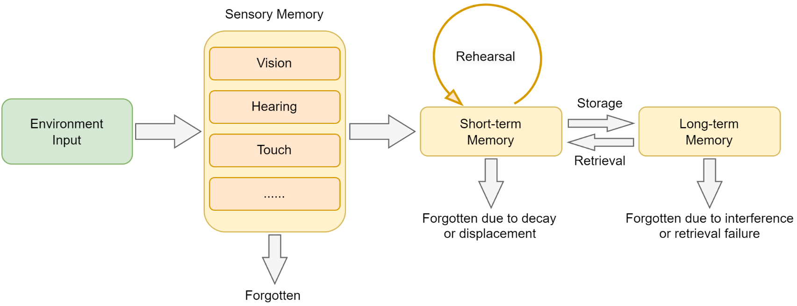
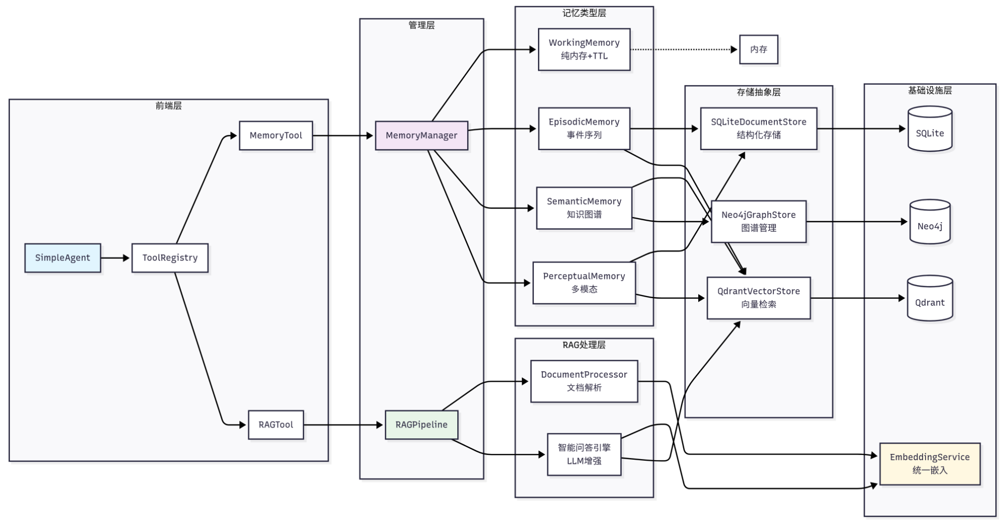
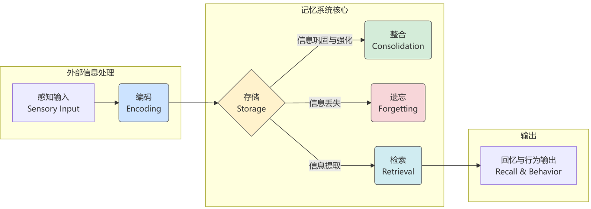
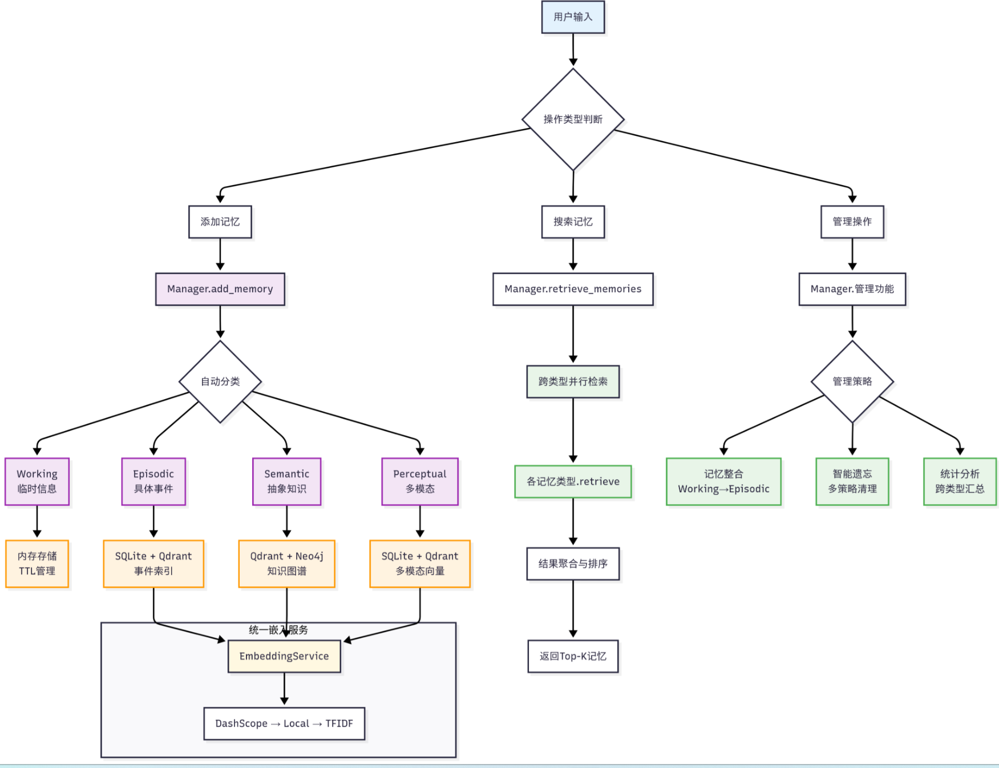

from pyarrow.device import MemoryManager

# 记忆与检索

## 8.1 从认知科学到智能体记忆

### 8.1.1 人类记忆系统的启发



人类记忆的层次：
+ **感觉记忆**：时间极短，容量巨大，负责暂时保存感官接收到的所有信息
+ **工作记忆**：时间短，容量有限，负责当前任务的信息处理
+ **长期记忆**：时间长，容量几乎无线
  + 程序性记忆：技能和习惯
  + 陈述性记忆：可以用语言表达的知识
    + 语义记忆：一般知识和概念
    + 情景记忆：个人经历和事件

### 8.1.2 智能体为何需要记忆与RAG

基于LLM的智能体通常面临两个根本性局限：**对话状态的遗忘**和**内置知识的局限**。

#### (1) 局限一：无状态导致的对话遗忘

大语言模型设计上是**无状态的**。每次用户请求都是一次独立的、无关联的计算。

+ **上下文丢失**：因为上下文窗口的限制而丢失 
+ **个性化缺失**：Agent无法记住用户的偏好、习惯或特定需求
+ **学习能力受限**：无法从过往的成功或失败经验中学习改进
+ **一致性问题**：在多轮对话中可能出现前后矛盾的回答

#### (2) 局限二：内置知识的局限

LLM的知识是**静态的、有限的**
+ **知识时效性**：训练数据有时间截止点
+ **专业领域知识**：在特定领域的知识深度不足
+ **事实准确性**：通过检索验证，减少模型的幻觉问题
+ **可解释性**：提供信息来源，增强回答的可信度

### 8.1.3 记忆与RAG系统架构设计

memory_tool负责存储和维护对话过程中的交互信息，rag_tool则负责从用户提供的知识库中检索相关信息作为上下文，并可将重要的检索结果自动存储到记忆系统中



记忆系统采用了四层架构设计
```
HelloAgents记忆系统
├── 基础设施层 (Infrastructure Layer)
│   ├── MemoryManager - 记忆管理器（统一调度和协调）
│   ├── MemoryItem - 记忆数据结构（标准化记忆项）
│   ├── MemoryConfig - 配置管理（系统参数设置）
│   └── BaseMemory - 记忆基类（通用接口定义）
├── 记忆类型层 (Memory Types Layer)
│   ├── WorkingMemory - 工作记忆（临时信息，TTL管理）
│   ├── EpisodicMemory - 情景记忆（具体事件，时间序列）
│   ├── SemanticMemory - 语义记忆（抽象知识，图谱关系）
│   └── PerceptualMemory - 感知记忆（多模态数据）
├── 存储后端层 (Storage Backend Layer)
│   ├── QdrantVectorStore - 向量存储（高性能语义检索）
│   ├── Neo4jGraphStore - 图存储（知识图谱管理）
│   └── SQLiteDocumentStore - 文档存储（结构化持久化）
└── 嵌入服务层 (Embedding Service Layer)
    ├── DashScopeEmbedding - 通义千问嵌入（云端API）
    ├── LocalTransformerEmbedding - 本地嵌入（离线部署）
    └── TFIDFEmbedding - TFIDF嵌入（轻量级兜底）
```

RAG系统专注于外部知识的获取和利用
```
HelloAgents RAG系统
├── 文档处理层 (Document Processing Layer)
│   ├── DocumentProcessor - 文档处理器（多格式解析）
│   ├── Document - 文档对象（元数据管理）
│   └── Pipeline - RAG管道（端到端处理）
├── 嵌入表示层 (Embedding Layer)
│   └── 统一嵌入接口 - 复用记忆系统的嵌入服务
├── 向量存储层 (Vector Storage Layer)
│   └── QdrantVectorStore - 向量数据库（命名空间隔离）
└── 智能问答层 (Intelligent Q&A Layer)
    ├── 多策略检索 - 向量检索 + MQE + HyDE
    ├── 上下文构建 - 智能片段合并与截断
    └── LLM增强生成 - 基于上下文的准确问答
```

### 8.1.4 本章学习目标与快速体验
```
hello-agents/
├── hello_agents/
│   ├── memory/                   # 记忆系统模块
│   │   ├── base.py               # 基础数据结构（MemoryItem, MemoryConfig, BaseMemory）
│   │   ├── manager.py            # 记忆管理器（统一协调调度）
│   │   ├── embedding.py          # 统一嵌入服务（DashScope/Local/TFIDF）
│   │   ├── types/                # 记忆类型实现
│   │   │   ├── working.py        # 工作记忆（TTL管理，纯内存）
│   │   │   ├── episodic.py       # 情景记忆（事件序列，SQLite+Qdrant）
│   │   │   ├── semantic.py       # 语义记忆（知识图谱，Qdrant+Neo4j）
│   │   │   └── perceptual.py     # 感知记忆（多模态，SQLite+Qdrant）
│   │   ├── storage/              # 存储后端实现
│   │   │   ├── qdrant_store.py   # Qdrant向量存储（高性能向量检索）
│   │   │   ├── neo4j_store.py    # Neo4j图存储（知识图谱管理）
│   │   │   └── document_store.py # SQLite文档存储（结构化持久化）
│   │   └── rag/                  # RAG系统
│   │       ├── pipeline.py       # RAG管道（端到端处理）
│   │       └── document.py       # 文档处理器（多格式解析）
│   └── tools/builtin/            # 扩展内置工具
│       ├── memory_tool.py        # 记忆工具（Agent记忆能力）
│       └── rag_tool.py           # RAG工具（智能问答能力）
└──
```

**快速开始：安装HelloAgents框架**

```bash
pip install "hello-agents[all]==0.2.0"
python -m spacy download zh_core_web_sm
python -m spacy download en_core_web_sm

# ================================
# Qdrant 向量数据库配置 - 获取API密钥：https://cloud.qdrant.io/
# ================================
# 使用Qdrant云服务 (推荐)
QDRANT_URL=https://your-cluster.qdrant.tech:6333
QDRANT_API_KEY=your_qdrant_api_key_here

# 或使用本地Qdrant (需要Docker)
# QDRANT_URL=http://localhost:6333
# QDRANT_API_KEY=

# Qdrant集合配置
QDRANT_COLLECTION=hello_agents_vectors
QDRANT_VECTOR_SIZE=384
QDRANT_DISTANCE=cosine
QDRANT_TIMEOUT=30

# ================================
# Neo4j 图数据库配置 - 获取API密钥：https://neo4j.com/cloud/aura/
# ================================
# 使用Neo4j Aura云服务 (推荐)
NEO4J_URI=neo4j+s://your-instance.databases.neo4j.io
NEO4J_USERNAME=neo4j
NEO4J_PASSWORD=your_neo4j_password_here

# 或使用本地Neo4j (需要Docker)
# NEO4J_URI=bolt://localhost:7687
# NEO4J_USERNAME=neo4j
# NEO4J_PASSWORD=hello-agents-password

# Neo4j连接配置
NEO4J_DATABASE=neo4j
NEO4J_MAX_CONNECTION_LIFETIME=3600
NEO4J_MAX_CONNECTION_POOL_SIZE=50
NEO4J_CONNECTION_TIMEOUT=60

# ==========================
# 嵌入（Embedding）配置示例 - 可从阿里云控制台获取：https://dashscope.aliyun.com/
# ==========================
# - 若为空，dashscope 默认 text-embedding-v3；local 默认 sentence-transformers/all-MiniLM-L6-v2
EMBED_MODEL_TYPE=dashscope
EMBED_MODEL_NAME=
EMBED_API_KEY=
EMBED_BASE_URL=
```

t体验使用hello-agents构建具有记忆和RAG能力的智能体
```python
# 配置好同级文件夹下.env中的大模型API
from hello_agents import SimpleAgent, HelloAgentsLLM, ToolRegistry
from hello_agents.tools import MemoryTool, RAGTool

# 创建LLM实例
llm = HelloAgentsLLM()

# 创建Agent
agent = SimpleAgent(
    name="智能助手",
    llm=llm,
    system_prompt="你是一个有记忆和知识检索能力的AI助手"
)

# 创建工具注册表
tool_registry = ToolRegistry()

# 添加记忆工具
memory_tool = MemoryTool(user_id="user123")
tool_registry.register_tool(memory_tool)

# 添加RAG工具
rag_tool = RAGTool(knowledge_base_path="./knowledge_base")
tool_registry.register_tool(rag_tool)

# 为Agent配置工具
agent.tool_registry = tool_registry

# 开始对话
response = agent.run("你好！请记住我叫张三，我是一名Python开发者")
print(response)
```

## 8.2 记忆系统：让智能体拥有记忆

### 8.2.1 记忆系统的工作流程



人类记忆形成经历的阶段：
+ **编码**：将感知到的信息转换为可存储的形式
+ **存储**：将编码后的信息保存在记忆系统中
+ **检索**：根据需要从记忆中提取相关信息
+ **整合**：将短期记忆转换为长期记忆
+ **遗忘**：删除不重要或过时的信息



记忆系统由四种不同类型的记忆模块构成：
+ **工作记忆**：用于存储当前对话的上下文信息
+ **情景记忆**：负责长期存储具体的交互事件和智能体的学习经历
+ **语义记忆**：存储的是更为抽象的知识、概念和规则
+ **感知记忆**：专门处理图像、音频等多模态信息，并支持跨膜态检索。

### 8.2.2 快速体验

```python
from hello_agents import SimpleAgent, HelloAgentsLLM, ToolRegistry
from hello_agents.tools import MemoryTool

# 创建具有记忆能力的Agent
llm = HelloAgentsLLM()
agent = SimpleAgent(name="记忆助手", llm=llm)

# 创建记忆工具
memory_tool = MemoryTool(user_id="user123")
tool_registry = ToolRegistry()
tool_registry.register_tool(memory_tool)
agent.tool_registry = tool_registry
 
# 体验记忆功能
print("=== 添加多个记忆 ===")

# 添加第一个记忆
result1 = memory_tool.execute("add", content="用户张三是一名Python开发者，专注于机器学习和数据分析", memory_type="semantic", importance=0.8)
print(f"记忆1: {result1}")

# 添加第二个记忆
result2 = memory_tool.execute("add", content="李四是前端工程师，擅长React和Vue.js开发", memory_type="semantic", importance=0.7)
print(f"记忆2: {result2}")

# 添加第三个记忆
result3 = memory_tool.execute("add", content="王五是产品经理，负责用户体验设计和需求分析", memory_type="semantic", importance=0.6)
print(f"记忆3: {result3}")

print("\n=== 搜索特定记忆 ===")
# 搜索前端相关的记忆
print("🔍 搜索 '前端工程师':")
result = memory_tool.execute("search", query="前端工程师", limit=3)
print(result)

print("\n=== 记忆摘要 ===")
result = memory_tool.execute("summary")
print(result)
```

### 8.2.3 MemoryTool详解

```python
def execute(self, action: str, **kwargs):
    """
    执行记忆操作
    支持的操作：
    - add：添加记忆(working/episodic/semantic/perceptual)
    - search: 搜索记忆
    - summary：获取记忆摘要
    - stats：获取统计信息
    - update：更新记忆
    - remove：删除记忆
    - forget: 遗忘记忆
    - consolidate：整合记忆
    - clear_all：清空所有记忆
    """

    if action == "add":
        return self._add_memory(**kwargs)
    elif action == "search":
        return self._search_memory(**kwargs)
    elif action == "summary":
        return self._get_summary(**kwargs)
```

#### (1) 操作1: add

```python
def _add_memory(
        self,
        content: str = "",
        memory_type: str = "working",
        importance: float = 0.5,
        file_path: str = None,
        modality: str = None,
        **metadata
) -> str:
    """添加记忆"""
    try:
        # 确保会话ID存在
        if self.current_session_id is None:
            self.current_session_id = f"session_{datetime.now().strftime('%Y%m%d_%H%M%S')}"

        # 感知记忆文件支持
        if memory_type == "perceptual" and file_path:
            inferred = modality or self._infer_modality(file_path)
            metadata.setdefault("modality", inferred)
            metadata.setdefault("raw_data", file_path)

        # 添加会话信息到元数据
        metadata.update({
            "session_id": self.current_session_id,
            "timestamp": datetime.now().isoformat()
        })

        memory_id = self.memory_manager.add_memory(
            content=content,
            memory_type=memory_type,
            importance=importance,
            metadata=metadata,
            auto_classify=False
        )

        return f"记忆添加(ID: {memory_id[:8]}...)"

    except Exception as e:
        return f"添加记忆失败：{str(e)}"
```

四种记忆类型的使用示例
```python
# 1. 工作记忆 - 临时信息，容量有限
memory_tool.execute("add",
    content="用户刚才问了关于Python函数的问题",
    memory_type="working",
    importance=0.6
)

# 2. 情景记忆 - 具体事件和经历
memory_tool.execute("add",
    content="2024年3月15日，用户张三完成了第一个Python项目",
    memory_type="episodic",
    importance=0.8,
    event_type="milestone",
    location="在线学习平台"
)

# 3. 语义记忆 - 抽象知识和概念
memory_tool.execute("add",
    content="Python是一种解释型、面向对象的编程语言",
    memory_type="semantic",
    importance=0.9,
    knowledge_type="factual"
)

# 4. 感知记忆 - 多模态信息
memory_tool.execute("add",
    content="用户上传了一张Python代码截图，包含函数定义",
    memory_type="perceptual",
    importance=0.7,
    modality="image",
    file_path="./uploads/code_screenshot.png"
)
```

#### (2) 操作2: search

```python
def _search_memory(
        self,
        query: str,
        limit: int = 5,
        memory_types: List[str] = None,
        memory_type: str = None,
        min_importance: float = 0.1
) -> str:
    """搜索记忆"""
    try:
        # 参数标准化处理
        if memory_type and not memory_types:
            memory_types = [memory_type]
        
        results = self.memory_manager.retrieve_memories(
            query=query,
            limit=limit,
            memory_types=memory_types,
            min_importance=min_importance
        )
        
        if not results:
            return f"未找到 'query' 相关的记忆"
        
        # 格式化结果
        formatted_results = []
        formatted_results.append(f"找到 {len(results)} 条相关记忆:")
        
        for i, memory in enumerate(results, 1):
            memory_type_label = {
                "working": "工作记忆",
                "episodic": "情境记忆",
                "semantic": "语义记忆",
                "perceptual": "感知记忆"
            }.get(memory.memory_type, memory.memory_type)
            
            content_preview = memory.content[:80] + "..." if len(memory.content) > 80 else memory.content
            formatted_results.append(
                f"{i}. [{memory_type_label}] {content_preview} (重要性: {memory.importance:.2f})"
            )
        
        return "\n".join(formatted_results)
    except Exception as e:
        return f"搜索记忆失败：{str(e)}"

# 示例

# 基础搜索
result = memory_tool.execute("search", query="Python编程", limit=5)

# 指定记忆类型搜索
result = memory_tool.execute("search", query="学习进度", memory_type="episodic", limit=3)

# 多类型搜索
result = memory_tool.execute("search", query="函数定义", memory_type=["semantic", "episodic"], min_importance=0.5)
```

#### (3)操作3：forget

支持三种策略：基于重要性(删除不重要的记忆)、基于时间(删除过时的记忆)和基于容量(当存储接近上限时删除最不重要的记忆)

```python
def _forget(self, strategy: str = "importance_based", threshold: float = 0.1, max_age_days: int = 30) -> str:
    """遗忘记忆"""
    try:
        count = self.memory_manager.forget_memories(
            strategy=strategy,
            threshold=threshold,
            max_age_days=max_age_days
        )
        return f"已遗忘{count} 条记忆 (策略)：{strategy}"
    except Exception as e:
        return f"遗忘记忆失败: {str(e)}"


"""三种遗忘策略的使用"""
# 1.基于重要性的遗忘 - 删除重要性低于阈值的记忆
memory_tool.execute(
    "forget",
    strategy="importance_based",
    threshold=0.2
)

# 2.基于时间的遗忘 - 删除超过指定天数的记忆
memory_tool.execute(
    "forget",
    strategy="time_based",
    max_age_days=30
)

# 3.基于容量的遗忘 - 当记忆数量超过限制时删除最不重要的
memory_tool.execute(
    "forget",
    strategy="capacity_based",
    threshold=0.3
)
```

#### (4) 操作4：consolidate

```python
def _consolidate(self, from_type: str = "working", to_type: str = "episodic", importance_threshold: float = 0.7) -> str:
    """整合记忆(将重要的短期记忆提升为长期记忆)"""
    try:
        count = self.memory_manager.consolidate_memories(
            from_type=from_type,
            to_type=to_type,
            importance_threshold=importance_threshold
        )
        return f"已整合 {count} 条记忆为长期记忆 ({from_type} -> {to_type}, 阈值={importance_threshold})"

    except Exception as e:
        return f"整合记忆失败: {str(e)}"

    
"""整合记忆使用示例"""
# 将重要的工作记忆转为情景记忆
memory_tool.execute(
    "consolidate",
    from_type="working",
    to_type="episodic",
    importance_threshold=0.7
)

# 将重要的情景记忆转为语义记忆
memory_tool.execute(
    "consolidate",
    from_type="episodic",
    to_type="semantic"
)

# 将重要的语义记忆转为感知记忆
memory_tool.execute(
    "consolidate",
    from_type="semantic",
    to_type="perceptual"
)
```

### 8.2.4 MemoryManager详解

```python
class MemoryTool(Tool):
    """记忆工具 - 为Agent提供记忆功能"""
    
    def __init__(
        self,
        user_id: str = "default_user",
        memory_config: MemoryConfig = None,
        memory_types: List[str] = None
    ):
        super().__init__(
            name="memory",
            description="记忆工具 - 可以存储和检索对话历史、知识和经验"
        )

        # 初始化记忆管理器
        self.memory_config = memory_config or MemoryConfig()
        self.memory_types = memory_types or ["working", "episodic", "semantic"]

        self.memory_manager = MemoryManager(
            config=self.memory_config,
            user_id=user_id,
            enable_working="working" in self.memory_types,
            enable_episodict="episodic" in self.memory_types,
            enable_semantic="semantic" in self.memory_types,
            enable_perceptual="perceptual" in self.memory_types
        )


class MemoryManager:
    """记忆管理器 - 统一的记忆操作接口"""
    
    def __init__(
        self,
        config: Optional[MemoryConfig] = None,
        user_id: str = "default_user",
        enable_working: bool = True,
        enable_episodic: bool = True,
        enable_semantic: bool = True,
        enable_perceptual: bool = False
    ):
        self.config = config or MemoryConfig()
        self.user_id = user_id

        # 初始化存储和检索组件
        self.store = MemoryStore(self.config)
        self.retriever = MemoryRetriever(self.store, self.config)

        # 初始化各类型记忆
        self.memory_types = {}
        
        if enable_working:
            self.memory_types["working"] = WorkingMemory(self.config, self.store)
            
        if enable_episodic:
            self.memory_types["episodic"] = EpisodicMemory(self.config, self.store)
            
        if enable_semantic:
            self.memory_types["semantic"] = SemanticMemory(self.config, self.store)
            
        if enable_perceptual:
            self.memory_types["perceptual"] = Perceptual(self.config, self.store)
```

#### 8.2.5四种记忆类型

#### (1)工作记忆

```python
class WorkingMemory:
    """
    工作记忆实现
    特点：
    - 容量有限(默认50条) + TTL自动清理
    - 纯内存存储，访问速度极快
    - 混合检索：TF-IDF向量化 + 关键词匹配
    """

    def __init__(self, config: MemoryConfig):
        self.max_capacity = config.working_memory_capacity or 50
        self.max_age_minutes = config.working_memory_ttl or 60
        self.memories = []

    def __add__(self, memory_item: MemoryItem) -> str:
        """添加工作记忆"""
        self._expire_old_memories()  # 过期清理

        if len(self.memories) >= self.max_capacity:
            self._remove_lowest_priority_memory()  # 容量管理
            
        self.memories.append(memory_item)
        return memory_item.id

    def retrieve(self, query: str, limit: int = 5, **kwargs) -> List[MemoryItem]:
        """混合检索：TF-IDF向量化 + 关键词匹配"""
        self._expire_old_memories()
        
        # 尝试TF-IDF向量检索
        vector_scores = self._try_tfidf_search(query)
        
        # 计算综合分数
        scored_memories = []
        for memory in self.memories:
            vector_score = vector_scores.get(memory.id, 0.0)
            keyword_score = self._calculate_keyword_score(query, memory.content)
            
            # 混合评分
            base_relevance = vector_score * 0.7 + keyword_score * 0.3 if vector_score > 0 else keyword_score

            time_decay = self._calculate_time_decay(memory.timestamp)
            importance_weight = 0.8 + (memory.importance * 0.4)
            final_score = base_relevance * time_decay * importance_weight
            if final_score > 0:
                scored_memories.append(final_score, memory)
        scored_memories.sort(key=lambda x: x[0], reverse=True)
        return [memory for _, memory in scored_memories[:limit]]

"""
工作记忆的检索采用了混合检索策略，首先尝试使用TF-IDF向量化进行语义检索，如果失败，则退回到关键词匹配。
评分算法结合了语义相似度、时间衰减和重要性权重，最终得分公式为：(相似度 * 时间衰减) * (0.8 + 重要性 * 0.4) 
"""
```

#### (2) 情景记忆

情景记忆负责存储具体的事件和经历，设计重点在于保持事件的完整性和时间序列关系。

情景记忆采用了SQLite+Qdrant的混合存储方案，SQLite负责结构化数据的存储和复杂查询，Qdrant负责高效的向量检索。

```python
class EpisodicMemory:
    """
    情景记忆实现
    特点：
    - SQLite+Qdrant混合存储架构
    - 支持时间序列和会话级检索
    - 结构化过滤 + 语义向量检索
    """

    def __init__(self, config: MemoryConfig):
        self.doc_store = SQLiteDocumentStore(config.database_path)
        self.vector_store = QdrantVectorStore(config.qdrant_url, config.qdrant_api_key)
        self.embedder = create_embedding_model_with_fallback()
        self.sessions = {}  # 会话索引

    def add(self, memory_item: MemoryItem) -> str:
        """添加情景记忆"""
        episode = Episode(
            episode_id=memory_item.id,
            session_id=memory_item.metadata.get("session_id", "default"),
            timestamp=memory_item.timestamp,
            content=memory_item.content,
            context=memory_item.metadata
        )

        # 更新会话索引
        session_id = episode.session_id
        if session_id not in self.sessions:
            self.sessions[session_id] = []

        self.sessions[session_id].append(episode.episode_id)

        # 持久化存储(SQLite + Qdrant)
        self._persist_episode(episode)
        return memory_item.id

    def retrieve(self, query: str, limit: int = 5, **kwargs) -> List[MemoryItem]:
        """混合检索：结构化过滤 + 语义向量检索"""
        # 1.混合检索：结构化过滤 (时间范围、重要性等)
        candidate_ids = self._structured_filter(**kwargs)
        
        # 2.向量语义检索
        hits = self._vector_search(query, limit * 5, kwargs.get("user_id"))

        # 3.综合评分与排序
        results = []
        for hit in hits:
            if self._should_include(hit, candidate_ids, kwargs):
                score = self._calculate_episode_score(hit)
                memory_item = self._create_memory_item(hit)
                results.append((score, memory_item))
        results.sort(key=lambda x: x[0], reverse=True)
        return [item for _, item in results[:limit]]

    def _calculate_episode_score(self, hit) -> float:
        """情景记忆评分算法"""
        vec_score = float(hit.get("score", 0.0))
        recency_score = self._calculate_recency(hit["metadata"]["timestamp"])
        importance = hit["metadata"].get("importance", 0.5)

        # 评分公式：(向量相似度 * 0.8 + 时间近因性 * 0.2) * 重要性权重
        base_relevance = vec_score * 0.8 + recency_score * 0.2
        # 重要性权重
        importance_weight = 0.8 + (importance * 0.4)

        return base_relevance * importance_weight
```

#### (3) 语义记忆

语义记忆是记忆系统中最复杂的部分，它负责存储抽象的概念、规则和知识。

重点在于知识的结构化表示和智能推理能力。语义记忆采用了Neo4j图数据库和Qdrant向量数据库的混合架构

这种设计既能进行快速的语义检索，又能利用知识图谱进行复杂的关系推理

```python
class SemanticMemory(BaseMemory):
    """
    语义记忆实现
    
    特点：
    - 使用Huggingface中文预训练模型进行文本嵌入
    - 向量检索进行快速相似度匹配
    - 知识图谱存储实体和关系
    - 混合检索策略：向量+图+语义推理
    """

    def __init__(self, config: MemoryConfig, storage_backend=None):
        super().__init__(config, storage_backend)
        
        # 嵌入模型(统一提供)
        self.embedding_model = get_text_embedder()
        
        # 专业数据库存储
        self.vector_store = QdrantConnectionManager.get_instance(**qdrant_config)
        self.graph_store = Neo4jGraphStore(**neo4j_config)
    
        # 实体和关系缓存
        self.entities: Dict[str, Entity] = {}
        self.relations: List[Relation] = []

        # NLP处理器(支持中英文)
        self.nlp = self._init_nlp()

    def add(self, memory_item: MemoryItem) -> str:
        """添加语义记忆"""
        # 1.生成语义记忆
        embedding = self.embedding_model.encode(memory_item.content)

        # 2.提取实体和关系
        entities = self._extract_entities(memory_item.content)
        relations = self._extract_relations(memory_item.content, entities)

        # 3.存储到Neo4j图数据库
        for entity in entities:
            self._add_entity_to_graph(entity, memory_item)

        for relation in relations:
            self._add_relation_to_graph(relation, memory_item)

        # 4.存储到Qdrant向量数据库
        metadata = {
            "memory_id": memory_item.id,
            "entities": [e.entity_id for e in entities],
            "entity_count": len(entities),
            "relation_count": len(relations)
        }

        self.vector_store.add_vectors(
            vectors=[embedding.tolist()],
            metadata=[metadata],
            ids=[memory_item.id]
        )

    def retrieve(self, query: str, limit: int = 5, **kwargs) -> List[MemoryItem]:
        """检索语义记忆"""
        # 1.向量检索
        vector_results = self._vector_search(query, limit * 2, user_id)

        # 2.图检索
        graph_results = self._graph_search(query, limit * 2, user_id)

        # 3.混合排序
        combined_results = self._combine_and_rank_results(
            vector_results, graph_results, query, limit
        )

        return combined_results[:limit]

    def _combine_and_rak_results(self, vector_results, graph_results, query, limit):
        """混合排序结果"""
        combined = {}
        
        # 合并向量和图检索结果
        for result in vector_results:
            combined[result["memory_id"]] = {
                **result,
                "vector_score": result.get("score", 0.0),
                "graph_score": 0.0
            }
            
        for result in graph_results:
            memory_id = result["memory_id"]
            if memory_id in combined:
                combined[memory_id]["graph_score"] = result.get("similarity", 0.0)
                
            else:
                combined[memory_id] = {
                    **result,
                    "vector_score": 0.0,
                    "graph_score": result.get("similarity", 0.0)
                }
                
        # 计算混合分数
        for memory_id, result in combined.items():
            vector_score = result["vector_score"]
            graph_score = result["graph_score"]
            importance = result.get("importance", 0.5)
            
            # 基础相似度得分
            base_relevance = vector_score * 0.7 + graph_score * 0.3
            
            # 重要性权重 [0.8, 1.2]
            importance_weight = 0.8 + (importance * 0.4)
            
            # 最终得分：相似度 * 重要性权重
            combined_score = base_relevance * importance_weight
            result["combined_score"] = combined_score
        
        # 排序并返回
        sorted_results = sorted(
            combined.values(),
            key=lambda x: x["combined_score"],
            reverse=True
        )
        return sorted_results[:limit]

"""
语义记忆的评分公式为：(相似度 * 0.7 + 图相似度 * 0.3) * (0.8 + 重要性 * 0.4)
+ 向量检索权重(0.7): 语义相似度，确保检索结果与查询语义相关
+ 图检索权重(0.3): 关系推理作为补充，发现概念间的隐含关联
+ 重要性权重范围[0.8, 1.2]: 避免重要性过度影响相似度排序，保持检索的准确性
"""
```

#### (4) 感知记忆

感知记忆支持文本、图像、音频等多种模态的数据存储和检索。

```python
class PerceptualMemory(BaseMemory):
    """
    感知记忆实现
    特点：
    - 支持多模态数据
    - 跨模态相似性搜索
    - 感知数据的语义理解
    - 支持内容生成和检索
    """
    
    def __init__(self, config: MemoryConfig, storage_backend=None):
        super().__init__(config, storage_backend)
        
        # 多模态编码器
        self.text_embeder = get_text_embedder()
        self._clip_model = self._init_clip_model()  # 图像编码
        self._clap_model = self._init_clap_model()  # 音频编码

        # 按模态分离的向量存储
        self.vector_stores = {
            "text": QdrantConnectionManager.get_instance(
                collection_name="perceptual_text",
                vector_size=self.vector_dim
            ),
            "image": QdrantConnectionManager.get_instance(
                collection_name="perceptual_image",
                vector_size=self._image_dim
            ),
            "sudio": QdrantConnectionManager.get_instance(
                collection_name="perceptual_audio",
                vector_size=self._audio_dim
            )
        }

    def retrieve(self, query: str, limit: int = 5, **kwargs) -> List[MemoryItem]:
        """检索感知记忆"""
        user_id = kwargs.get("user_id")
        target_modality = kwargs.get("target_modality")
        query_modality = kwargs.get("query_modality", target_modality or "text")

        # 同模态向量检索
        try:
            query_vector = self._encode_data(query, query_modality)
            store = self._get_vector_store_for_modality(target_modality or query_modality)
            
            where = {"memory_type": "perceptual"}
            if user_id:
                where["user_id"] = user_id
            if target_modality:
                where["modality"] = target_modality
                
            hits = store.search_similar(
                query_vector=query_vector,
                limit=max(limit * 5, 20),
                where=where
            )
        except Exception:
            hits = []

        # 融合排序(向量相似度 + 时间近因性 + 重要性权重)
        results = []
        for hit in hits:
            vector_score = float(hit.get("score", 0.0))
            recency_score = self._calculate_recency_score(hit["metadata"]["timestamp"])
            importance = hit["metadata"].get("importance", 0.5)

            # 评分算法
            base_relevance = vector_score * 0.8 + recency_score * 0.2
            importance_weight = 0.8 + (importance * 0.4)
            combined_score = base_relevance + importance_weight
            
            results.append(combined_score, self._create_memory_item(hit))
    
        results.sort(key=lambda x: x[0], reverse=True)
        return [item for _, item in results[:limit]]


    def _calculate_recency_score(self, timestamp: str) -> float:
        """计算时间近因得分"""
        try:
            memory_time = datetime.fromisoformat(timestamp)
            current_time = datetime.now()
            age_hours = (current_time - memory_time).total_seconds() / 3600
            
            # 指数衰减：24小时内保持高分，之后逐渐衰减
            decay_factor = 0.1  # 衰减系数
            recency_score = math.exp(-decay_factor * age_hours / 24)
            return max(0.1, recency_score)  # 最低保持0.1的基础分数
        except Exception:
            return 0.5  # 默认中等分数

```

## 8.3 RAG系统：知识检索增强

### 8.3.1 RAG的基础知识

#### (1) 什么是RAG

检索增强生成(Retrieval-Augmented Generation, RAG)是一种结合了信息检索和文本生成的技术。

核心思想是：在生成回答之前，先从外部知识库中检索相关信息，然后将检索到的信息作为上下文提供给大语言模型，从而生成更准确、更可靠的回答。

检索：是指从知识库查询相关的内容，增强：是将检索结果融入提示词，辅助模型生成，生成：输出兼具准确性与透明度的答案。

#### (2) 基本工作流程

分为两大核心环节：
+ 数据准备阶段：系统通过数据提取、文本分割和向量化，将外部知识构建成一个可检索的数据库。
+ 应用阶段：系统会响应用户的提问，从数据库中检索相关信息，将其注入prompt，并最终驱动大语言模型生成答案

#### (3) 发展历程

现阶段：RAG向着模块化、自动化和智能化的方向发展。系统的各个部分被设计成可插拔、可组合的独立模块，以适应更多样化和复杂的应用场景。

检索方式：混合检索，多查询扩展，假设性文档嵌入等。生成模式：思维链推理，自我反思与修正等。

### 8.3.2 RAG系统工作原理


两个主要工作模式：
+ 数据处理流程：处理和存储知识文档，在这里采用了Markitdown工具
+ 查询与生成流程：根据查询检索相关信息并生成回答。

### 8.3.3 快速体验RAG功能

```python
from hello_agents import SimpleAgent, HelloAgentsLLM, ToolRegistry
from hello_agents.tools import RAGTool

# 创建具有RAG能力的Agent
llm = HelloAgentsLLM()
agent = SimpleAgent(name="知识助手", llm=llm)

# 创建RAG工具
rag_tool = RAGTool(
    knowledge_base_path="./knowledge_base",
    collection_name="test_collection",
    rag_namespace="test"
)

tool_registry = ToolRegistry()
tool_registry.register_tool(rag_tool)
agent.tool_registry = tool_registry

# 体验RAG功能
# 添加第一个知识
result1 = rag_tool.execute(
    "add_text",
    text="Python是一种高级编程语言，由Guido van Rossum于1991年首次发布。Python的设计哲学强调代码的可读性和简洁的语法。",
    document_id="python_intro"
)

# 添加第二个知识
result2 = rag_tool.execute(
    "add_text",
    text="机器学习是人工智能的一个分支，通过算法让计算机从数据中学习模式。主要包括监督学习、无监督学习和强化学习三种类型。",
    document_id="ml_basics"
)

# 添加第三个知识
result3 = rag_tool.execute(
    "add_text",
    text="RAG（检索增强生成）是一种结合信息检索和文本生成的AI技术。它通过检索相关知识来增强大语言模型的生成能力。",
    document_id="rag_concept"
)

print("\n === 搜索知识 === ")
result = rag_tool.execute("search",
                          query="Python编程语言的历史",
                          limit=3,
                          min_score=0.1)
print(result)

print("\n === 知识库统计 ===")
result = rag_tool.execute("stats")

print(result)

```

### 8.3.4 RAG系统架构设计

```
用户层：RAGTool统一接口
  ↓
应用层：智能问答、搜索、管理
  ↓  
处理层：文档解析、分块、向量化
  ↓
存储层：向量数据库、文档存储
  ↓
基础层：嵌入模型、LLM、数据库
```

优势：每一层都可以独立优化和替换。

```python
class RAGTool(Tool):
    """
    RAG工具
    提供完整的RAG能力：
    - 添加多格式文档(PDF\Office\图片\音频)
    - 智能检索与召回
    - LLM增强回答
    - 知识库管理
    """

    def __init__(
        self,
        knowledge_base_path: str = "./knowledge_base",
        qdrant_url: str = None,
        qdrant_api_key: str = None,
        collection_name: str = "rag_knowledge_base",
        rag_namespace: str = "default"
    ):
        # 初始化RAG管道
        self._pipelines: Dict[str, Dict[str, Any]] = {}
        self.llm = HelloAgentsLLM()
        
        # 创建默认管道
        default_pipeline = create_rag_pipeline(
            qdrant_url=self.qdrant_url,
            qdrant_api_key=self.qdrant_api_key,
            collection_name=self.collection_name,
            rag_namespace=self.rag_namespace
        )
        self._pipelines[self.rag_namespace] = default_pipeline
```

#### (1) 多模态文档载入

将任意格式的文档统一转换为结构化的Markdown格式

```python
import os.path


def _convert_to_markdown(path: str) -> str:
    """
    Universal document reader using MarkItDown with enhanced PDF processing.
    核心功能：将任意格式文档转换为Markdown文本
    
    支持格式：
    - 文档：PDF、Word、Excel、PowerPoint
    - 图片：JPG、PNG、GIF
    - 音频：MP3、WAV、M4A
    - 文本：TXT、CSV、JSON、XML、HTML
    - 代码：Python、Java、C++、JavaScript、Ruby、PHP、C#、Go、Swift、Kotlin、Rust、Scala、Perl、Lua、VBA、SQL、Markdown、HTML、CSS、YAML、Bash、CoffeeScript、TypeScript、VBScript、Fortran、Pascal、Ada、Lisp、Scheme、Erlang、Haskell、Lua、R、Matlab、SAS、Spreadsheet、Word、Excel、PowerPoint、PDF、Image、Audio、Video
    """

    if not os.path.exists(path):
        return ""

    # 对PDF文件使用增强处理
    ext = (os.path.splitext(path)[1] or "").lower()
    if ext == ".pdf":
        return _enhanced_pdf_processing(path)
    
    # 其他格式使用MarkItDown处理
    md_instance = _get_markitdown_instance()
    if md_instance is None:
        return _fallback_text_reader(path)
    
    try:
        result = md_instance.convert(path)
        markdown_text = getattr(result, "text_content", None)
        if isinstance(markdown_text, str) and markdown_text.strip():
            return markdown_text
        return ""
    except Exception as e:
        print(f"[WARNING] MarkItDown 转换失败 {path}: {e}")

```

#### (2) 智能分块策略

Markdown结构感知的分块流程：
```
标准Markdown文本 → 标题层次解析 → 段落语义分割 → Token计算分块 → 重叠策略优化 → 向量化准备
       ↓                ↓              ↓            ↓           ↓            ↓
   统一格式          #/##/###        语义边界      大小控制     信息连续性    嵌入向量
   结构清晰          层次识别        完整性保证    检索优化     上下文保持    相似度匹配
```

```python
def _split_paragraphs_with_headings(text: str) -> List[Dict]:
    """
    根据标题层次分割段落，保持语义完整性
    """
    lines = text.splitlines()
    heading_stack: List[str] = []
    paragraphs: List[Dict] = []
    buf: List[str] = []
    char_pos = 0
    
    def flush_buf(end_pos: int):
        if not buf:
            return
        
        content = "\n".join(buf).strip()
        if not content:
            return
        
        paragraphs.append({
            "content": content,
            "heading_path": ">".join(heading_stack) if heading_stack else None,
            "start": max(0, end_pos - len(content)),
            "end": end_pos
        })
        
    for ln in lines:
        raw = ln
        if raw.strip().startswith("#"):
            # 处理标题
            flush_buf(char_pos)
            level = len(raw) - len(raw.lstrip("#"))
            title = raw.lstrip("#").strip()
            
            if level <= 0:
                level = 1
                
            if level <= len(heading_stack):
                heading_stack = heading_stack[:level - 1]
            
            char_pos += len(raw) + 1
            continue
        
        # 段落内容累积
        if raw.strip() == "":
            flush_buf(char_pos)
            buf = []
        else:
            buf.append(raw)
        char_pos += len(raw) + 1
        
    flush_buf(char_pos)
    
    if not paragraphs:
        paragraphs = [{"content": text, "heading_path": None, "start": 0, "end": len(text)}]
        
    return paragraphs
```

根据Token数量进行智能分块

```python
def _chunk_paragraphs(paragraphs: List(Dict), chunk_tokens: int, overlap_tokens: int) -> List[Dict]:
    """基于Token数量的智能分块"""
    chunks: List[Dict] = []
    cur: List[Dict] = []
    cur_tokens = 0
    i = 0
    
    while i < len(paragraphs):
        para = paragraphs[i]
        para_tokens = _approx_token_len(para["content"]) or 1

        if cur_tokens + para_tokens <= chunk_tokens or not cur:
            cur.append(para)
            cur_tokens += para_tokens
            i += 1
        else:
            # 生成当前分块
            content = "\n\n".join(x["content"] for x in cur)
            start = cur[0]["start"]
            end = cur[-1]["end"]
            heading_path = next((x["heading_path"] for x in reversed(cur) if x.get("heading_path")), None)

            chunks.append({
                "content": content,
                "start": start,
                "end": end,
                "heading_path": heading_path
            })
            # 构建重叠部分
            if overlap_tokens > 0 and cur:
                kept: List[Dict] = []
                kept_tokens = 0
                for x in reversed(cur):
                    t = _approx_token_len(x["content"]) or 1
                    if kept_tokens + t > overlap_tokens:
                        break
                    kept.append(x)
                    kept_tokens += t
                cur = list(reversed(kept))
                cur_tokens = kept_tokens
            else:
                cur = []
                cur_tokens = 0

    # 处理最后一个分块
    if cur:
        content = "\n\n".join(x["content"] for x in cur)
        start = cur[0]["start"]
        end = cur[-1]["end"]
        heading_path = next((x["heading_path"] for x in reversed(cur) if x.get("heading_path")), None)

        chunks.append({
            "content": content,
            "start": start,
            "end": end,
            "heading_path": heading_path
        })

    return chunks


def _approx_token_len(text: str) -> int:
    """近似估计Token长度，支持中英文混合"""

    # CJK字符按1个Token计算
    cjk = sum(1 for ch in text if _is_cjk(ch))

    # 其他字符按空白分词计算
    non_cjk_tokens = len([t for t in text.strip() if t])
    return cjk + non_cjk_tokens

def _is_cjk(ch: str) -> bool:
    """判断是否为CJK字符"""
    code = ord(ch)

    return (
        0x4E00 <= code <= 0x9FFF or  # CJK统一汉字
        0x3400 <= code <= 0x4DBF or  # CJK扩展A
        0x20000 <= code <= 0x2A6DF or # CJK扩展B
        0x2A700 <= code <= 0x2B73F or # CJK扩展C
        0x2B740 <= code <= 0x2B81F or # CJK扩展D
        0x2B820 <= code <= 0x2CEAF or # CJK扩展E
        0xF900 <= code <= 0xFAFF      # CJK兼容汉字
    )
```

#### (3) 统一嵌入与向量存储

```python
def index_chunks(
        store = None,
        chunks: List[Dict] = None,
        cache_db: Optional[str] = None,
        batch_size: int = 64,
        rag_namespace: str = "default"
) -> None:
    """
    Index markdown chunks with unified embedding and Qdrant storage.
    Uses百炼 API with fallback to sentence-transformers.
    """
    if not chunks:
        return
    
    # 使用统一嵌入模型
    embedder = get_text_embedder()
    dimension = get_dimension(384)
    
    # 创建默认Qdrant存储
    if store is None:
        store = _create_default_vector_store(dimension)
    
    # 预处理Markdown文本以获得更好的嵌入质量
    processed_texts = []
    for c in chunks:
        raw_content = c["content"]
        processed_content = _preprocess_markdown_for_embedding(raw_content)
        processed_texts.append(processed_content)
    
    # 批量编码
    vecs: List[List[float]] = []
    for i in range(0, len(processed_texts), batch_size):
        batch = processed_texts[i:i + batch_size]
        try:
            # 使用统一嵌入器
            batch_vecs = embedder.encode(batch)
            
            # 标准化为List[List[float]]格式
            if not isinstance(batch_vecs, list):
                if hasattr(batch_vecs, "tolist"):
                    batch_vecs = [batch_vecs.tolist()]
                else:
                    batch_vecs = [list(batch_vecs)]
                    
            # 处理向量格式和维度
            for v in batch_vecs:
                try:
                    if hasattr(v, "tolist"):
                        v = v.tolist()
                    v_norm = [float(x) for x in v]
                    
                    # 维度检查和调整
                    if len(v_norm) != dimension:
                        if len(v_norm) < dimension:
                            v_norm.extend([0.0] * (dimension - len(v_norm)))
                        else:
                            v_norm = v_norm[:dimension]
                    vecs.append(v_norm)
                except Exception as e:
                    vecs.append([0.0] * dimension)
        except Exception as e:
            # 实现重试机制
            # ... 重试逻辑 ...
```

### 8.3.5 高级检索策略

#### (1) 多查询扩展MQE

是一种通过生成语义等价的多样化查询来提高检索召回率的技术。

优势：能够自动理解用户查询的多种可能含义，特别是模糊查询或专业术语查询

```python
def _prompt_mqe(query: str, n: int) -> List[str]:
    """使用LLM生成多样化的查询扩展"""

    try:
        from ...core.llm import HelloAgentsLLM
        llm = HelloAgentsLLM()
        prompt = [
            {"role": "system", "content": "你是检索查询扩展助手。生成语义等价或互补的多样化查询。使用中文，简短，避免标点。"},
            {"role": "user", "content": f"原始查询：{query}\n请给出{n}个不同表述的查询，每行一个。"}
        ]
        text = llm.invoke(prompt)
        lines = [ln.strip("- \t") for ln in (text or "").splitlines()]
        outs = [ln for ln in lines if ln]
        return outs[:n] or [query]
    except Exception as e:
        return [query]
```

#### (2) 假设文档嵌入HyDE

是一种检索技术，核心思想是：用答案找答案
优势：假设答案与真实答案在语义空间中更加接近(因为问题是疑问句，答案是陈述句)，能够更准确地匹配到相关文档

```python
def _prompt_hyde(query: str) -> Optional[str]:
    """生成假设性文档用于改善检索"""
    try:
        from ...core.llm import HelloAgentsLLM
        llm = HelloAgentsLLM()
        prompt = [
                {"role": "system", "content": "根据用户问题，先写一段可能的答案性段落，用于向量检索的查询文档（不要分析过程）。"},
                {"role": "user", "content": f"问题：{query}\n请直接写一段中等长度、客观、包含关键术语的段落。"}
            ]
        return llm.invoke(prompt)
    except Exception:
        return None
```

#### (3) 扩展检索框架

核心机制是：扩展 - 检索 - 合并

首先，系统根据原始查询生成多个扩展查询（包括MQE生成的多样化查询和HyDE生成的假设文档）；然后，对每个扩展查询并行执行向量检索，获取候选文档池；最后，通过去重和分数排序合并所有结果，返回最相关的top-k文档。

```python
def search_vectors_expanded(
        store = None,
        query: str = None,
        top_k: int = 0,
        rag_namespace: Optional[str] = None,
        only_rag_data: bool = True,
        score_threshold: Optional[float] = None,
        enable_mqe: bool = False,
        mqe_expansions: int = 2,
        enable_hyde: bool = False,
        candidate_pool_multiplier: int = 4,
) -> List[Dict]:
    """
    Search with query expansion using unified embedding and Qdrant.
    """
    if not query:
        return []

    # 创建默认存储
    if store is None:
        store = _create_default_vector_store()

    # 查询扩展
    expansions: List[str] = [query]

    if enable_mqe and mqe_expansions > 0:
        expansions.extend(_prompt_mqe(query, mqe_expansions))
    if enable_hyde:
        hyde_text = _prompt_hyde(query)
        if hyde_text:
            expansions.append(hyde_text)

    # 去重和修剪
    uniq: List[str] = []
    for e in expansions:
        if e and e not in uniq:
            uniq.append(e)
    expansions = uniq[: max(1, len(uniq))]

    # 分配候选池
    pool = max(top_k * candidate_pool_multiplier, 20)
    per = max(1, pool // max(1, len(expansions)))

    # 构建RAG数据过滤器
    where = {"memory_type": "rag_chunk"}

    if only_rag_data:
        where["is_rag_data"] = True
        where["data_source"] = "rag_pipeline"

    if rag_namespace:
        where["rag_namespace"] = rag_namespace

    # 收集所有扩展查询的结果
    agg: Dict[str, Dict] = {}
    for q in expansions:
        qv = embed_query(q)
        hits = store.search_similar(
            query_vector=qv,
            limit=per,
            score_threshold=score_threshold,
            where=where
        )
        for hit in hits:
            mid = hit.get("metadata", {}).get("memory_id", hit.get("id"))
            s = float(hit.get("score", 0.0))
            if mid not in agg or s > float(agg[mid].get("score", 0.0)):
                agg[mid] = hit

    # 按分数排序返回
    merged = list(agg.values())
    merged.sort(key=lambda x: float(x.get("score", 0.0)), reverse=True)
    return merged[:top_k]
```

总结：

MQE擅长处理用词多样性问题，HyDE擅长处理语义鸿沟问题，而统一框架则确保了结果的质量和多样性。对于一般查询，建议启用MQE；
对于专业领域查询，建议同时启用MQE和HyDE；对于性能敏感场景，可以只使用基础检索或仅启用MQE。

## 8.4 构建智能文档问答助手

### 8.4.1 案例背景与目标

实现功能：
+ **智能文档处理**
+ **高级检索问答**
+ **多层次记忆管理**
+ **个性化学习支持**


整个应用分为三个核心应用：
+ **核心助手类**：封装RAGTool和MemoryTool的调用逻辑
+ **Gradio Web界面**：用户交互界面
+ **其他核心功能**：笔记记录、学习回顾、统计查看和报告生成

### 8.4.2 核心助手类的实现


