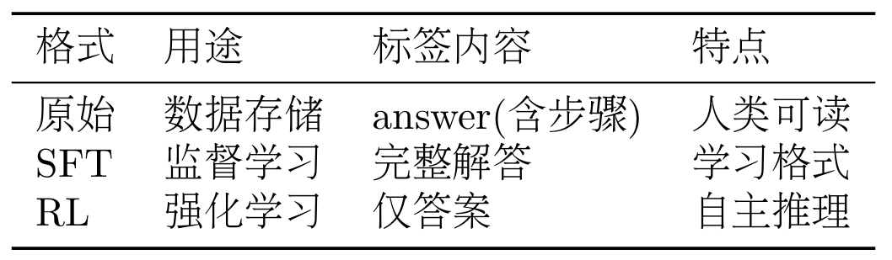
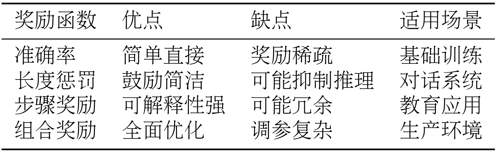

# 第十一章 Agentic-RL

## 11.1 从LLM训练到Agentic RL

### 11.1.1 从强化学习到Agentic RL

强化学习RL是一种专注于解决序贯决策问题的学习范式,它通过智能体与环境的直接交互，在"试错"中学习如何最大化长期收益。

**传统的监督学习方法存在三个核心局限**:
+ 一是数据质量完全决定训练质量，模型只能模仿训练数据，难以超越;
+ 二是缺乏探索能力，只能被动学习人类提供的路径;
+ 三是难以优化长期目标，无法精确优化多步推理的中间过程。

### 11.1.2 LLM训练全景图

LLM通常要经过两个主要阶段:预训练和后训练.


**预训练**阶段是 LLM 训练的第一阶段，目标是让模型学习语言的基本规律和世界知识。这个阶段使用海量的文本数据(通常是数 TB 级别)，通过自监督学习的方式训练模型。
最常见的预训练任务是因果语言建模(Causal Language Modeling)，也称为下一个词预测(Next Token Prediction)。

给定一个文本序列$x_1,x_2,...,x_t$，模型需要预测下一个词$x_{t+1}$:

$$\mathcal{L}_{\text{pretrain}} = -\sum_{t=1}^{T} \log P(x_t | x_1, x_2, \ldots, x_{t-1}; \theta)$$

其中$\theta$是模型参数， $P(x_t|x_1,...,x_{t-1};\theta)$是模型预测的下一个词的概率分布，目标是最小化负对数似然，即最大化预测正确词的概率。例如，给定文本"The cat sat on the"，模型需要预测下一个词最可能是"mat"。通过在海量文本上进行这样的训练，模型逐渐学会语法规则(什么样的词序是合法的)、语义知识(词与词之间的关系)、世界知识(关于世界的事实性信息)以及基础的推理能力。

**预训练阶段的特点是数据量巨大、计算成本高、学到的是通用的语言理解和生成能力、采用无监督学习。**

**后训练阶段则是要解决预训练模型的不足。**

后训练通常包含三个步骤:
+ 1.监督微调(SFT): 目标是让模型学会遵循指令和对话格式。
  + $$\mathcal{L}_{SFT} = - \sum_{i=1}^{N} \log P(y_i|x_i;\theta)$$
  + $x_i$是输入提示，$y_i$是期望的输出，N是训练样本数量。SFT的特点是数据量较小、需要人工标注、快速见效、主要学习任务格式和基本能力。
+ 2.奖励建模(RM): 评估回答的质量，奖励模型的训练数据是偏好对比数据,包含同一个问题的两个回答,一个更好(chosen),一个更差(rejected)。奖励模型的训练目标是学习人类的偏好:
  + $$\mathcal{L}_{RM} = -\mathbb{E}_{(x,y_w,y_l)}[\log \sigma(r_\phi(x,y_w) - r_\phi(x,y_l))]$$
  + $r_\phi(x,y)$是奖励模型，输入是(提示，回答)对，输出是质量分数; $y_w$是更好的回答(chosen), $y_l$是更差的回答(rejected), $\sigma$是 sigmoid 函数，目标是让奖励模型给更好的回答更高的分数。
+ 3.强化学习微调：用强化学习来优化语言模型，让它生成更高质量的回答。最经典的算法是 PPO(Proximal Policy Optimization)[1]，训练目标是:
  + $$J_{PPO} = \mathbb{E}_{x,y~\pi_\theta}[r_\phi(x,y)] - \beta·D_{KL}(\pi_\theta||\pi_{ref})$$
  + $\pi_\theta$是当前策略，即语言模型,$\pi_{ref}$是参考策略，这个场景下可以是 SFT 模型,$r_\phi(x,y)$是奖励模型的评分, $D_{KL}$是 KL 散度，目的是为了防止模型偏离太远,$\beta$是平衡系数。
  + 这个目标函数的含义是:最大化奖励，同时不要偏离原始模型太远。

传统的 RLHF(Reinforcement Learning from Human Feedback)[5]需要大量人工标注偏好数据，成本高昂。

为了降低成本，研究者提出了 RLAIF(Reinforcement Learning from AI Feedback)[7]，用强大的 AI 模型(如 GPT-4)来替代人类标注员。

RLAIF 的工作流程是:用 SFT 模型生成多个候选回答，用强大的 AI 模型对回答进行评分和排序，用 AI 的评分训练奖励模型，用奖励模型进行强化学习。

### 11.1.3 Agentic RL的核心概念

传统的后训练(我们称之为 PBRFT: Preference-Based Reinforcement Fine-Tuning)主要关注单轮对话的质量优化:给定一个用户问题，模型生成一个回答，然后根据回答的质量获得奖励。
这种方式适合优化对话助手，但对于需要多步推理、工具使用、长期规划的智能体任务来说，就显得力不从心了。

Agentic RL则是一种新的范式，它将 LLM 视为一个可学习的策略，嵌入在一个顺序决策循环中。
在这个框架下，智能体需要在动态环境中与外部世界交互，执行多步行动来完成复杂任务，获得中间反馈来指导后续决策，优化长期累积奖励而非单步奖励。

Agentic RL则是一种新的范式，它将 LLM 视为一个可学习的策略，嵌入在一个顺序决策循环中。
在这个框架下，智能体需要在动态环境中与外部世界交互，执行多步行动来完成复杂任务，获得中间反馈来指导后续决策，优化长期累积奖励而非单步奖励

强化学习是基于马尔可夫决策过程(Markov Decision Process， MDP)框架进行形式化的。MDP 由五元组(S,A,P,R,$\gamma$) 定义:状态空间S、 行动空间A、状态转移函数$P(s'|s,a)$、奖励函数R(s,a)、折扣因子$\gamma$。


在状态方面，PBRFT 的状态 $s_0$ 仅由用户提示构成，时间跨度 $T = 1$（单步）， 状态不变化，可以表示为 $s_0 = \text{prompt}$。而 Agentic RL 的状态 $s_t$
包含历史观察和上下文，时间跨度 $T \gg 1$（多步），状态随行动演化，可以表示为$s_t = (\text{prompt}, o_1, o_2, ..., o_t)$，其中 $o_t$ 是第 $t$ 步的观察 （如工具返回结果、环境反馈等）。

在行动方面，PBRFT 的行动空间只有文本生成，单一行动类型，表示为$a = y \sim \pi_\theta(y|s_0)$。而 Agentic RL 的行动空间包含文本生成、工具调用、 环境操作等多种类型，表示为 $a_t \in \{a_t^{\text{text}}, a_t^{\text{tool}}\}$，
例如 $a_t^{\text{text}}$ 是生成思考过程或回答，$a_t^{\text{tool}}$ 是调用计算器、 搜索引擎等工具。

在转移函数方面，PBRFT 无状态转移，表示为$P(s'|s,a) = \delta(s' - s_{\text{terminal}})$。而 Agentic RL 的状态根据行动和
环境动态变化，表示为 $s_{t+1} \sim P(s_{t+1}|s_t, a_t)$，例如调用搜索工具后， 状态会包含搜索结果。

在奖励方面，PBRFT 只有单步奖励 $r(s_0, a)$，仅在任务结束时给予，表示为$R_{\text{PBRFT}} = r(s_0, y)$，通常由奖励模型给出：
$r(s_0, y) = r_\phi(s_0, y)$。而 Agentic RL 有多步奖励 $r(s_t, a_t)$， 可以在中间步骤给予部分奖励，表示为：

$$
R_{\text{Agentic}} = \sum_{t=0}^{T} \gamma^t r(s_t, a_t)
$$

其中 $\gamma \in [0, 1]$ 是折扣因子，$r(s_t, a_t)$ 可以是稀疏奖励（只在任务完成时给予， 如答案正确 +1）、密集奖励（每步都给予，如工具调用成功 +0.1）或结合两者的混合奖励。
在目标函数方面，PBRFT 最大化单步期望奖励：
$$
J_{\text{PBRFT}}(\theta) = \mathbb{E}_{s_0, y \sim \pi_\theta}[r(s_0, y)]
$$

而 Agentic RL 最大化累积折扣奖励：
$$
J_{\text{Agentic}}(\theta) = \mathbb{E}_{\tau \sim \pi_\theta} \left[ \sum_{t=0}^{T} \gamma^t r(s_t, a_t) \right]
$$

其中 $\tau = (s_0, a_0, s_1, a_1, ..., s_T)$ 是完整的轨迹（trajectory）。


+ **推理(Reasoning)** 是指从给定信息中逻辑地得出结论的过程，是智能体的核心能力。传统的 CoT 提示方法依赖少样本示例，泛化能力有限；SFT 只能模仿训练数据中的推理模式，难以创新。
  强化学习 的优势在于通过试错学习有效的推理策略，发现训练数据中没有的推理路径，学会何时需要深度思考、 何时可以快速回答。推理任务可以建模为序列决策问题，给定问题 $q$，
  智能体需要生成推理链$c = (c_1, c_2, ..., c_n)$ 和最终答案 $a$。奖励函数通常设计为$r(q, c, a) = 1 \text{ if } a = a^* \text{ else } 0$，
  训练目标是$\max_\theta \mathbb{E}_{q,(c,a) \sim \pi_\theta}[r(q, c, a)]$。 通过这种方式，模型学会生成高质量的推理链，而不仅仅是记忆答案。
+ **工具使用(Tool Use)** 是指智能体调用外部工具来完成任务的能力。在工具使用任务中，行动空间 扩展为 $a_t \in \{a_t^{\text{think}}, a_t^{\text{tool}}\}$，其中 $a_t^{\text{think}}$
  是生成思考过程，$a_t^{\text{tool}} = (\text{tool\_name, arguments})$ 是调用工具。 强化学习让智能体学会何时需要使用工具、选择哪个工具、如何组合多个工具。例如，在解决数学问题时，
  智能体需要学会何时使用计算器、何时使用代码解释器、何时直接推理。
+ **记忆(Memory)** 是指智能体保持和重用过去信息的能力，对于长期任务至关重要。LLM 的上下文窗口有限，静态检索策略(如 RAG)无法针对任务优化。
  强化学习让智能体学会记忆管理策略:决定哪些信息值得记住、何时更新记忆、何时删除过时信息。这类似于人类的工作记忆，我们会主动管理大脑中的信息，保留重要的、遗忘无关的。
+ **规划(Planning)** 是指制定行动序列以达成目标的能力。传统的 CoT 是线性思考，无法回溯;提示工程使用静态规划模板，难以适应新情况。
  强化学习让智能体学会动态规划:通过试错发现有效的行动序列，学会权衡短期和长期收益。例如，在多步任务中，智能体可能需要先执行一些看似"绕路"的步骤，例如收集信息，才能最终完成任务。
+ **自我改进(Self-Improvement)** 是指智能体回顾自身输出、纠正错误并优化策略的能力。强化学习让智能体学会自我反思:识别自己的错误、分析失败原因、调整策略。
  这种能力使得智能体能够在没有人工干预的情况下持续改进，类似于人类的"从错误中学习"。
+ **感知(Perception)** 是指理解多模态信息的能力。例如，强化学习可以提升视觉推理能力，让模型学会使用视觉工具，学会视觉规划。这使得智能体不仅能理解文本，还能理解和操作视觉世界。

### 11.1.4 HelloAgents的Agentic RL设计
在技术选型上，我们集成了 TRL(Transformer Reinforcement Learning)框架[9]，模型选择 Qwen3-0.6B[10]。TRL 是 Hugging Face 的强化学习库，成熟稳定、功能完整、易于集成。
Qwen3-0.6B 是阿里云的小型语言模型，0.6B 参数适合普通 GPU 训练，性能优秀且开源免费。


最底层是数据集层，包含GSM8KDataset类、create_sft_dataset()函数和create_rl_dataset()函数，负责数据加载和格式转换。
第二层是奖励函数层，包含MathRewardFunction基类、AccuracyReward准确率奖励、LengthPenaltyReward长度惩罚、StepReward步骤奖励，以及便捷创建函数create_*_reward()，负责定义什么是好的行为。
第三层是训练器层，包含SFTTrainerWrapper和GRPOTrainerWrapper，负责具体的训练逻辑和 LoRA 支持。最顶层是统一接口层，提供RLTrainingTool统一训练工具，支持四种操作:action="train"(训练模型)、action="load_dataset"(加载数据集)、action="create_reward"(创建奖励函数)、action="evaluate"(评估模型)。

### 11.1.5 快速上手示例

```bash
# 安装HelloAgents框架(第11章版本)
pip install "hello-agents[rl]==0.2.5"

# 或者从源码安装
cd HelloAgents
pip install -e ".[rl]"
```
代码：
```python
import sys
import json

from hello_agents.tools import RLTrainingTool

# 创建RL训练工具
rl_tool = RLTrainingTool()

# 1.快速测试：SFT训练(10个样本，1个epoch)
sft_result_str = rl_tool.run({
    "action": "train",
    "algorithm": "sft",
    "model_name": "Qwen/Qwen3-0.6B",
    "output_dir": "./models/quick_test_sft",
    "max_samples": 10,      # 只用10个样本快速测试
    "num_epochs": 1,        # 只训练1轮
    "batch_size": 2,
    "use_lora": True        # 使用LoRA加速训练
})

sft_result = json.loads(sft_result_str)
print(f"\n SFT训练完成，模型保存在: {sft_result['output_dir']}")

# 2.GRPO训练(5个样本，1个epoch)
grpo_result_str = rl_tool.run({
    "action": "train",
    "algorithm": "grpo",
    "model_name": "Qwen/Qwen3-0.6B",  # 使用基础模型
    "output_dir": "./models/quick_test_grpo",
    "max_samples": 5,       # 只用5个样本快速测试
    "num_epochs": 1,
    "batch_size": 2,        # 必须能被num_generations(8)整除,使用2
    "use_lora": True
})

grpo_result = json.loads(grpo_result_str)
print(f"\n GRPO训练完成，模型保存在：{grpo_result['output_dir']}")

# 3.评估模型
eval_result_str = rl_tool.run({
    "action": "evaluate",
    "model_path": "./models/quick_test_grpo",
    "max_samples": 10,      # 在10个测试样本上评估
    "use_lora": True
})

eval_result = json.loads(eval_result_str)
print(f"\n✓ 评估完成:")
print(f"  - 准确率: {eval_result['accuracy']}")
print(f"  - 平均奖励: {eval_result['average_reward']}")
print(f"  - 测试样本数: {eval_result['num_samples']}")

print("\n" + "=" * 50)
print("🎉 恭喜!你已经完成了第一个Agentic RL模型的训练!")
print("=" * 50)
print(f"\n模型路径:")
print(f"  SFT模型: {sft_result['output_dir']}")
print(f"  GRPO模型: {grpo_result['output_dir']}")

```

## 11.2 数据集与奖励函数
### 11.2.1 GSM8K数学推理数据集

数学推理是评估 LLM 推理能力的理想任务。

首先，数学问题有明确的正确答案，可以自动评估，不需要人工标注或复杂的奖励模型。

其次，解决数学问题需要分解问题、逐步推导，这正是多步推理的典型场景。

最后，学到的推理能力可以迁移到其他领域，具有很强的泛化性


典型的GSM8K问题：
```bash
问题: Natalia sold clips to 48 of her friends in April, and then she sold half 
      as many clips in May. How many clips did Natalia sell altogether in April 
      and May?

答案: Natalia sold 48/2 = <<48/2=24>>24 clips in May.
      Natalia sold 48+24 = <<48+24=72>>72 clips altogether in April and May.
      #### 72

最终答案: 72
```

GSM8K 数据集需要转换为不同的格式，以适应不同的训练方法


原始格式直接来自数据集，包含问题(question)和答案(answer，含解题步骤)，适合人类阅读。SFT格式用于监督微调，将问题转换为对话格式的prompt，
将完整解答作为completion。

```bash
{
    "prompt": "<|im_start|>user\nNatalia sold clips to 48 of her friends...<|im_end|>\n<|im_start|>assistant\n",
    "completion": "Let me solve this step by step.\n\nStep 1: ...\n\nFinal Answer: 72<|im_end|>"
}
```

关键点是使用模型的对话模板(如 Qwen 的<|im_start|>标记)，prompt 包含用户问题，completion 包含完整的解题过程和答案。这样模型可以学习如何格式化输出、如何分步推理。

RL 格式用于强化学习，只提供问题和正确答案，不提供解题过程。
```bash
{
    "prompt": "<|im_start|>user\nNatalia sold clips to 48 of her friends...<|im_end|>\n<|im_start|>assistant\n",
    "ground_truth": "72"
}
```

关键点是 prompt 与 SFT 相同，但 ground_truth 只包含最终答案(用于计算奖励)，模型需要自己生成完整的推理过程。这种设计迫使模型学会自主推理，而不是简单地记忆答案。



```python
from hello_agents.tools import RLTrainingTool
import json

# 创建工具
rl_tool = RLTrainingTool()

# 1.加载SFT格式数据集
sft_result = rl_tool.run({
    "action": "load_dataset",
    "format": "sft",
    "max_samples": 5  # 只加载5个样本查看
})
sft_data = json.loads(sft_result)

print(f"数据集大小: {sft_data['dataset_size']}")
print(f"数据格式: {sft_data['format']}")
print(f"样本字段: {sft_data['sample_keys']}")

# 2. 加载RL格式数据集
rl_result = rl_tool.run({
    "action": "load_dataset",
    "format": "rl",
    "max_samples": 5
})
rl_data = json.loads(rl_result)

print(f"数据集大小: {rl_data['dataset_size']}")
print(f"数据格式: {rl_data['format']}")
print(f"样本字段: {rl_data['sample_keys']}")
```

### 11.2.2奖励函数设计

在强化学习中，奖励函数 $r(s, a)$ 或 $r(s, a, s')$ 为智能体的每个行动分配一个数值奖励。
智能体的目标是最大化累积奖励：

$$
J(\theta) = \mathbb{E}_{\tau \sim \pi_\theta} \left[ \sum_{t=0}^{T} \gamma^t r(s_t, a_t) \right]
$$

对于数学推理任务，我们可以简化为：

$$
r(q, a) = f(a, a^*)
$$

其中q是问题，a是模型生成的答案，$a^*$，$\mathcal{f}$是评估函数。

奖励函数的设计直接影响训练效果。好的奖励函数应该能清楚地定义什么是成功、能够提供梯度信号、不会产生过大的方差、容易调整和组合。
糟糕的奖励函数可能只在任务结束时给奖励，中间步骤无反馈、存在奖励欺骗，使得智能体找到"作弊"方式获得高奖励、多个目标相互矛盾、方差过大，训练不收敛。

HelloAgents 提供了三种内置奖励函数，可以单独使用或组合使用


#### (1) 准确率奖励

准确率奖励(AccuracyReward)是最基础的奖励函数，它只关心答案是否正确。数学定义为:

$$
r_{\text{acc}}(a, a^*) = \begin{cases} 1 & \text{if } a = a^* \\ 0 & \text{otherwise} \end{cases}
$$

其中a是模型生成的答案，$a^*$是正确答案。这是一个二值奖励函数，答案正确得 1 分，错误得 0 分。

实现时需要处理答案提取和比较。模型的输出可能包含大量文本，我们需要提取最终答案。常见的提取方法包括:查找"Final Answer:"后的数字、查找"####"标记后的数字、使用正则表达式提取最后一个数字。
答案比较时需要处理数值精度(如 72.0 和 72 应该视为相同)、单位转换(如 1000 和 1k)、格式差异(如"72"和"seventy-two")。

示例：
```python
from hello_agents.tools import RLTrainingTool
import json
rl_tool = RLTrainingTool()

# 创建准确率奖励函数
reward_result = rl_tool.run({
    "action": "create_reward",
    "reward_type": "accuracy"
})
reward_data = json.loads(reward_result)

print(f"奖励类型: {reward_data['reward_type']}")
print(f"描述: {reward_data['description']}")

# 注意: RLTrainingTool的create_reward操作返回的是配置信息,
# 实际的奖励函数会在训练时自动创建和使用
```

**准确率奖励的优点**是简单直接，容易理解和实现，适合有明确正确答案的任务。**缺点**是奖励稀疏，只有答案完全正确才有奖励，无法区分"接近正确"和"完全错误"，可能导致训练初期缺乏有效反馈。

#### (2) 长度惩罚
长度惩罚(LengthPenaltyReward)鼓励模型生成简洁的回答，避免冗长啰嗦。数学定义为:

$$
r_{\text{length}}(a, a^*, l) = r_{\text{acc}}(a, a^*) - \alpha \cdot \max(0, l - l_{\text{target}})
$$

其中l是生成文本的长度(字符数或 token 数)，$l_{target}$是目标长度，$\alpha$是惩罚系数(默认 0.001)。只有在答案正确的情况下才应用长度惩罚，避免模型为了减少惩罚而生成错误的短答案。

设计思路是:如果答案错误，奖励为 0(无论长度);如果答案正确且长度合理，奖励为 1;如果答案正确但过长，奖励为$1 - \alpha · (l - l_{target})$。
例如，目标长度 200 字符，实际长度 500 字符，惩罚系数 0.001，则奖励为 1 - 0.001 * (500 - 200) = 0.7

示例：
```python
# 创建长度惩罚奖励函数
reward_result = rl_tool.run({
    "action": "create_reward",
    "reward_type": "length_penalty",
    "max_length": 1024,      # 最大长度
    "penalty_weight": 0.001  # 惩罚权重
})
reward_data = json.loads(reward_result)

print(f"奖励类型: {reward_data['reward_type']}")
print(f"描述: {reward_data['description']}")
print(f"最大长度: {reward_data['max_length']}")
print(f"惩罚权重: {reward_data['penalty_weight']}")
```

**长度惩罚的优点**是鼓励简洁表达，避免模型生成冗余内容，可以控制推理成本(更短的输出意味着更少的 token 消耗)。**缺点**是可能抑制详细推理，需要仔细调整惩罚系数，不同任务的最优长度差异很大。

#### (3) 步骤奖励
步骤奖励(StepReward)鼓励模型生成清晰的推理步骤，提高可解释性。数学定义为:

$$
r_{\text{step}}(a, a^*, s) = r_{\text{acc}}(a, a^*) + \beta \cdot s
$$

其中s是检测到的推理步骤数量, $\beta$步骤奖励系数(默认0.1)。同样，只有在答案正确的情况下才给予步骤奖励。

步骤检测方法包括:查找"Step 1:"， "Step 2:"等标记、查找换行符数量、使用正则表达式匹配推理模式。例如，一个包含 3 个清晰步骤的正确答案，奖励为1 + 0.1 * 3 = 1.3

示例：
```python
# 创建步骤奖励函数
reward_result = rl_tool.run({
    "action": "create_reward",
    "reward_type": "step",
    "step_bonus": 0.1  # 每个步骤奖励0.1
})
reward_data = json.loads(reward_result)

print(f"奖励类型: {reward_data['reward_type']}")
print(f"描述: {reward_data['description']}")
print(f"步骤奖励: {reward_data['step_bonus']}")
```

**步骤奖励的优点**是鼓励可解释的推理，生成的答案更容易验证和调试，有助于模型学习系统化的思考方式。**缺点**是可能导致模型为了获得更多奖励生成冗余步骤，需要平衡步骤数量和答案质量，步骤检测可能不准确。

在实际应用中，我们通常会组合多个奖励函数，以平衡不同的目标。常见的组合策略包括:

**准确率** + **长度惩罚**:鼓励简洁正确的答案，适合对话系统、问答系统。公式为:
$$
r = r_{\text{acc}} - \alpha \cdot \max(0, l - l_{\text{target}})
$$

**准确率 + 步骤奖励**：鼓励详细的推理过程，适合教育场景、可解释 AI。公式为：
$$
r = r_{\text{acc}} + \beta \cdot s
$$

**三者平衡**：全面优化答案质量、简洁性和可解释性。公式为：
$$
r = r_{\text{acc}} - \alpha \cdot \max(0, l - l_{\text{target}}) + \beta \cdot s
$$

需要仔细调整权重 $\alpha$ 和 $\beta$，避免某个目标过度主导。

示例：
```python
# 组合奖励函数:准确率 + 长度惩罚 + 步骤奖励
# 注意: RLTrainingTool目前支持单一奖励类型
# 组合奖励需要在训练配置中通过reward_fn参数指定
# 这里展示如何配置不同类型的奖励函数

# 准确率奖励
accuracy_result = rl_tool.run({
    "action": "create_reward",
    "reward_type": "accuracy"
})
print("准确率奖励:", json.loads(accuracy_result)['description'])

# 长度惩罚奖励
length_result = rl_tool.run({
    "action": "create_reward",
    "reward_type": "length_penalty",
    "max_length": 1024,
    "penalty_weight": 0.001
})
print("长度惩罚奖励:", json.loads(length_result)['description'])

# 步骤奖励
step_result = rl_tool.run({
    "action": "create_reward",
    "reward_type": "step",
    "step_bonus": 0.1
})
print("步骤奖励:", json.loads(step_result)['description'])
```

不同奖励函数适合不同的应用场景。



### 11.2.3 自定义数据集和奖励函数

**SFT 格式**:用于监督微调，需要包含以下字段:
+ prompt: 输入提示(包含 system 和 user 消息)
+ completion: 期望的输出
+ text: 完整的对话文本(可选)

**RL 格式**:用于强化学习，需要包含以下字段:
+ question: 原始问题
+ prompt: 输入提示(包含 system 和 user 消息)
+ ground_truth: 正确答案
+ full_answer: 完整答案(包含推理过程)

#### (1) 使用 format_math_dataset 转换

```python
from datasets import Dataset
from hello_agents.rl import format_math_dataset

# 1. 准备原始数据
custom_data = [
    {
        "question": "What is 2+2?",
        "answer": "2+2=4. #### 4"
    },
    {
        "question": "What is 5*3?",
        "answer": "5*3=15. #### 15"
    },
    {
        "question": "What is 10+7?",
        "answer": "10+7=17. #### 17"
    }
]

# 2.转换为Dataset对象
raw_dataset = Dataset.from_list(custom_data)

# 3.转换为SFT对象
sft_dataset = format_math_dataset(
    dataset=raw_dataset,
    format_type="sft",
    model_name="Qwen/Qwen3-0.6B"
)
print(f"SFT数据集：{len(sft_dataset)}个样本")
print(f"字段: {sft_dataset.column_names}")

# 4. 转换为RL格式
rl_dataset = format_math_dataset(
    dataset=raw_dataset,
    format_type="rl",
    model_name="Qwen/Qwen3-0.6B"
)

print(f"RL数据集: {len(rl_dataset)}个样本")
print(f"字段: {rl_dataset.column_names}")

```

#### (2) 直接传入自定义的数据集

使用 RLTrainingTool 时，可以通过custom_dataset参数直接传入自定义数据集:
```python
from hello_agents.tools import RLTrainingTool

rl_tool = RLTrainingTool()

# SFT训练
result = rl_tool.run({
    "action": "train",
    "algorithm": "sft",
    "model_name": "Qwen/Qwen3-0.6B",
    "output_dir": "./models/custom_sft",
    "num_epochs": 3,
    "batch_size": 4,
    "use_lora": True,
    "custom_dataset": sft_dataset  # 直接传入自定义数据集
})

# GRPO训练
result = rl_tool.run({
    "action": "train",
    "algorithm": "grpo",
    "model_name": "Qwen/Qwen3-0.6B",
    "output_dir": "./models/custom_grpo",
    "num_epochs": 2,
    "batch_size": 2,
    "use_lora": True,
    "custom_dataset": rl_dataset  # 直接传入自定义数据集
})
```

#### (3) 注册自定义数据集(推荐)
对于需要多次使用的数据集，推荐使用注册方式:
```bash
# 1. 注册数据集
rl_tool.register_dataset("my_math_dataset", rl_dataset)

# 2. 使用注册的数据集
result = rl_tool.run({
    "action": "train",
    "algorithm": "grpo",
    "dataset": "my_math_dataset",  # 使用注册的数据集名称
    "output_dir": "./models/custom_grpo",
    "num_epochs": 2,
    "use_lora": True
})
```
奖励函数用于评估模型生成的答案质量。自定义奖励函数需要遵循以下签名:

```python
from typing import List
import re

def custom_reward_function(
    completions: List[str],
    **kwargs
) -> List[float]:
    """
    自定义奖励函数

    Args:
        completions: 模型生成的完成文本列表
        **kwargs: 其他参数,通常包含:
            - ground_truth: 正确答案列表
            - 其他数据集字段

    Returns:
        奖励值列表(每个值在0.0-1.0之间)
    """
    ground_truths = kwargs.get("ground_truth", [])
    rewards = []

    for completion, truth in zip(completions, ground_truths):
        reward = 0.0

        # 提取答案
        numbers = re.findall(r'-?\d+\.?\d*', completion)
        if numbers:
            try:
                pred = float(numbers[-1])
                truth_num = float(truth)
                error = abs(pred - truth_num)

                # 根据误差给予不同奖励
                if error < 0.01:
                    reward = 1.0  # 完全正确
                elif error < 1.0:
                    reward = 0.8  # 非常接近
                elif error < 5.0:
                    reward = 0.5  # 接近

                # 额外奖励:鼓励展示推理步骤
                if "step" in completion.lower() or "=" in completion:
                    reward += 0.1

            except ValueError:
                reward = 0.0

        rewards.append(min(reward, 1.0))  # 限制最大值为1.0

    return rewards
```

#### (1) 直接传入
```python
result = rl_tool.run({
    "action": "train",
    "algorithm": "grpo",
    "model_name": "Qwen/Qwen3-0.6B",
    "output_dir": "./models/custom_grpo",
    "custom_dataset": rl_dataset,
    "custom_reward": custom_reward_function  # 直接传入奖励函数
})
```

#### (2) 注册使用(推荐)
```python
# 1. 注册奖励函数
rl_tool.register_reward_function("my_reward", custom_reward_function)

# 2. 使用注册的奖励函数
result = rl_tool.run({
    "action": "train",
    "algorithm": "grpo",
    "dataset": "my_math_dataset",
    "output_dir": "./models/custom_grpo"
    # 奖励函数会自动使用与dataset同名的注册函数
})
```

## 11.3 SFT训练

监督微调(Supervised Fine-Tuning， SFT)是强化学习训练的第一步，也是最重要的基础。SFT 让模型学习任务的基本格式、对话模式和初步的推理能力。没有 SFT 的基础，直接进行强化学习往往会失败，因为模型连基本的输出格式都不会。

### 11.3.1 为什么需要SFT

```python
from transformers import AutoTokenizer, AutoModelForCausalLM

# 加载预训练模型
model_name = "Qwen/Qwen3-0.6B"
tokenizer = AutoTokenizer.from_pretrained(model_name)
model = AutoModelForCausalLM.from_pretrained(model_name)

# 测试问题
question = """Natalia sold clips to 48 of her friends in April, and then she sold half as many clips in May. How many clips did Natalia sell altogether in April and May?"""

# 构造输入
prompt = f"<|im_start|>user\n{question}<|im_end|>\n<|im_start|>assistant\n"
inputs = tokenizer(prompt, return_tensors="pt")

# 生成回答
outputs = model.generate(**inputs, max_new_tokens=200)
response = tokenizer.decode(outputs[0], skip_special_tokens=False)

print("预训练模型的回答:")
print(response)
```


### 11.3.2 LoRA:参数高效微调

直接微调整个模型需要大量的计算资源和显存。

对于 Qwen3-0.6B(0.6B 参数)，全量微调需要约 12GB 显存(FP16)或 24GB 显存(FP32)。对于更大的模型(如 7B、13B)，全量微调几乎不可能在消费级 GPU 上进行。

LoRA(Low-Rank Adaptation)[3]是一种参数高效微调方法，它只训练少量的额外参数，而保持原模型参数冻结。
**LoRA 的核心思想**是:模型微调时的参数变化可以用低秩矩阵表示。

假设原模型的权重矩阵为 $W \in \mathbb{R}^{d \times k}$，微调后的权重为 $W' = W + \Delta W$。LoRA 假设 $\Delta W$ 可以分解为两个低秩矩阵的乘积：

$$
\Delta W = BA
$$

其中 $B \in \mathbb{R}^{d \times r}$, $A \in \mathbb{R}^{r \times k}$, $r \ll \min(d, k)$ 是秩(rank)。

前向传播时，输出为：

$$
h = Wx + \Delta Wx = Wx + BAx
$$

原模型参数 $W$ 保持冻结，只训练 $B$ 和 $A$。

参数量对比：原模型参数量为 $d \times k$，LoRA 参数量为 $d \times r + r \times k = r(d + k)$。当 $r \ll \min(d, k)$ 时，
LoRA 参数量远小于原模型。例如，对于 $d = 4096, k = 4096, r = 8$ 的情况，原模型参数量为 $4096 \times 4096 = 16,777,216$，
LoRA 参数量为 $8 \times (4096 + 4096) = 65,536$，参数量减少了 256 倍！

**LoRA 的优势**:显存占用大幅降低、训练速度更快、易于部署、防止过拟合。**缺点是**训练的效果通常情况会比全量调参更差一些。


**全量微调 = 模型权重 + 优化器状态 + 梯度 + 激活值**
+ 模型权重：0.6B 参数在 FP32 精度下约 0.6B × 4Byte = 2.4GB
+ 优化器状态（如 AdamW）：约是权重的 2 倍 → 4.8GB
+ 梯度：和权重大小一致 → 2.4GB
+ 激活值 / 中间计算：根据 batch size 和序列长度，通常再占 2~4GB
合计：2.4 + 4.8 + 2.4 + 2.4 ≈ 12GB，和表中数据完全吻合

LoRA 的关键超参数包括：
- **秩(rank, r)**：控制 LoRA 矩阵的秩，秩越大模型表达能力越强，但参数量也随之增加。典型取值范围为 4-64，默认值为 8。
- **Alpha($\alpha$)**：LoRA 的缩放因子，实际权重更新量为 $\Delta W = \frac{\alpha}{r}BA$，用于控制 LoRA 模块对原模型的影响强度，典型取值等于秩（rank）。
- **目标模块(target_modules)**：指定在模型哪些层应用 LoRA 微调。通常选择注意力层的 **q_proj、k_proj、v_proj、o_proj**，也可包含 MLP 层的 **gate_proj、up_proj、down_proj**。

### 11.3.3 SFT训练实战

完整的训练流程包括:准备数据集、配置 LoRA、设置训练参数、开始训练、保存模型。

基础训练示例:
```python
from hello_agents.tools import RLTrainingTool

# 创建训练工具
rl_tool = RLTrainingTool()

# SFT训练
result = rl_tool.run({
    # 训练配置
    "action": "train",
    "algorithm": "sft",
    
    # 模型配置
    "model_name": "Qwen/Qwen3-0.6B",
    "output_dir": "./models/sft_model",
    
    # 数据配置
    "max_samples": 100,     # 使用100个样本快速测试
    
    # 训练参数
    "num_epochs": 3,        # 训练3轮
    "batch_size": 4,        # 批次大小
    "learning_rate": 5e-5,  # 学习率
    
    # LoRA配置
    "use_lora": True,       # 使用LoRA
    "lora_rank": 8,         # LoRA秩
    "lora_alpha": 16,       # LoRA alpha
})

print(f"\n✓ 训练完成!")
print(f"  - 模型保存路径: {result['model_path']}")
print(f"  - 训练样本数: {result['num_samples']}")
print(f"  - 训练轮数: {result['num_epochs']}")
print(f"  - 最终损失: {result['final_loss']:.4f}")
```

#### (1) 训练参数详解
**数据参数**
+ max_samples: 使用的训练样本数量。快速测试时可以用 100-1000 个样本，完整训练建议使用全部数据(7473 个样本)。更多数据通常带来更好的效果，但训练时间也更长。
+ split: 数据集划分，默认"train"。可以设置为"train[:1000]"只使用前 1000 个样本。

**训练参数**：
+ num_epoch: 训练轮数。1 轮表示遍历整个数据集一次。太少(1-2 轮)可能欠拟合，太多(>10 轮)可能过拟合。建议从 3 轮开始，观察损失曲线调整。
+ batch_size: 每次更新使用的样本数。越大训练越稳定，但显存占用越高。建议根据显存调整:4GB 显存用 batch_size=1-2，8GB 显存用 batch_size=4-8，16GB 显存用 batch_size=8-16。
+ learning_rate: 学习率，控制参数更新的步长。太小(1e-6)收敛慢，太大(1e-3)可能不收敛。SFT 推荐 5e-5，LoRA 可以稍大(1e-4)。

**LoRA参数**:
+ use_lora: 是否使用 LoRA。建议始终开启，除非有充足的显存。
+ lora_rant: LoRA 秩，控制表达能力。4-8 适合小任务，16-32 适合复杂任务，64 适合大规模微调。
+ lora_alpha: LoRA 缩放因子，通常设置为 rank 的 2 倍。rank=8 时，alpha=16;rank=16 时，alpha=32。

**优化器参数**:
+ optimizer: 优化器类型，默认"adamw"。AdamW 是最常用的选择，也可以尝试"sgd"或"adafactor"等。
+ weight_decay: 权重衰减，防止过拟合。默认 0.01，可以尝试 0.001-0.1。
+ warmup_ratio: 学习率预热比例。前 warmup_ratio 的步数学习率线性增加，然后线性衰减。默认 0.1(前 10%步数预热)。

#### (2) 完整训练示例

```python
from hello_agents.tools import RLTrainingTool


from hello_agents.tools import RLTrainingTool

rl_tool = RLTrainingTool()

# 完整SFT训练
result = rl_tool.run({
    "action": "train",
    "algorithm": "sft",

    # 模型配置
    "model_name": "Qwen/Qwen3-0.6B",
    "output_dir": "./models/sft_full",

    # 数据配置
    "max_samples": None,    # 使用全部数据(7473个样本)

    # 训练参数
    "num_epochs": 3,
    "batch_size": 8,
    "learning_rate": 5e-5,
    "warmup_ratio": 0.1,
    "weight_decay": 0.01,

    # LoRA配置
    "use_lora": True,
    "lora_rank": 16,        # 使用更大的rank
    "lora_alpha": 32,
    "lora_target_modules": ["q_proj", "k_proj", "v_proj", "o_proj"],

    # 其他配置
    "save_steps": 500,      # 每500步保存一次
    "logging_steps": 100,   # 每100步记录一次
    "eval_steps": 500,      # 每500步评估一次
})

print(f"训练完成! 模型保存在: {result['model_path']}")
```

#### (3) 训练监控和调试

训练过程中，要监控三个关键指标。
+ **损失(Loss)**：应该逐渐下降，如果不下降可能是学习率太小或数据有问题，如果下降后又上升则可能是学习率太大或出现过拟合。
+ **梯度范数(Gradient Norm)**：应该在 0.1-10 的合理范围内，过大(>100)说明出现梯度爆炸需要降低学习率，过小(<0.01)说明梯度消失需要检查模型配置。
+ **学习率(Learning Rate)**：应该按照 warmup 策略变化，前 10%步数线性增加，然后线性衰减到 0。

训练过程中，常见的问题及解决方案:
+ 显存不足时可以减小 batch_size 或 max_length，使用梯度累积或更小的模型
+ 训练速度慢时可以增大 batch_size，减少 logging 频率，或使用混合精度训练
+ 损失不下降时可以增大学习率，检查数据格式，或增加训练轮数
+ 过拟合时可以增大 weight_decay，减少训练轮数，或使用更多数据

### 11.3.4 模型评估

模型评估指标：
+ **准确率(Accuracy)**：答案完全正确的比例，最直接的指标，范围 0-1，越高越好
+ **平均奖励(Average Reward)**: 所有样本的平均奖励，综合考虑准确率、长度、步骤等因素，范围取决于奖励函数设计。
+ **推理质量(Reasoning Quality)**: 推理过程的清晰度和逻辑性，需要人工评估或使用专门的评估模型。
```python
from hello_agents.tools import RLTrainingTool

rl_tool = RLTrainingTool()

# 评估SFT模型
eval_result = rl_tool.run({
    "action": "evaluate",
    "model_path": "./models/sft_full",
    "max_samples": 100,     # 在100个测试样本上评估
    "use_lora": True,
})

eval_data = json.loads(eval_result)
print(f"\n评估结果:")
print(f"  - 准确率: {eval_data['accuracy']}")
print(f"  - 平均奖励: {eval_data['average_reward']}")
print(f"  - 测试样本数: {eval_data['num_samples']}")
```

## 11.4 GRPO 训练

### 11.4.1 从PPO到GRPO

在强化学习领域，PPO(Proximal Policy Optimization)[1]是最经典的算法之一。PPO 通过限制策略更新的幅度，保证训练的稳定性

PPO 在 LLM 训练中存在一些问题:需要训练 Value Model(价值模型)，增加了训练复杂度和显存占用;需要同时维护四个模型(Policy Model、Reference Model、Value Model、Reward Model)，工程实现复杂;训练不稳定，容易出现奖励崩塌或策略退化。

GRPO(Group Relative Policy Optimization)[2]是一种简化的 PPO 变体，专门为 LLM 设计。

GRPO的核心思想：不需要 Value Model，使用组内相对奖励代替绝对奖励;简化训练流程，只需要 Policy Model 和 Reference Model;提高训练稳定性，减少奖励崩塌的风险。

PPO 通过限制策略更新的幅度，保证训练的稳定性。但是，PPO 在 LLM 训练中存在一些问题:需要训练 Value Model(价值模型)，增加了训练复杂度和显存占用;
需要同时维护四个模型(Policy Model、Reference Model、Value Model、Reward Model)，工程实现复杂;训练不稳定，容易出现奖励崩塌或策略退化。

GRPO(Group Relative Policy Optimization)[2]是一种简化的 PPO 变体，专门为 LLM 设计。GRPO的核心思想是：
+ 不需要 Value Model，使用组内相对奖励代替绝对奖励;简化训练流程，只需要 Policy Model 和 Reference Model;提高训练稳定性，减少奖励崩塌的风险。

让我们通过数学公式来理解 GRPO 的原理。PPO 的目标函数为：

$$
J_{\text{PPO}}(\theta) = \mathbb{E}_{s, a \sim \pi_\theta} \left[ \min \left( \frac{\pi_\theta(a|s)}{\pi_{\text{old}}(a|s)} A(s, a), \text{clip} \left( \frac{\pi_\theta(a|s)}{\pi_{\text{old}}(a|s)}, 1 - \epsilon, 1 + \epsilon \right) A(s, a) \right) \right]
$$

其中 $A(s, a)$ 是优势函数(Advantage)，需要 Value Model 来估计：

$$
A(s, a) = Q(s, a) - V(s) = r(s, a) + \gamma V(s') - V(s)
$$

GRPO 的目标函数简化为：

$$
J_{\text{GRPO}}(\theta) = \mathbb{E}_{s, a \sim \pi_\theta} \left[ \frac{\pi_\theta(a|s)}{\pi_{\text{ref}}(a|s)} \cdot (r(s, a) - \bar{r}_{\text{group}}) \right] - \beta \cdot D_{KL}(\pi_\theta || \pi_{\text{ref}})
$$

其中 $\bar{r}_{\text{group}}$ 是组内平均奖励，$\beta$ 是 KL 散度惩罚系数。关键区别在于：GRPO 使用
$r(s, a) - \bar{r}_{\text{group}}$ 代替优势函数 $A(s, a)$，不需要 Value Model；GRPO 使用组内
相对奖励，减少奖励方差；GRPO 添加 KL 散度惩罚，防止策略偏离太远。


对于 LLM 训练，GRPO 是更好的选择，因为它更简单、更稳定、显存占用更低。

### 11.4.2 GRPO训练实战

GRPO 训练的前提是已经完成 SFT 训练，因为 GRPO 需要一个合理的初始策略。

基础 GRPO 训练示例:
```python
from hello_agents.tools import RLTrainingTool

# 创建训练工具
rl_tool = RLTrainingTool()

# GRPO训练
result = rl_tool.run({
    # 训练配置
    "action": "train",
    "algorithm": "grpo",
    
    # 模型配置
    "model_name": "./models/sft_full",  # 从SFT模型开始
    "output_dir": "./models/grpo_model",
    
    # 数据配置
    "max_samples": 100,     # 使用100个样本快速测试
    
    # 训练参数
    "num_epochs": 3,
    "batch_size": 4,
    "learning_rate": 1e-5,  # GRPO学习率通常比SFT小
    
    # GRPO特定参数
    "num_generations": 4,   # 每个问题生成4个答案
    "kl_coef": 0.05,        # KL散度惩罚系数
    
    # LoRA配置
    "use_lora": True,
    "lora_rank": 16,
    "lora_alpha": 32,
    
    # 奖励函数配置
    "reward_type": "accuracy",  # 使用准确率奖励
})

print(f"\n✓ 训练完成!")
print(f"  - 模型保存路径: {result['model_path']}")
print(f"  - 训练样本数: {result['num_samples']}")
print(f"  - 训练轮数: {result['num_epochs']}")
print(f"  - 平均奖励: {result['average_reward']:.4f}")
```

GRPO 有一些特定的参数需要理解和调优。

**生成参数**：
+ num_generations: 每个问题生成多少个答案。越多越好，但计算成本也越高。典型值为 4-8。生成多个答案的目的是计算组内相对奖励，增加训练信号的多样性。
+ max_new_tokens: 每个答案最多生成多少个 token。太少可能截断答案，太多浪费计算。建议 256-512。
+ temperature: 生成温度，控制随机性。0 表示贪婪解码，1 表示标准采样。GRPO 建议 0.7-1.0，保持一定的探索性。

**优化参数**：
+ learning_rate: GRPO 的学习率通常比 SFT 小，因为我们不想偏离 SFT 模型太远。建议 1e-5 到 5e-5。
+ kl_coef: KL 散度惩罚系数，控制策略更新的幅度。太小(0.01)可能导致策略偏离太远，太大(0.5)可能限制学习。建议 0.05-0.1。
+ clip_range: 策略比率裁剪范围，类似 PPO 的 epsilon。建议 0.2。

**奖励参数**：
+ reward_type: 奖励函数类型，可以是"accuracy"、"length_penalty"、"step"或"combined"。
+ reward_config: 奖励函数的额外配置，如长度惩罚的目标长度、步骤奖励的系数等。

完整的GRPO训练：
```python
from hello_agents.tools import RLTrainingTool

rl_tool = RLTrainingTool()

# 完整GRPO训练
result = rl_tool.run({
    "action": "train",
    "algorithm": "grpo",

    # 模型配置
    "model_name": "./models/sft_full",
    "output_dir": "./models/grpo_full",
    
    # 数据配置
    "max_samples": None,    # 使用全部数据
    
    # 训练参数
    "num_epochs": 3,
    "batch_size": 4,
    "learning_rate": 1e-5,
    "warmup_ratio": 0.1,
    
    # GRPO特定参数
    "num_generations": 4,
    "max_new_tokens": 512,
    "temperature": 0.8,
    "kl_coef": 0.05,
    "clip_range": 0.2,
    
    # LoRA配置
    "use_lora": True,
    "lora_rank": 16,
    "lora_alpha": 32,
    
    # 奖励函数配置
    "reward_type": "combined",
    "reward_config": {
        "components": [
            {"type": "accuracy", "weight": 1.0},
            {"type": "length_penalty", "weight": 0.5, "target_length": 200},
            {"type": "step", "weight": 0.3, "step_bonus": 0.1}
        ]
    },
    
    # 其他配置
    "save_steps": 500,
    "logging_steps": 100,
})

print(f"训练完成! 模型保存在: {result['model_path']}")
```

### 11.4.3 GRPO训练过程解析

#### (1) 训练循环

GRPO的训练循环包括以下步骤：
+ **采样阶段**:对于每个问题，使用当前策略生成多个答案(num_generations个)。这些答案构成一个"组"，用于计算相对奖励。
+ **策略更新**:使用相对奖励更新策略，同时添加 KL 散度惩罚，防止策略偏离参考模型太远。
+ **重复**:重复上述步骤，直到完成所有训练轮次。
+ **奖励计算**：对每个生成的答案计算奖励 $r_i$。奖励可以是准确率、长度惩罚、步骤奖励或它们的组合。
+ **相对奖励**：计算组内平均奖励 $\bar{r} = \frac{1}{N} \sum_{i=1}^{N} r_i$，然后计算相对奖励$\hat{r}_i = r_i - \bar{r}$。这样做的好处是减少奖励方差，使训练更稳定。

```python
# 假设我们有一个问题
question = "What is 48 + 24?"

# 生成4个答案
answers = [
    "48 + 24 = 72. Final Answer: 72",      # 正确
    "48 + 24 = 72. Final Answer: 72",      # 正确
    "48 + 24 = 70. Final Answer: 70",      # 错误
    "Let me think... 72. Final Answer: 72" # 正确但冗长
]

# 计算奖励(假设使用准确率 + 长度惩罚)
rewards = [1.0, 1.0, 0.0, 0.8]  # 第4个答案因为冗长被惩罚

# 计算组内平均奖励
avg_reward = (1.0 + 1.0 + 0.0 + 0.8) / 4 = 0.7

# 计算相对奖励
relative_rewards = [
    1.0 - 0.7 = 0.3,   # 正确且简洁,相对奖励为正
    1.0 - 0.7 = 0.3,   # 正确且简洁,相对奖励为正
    0.0 - 0.7 = -0.7,  # 错误,相对奖励为负
    0.8 - 0.7 = 0.1    # 正确但冗长,相对奖励较小
]

# 策略更新:增加前两个答案的概率,减少第三个答案的概率
```

#### (2) KL散度惩罚

KL 散度惩罚是 GRPO 的关键组成部分，它防止策略偏离参考模型太远。KL 散度定义为：

$$
D_{KL}(\pi_\theta || \pi_{\text{ref}}) = \mathbb{E}_{s, a \sim \pi_\theta} \left[ \log \frac{\pi_\theta(a|s)}{\pi_{\text{ref}}(a|s)} \right]
$$

在实践中，我们计算每个 token 的 KL 散度，然后求和：

$$
D_{KL} = \sum_{t=1}^{T} \log \frac{\pi_\theta(a_t|s, a_{\lt t})}{\pi_{\text{ref}}(a_t|s, a_{\lt t})}
$$

KL 散度越大，说明当前策略与参考模型差异越大。通过添加 KL 散度惩罚项 $-\beta \cdot D_{KL}$，
我们限制策略更新的幅度，避免"遗忘"SFT 阶段学到的知识。

kl_coef($\beta$)的选择很重要:


