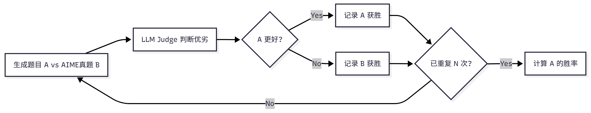

# 第十二章 智能体性能评估

## 12.1 智能体评估基础

### 12.1.1 为什么需要智能体评估

核心问题：如何客观地评估它的性能？当我们优化提示词或更换 LLM 模型后，如何知道是否真的有改进？在部署到生产环境前，如何保证智能体的可靠性？这些问题都需要通过系统化的评估来解决。

### 12.1.2 主流评估基准概览

#### (1) 工具调用能力评估

工具调用是智能体的核心能力之一。智能体需要理解用户意图，选择合适的工具，并正确构造函数调用。相关的评估基准包括：
+ BFCL: 使用 AST 匹配算法评估，数据集规模适中，社区活跃。
+ ToolBench: 清华大学推出，包含 16000+真实 API 调用场景，覆盖真实世界的复杂工具使用场景。
+ API-Bank: 包含 53 个常用 API 工具，专注于评估智能体对 API 文档的理解和调用能力。

#### (2) 通用能力评估

评估智能体在真实世界任务中的综合表现，包括多步推理、知识运用、多模态理解等能力: 

+ GAIA: 包含 466 个真实世界问题，分为 Level 1/2/3 三个难度级别，评估多步推理、工具使用、文件处理、网页浏览等能力，使用准精确匹配（Quasi Exact Match）算法，任务真实且综合性强。
+ AgentBench: 包含 8 个不同领域的任务，全面评估智能体的通用能力。
+ WebArena: 评估智能体在真实网页环境中的任务完成能力和网页交互能力。

#### (3) 多智能体协作评估

评估多个智能体协同工作的能力:

+ ChatEval: 评估多智能体对话系统的质量。
+ SOTOPIA: 评估智能体在社交场景中的互动能力.
+ 自定义协作场景: 根据具体应用场景设计的评估任务.

#### (4) 常用评估指标

不同基准使用不同的评估指标，常见的包括:

+ 准确性指标: Accuracy（准确率）、Exact Match（精确匹配）、F1 Score（F1 分数），用于衡量答案的正确性。
+ 效率指标: Response Time（响应时间）、Token Usage（Token 使用量），用于衡量执行效率。
+ 鲁棒性指标: Error Rate（错误率）、Failure Recovery（故障恢复），用于衡量容错能力。
+ 协作指标: Communication Efficiency（通信效率）、Task Completion（任务完成度），用于衡量协作效果。

### 12.1.3 HelloAgents评估体系设计


### 12.1.4 本章学习目标

```bash
hello_agents/
├── evaluation/                         # 评估模块
│   └── benchmarks/                     # 评估基准实现
│       ├── bfcl/                       # BFCL评估实现
│       │   ├── dataset.py              # BFCL数据集加载器
│       │   ├── evaluator.py            # BFCL评估器（AST匹配）
│       │   ├── metrics.py              # BFCL专用指标
│       │   └── ast_matcher.py          # AST匹配算法
│       ├── gaia/                       # GAIA评估实现
│       │   ├── dataset.py              # GAIA数据集加载器
│       │   ├── evaluator.py            # GAIA评估器（准精确匹配）
│       │   ├── metrics.py              # GAIA专用指标
│       │   └── quasi_exact_match.py    # 准精确匹配算法
│       └── data_generation/            # 数据生成评估实现
│           ├── dataset.py              # AIME数据集加载器
│           ├── llm_judge.py            # LLM Judge评估器
│           └── win_rate.py             # Win Rate评估器
└── tools/builtin/                      # 内置工具模块
    ├── bfcl_evaluation_tool.py         # BFCL评估工具
    ├── gaia_evaluation_tool.py         # GAIA评估工具
    ├── llm_judge_tool.py               # LLM Judge工具
    └── win_rate_tool.py                # Win Rate工具
```

环境准备:
```bash
# 安装HelloAgents框架（第12章版本）
pip install "hello-agents[evaluation]==0.2.7"

# 设置环境变量
export HF_TOKEN="your_huggingface_token"     # 用于GAIA数据集(后续也会有设置步骤)

# 由于 `bfcl-eval` 官方包强制要求 numpy<=2.0.0, 和HelloAgents 主依赖版本存在冲突,因此需要单独安装
pip install "numpy==1.26.4" bfcl-eval
```

## 12.2 BFCL: 工具调用能力评估

### 12.2.1 BFCL基准介绍

智能体需要完成:
+ 理解任务需求：从用户的自然语言描述中提取关键信息
+ 选择合适工具：从可用工具集中选择最适合的工具
+ 构造函数调用：正确填写函数名和参数
+ 处理复杂场景：支持多函数调用、并行调用等高级场景

BFCL 基准包含四个评估类别，难度递增。
从最基础的单函数调用（Simple）开始，逐步增加到需要调用多个函数的场景（Multiple），再到需要并行调用多个函数的复杂场景（Parallel），最后是需要判断是否需要调用函数的场景（Irrelevance）。
这四个类别覆盖了智能体在实际应用中可能遇到的各种工具调用场景


BFCL 的评估流程遵循标准的基准测试流程：首先加载数据集并选择评估类别，然后运行智能体获取预测结果，接着将预测结果解析为抽象语法树（AST），最后通过 AST 匹配算法判断预测是否正确。整个流程会遍历所有测试样本，最终计算出准确率等评估指标并生成评估报告。


#### (1) BFCL数据集结构

```json
{
  "id": "simple_001",
  "question": "What's the weather like in Beijing today?",
  "function": [
    {
      "name": "get_weather",
      "description": "Get the current weather for a location",
      "parameters": {
        "type": "object",
        "properties": {
          "location": {
            "type": "string",
            "description": "The city name"
          }
        },
        "required": ["location"]
      }
    }
  ],
  "ground_truth": [
    {
      "name": "get_weather",
      "arguments": {
        "location": "Beijing"
      }
    }
  ]
}
```

#### (2) AST匹配说明
AST 匹配的核心思想是：**将函数调用解析为语法树，然后比较树的结构和节点值。**

给定预测的函数调用P和标准答案G，AST匹配函数定义为:
$$
\text{AST\_Match}(P, G) =
\begin{cases}
1 & \text{if } \text{AST}(P) \equiv \text{AST}(G) \\
0 & \text{otherwise}
\end{cases}
$$

其中AST(x)表示将函数调用解析为抽象语法树，$\equiv$表示语法树等价。

两个语法树等价需要满足三个核心条件:
+ 函数名必须完全一致（精确匹配），参数键值对集合相等（忽略顺序）以及每个参数的值在语义上等价（例如 2+3 等价于 5）
+ 函数名匹配要求字符串精确匹配，例如 get_weather 和 get_temperature 被视为不同的函数
+ 参数匹配则使用 AST 进行智能比较，允许参数顺序不同（f(a=1, b=2) 等价于 f(b=2, a=1)），允许等价表达式（f(x=2+3) 等价于 f(x=5)），也允许不同的字符串表示（f(s="hello") 等价于 f(s='hello')）。对于多函数调用的场景，匹配算法要求调用相同数量的函数，每个函数调用都必须匹配，但调用顺序可以不同（使用集合匹配）。

#### (3) BFCL评估指标

BFCL 使用以下指标评估智能体性能：

**1.准确率**:
$$
\text{Accuracy} = \frac{1}{N} \sum_{i=1}^{N} \text{AST\_Match}(P_i, G_i)
$$

其中：
- $N$ 是总样本数
- $P_i$ 是第 $i$ 个样本的预测结果
- $G_i$ 是第 $i$ 个样本的标准答案
- $\text{AST\_Match}(P_i, G_i) \in \{0, 1\}$ 是 AST 匹配函数

**2.AST匹配率**:
与准确率相同，强调使用 AST 匹配算法：
$$
\text{AST Match Rate} = \text{Accuracy}
$$

**3.分类准确率**
对于每个类别 $c \in \{\text{simple}, \text{multiple}, \text{parallel}, \dots\}$，计算该类别的准确率：
$$
\text{Accuracy}_c = \frac{1}{|D_c|} \sum_{i \in D_c} \text{AST\_Match}(P_i, G_i)
$$
其中 $D_c$ 是类别 $c$ 的样本集合，$|D_c|$ 是该类别的样本数。


**4.加权准确率**
考虑不同类别的难度权重：
$$
\text{Weighted Accuracy} = \sum_c w_c \cdot \text{Accuracy}_c
$$
其中 $w_c$ 是类别 $c$ 的权重，满足 $\sum_c w_c = 1$。


**5.错误率**
未能正确调用函数的样本比例：
$$
\text{Error Rate} = 1 - \text{Accuracy} = \frac{1}{N} \sum_{i=1}^{N} (1 - \text{AST\_Match}(P_i, G_i))
$$

---

### 指标解释:
- $\text{Accuracy} = 1.0$: 所有样本都完全正确
- $\text{Accuracy} = 0.8$: 80%的样本正确，20%的样本错误
- $\text{Accuracy} = 0.0$: 所有样本都错误

### 12.2.3 在 HelloAgents 中实现 BFCL 评估

#### 方式一: 使用BFCLEvaluationTool(推荐)

```python

from hello_agents import SimpleAgent, HelloAgentsLLM
from hello_agents.tools import BFCLEvaluationTool

# 1. 创建要评估的智能体
llm = HelloAgentsLLM()
agent = SimpleAgent(name="TestAgent", llm=llm)

# 2. 创建BFCL评估工具
bfcl_tool = BFCLEvaluationTool()

# 3. 运行评估（自动完成所有步骤）
results = bfcl_tool.run(
    agent=agent,
    category="simple_python",  # 评估类别
    max_samples=5              # 评估样本数（0表示全部）
)

# 4. 查看结果
print(f"准确率: {results['overall_accuracy']:.2%}")
print(f"正确数: {results['correct_samples']}/{results['total_samples']}")
```

#### 方式二: 使用一键评估脚本

```bash
# 运行评估脚本
python chapter12/04_run_bfcl_evaluation.py --category simple_python --samples 10

# 指定模型名称（用于BFCL官方评估）
python examples/04_run_bfcl_evaluation.py \
    --category simple_python \
    --samples 10 \
    --model-name "Qwen/Qwen3-8B"
```

#### 方式三: 直接使用Dataset和Evaluator
适合需要自定义评估流程的场景：

```python
from hello_agents import SimpleAgent, HelloAgentsLLM
from hello_agents.evaluation import BFCLDataset, BFCLEvaluator

# 1. 创建智能体
llm = HelloAgentsLLM()
agent = SimpleAgent(name="TestAgent", llm=llm)

# 2. 加载数据集
dataset = BFCLDataset(
    bfcl_data_dir="./temp_gorilla/berkeley-function-call-leaderboard/bfcl_eval/data",
    category="simple_python"
)
data = dataset.load()

# 3. 创建评估器
evaluator = BFCLEvaluator(
    dataset=dataset,
    category="simple_python",
    evaluation_mode="ast"  # 使用AST匹配模式
)

# 4. 运行评估
results = evaluator.evaluate(agent, max_samples=10)

# 5. 查看结果
print(f"准确率: {results['overall_accuracy']:.2%}")
print(f"正确数: {results['correct_samples']}/{results['total_samples']}")

# 6. 导出BFCL格式结果（可选）
evaluator.export_to_bfcl_format(
    results,
    output_path="./evaluation_results/my_results.json"
)
```

### 12.2.4 BFCL官方评估工具集成

BFCLEvaluationTool已经自动集成了 BFCL 官方评估工具


使用`BFCLEvaluationTool`时，官方评估会自动运行（默认启用）：

```python
from hello_agents import SimpleAgent, HelloAgentsLLM
from hello_agents.tools import BFCLEvaluationTool

# 创建智能体
llm = HelloAgentsLLM()
agent = SimpleAgent(name="TestAgent", llm=llm)

# 创建评估工具
bfcl_tool = BFCLEvaluationTool()

# 运行评估（自动运行官方评估）
results = bfcl_tool.run(
    agent=agent,
    category="simple_python",
    max_samples=5,
    # run_official_eval=True  # 默认为True，可以省略
    model_name="Qwen/Qwen3-8B"  # 可选，指定模型名称
)
```

如果你想手动控制评估流程，可以禁用自动官方评估：
```python
# 禁用官方评估
results = bfcl_tool.run(
    agent=agent,
    category="simple_python",
    max_samples=5,
    run_official_eval=False  # 禁用官方评估
)

# 然后手动运行官方评估
import subprocess
subprocess.run([
    "bfcl", "evaluate",
    "--model", "Qwen/Qwen3-8B",
    "--test-category", "simple_python",
    "--partial-eval"
])
```

你也可以手动生成报告：
```python
# 运行评估
results = bfcl_tool.run(agent, category="simple_python", max_samples=5)

# 手动生成报告
report = bfcl_tool.generate_report(
    results,
    output_file="./my_reports/custom_report.md"
)

# 打印报告内容
print(report)
```

### 12.2.5 核心组件实现细节

#### (1) BFCLDataset: 数据集加载器

```python
class BFCLDataset:
    """BFCL数据集加载器"""

    def __init__(self, category: str = "simple", local_data_path: Optional[str] = None):
        self.category = category
        self.local_data_path = local_data_path
        self.data = []

    def load(self) -> List[Dict[str, Any]]:
        """加载数据集"""
        # 优先从本地加载
        if self.local_data_path:
            return self._load_from_local()
        # 否则从Hugging Face加载
        return self._load_from_huggingface()
```

#### (2) BFCLEvaluator: 评估执行器
```python
class BFCLEvaluator:
    """BFCL评估器"""

    def evaluate(self, agent: Any, max_samples: Optional[int] = None) -> Dict[str, Any]:
        """执行评估"""
        results = []

        for item in self.dataset[:max_samples]:
            # 1. 构造提示词
            prompt = self._build_prompt(item)

            # 2. 调用智能体
            response = agent.run(prompt)

            # 3. 提取函数调用
            predicted_calls = self._extract_function_calls(response)

            # 4. 与标准答案对比
            is_correct = self._compare_calls(predicted_calls, item["ground_truth"])

            results.append({
                "id": item["id"],
                "prediction": predicted_calls,
                "ground_truth": item["ground_truth"],
                "is_correct": is_correct
            })

        return {"results": results, "total_samples": len(results)}
```

评估器的设计包含三个核心要点：首先是提示词构造，需要将数据集中的问题和函数定义转换为智能体可理解的提示词；其次是函数调用提取，需要从智能体的响应中提取函数调用，并支持多种格式（JSON、代码块等）；最后是 AST 匹配，使用抽象语法树进行函数调用对比，这比简单的字符串匹配更准确。

```python
def _extract_function_calls(self, response: str) -> List[Dict[str, Any]]:
    """从响应中提取函数调用

    支持多种格式：
    1. JSON格式：{"name": "func", "arguments": {...}}
    2. 代码块格式：```python\nfunc(arg1=val1)\n```
    3. 纯文本格式：func(arg1=val1)
    """
    calls = []

    # 尝试JSON解析
    try:
        json_match = re.search(r'\{.*\}', response, re.DOTALL)
        if json_match:
            data = json.loads(json_match.group())
            if isinstance(data, dict) and "name" in data:
                calls.append(data)
            elif isinstance(data, list):
                calls.extend(data)
    except json.JSONDecodeError:
        pass

    # 尝试代码块提取
    code_blocks = re.findall(r'```(?:python)?\n(.*?)\n```', response, re.DOTALL)
    for code in code_blocks:
        # 解析Python函数调用
        parsed_calls = self._parse_python_calls(code)
        calls.extend(parsed_calls)

    return calls
```

#### (3) BFCLMetrics: 指标计算器
BFCLMetrics 负责计算各种评估指标：
```python
class BFCLMetrics:
    """BFCL指标计算器"""

    def compute_metrics(self, results: List[Dict[str, Any]]) -> Dict[str, Any]:
        """计算所有指标"""
        return {
            "accuracy": self._compute_accuracy(results),
            "ast_match_rate": self._compute_ast_match_rate(results),
            "parameter_accuracy": self._compute_parameter_accuracy(results),
            "f1_score": self._compute_f1_score(results),
            "category_statistics": self._compute_category_stats(results)
        }
```

AST匹配的实现:
```python
def _ast_match(self, pred_call: Dict, true_call: Dict) -> bool:
    """使用AST匹配函数调用

    AST匹配的优势：
    1. 忽略参数顺序：func(a=1, b=2) 等价于 func(b=2, a=1)
    2. 识别等价表达式：2+3 等价于 5
    3. 忽略空格和格式差异
    """
    # 1. 函数名必须完全匹配
    if pred_call.get("name") != true_call.get("name"):
        return False

    # 2. 将参数转换为AST节点
    pred_args = self._args_to_ast(pred_call.get("arguments", {}))
    true_args = self._args_to_ast(true_call.get("arguments", {}))

    # 3. 比较AST节点
    return ast.dump(pred_args) == ast.dump(true_args)

def _args_to_ast(self, args: Dict[str, Any]) -> ast.AST:
    """将参数字典转换为AST节点"""
    # 构造一个虚拟的函数调用
    code = f"func({', '.join(f'{k}={repr(v)}' for k, v in args.items())})"
    tree = ast.parse(code)
    return tree.body[0].value  # 返回Call节点
```

#### (4) 工具化封装: BFCLEvaluationTool
```python
class BFCLEvaluationTool(Tool):
    """BFCL评估工具"""

    def __init__(self, local_data_path: Optional[str] = None):
        super().__init__(
            name="bfcl_evaluation",
            description="评估智能体的工具调用能力"
        )
        self.dataset = None
        self.evaluator = None
        self.metrics_calculator = BFCLMetrics()

    def run(self, parameters: Dict[str, Any]) -> str:
        """执行评估"""
        # 1. 加载数据集
        self.dataset = BFCLDataset(...)

        # 2. 创建评估器
        self.evaluator = BFCLEvaluator(...)

        # 3. 运行评估
        results = self.evaluator.evaluate(...)

        # 4. 计算指标
        metrics = self.metrics_calculator.compute_metrics(...)

        # 5. 返回JSON结果
        return json.dumps(results, ensure_ascii=False)
```

工具的设计遵循三个核心原则：首先继承 Tool 基类以遵循 HelloAgents 的工具规范，确保与框架的无缝集成；其次进行严格的参数验证，检查必需参数并提供友好的错误提示，提升用户体验；最后对结果进行格式化，返回 JSON 字符串以便于解析和展示。

### 12.2.6 扩展与优化建议

#### (1) 当前实现的局限性
SimpleAgent 使用自定义的工具调用格式[TOOL_CALL:tool_name:parameters]，这种格式需要 LLM 主动学习和使用，在复杂场景下的表现可能不如使用原生函数调用（Function Calling）的智能体

#### (2) 提升BFCL分数的方向

首先是优化智能体的工具调用能力，可以考虑使用支持原生函数调用的 LLM（如 GPT-4、Claude 等），或者改进提示词让 LLM 更好地理解工具调用格式。其次是扩展工具库，BFCL 测试中涉及各种类型的函数，可以根据测试数据集的特点，预先实现常用的工具类型，提高智能体的工具覆盖率。第三是针对不同难度级别设计不同的策略，例如在 multiple 场景下需要智能体能够规划多步骤的工具调用序列，在 parallel 场景下需要识别可以并行执行的工具调用，在 irrelevance 场景下需要判断是否真的需要调用工具。

#### (3) 实践建议

**1.渐进式评估**

```python
# 第一步：快速测试（5个样本）
results_quick = bfcl_tool.run(agent, category="simple_python", max_samples=5)

# 第二步：中等规模测试（50个样本）
if results_quick['overall_accuracy'] > 0.8:
    results_medium = bfcl_tool.run(agent, category="simple_python", max_samples=50)

# 第三步：完整评估（全部样本）
if results_medium['overall_accuracy'] > 0.8:
    results_full = bfcl_tool.run(agent, category="simple_python", max_samples=0)
```

**2.多类别评估**
```python
categories = ["simple_python", "multiple", "parallel", "irrelevance"]

for category in categories:
    print(f"\n评估类别: {category}")
    results = bfcl_tool.run(agent, category=category, max_samples=10)
    print(f"准确率: {results['overall_accuracy']:.2%}")
```

**3.对比评估**
```python
# 配置1：默认提示词
agent1 = SimpleAgent(name="Agent-Default", llm=llm)
results1 = bfcl_tool.run(agent1, category="simple_python", max_samples=10)

# 配置2：优化提示词
agent2 = SimpleAgent(name="Agent-Optimized", llm=llm)
# ... 设置优化的系统提示词 ...
results2 = bfcl_tool.run(agent2, category="simple_python", max_samples=10)

# 对比结果
print(f"默认配置准确率: {results1['overall_accuracy']:.2%}")
print(f"优化配置准确率: {results2['overall_accuracy']:.2%}")
```

## 12.3 GAIA: 通用AI助手能力评估

### 12.3.1 GAIA基准介绍

GAIA的设计理念：
+ 多步推理：将复杂的问题分解为多个子问题
+ 知识运用：利用内置知识和外部知识库
+ 多模态理解：处理文本、图片、文件、等多种输入
+ 网页浏览：从互联网获取最新信息
+ 文件操作：读取和处理各种格式的文件

#### (1) GAIA数据集结构


关键字段说明：

+ Question: 问题描述
+ Level: 难度级别（1-3）
+ Final answer: 标准答案（可能是数字、文本或文件）
+ file_name/file_path: 附件文件（如果有）
+ Annotator Metadata: 标注者提供的元数据（推理步骤、所需工具等）

#### (2) 准精确匹配介绍

GAIA 使用准精确匹配（Quasi Exact Match）评估算法，这是 GAIA 官方定义的评估标准。该算法的核心思想是：**先对答案进行归一化处理，然后进行精确匹配。**

给定预测答案$A_{pred}$和标准答案$A_{true}$，准精确匹配函数定义为：

$$
\text{Quasi\_Exact\_Match}(A_{\text{pred}}, A_{\text{true}}) = \begin{cases} 1 & \text{if } \mathcal{N}(A_{\text{pred}}) = \mathcal{N}(A_{\text{true}}) \\ 0 & \text{otherwise} \end{cases}
$$

其中 $\mathcal{N}(\cdot)$ 是归一化函数，根据答案类型应用不同的规则。

对于数字类型，需要移除逗号分隔符（1,000 → 1000）和单位符号（$100 → 100，50% → 50），例如"$1,234.56"归一化为"1234.56"。对于字符串类型，需要转换为小写（"Apple" → "apple"）、移除冠词（"the apple" → "apple"）、移除多余空格（"hello  world" → "hello world"）和移除末尾标点（"hello." → "hello"），例如"The United States"归一化为"united states"。对于列表类型，需要按逗号分隔元素，对每个元素应用字符串归一化，按字母顺序排序后重新连接，例如"Paris, London, Berlin"归一化为"berlin,london,paris"。

#### (3) GAIA评估指标

GAIA 使用以下指标评估智能体性能：

**1.精确匹配率**
$$
\text{Exact Match Rate} = \frac{1}{N} \sum_{i=1}^{N} \text{Quasi\_Exact\_Match}(A_{\text{pred},i}, A_{\text{true},i})
$$

其中：

- $N$ 是总样本数
- $A_{\text{pred},i}$ 是第 $i$ 个样本的预测答案
- $A_{\text{true},i}$ 是第 $i$ 个样本的标准答案
- $\text{Quasi\_Exact\_Match}(\cdot, \cdot) \in \{0, 1\}$ 是准精确匹配函数

**2.分级准确率(Level-wise Accuracy)**
对于每个难度级别 $\ell \in \{1, 2, 3\}$，计算该级别的准确率：

$$
\text{Accuracy}_{\ell} = \frac{1}{|D_\ell|} \sum_{i \in D_\ell} \text{Quasi\_Exact\_Match}(A_{\text{pred},i}, A_{\text{true},i})
$$

其中 $D_\ell$ 是难度级别 $\ell$ 的样本集合，$|D_\ell|$ 是该级别的样本数。

**3.难度递进下降率**
衡量智能体在难度增加时的性能衰减：

$$
\text{Drop Rate}_{\ell \to \ell+1} = \frac{\text{Accuracy}_{\ell} - \text{Accuracy}_{\ell+1}}{\text{Accuracy}_{\ell}}
$$

- $\text{Drop Rate}_{1 \to 2}$：从 Level 1 到 Level 2 的下降率
- $\text{Drop Rate}_{2 \to 3}$：从 Level 2 到 Level 3 的下降率

**4.平均推理步骤数**
评估智能体完成任务所需的平均步骤数：

$$
\text{Avg Steps} = \frac{1}{N_{\text{correct}}} \sum_{i \in \text{Correct}} \text{steps}_i
$$

其中 $N_{\text{correct}}$ 是正确回答的样本数，$\text{steps}_i$ 是第 $i$ 个样本的推理步骤数。

**指标解释：**

+ Exact Match Rate = 1.0：所有样本都完全正确
+ Exact Match Rate = 0.5：50%的样本正确，50%的样本错误
+ Drop Rate = 0.3：难度增加导致准确率下降 30%
+ Drop Rate = 0.0：难度增加不影响准确率（理想情况）

下降率越大，说明智能体在处理复杂任务时的能力衰减越明显。

#### (4) GAIA官方系统提示词

```python
GAIA_SYSTEM_PROMPT = """You are a general AI assistant. I will ask you a question. Report your thoughts, and finish your answer with the following template: FINAL ANSWER: [YOUR FINAL ANSWER].

YOUR FINAL ANSWER should be a number OR as few words as possible OR a comma separated list of numbers and/or strings.

If you are asked for a number, don't use comma to write your number neither use units such as $ or percent sign unless specified otherwise.

If you are asked for a string, don't use articles, neither abbreviations (e.g. for cities), and write the digits in plain text unless specified otherwise.

If you are asked for a comma separated list, apply the above rules depending of whether the element to be put in the list is a number or a string."""
```

### 12.3.3 在HelloAgents中实现GAIA评估

**方式1: 使用GAIAEvaluationTool一键评估**
```python
from hello_agents import SimpleAgent, HelloAgentsLLM
from hello_agents.tools import GAIAEvaluationTool
from hello_agents.tools import RLTrainingTool

# GAIA官方系统提示词（来自论文）
GAIA_SYSTEM_PROMPT = """You are a general AI assistant. I will ask you a question. Report your thoughts, and finish your answer with the following template: FINAL ANSWER: [YOUR FINAL ANSWER].

YOUR FINAL ANSWER should be a number OR as few words as possible OR a comma separated list of numbers and/or strings.

If you are asked for a number, don't use comma to write your number neither use units such as $ or percent sign unless specified otherwise.

If you are asked for a string, don't use articles, neither abbreviations (e.g. for cities), and write the digits in plain text unless specified otherwise.

If you are asked for a comma separated list, apply the above rules depending of whether the element to be put in the list is a number or a string."""

# 1. 创建智能体（使用GAIA官方系统提示词）
llm = HelloAgentsLLM()
agent = SimpleAgent(
    name="TestAgent",
    llm=llm,
    system_prompt=GAIA_SYSTEM_PROMPT  # 关键：使用GAIA官方提示词
)

# 2. 创建GAIA评估工具
gaia_tool = GAIAEvaluationTool()

# 3. 一键运行评估
results = gaia_tool.run(
    agent=agent,
    level=1,  # Level 1: 简单任务
    max_samples=5,  # 评估5个样本
    export_results=True,  # 导出GAIA格式结果
    generate_report=True  # 生成评估报告
)

# 4. 查看结果
print(f"精确匹配率: {results['exact_match_rate']:.2%}")
print(f"部分匹配率: {results['partial_match_rate']:.2%}")
print(f"正确数: {results['exact_matches']}/{results['total_samples']}")
```

**方式2: 使用Dataset+Evaluator(灵活定制)**

```python
from hello_agents.evaluation import GAIADataset, GAIAEvaluator

# 1. 加载数据集
dataset = GAIADataset(level=1)
items = dataset.load()
print(f"加载了 {len(items)} 个样本")

# 2. 创建评估器
evaluator = GAIAEvaluator(dataset=dataset, level=1)

# 3. 运行评估
results = evaluator.evaluate(agent, max_samples=5)

# 4. 导出GAIA格式结果
evaluator.export_to_gaia_format(
    results,
    "gaia_results.jsonl",
    include_reasoning=True
)
```

### 12.3.4 核心组件实现细节

#### (1) GAIADataset：支持多模态的数据加载器

GAIA 数据集的特殊之处在于它包含多模态数据（文本、文件、图片等）：

```python
class GAIADataset:
    """GAIA数据集加载器

    支持从HuggingFace加载GAIA数据集（受限数据集）
    """

    def __init__(
        self,
        level: Optional[int] = None,
        split: str = "validation",
        local_data_dir: Optional[str] = None
    ):
        self.level = level
        self.split = split
        self.local_data_dir = local_data_dir or "./data/gaia"
        self.data = []

    def load(self) -> List[Dict[str, Any]]:
        """加载数据集"""
        items = self._load_from_huggingface()
        # 按级别过滤
        if self.level:
            items = [item for item in items if item.get("level") == self.level]
        self.data = items
        return items

    def _load_from_huggingface(self) -> List[Dict[str, Any]]:
        from huggingface_hub import snapshot_download
        import json
        
        repo_id = "gaia-benchmark/GAIA"
        local_dir = snapshot_download(
            repo_id=repo_id,
            repo_type="dataset",
            local_dir=self.local_data_dir
        )

        data_file = Path(local_dir) / "2023" / self.split / "metadata.jsonl"
        items = []
        with open(data_file, "r", encoding="utf-8") as f:
            for line in f:
                item = json.loads(line)
                items.append(self._standardize_item(item))

        return items
```

#### (2) GAIAEvaluator: 实现GAIA官方评估算法
GAIA 的评估使用准精确匹配（Quasi Exact Match）算法，需要特殊的答案归一化和匹配逻辑：

```python
import re


class GAIAEvaluator:
    """GAIA评估器

    实现GAIA官方的准精确匹配（Quasi Exact Match）评估算法
    """

    def evaluate(self, agent: Any, max_samples: Optional[int] = None) -> Dict[str, Any]:
        """执行评估"""

        dataset_items = self.dataset.load()
        if max_samples:
            dataset_items = dataset_items[:max_samples]

        results = []
        for i, item in enumerate(dataset_items, 1):
            # 1.构造提示词
            prompt = self._build_prompt(item["question"], item)

            # 2.调用智能体
            response = agent.run(prompt)

            # 3.提取答案(GAIA格式：FINAL ANSWER：[答案])
            predicted_answer = self._extract_answer(response)

            # 4.归一化答案(GAIA官方规则)
            normalized_pred = self._normalize_answer(predicted_answer)
            normalized_true = self._normalize_answer(item["final_answer"])

            # 5.准精确匹配
            exact_match = (normalized_pred == normalized_true)

            results.append({
                "task_id": item["task_id"],
                "predicted": predicted_answer,
                "expected": item["final_answer"],
                "exact_match": exact_match,
                "level": item.get("level", 0)
            })

        return self._format_results(results)

    # GAIA 使用特定的归一化规则来处理不同类型的答案：
    def _normalize_answer(self, answer: str) -> str:
        """标准化答案字符串(GAIA官方标准化规则)
        规则：
        1.数字：移除逗号分隔符和单位符号
        2.字符串：移除冠词、转小写、移除多余空格
        3.列表：逗号分隔，按字母顺序排序
        """
        if not answer:
            return ""

        answer = answer.strip()
        # 检查是否是逗号分隔的列表
        if "," in answer:
            parts = [self._normalize_single_answer(p.strip()) for p in answer.split(",")]
            parts.sort()  # GAIA要求按字母顺序排序
            return ",".join(parts)
        else:
            return self._normalize_single_answer(answer)

    def _normalize_single_answer(self, answer: str) -> str:
        """标准化单个答案(不包含逗号的答案)"""
        answer = answer.strip().lower()

        # 移除常见的冠词
        articles = ["the", "a", "an"]
        words = answer.split()
        if words and words[0] in articles:
            words = words[1:]
            answer = " ".join(words)
        # 移除货币符号和百分号
        answer = answer.replace("$", "").replace("%", "").replace("€", "").replace('£', '')

        # 移除数字中的逗号分隔符
        answer = re.sub(r'(\d),(\d)', r'\1\2', answer)
        
        # 移除多余空格
        answer = " ".join(answer.split())
        
        # 移除末尾的标点符号
        answer = answer.rstrip('.,;:!?')
        return answer
    
    def _extract_answer(self, response: str) -> str:
        """从响应中提取答案（GAIA格式）

        GAIA要求答案格式为：FINAL ANSWER: [答案]
        """
        # 首先尝试提取GAIA官方格式的答案
        final_answer_pattern = r'FINAL ANSWER:\s*(.+?)(?:\n|$)'
        match = re.search(final_answer_pattern, response, re.IGNORECASE | re.MULTILINE)
        
        if match:
            answer = match.group(1).strip()
            
            return answer
        
        # 备用方案：查找其他答案标记
        answer_patterns = [
            r'答案[：:]\s*(.+)',
            r'最终答案[：:]\s*(.+)',
            r'Final answer[：:]\s*(.+)',
            r'Answer[：:]\s*(.+)',
        ]
    
        for pattern in answer_patterns:
            match = re.search(pattern, response, re.IGNORECASE)
            if match:
                return match.group(1).strip()
    
        # 如果没有找到标记，返回最后一个非空行
        lines = response.strip().split('\n')
        for line in reversed(lines):
            line = line.strip()
            if line and not line.startswith('#'):
                return line
    
        return response.strip()
    
    def export_to_gaia_format(
        self,
        results: Dict[str, Any],
        output_path: Union[str, Path],
        include_reasoning: bool = True
    ) -> None:
        """导出为GAIA官方格式（JSONL）
    
        GAIA要求的格式：
        {"task_id": "xxx", "model_answer": "答案", "reasoning_trace": "推理过程"}
        """
        output_path = Path(output_path)
        output_path.parent.mkdir(parents=True, exist_ok=True)
    
        with open(output_path, 'w', encoding='utf-8') as f:
            for result in results.get("detailed_results", []):
                entry = {
                    "task_id": result["task_id"],
                    "model_answer": result["predicted"]
                }
    
                if include_reasoning:
                    entry["reasoning_trace"] = result.get("response", result["predicted"])
    
                f.write(json.dumps(entry, ensure_ascii=False) + '\n')
```

#### (3) GAIAEvaluationTool：一键评估工具
```python
class GAIAEvaluationTool(Tool):
    """GAIA评估工具

    提供一键评估功能：
    1. 运行HelloAgents评估
    2. 导出GAIA格式结果
    3. 生成评估报告
    4. 生成提交说明
    """

    def run(
        self,
        agent: Any,
        level: Optional[int] = None,
        max_samples: Optional[int] = None,
        local_data_dir: Optional[str] = None,
        export_results: bool = True,
        generate_report: bool = True
    ) -> Dict[str, Any]:
        """执行GAIA一键评估"""
        # 步骤1: 运行HelloAgents评估
        results = self._run_evaluation(agent, level, max_samples, local_data_dir)

        # 步骤2: 导出GAIA格式结果
        if export_results:
            self._export_results(results)

        # 步骤3: 生成评估报告
        if generate_report:
            self.generate_report(results)

        return results

    # GAIAEvaluationTool 会自动生成评估报告：
    def generate_report(
        self,
        results: Dict[str, Any],
        output_file: Optional[Union[str, Path]] = None
    ) -> str:
        """生成评估报告"""
        report = f"""# GAIA评估报告
    
**生成时间**: {datetime.now().strftime("%Y-%m-%d %H:%M:%S")}
        
## 📊 评估概览

- **智能体**: {results.get("agent_name", "Unknown")}
- **难度级别**: {results.get("level_filter") or '全部'}
- **总样本数**: {results.get("total_samples", 0)}
- **精确匹配数**: {results.get("exact_matches", 0)}
- **精确匹配率**: {results.get("exact_match_rate", 0):.2%}

## 📈 详细指标

### 分级准确率

{self._format_level_metrics(results.get("level_metrics", {}))}

## 📝 样本详情（前10个）

{self._format_sample_details(results.get("detailed_results", [])[:10])}

## 📊 准确率可视化

{self._format_visualization(results.get("exact_match_rate", 0))}

## 💡 建议

{self._format_suggestions(results.get("exact_match_rate", 0))}
"""
        
        # 保存报告
        if output_file is None:
            output_dir = Path("./evaluation_reports")
            output_dir.mkdir(parents=True, exist_ok=True)
            output_file = output_dir / f"gaia_report_{datetime.now().strftime('%Y%m%d_%H%M%S')}.md"
    
        with open(output_file, 'w', encoding='utf-8') as f:
            f.write(report)
    
        return report

```

## 12.4 数据生成质量评估

### 12.4.1 评估方法概述


#### (1) LLM Judge评估


**评估指标**：
+ 平均分：计算所有题目在四个维度上的平均得分，反映生成题目的整体质量水平。
  + $$
    \text{Average Score} = \frac{1}{N} \sum_{i=1}^{N} \frac{\sum_{d=1}^{4} S_{i,d}}{4}
    $$
+ 及格率：统计平均分达到 3.5 分及以上的题目比例，反映生成题目的基本质量保障。
  + $$
    \text{Pass Rate} = \frac{|\{i : \text{Score}_i \geq 3.5\}|}{N}
    $$
+ 优秀率：统计平均分达到 4.5 分及以上的题目比例，反映生成题目的高质量占比。
  + $$
    \text{Excellent Rate} = \frac{|\{i : \text{Score}_i \geq 4.5\}|}{N}
    $$

其中：

- $N$ 是评估的题目总数
- $S_{i,d}$ 是第 $i$ 个题目在第 $d$ 个维度的得分（1-5 分）
- $\text{Score}_i$ 是第 $i$ 个题目的平均分（四个维度得分的平均值）

#### (2) Win Rate评估



评估指标：

1. **胜率（Win Rate）**：生成题目被判定为更好的比例，反映生成题目相对于真题的优势。

$$
\text{Win Rate} = \frac{\text{Wins}}{\text{Total Comparisons}}
$$

2. **败率（Loss Rate）**：真题被判定为更好的比例，反映生成题目相对于真题的劣势。

$$
\text{Loss Rate} = \frac{\text{Losses}}{\text{Total Comparisons}}
$$

3. **平局率（Tie Rate）**：两者被判定为质量相当的比例，反映生成题目与真题的相似程度。

$$
\text{Tie Rate} = \frac{\text{Ties}}{\text{Total Comparisons}}
$$

其中，Total Comparisons 是总的对比次数，Wins、Losses 和 Ties 分别是生成题目获胜、失败和平局
的次数。这三个指标满足：$\text{Win Rate} + \text{Loss Rate} + \text{Tie Rate} = 100\%$。

#### (3) 人工验证

### 12.4.2 系统架构
```
data_generation/
├── aime_generator.py              # AIME题目生成器
├── human_verification_ui.py       # 人工验证界面
├── run_complete_evaluation.py     # 完整评估流程
│
├── generated_data/                # 生成的数据
│   ├── aime_generated_XXXXXX.json
│   └── generation_report_XXXXXX.md
│
└── evaluation_results/            # 评估结果
    └── XXXXXX/
        ├── llm_judge/
        ├── win_rate/
        └── comprehensive_report.md
```

系统包含四个核心组件：首先是 AIMEGenerator（题目生成器），使用 HelloAgents 框架生成 AIME 风格题目，支持批量生成和进度保存，并能自动处理 API 速率限制；其次是 LLMJudgeTool（LLM Judge 评估工具），提供 4 维度质量评估，自动生成 JSON 结果和 Markdown 报告；第三是 WinRateTool（Win Rate 评估工具），通过成对对比评估计算胜率、败率和平局率；最后是 HumanVerificationUI（人工验证界面），基于 Gradio Web 界面，支持评分和状态标注。

### 12.4.3 AIME题目生成器实现

```python
class AIMEGenerator:
    """AIME Problem Generator"""

    def __init__(
        self,
        llm: HelloAgentsLLM = None,
        delay_seconds: float = 1.0,
        use_reference_examples: bool = True,
        reference_dataset: str = "TianHongZXY/aime-1983-2025"
    ):
        self.llm = llm or HelloAgentsLLM()
        self.agent = SimpleAgent(
            name="AIME Generator",
            llm=self.llm,
            system_prompt="You are a professional mathematics competition problem designer."
        )
        self.delay_seconds = delay_seconds
        self.use_reference_examples = use_reference_examples

        # Load reference examples from 900+ AIME problems (1983-2025)
        if use_reference_examples:
            dataset = load_dataset(reference_dataset, split="test")
            self.reference_examples = list(dataset)

    def generate_and_save(self, num_problems: int = 30, output_dir: str = "data_generation/generated_data"):
        """Generate and save problems with intelligent delay"""
        # Clean old checkpoints
        for file in os.listdir(output_dir):
            if file.startswith("checkpoint_") and file.endswith(".json"):
                os.remove(os.path.join(output_dir, file))
    
        # Generate with tqdm progress bar
        with tqdm(total=num_problems, desc="Generating AIME problems", unit="problem") as pbar:
            last_call_time = 0
    
            for i in range(num_problems):
                # Ensure minimum delay between API calls
                if last_call_time > 0:
                    elapsed = time.time() - last_call_time
                    if elapsed < self.delay_seconds:
                        wait_time = self.delay_seconds - elapsed
                        time.sleep(wait_time)
    
                # Generate problem (randomly select reference example)
                start_time = time.time()
                problem = self.generate_single()
                last_call_time = time.time()
                generation_time = last_call_time - start_time
    
                # Update progress bar
                pbar.set_postfix({
                    "topic": problem.get('topic', 'N/A'),
                    "answer": problem.get('answer', 'N/A'),
                    "time": f"{generation_time:.1f}s"
                })
                pbar.update(1)
    
        return generated_data_path

    def _parse_response(self, response: str) -> Dict[str, Any]:
        """解析LLM响应（支持LaTeX数学公式）"""
        import re
    
        # 提取JSON部分
        if "```json" in response:
            json_str = response.split("```json")[1].split("```")[0].strip()
        else:
            json_str = response.strip()
    
        try:
            problem_data = json.loads(json_str)
        except json.JSONDecodeError:
            # 修复LaTeX转义问题：将 \frac 转为 \\frac
            # 正则表达式：找到未转义的反斜杠
            fixed_json_str = re.sub(r'(?<!\\)\\(?!["\\/bfnrtu])', r'\\\\', json_str)
            problem_data = json.loads(fixed_json_str)
    
        return problem_data
```

### 12.4.4 LLM Judge 评估工具
```python
class LLMJudgeTool(Tool):
    """LLM Judge评估工具"""

    def run(self, params: Dict[str, Any]) -> str:
        """运行LLM Judge评估"""
        # 1. 加载生成数据
        gen_dataset = AIDataset(dataset_type="generated", data_path=params["generated_data_path"])
        gen_problems = gen_dataset.load()

        # 2. 加载参考数据（AIME 2025）
        ref_dataset = AIDataset(dataset_type="real", year=2025)
        ref_problems = ref_dataset.load()

        # 3. 创建评估器
        evaluator = LLMJudgeEvaluator(llm=self.llm, judge_model=params.get("judge_model", "gpt-4o"))

        # 4. 运行评估
        results = evaluator.evaluate_batch(gen_problems, max_samples=params.get("max_samples"))

        # 5. 保存结果
        evaluator.export_results(results, result_file)

        # 6. 生成报告
        self._generate_report(results, report_file)

        return json.dumps({"status": "success", "metrics": results["metrics"]})


# 评估提示词
EVALUATION_PROMPT = """请评估以下AIME数学题目的质量。

题目：
{problem}

答案：{answer}

解答：
{solution}

请从以下4个维度评分（1-5分）：

1. <strong>正确性 (Correctness)</strong>：数学逻辑是否正确，答案是否准确
2. <strong>清晰度 (Clarity)</strong>：问题表述是否清晰，解答是否易懂
3. <strong>难度匹配 (Difficulty Match)</strong>：难度是否符合AIME标准（中等偏难）
4. <strong>完整性 (Completeness)</strong>：解答步骤是否完整，是否包含必要的推理

请按以下JSON格式输出：
{
    "correctness": 5,
    "clarity": 4,
    "difficulty_match": 4,
    "completeness": 5,
    "comments": "评价理由"
}
"""
```

### 12.4.5 Win Rate评估工具
```python
class WinRateTool(Tool):
    """Win Rate评估工具"""

    def run(self, params: Dict[str, Any]) -> str:
        """运行Win Rate评估"""
        # 1. 加载生成数据
        gen_dataset = AIDataset(dataset_type="generated", data_path=params["generated_data_path"])
        gen_problems = gen_dataset.load()

        # 2. 加载参考数据（AIME 2025）
        ref_dataset = AIDataset(dataset_type="real", year=2025)
        ref_problems = ref_dataset.load()

        # 3. 创建评估器
        evaluator = WinRateEvaluator(llm=self.llm, judge_model=params.get("judge_model", "gpt-4o"))

        # 4. 运行评估
        results = evaluator.evaluate_win_rate(gen_problems, ref_problems, num_comparisons=params.get("num_comparisons"))

        # 5. 保存结果和报告
        evaluator.export_results(results, result_file)
        self._generate_report(results, report_file)

        return json.dumps({"status": "success", "metrics": results["metrics"]})

class AIDataset:
    """AI数据集加载器

    支持两种数据类型：
    1. generated: 生成的数据（JSON格式）
    2. real: AIME真题（从HuggingFace加载）
    """

    def __init__(
        self,
        dataset_type: str = "generated",
        data_path: Optional[str] = None,
        year: Optional[int] = None
    ):
        self.dataset_type = dataset_type
        self.data_path = data_path
        self.year = year  # 仅用于real类型，默认2025

    def load(self) -> List[Dict[str, Any]]:
        """加载数据集"""
        if self.dataset_type == "generated":
            return self._load_generated_data()
        elif self.dataset_type == "real":
            return self._load_real_data()

    def _load_real_data(self) -> List[Dict[str, Any]]:
        """从HuggingFace加载AIME 2025真题"""
        from huggingface_hub import snapshot_download

        # 使用AIME 2025数据集
        repo_id = "math-ai/aime25"

        # 下载数据集
        local_dir = snapshot_download(
            repo_id=repo_id,
            repo_type="dataset"
        )

        # 读取JSONL文件
        data_file = list(Path(local_dir).glob("*.jsonl"))[0]
        data = []
        with open(data_file, 'r', encoding='utf-8') as f:
            for line in f:
                if line.strip():
                    data.append(json.loads(line))

        # 统一数据格式（AIME 2025使用小写字段名）
        problems = []
        for idx, item in enumerate(data):
            problem = {
                "problem_id": item.get("id", f"aime_2025_{idx}"),
                "problem": item.get("problem", ""),
                "answer": item.get("answer", ""),
                "solution": item.get("solution", ""),  # AIME 2025没有solution字段
            }
            problems.append(problem)

        return problems

# 对比提示词
COMPARISON_PROMPT = """请比较以下两个AIME数学题目的质量，判断哪个更好。

【题目A - 生成题目】
问题：{problem_a}
答案：{answer_a}
解答：{solution_a}

【题目B - AIME真题】
问题：{problem_b}
答案：{answer_b}
解答：{solution_b}

请从以下方面比较：
1. 数学逻辑的严谨性
2. 问题表述的清晰度
3. 难度的合理性
4. 解答的完整性

请按以下JSON格式输出：
{
    "winner": "A" 或 "B" 或 "Tie",
    "reason": "判断理由"
}
"""
```

### 12.4.6 人工验证界面
```python
class HumanVerificationUI:
    """人工验证界面"""

    def launch(self, share: bool = False):
        """启动Gradio界面"""
        with gr.Blocks(title="AIME题目人工验证") as demo:
            gr.Markdown("# 🎯 AIME题目人工验证系统")

            with gr.Row():
                with gr.Column(scale=2):
                    # 题目显示区域
                    problem_text = gr.Textbox(label="问题描述", lines=5, interactive=False)
                    answer_text = gr.Textbox(label="答案", interactive=False)
                    solution_text = gr.Textbox(label="解答过程", lines=10, interactive=False)

                with gr.Column(scale=1):
                    # 评分区域
                    correctness_slider = gr.Slider(1, 5, value=3, step=1, label="正确性")
                    clarity_slider = gr.Slider(1, 5, value=3, step=1, label="清晰度")
                    difficulty_slider = gr.Slider(1, 5, value=3, step=1, label="难度匹配")
                    completeness_slider = gr.Slider(1, 5, value=3, step=1, label="完整性")

                    # 状态选择
                    status_radio = gr.Radio(
                        choices=["approved", "rejected", "needs_revision"],
                        value="approved",
                        label="状态"
                    )

                    # 验证按钮
                    verify_btn = gr.Button("✅ 提交验证", variant="primary")

            demo.launch(share=share, server_name="127.0.0.1", server_port=7860)
```

### 12.4.7 完整评估流程
```python
def run_complete_evaluation(
    num_problems: int = 30,
    delay_seconds: float = 3.0
):
    """
    运行完整评估流程

    Args:
        num_problems: 生成题目数量
        delay_seconds: 每次生成之间的延迟（秒），避免API速率限制
    """
    # 步骤1: 生成AIME题目
    generator = AIMEGenerator(delay_seconds=delay_seconds)
    generated_data_path = generator.generate_and_save(
        num_problems=num_problems,
        output_dir="data_generation/generated_data"
    )

    # 步骤2: 评估
    # 创建评估结果目录
    timestamp = datetime.now().strftime("%Y%m%d_%H%M%S")
    evaluation_dir = f"data_generation/evaluation_results/{timestamp}"
    os.makedirs(evaluation_dir, exist_ok=True)
    os.makedirs(os.path.join(evaluation_dir, "llm_judge"), exist_ok=True)
    os.makedirs(os.path.join(evaluation_dir, "win_rate"), exist_ok=True)

    # 创建LLM
    llm = HelloAgentsLLM()

    # 步骤2.1: LLM Judge评估
    llm_judge_result = None
    try:
        llm_judge_tool = LLMJudgeTool(llm=llm)
        llm_judge_result_json = llm_judge_tool.run({
            "generated_data_path": generated_data_path,
            "reference_year": 2025,
            "max_samples": num_problems,
            "output_dir": os.path.join(evaluation_dir, "llm_judge"),
            "judge_model": "gpt-4o"
        })
        llm_judge_result = json.loads(llm_judge_result_json)
    except Exception as e:
        print(f"❌ LLM Judge评估失败: {e}")

    # 步骤2.2: Win Rate评估
    win_rate_result = None
    try:
        win_rate_tool = WinRateTool(llm=llm)
        win_rate_result_json = win_rate_tool.run({
            "generated_data_path": generated_data_path,
            "reference_year": 2025,
            "num_comparisons": min(num_problems, 20),
            "output_dir": os.path.join(evaluation_dir, "win_rate"),
            "judge_model": "gpt-4o"
        })
        win_rate_result = json.loads(win_rate_result_json)
    except Exception as e:
        print(f"❌ Win Rate评估失败: {e}")

    # 步骤3: 生成综合报告
    comprehensive_report_path = None
    if llm_judge_result or win_rate_result:
        comprehensive_report_path = os.path.join(evaluation_dir, "comprehensive_report.md")
        report = generate_comprehensive_report(
            generated_data_path,
            llm_judge_result,
            win_rate_result
        )
        with open(comprehensive_report_path, 'w', encoding='utf-8') as f:
            f.write(report)

    return {
        "generated_data_path": generated_data_path,
        "llm_judge_result": llm_judge_result,
        "win_rate_result": win_rate_result,
        "comprehensive_report_path": comprehensive_report_path
    }
```


