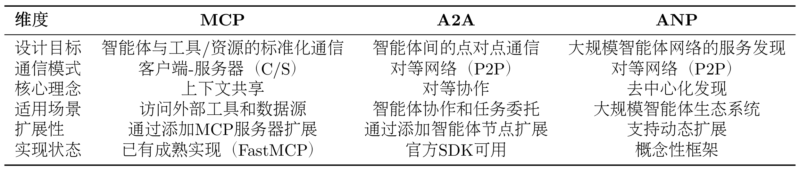

from camel.utils.mcp_client import MCPClient

# 第十章 智能体通信协议

三种通信协议：
+ MCP(Model Context Protocol)：用于智能体与工具的标准化通信
+ A2A(Agent-to-Agent Protocol)：用于智能体间的点对点协作
+ ANP(Agent Network Protocol): 用于构建大规模智能体网络

## 10.1 智能体通信协议基础

### 10.1.1 为何需要智能体通信协议

```python
from hello_agents import ReActAgent, HelloAgentsLLM
from hello_agents.tools import CalculatorTool, SearchTool

llm = HelloAgentsLLM()
agent = ReActAgent(name="AI助手", llm=llm)
agent.add_tool(CalculatorTool())
agent.add_tool(SearchTool())

# 智能体可以独立完成任务
response = agent.run("搜索最新的AI新闻，并计算相关公司的市值总和")
```

上述智能体面临三个根本性的限制。

首先是**工具集成的困境**：每当需要访问新的外部服务（如 GitHub API、数据库、文件系统），我们都必须编写专门的 Tool 类。这不仅工作量大，而且不同开发者编写的工具无法互相兼容。

其次是**能力扩展的瓶颈**：智能体的能力被限制在预先定义的工具集内，无法动态发现和使用新的服务。

最后是**协作的缺失**：当任务复杂到需要多个专业智能体协作时（如研究员+撰写员+编辑），我们只能通过手动编排来协调它们的工作。

案例：
```python
# 传统方式：手动集成每个服务
class GitHubTool(BaseTool):
    """需要手写GitHub API适配器"""
    def run(self, repo_url):
        # 大量的API调用代码...
        pass

class DatabaseTool(BaseTool):
    """需要手写数据库适配器"""
    def run(self, query):
        # 数据库连接和查询代码...
        pass

class WeatherTool(BaseTool):
    """需要手写天气API适配器"""
    def run(self, location):
        # 天气API调用代码...
        pass

# 每个新服务都需要重复这个过程
agent.add_tool(GitHubTool())
agent.add_tool(DatabaseTool())
agent.add_tool(WeatherTool())
```

这种方式存在明显的问题：代码重复（每个工具都要处理 HTTP 请求、错误处理、认证等），难以维护（API 变更需要修改所有相关工具），
无法复用（其他开发者的工具无法直接使用），扩展性差（添加新服务需要大量编码工作）。

通信协议的核心价值正是解决这些问题。它提供了一套标准化的接口规范，让智能体能够以统一的方式访问各种外部服务，而无需为每个服务编写专门的适配器。
这就像互联网的 TCP/IP 协议，它让不同的设备能够相互通信，而不需要为每种设备编写专门的通信代码。

通过通信协议简化为：
```python
from hello_agents.tools import MCPTool

# 连接到MCP服务器，自动获得所有工具
mcp_tool = MCPTool()  # 内置服务器提供基础工具

# 或者连接到专业的MCP服务器
github_mcp = MCPTool(server_command=["npx", "-y", "@modelcontextprotocol/server-github"])
database_mcp = MCPTool(server_command=["python", "database_mcp_server.py"])

# 智能体自动获得所有能力，无需手写适配器
agent.add_tool(mcp_tool)
agent.add_tool(github_mcp)
agent.add_tool(database_mcp)
```

### 10.1.2 三种协议设计理念比较

#### (1) MCP: 智能体与工具的桥梁

MCP 的设计哲学是"上下文共享"。它不仅仅是一个 RPC（远程过程调用）协议，更重要的是它允许智能体和工具之间共享丰富的上下文信息。
当智能体访问一个代码仓库时，MCP 服务器不仅能提供文件内容，还能提供代码结构、依赖关系、提交历史等上下文信息，让智能体能够做出更智能的决策。


#### (2) A2A: 智能体间的对话

A2A 的设计哲学是"对等通信"。每个智能体既是服务提供者，也是服务消费者。


#### (3) ANP: 智能体网络的基础设施

ANP 的设计哲学是"去中心化服务发现"。ANP 提供了服务注册、发现和路由机制，让智能体能够动态地发现网络中的其他服务，而不需要预先配置所有的连接关系。


#### (4) 如何选择合适的协议
+ 如果你的智能体需要访问外部服务（文件、数据库、API），选择MCP
+ 如果你需要多个智能体相互协作完成任务，选择A2A
+ 如果你要构建大规模的智能体生态系统，考虑ANP



### 10.1.3 HelloAgents通信协议架构设计

HelloAgents 的通信协议架构采用三层设计，从底层到上层分别是：协议实现层、工具封装层和智能体集成层。


#### (1) 协议实现层

包含了三种协议的具体实现。
MCP 基于 FastMCP 库实现，提供客户端和服务器功能；A2A 基于 Google 官方的 a2a-sdk 实现；ANP 是我们自研的轻量级实现，提供服务发现和网络管理功能，当然目前也有官方的实现

#### (2) 工具封装层

将协议实现封装成统一的 Tool 接口。MCPTool、A2ATool 和 ANPTool 都继承自 BaseTool，提供一致的run()方法。这种设计让智能体能够以相同的方式使用不同的协议。

#### (3) 智能体集成层

智能体与协议的集成点。所有的智能体（ReActAgent、SimpleAgent 等）都通过 Tool System 来使用协议工具，无需关心底层的协议细节。

### 10.1.4 学习目标与体验

``` 
hello_agents/
├── protocols/                          # 通信协议模块
│   ├── mcp/                            # MCP协议实现（Model Context Protocol）
│   │   ├── client.py                   # MCP客户端（支持5种传输方式）
│   │   ├── server.py                   # MCP服务器（FastMCP封装）
│   │   └── utils.py                    # 工具函数（create_context/parse_context）
│   ├── a2a/                            # A2A协议实现（Agent-to-Agent Protocol）
│   │   └── implementation.py           # A2A服务器/客户端（基于a2a-sdk，可选依赖）
│   └── anp/                            # ANP协议实现（Agent Network Protocol）
│       └── implementation.py           # ANP服务发现/注册（概念性实现）
└── tools/builtin/                      # 内置工具模块
    └── protocol_tools.py               # 协议工具包装器（MCPTool/A2ATool/ANPTool）
```

```python
from hello_agents.tools import MCPTool, A2ATool, ANPTool

# 1.MCP: 访问工具
mcp_tool = MCPTool()
result = mcp_tool.run({
    "action": "call_tool",
    "tool_name": "add",
    "arguments": {"a": 10, "b": 20}
})
print(f"MCP计算结果: {result}")

# 2.ANP：服务发现
anp_tool = ANPTool()
anp_tool.run({
    "action": "register_service",
    "service_id": "calculator",
    "service_type": "math",
    "endpoint": "http://localhost:8080"
})
services = anp_tool.run({"action": "discover_services"})
print(f"发现的服务: {services}")

# 3.A2A: 智能体通信
a2a_tool = A2ATool("http://localhost:5000")
print("A2A工具创建成功")
```

## 10.2 MCP协议实战

### 10.2.1 MCP协议概念介绍

#### (1) MCP: 智能体的USB-C

不同 LLM 平台的 function call 实现差异巨大，切换模型时需要重写大量代码。
MCP 统一了智能体与外部工具的交互方式。无论你使用 Claude、GPT 还是其他模型，只要它们支持 MCP 协议，就能无缝访问相同的工具和资源。

#### (2) MCP架构

MCP协议采用了Host、Client、Serves三层架构设计


**三层架构的职责**：
+ Host(宿主层)：Host是用户直接交互的界面，管理整个对话流程
+ Client(客户端层)：当Claude模型决定需要访问文件系统时，Host中内置的MCP Client被激活。Client负责与适当的MCP Server建立连接，发送请求并接收响应。
+ Server(服务器)：文件系统MCP Server被调用，执行实际的文件扫描操作，访问桌面目录，并返回找到的文档列表。

完整的交互流程：
用户问题 → Claude Desktop(Host) → Claude 模型分析 → 需要文件信息 → MCP Client 连接 → 文件系统 MCP Server → 执行操作 → 返回结果 → Claude 生成回答 → 显示在 Claude Desktop 上

优势在于关注点分离：Host 专注于用户体验，Client 专注于协议通信，Server 专注于具体功能实现。
开发者只需专注于开发对应的 MCP Server，无需关心 Host 和 Client 的实现细节。

#### (3) MCP的核心能力


Tools 是主动的（执行操作），Resources 是被动的（提供数据），Prompts 是指导性的（提供模板）

#### (4) MCP的工作流程


**关键问题**：
Claude（或其他 LLM）是如何决定使用哪些工具的？

完整的工具选择流程：
+ 工具发现阶段：获取所有可用的工具信息
+ 上下文构建：将工具信息添加到系统提示词中
+ 模型推理：LLM根据问题和工具描述选择使用的工具
+ 工具执行：执行所选工具，获取结果
+ 结果整合：工具执行结果被返回给LLM，LLM结合结果生成最终回答

#### (5) MCP与Function Calling的差异


**方式1:使用Function Calling**
```python
# 步骤1: 为每个LLM提供商定义函数
# OpenAI格式
openai_tools = [
    {
        "type": "function",
        "function": {
            "name": "search_github",
            "description": "搜索GitHub仓库",
            "parameters": {
                "type": "object",
                "properties": {
                    "query": {"type": "string", "description": "搜索关键词"}
                },
                "required": ["query"]
            }
        }
    }
]

# Claude格式
claude_tools = [
    {
        "name": "search_github",
        "description": "搜索GitHub仓库",
        "input_schema": {  # 不是parameters
            "type": "object",
            "properties": {
                "query": {"type": "string", "description": "搜索关键词"}
            },
            "required": ["query"]
        }
    }
]

# 步骤2:自己实现工具函数
def search_github(query):
    import requests
    response = requests.get(
        "https://api.github.com/search/repositories",
        params={"q": query}
    )
    return response.json()

# 步骤3: 处理不同模型的响应格式
# OpenAI的响应
if response.choices[0].message.tool_calls:
    tool_call = response.choices[0].message.tool_calls[0]
    result = search_github(**json.loads(tool_call.function.arguments))

# Claude的响应
if response.content[0].type == "tool_use":
    tool_use = response.content[0]
    result = search_github(**tool_use.input)
```

**方法2: 使用MCP**

```python
from hello_agents.protocols import MCPClient

# 步骤1：连接到社区提供的MCP服务器（无需自己实现）
github_client = MCPClient([
    "npx", "-y", "@modelcontextprotocol/server-github"
])

fs_client = MCPClient([
    "npx", "-y", "@modelcontextprotocol/server-filesystem", "."
])

# 步骤2：统一的调用方式（与模型无关）
async with github_client:
    # 自动发现工具
    tools = await github_client.list_tools()

    # 调用工具（标准化接口）
    result = await github_client.call_tool(
        "search_repositories",
        {"query": "AI agents"}
    )

# 步骤3：任何支持MCP的模型都能使用
# OpenAI、Claude、Llama等都使用相同的MCP客户端
```

### 10.2.2 使用MCP客户端

#### (1) 连接到MCP服务器

```python
import asyncio
from hello_agents.protocols import MCPClient

async def connect_to_server():
    # 方式1：连接到社区提供的文件系统服务器
    # npx会自动下载并运行@modelcontextprotocol/server-filesystem包
    client = MCPClient([
        "npx", "-y",
        "@modelcontextprotocol/server-filesystem",
        "."  # 指定根目录
    ])

    # 使用async with确保连接正确关闭
    async with client:
        tools = await client.list_tools()
        print(f"可用工具: {[t['name'] for t in tools]}")

    # 方式2：连接到自定义的Python MCP服务器
    client = MCPClient(["python", "my_mcp_server.py"])
    async with client:
        # 使用client...
        pass

# 运行异步函数
asyncio.run(connect_to_server())
```

#### (2) 发现可用工具
```python
async def discover_tools():
    client = MCPClient(["npx", "-y", "@modelcontextprotocol/server-filesystem", "."])

    async with client:
        # 获取所有可用工具
        tools = await client.list_tools()
        
        print(f"服务器提供了 {len(tools)} 个工具")
        for tool in tools:
            print(f"\n工具名称: {tool['name']}")
            print(f"描述: {tool.get('description', '无描述')}")
            
            # 打印参数信息
            if "inputSchema" in tool:
                schema = tool["inputSchema"]
                if "properties" in schema:
                    print("参数：")
                    for param_name, param_info in schema["properties"].items():
                        param_type = param_info.get("type", "any")
                        param_desc = param_info.get("description", "")
                        print(f"- {param_name} ({param_type}: {param_desc})")

asyncio.run(discover_tools())
```

#### (3) 调用工具
```python

async def use_tools():
    client = MCPClient(["npx", "-y", "@modelcontextprotocol/server-filesystem", "."])

    async with client:
        # 读取文件
        result = await client.call_tool("read_file", {"path": "my_README.md"})
        print(f"文件内容：\n{result}")

        # 列出目录
        result = await client.call_tool("list_directory", {"path": "."})
        print(f"当前目录文件：{result}")
        
        # 写入文件
        result = await client.call_tool("write_file", {
            "path": "output.txt",
            "content": "Hello from MCP!"
        })
        print(f"写入结果: {result}")

asyncio.run(use_tools())

async def safe_tool_call():
    client = MCPClient(["npx", "-y", "@modelcontextprotocol/server-filesystem", "."])
    async with client:
        try:
            # 尝试读取可能不存在的文件
            result = await client.call_tool("read_file", {"path": "nonexistent.txt"})
            print(result)
        except Exception as e:
            print(f"工具调用失败:{e}")

            # 可以选择重试，使用默认值或向用户报告错误

asyncio.run(safe_tool_call())
```

#### (4) 访问资源

```python
# 列出可用资源
resources = client.list_resources()
print(f"可用资源：{[r['uri'] for r in resources]}")

# 读取资源
resource_content = client.read_resource("file:///path/to/resource")
print(f"资源内容：{resource_content}")
```

#### (5) 使用提示模板

MCP 服务器可以提供预定义的提示模板（Prompts）:

```python
# 列出可用提示
prompts = client.list_prompts()
print(f"可用提示：{[p['name'] for p in prompts]}")

# 获取提示内容
prompt = client.get_prompt("code_review", {"language": "python"})
print(f"提示内容：{prompt}")
```

#### (6) 完整示例: 使用GitHub MCP服务

```python
"""
GitHub MCP 服务示例

注意：需要设置环境变量
    Windows: $env:GITHUB_PERSONAL_ACCESS_TOKEN="your_token_here"
    Linux/macOS: export GITHUB_PERSONAL_ACCESS_TOKEN="your_token_here"
"""

from hello_agents.tools import MCPTool

# 创建 GitHub MCP 工具
github_tool = MCPTool(
    server_command=["npx", "-y", "@modelcontextprotocol/server-github"]
)

# 1. 列出可用工具
print("📋 可用工具：")
result = github_tool.run({"action": "list_tools"})
print(result)

# 2. 搜索仓库
print("\n🔍 搜索仓库：")
result = github_tool.run({
    "action": "call_tool",
    "tool_name": "search_repositories",
    "arguments": {
        "query": "AI agents language:python",
        "page": 1,
        "perPage": 3
    }
})
print(result)
```

### 10.2.3 MCP传输方式详解

#### (1) 传输方式概览


#### (2) 传输方式使用示例
```python
from hello_agents.tools import MCPTool

# 1. Memory Transport - 内存传输（用于测试）
# 不指定任何参数，使用内置演示服务器
mcp_tool = MCPTool()

# 2. Stdio Transport - 标准输入输出传输（本地开发）
# 使用命令列表启动本地服务器
mcp_tool = MCPTool(server_command=["python", "examples/mcp_example_server.py"])

# 3. Stdio Transport with Args - 带参数的命令传输
# 可以传递额外参数
mcp_tool = MCPTool(server_command=["python", "examples/mcp_example_server.py", "--debug"])

# 4. Stdio Transport - 社区服务器（npx方式）
# 使用npx启动社区MCP服务器
mcp_tool = MCPTool(server_command=["npx", "-y", "@modelcontextprotocol/server-filesystem", "."])

# 5. HTTP/SSE/StreamableHTTP Transport
# 注意：MCPTool主要用于Stdio和Memory传输
# 对于HTTP/SSE等远程传输，建议直接使用MCPClient
```

#### (3) Memory Transport - 内存传输

适用场景：单元测试、快速原型开发

```python
from hello_agents.tools import MCPTool

# 使用内置演示服务器（Memory传输）
mcp_tool = MCPTool()

# 列出可用工具
result = mcp_tool.run({"action": "list_tools"})
print(result)

# 调用工具
result = mcp_tool.run({
    "action": "call_tool",
    "tool_name": "add",
    "arguments": {"a": 10, "b": 20}
})
print(result)
```

#### (4) Stdio Transport - 标准输入输出传输

适用场景：本地开发、调试、Python 脚本服务器
```python
from hello_agents.tools import MCPTool

# 方式1：使用自定义Python服务器
mcp_tool = MCPTool(server_command=["python", "my_mcp_server.py"])

# 方式2：使用社区服务器（文件系统）
mcp_tool = MCPTool(server_command=["npx", "-y", "@modelcontextprotocol/server-filesystem", "."])

# 列出工具
result = mcp_tool.run({"action": "list_tools"})
print(result)

# 调用工具
result = mcp_tool.run({
    "action": "call_tool",
    "tool_name": "read_file",
    "arguments": {"path": "README.md"}
})
print(result)
```

#### (5) HTTP Transport - HTTP 传输

适用场景：生产环境、远程服务、微服务架构
```python
# 注意：MCPTool 主要用于 Stdio 和 Memory 传输
# 对于 HTTP/SSE 等远程传输，建议使用底层的 MCPClient

import asyncio
from hello_agents.protocols import MCPClient

async def test_http_transport():
    # 连接到远程 HTTP MCP 服务器
    client = MCPClient("http://api.example.com/mcp")

    async with client:
        # 获取服务器信息
        tools = await client.list_tools()
        print(f"远程服务器工具: {len(tools)} 个")

        # 调用远程工具
        result = await client.call_tool("process_data", {
            "data": "Hello, World!",
            "operation": "uppercase"
        })
        print(f"远程处理结果: {result}")

# 注意：需要实际的 HTTP MCP 服务器
# asyncio.run(test_http_transport())
```

#### (6) SSE Transport - Server-Sent Events 传输

适用场景：实时通信、流式处理、长连接

```python
# 注意：MCPTool 主要用于 Stdio 和 Memory 传输
# 对于 SSE 传输，建议使用底层的 MCPClient

import asyncio
from hello_agents.protocols import MCPClient

async def test_sse_transport():
    # 连接到 SSE MCP 服务器
    client = MCPClient(
        "http://localhost:8080/sse",
        transport_type="sse"
    )

    async with client:
        # SSE 特别适合流式处理
        result = await client.call_tool("stream_process", {
            "input": "大量数据处理请求",
            "stream": True
        })
        print(f"流式处理结果: {result}")

# 注意：需要支持 SSE 的 MCP 服务器
# asyncio.run(test_sse_transport())
```

#### (7) StreamableHTTP Transport - 流式 HTTP 传输
适用场景：需要双向流式通信的 HTTP 场景

```python
# 注意：MCPTool 主要用于 Stdio 和 Memory 传输
# 对于 StreamableHTTP 传输，建议使用底层的 MCPClient

import asyncio
from hello_agents.protocols import MCPClient

async def test_streamable_http_transport():
    # 连接到 StreamableHTTP MCP 服务器
    client = MCPClient(
        "http://localhost:8080/mcp",
        transport_type="streamable_http"
    )

    async with client:
        # 支持双向流式通信
        tools = await client.list_tools()
        print(f"StreamableHTTP 服务器工具: {len(tools)} 个")

# 注意：需要支持 StreamableHTTP 的 MCP 服务器
# asyncio.run(test_streamable_http_transport())
```

### 10.2.4 在智能体中使用MCP工具
#### (1) MCP工具的自动展开开机制

自动展开。当你添加一个 MCP 工具到 Agent 时，它会自动将 MCP 服务器提供的所有工具展开为独立的工具，让 Agent 可以像调用普通工具一样调用它们。

**方式1: 使用内置演示服务器**

```python
from hello_agents import SimpleAgent, HelloAgentsLLM
from hello_agents.tools import MCPTool

agent = SimpleAgent(name="助手", llm=HelloAgentsLLM())

# 无需任何配置，自动使用内置演示服务器
mcp_tool = MCPTool(name="calculator")
agent.add_tool(mcp_tool)
# ✅ MCP工具 'calculator' 已展开为 6 个独立工具

# 智能体可以直接使用展开后的工具
response = agent.run("计算 25 乘以 16")
print(response)  # 输出：25 乘以 16 的结果是 400
```

**自动展开后的工具**：

+ calculator_add - 加法计算器
+ calculator_subtract - 减法计算器
+ calculator_multiply - 乘法计算器
+ calculator_divide - 除法计算器
+ calculator_greet - 友好问候
+ calculator_get_system_info - 获取系统信息

Agent 调用时只需提供参数，例如：[TOOL_CALL:calculator_multiply:a=25,b=16]，系统会自动处理类型转换和 MCP 调用。

**方式2: 连接外部MCP服务器**

```python
from hello_agents import SimpleAgent, HelloAgentsLLM
from hello_agents.tools import MCPTool

agent = SimpleAgent(name="文件助手", llm=HelloAgentsLLM())

# 示例1: 连接到社区提供的文件系统服务器
fs_tool = MCPTool(
    name="filesystem",  # 指定唯一名称
    description="访问本地文件系统",
    server_command=["npx", "-y", "@modelcontextprotocol/server-filesystem", "."]
)
agent.add_tool(fs_tool)

# 示例2: 连接到自定义的Python MCP服务器
# 关于如何编写自定义MCP服务器，参考10.5章节
custom_tool = MCPTool(
    name="custom_server",  # 使用不同的名称
    description="自定义业务逻辑服务器",
    server_command=["python", "my_mcp_server.py"]
)

agent.add_tool(custom_tool)

# Agent现在可以自动使用这些工具
response = agent.run("请读取my_README.md文件，并总结其中的主要内容")
print(response)
```

#### (2) MCP工具自动展开的工作原理
```python
# 用户代码
fs_tool = MCPTool(name="fs", server_command=[...])
agent.add_tool(fs_tool)

# 内部发生的事情：
# 1. MCPTool连接到服务器，发现14个工具
# 2. 为每个工具创建包装器：
#    - fs_read_text_file (参数: path, tail, head)
#    - fs_write_file (参数: path, content)
#    - ...
# 3. 注册到Agent的工具注册表

# Agent调用
response = agent.run("读取README.md")

# Agent内部：
# 1. 识别需要调用 fs_read_text_file
# 2. 生成参数：path=README.md
# 3. 包装器转换为MCP格式：
#    {"action": "call_tool", "tool_name": "read_text_file", "arguments": {"path": "README.md"}}
# 4. 调用MCP服务器
# 5. 返回文件内容

# Agent调用计算器
agent.run("计算 25 乘以 16")

# Agent生成：a=25,b=16 (字符串)
# 系统自动转换为：{"a": 25.0, "b": 16.0} (数字)
# MCP服务器接收到正确的数字类型
```

#### (3) 实战案例：智能文档助手
```python
"""
多Agent协作的智能文档助手

使用两个SimpleAgent分工协作：
- Agent1：GitHub搜索专家
- Agent2：文档生成专家
"""
from hello_agents import SimpleAgent, HelloAgentsLLM
from hello_agents.tools import MCPTool
from dotenv import load_dotenv

# 加载.env文件中的环境变量
load_dotenv(dotenv_path="../HelloAgents/.env")

print("="*70)
print("多Agent协作的智能文档助手")
print("="*70)

# ============================================================
# Agent 1: GitHub搜索专家
# ============================================================
print("\n【步骤1】创建GitHub搜索专家...")

github_searcher = SimpleAgent(
    name="GitHub搜索专家",
    llm=HelloAgentsLLM(),
    system_prompt="""你是一个GitHub搜索专家。
你的任务是搜索GitHub仓库并返回结果。
请返回清晰、结构化的搜索结果，包括：
- 仓库名称
- 简短描述

保持简洁，不要添加额外的解释。"""
)

# 添加GitHub工具
github_tool = MCPTool(
    name="gh",
    server_command=["npx", "-y", "@modelcontextprotocol/server-github"]
)
github_searcher.add_tool(github_tool)

# ============================================================
# Agent 2: 文档生成专家
# ============================================================
print("\n【步骤2】创建文档生成专家...")
document_writer = SimpleAgent(
    name="文档生成专家",
    llm=HelloAgentsLLM(),
    system_prompt="""你是一个文档生成专家。
你的任务是根据提供的信息生成结构化的Markdown报告。

报告应该包括：
- 标题
- 简介
- 主要内容（分点列出，包括项目名称、描述等）
- 总结

请直接输出完整的Markdown格式报告内容，不要使用工具保存。"""
)

# 添加文件系统工具

fs_tool = MCPTool(
    name="fs",
    server_command=["npx", "-y", "@modelcontextprotocol/server-filesystem", "."]
)
document_writer.add_tool(fs_tool)

# ============================================================
# 执行任务
# ============================================================
print("\n" + "="*70)
print("开始执行任务...")
print("="*70)

try:
    # 步骤1: GitHub搜索
    print("\n 【步骤3】Agent1 搜索GitHub...")
    search_task = "搜索关于 'AI Agent' 的GitHub仓库，返回前5个最相关的结果"

    search_results = github_searcher.run(search_task)

    print("\n搜索结果:")
    print("-" * 70)
    print(search_results)
    print("-" * 70)

    # 步骤2: 生成报告
    print("\n 【步骤4】Agent2 生成报告...")
    report_task = f"""
根据以下GitHub搜索结果，生成一份Markdown格式的研究报告：

{search_results}

报告要求：
1. 标题：# AI Agent框架研究报告
2. 简介：说明这是关于AI Agent的GitHub项目调研
3. 主要发现：列出找到的项目及其特点（包括名称、描述等）
4. 总结：总结这些项目的共同特点

请直接输出完整的Markdown格式报告。
"""

    report_content = document_writer.run(report_task)

    print("\n报告内容:")
    print("=" * 70)
    print(report_content)
    print("=" * 70)

    # 步骤3：保存报告
    print("\n【步骤5】保存报告到文件...")
    import os
    try:
        with open("report.md", "w", encoding="utf-8") as f:
            f.write(report_content)
        print("✅ 报告已保存到 report.md")

        # 验证文件
        file_size = os.path.getsize("report.md")
        print(f"✅ 文件大小: {file_size} 字节")
    except Exception as e:
        print(f"❌ 保存失败: {e}")

except Exception as e:
    print(f"\n错误：{e}")
    import traceback
    traceback.print_exc()
```

### 10.2.5 MCP社区生态

MCP社区的三个资源库：

**Awesome MCP servers**(https://github.com/punkpeye/awesome-mcp-servers)
+ 社区维护的 MCP 服务器精选列表 
+ 包含各种第三方服务器 
+ 按功能分类，易于查找

**MCP Servers Website**(https://mcpservers.org/)
+ 官方 MCP 服务器目录网站
+ 提供搜索和筛选功能
+ 包含使用说明和示例

**Official MCP Servers**(https://github.com/modelcontextprotocol/servers)

+ Anthropic 官方维护的服务器
+ 质量最高、文档最完善
+ 包含常用服务的实现


案例TODO：

**1.自动化网页测试(Playwright)**
```python
# Agent可以自动：
# - 打开浏览器访问网站
# - 填写表单并提交
# - 截图验证结果
# - 生成测试报告
playwright_tool = MCPTool(
    name="playwright",
    server_command=["npx", "-y", "@playwright/mcp"]
)
```

**2.智能笔记助手（Obsidian + Perplexity）**
```python
# Agent可以：
# - 搜索最新技术资讯（Perplexity）
# - 整理成结构化笔记
# - 保存到Obsidian知识库
# - 自动建立笔记间的链接
```

**3.项目管理自动化(Jira+GitHub)**
```python
# Agent可以：
# - 从GitHub Issue创建Jira任务
# - 同步代码提交到Jira
# - 自动更新Sprint进度
# - 生成项目报告
```

**4.内容创作工作流(YouTube + Notion + Spotify)
```python
# Agent可以：
# - 获取YouTube视频字幕
# - 生成内容摘要
# - 保存到Notion数据库
# - 播放背景音乐（Spotify）
```

## 10.3 A2A协议实战

是一种支持智能体之间直接通信与协作的协议。

### 10.3.1 协议设计动机
MCP 协议解决了智能体与工具的交互，而 A2A 协议则解决智能体之间的协作问题。

传统的中央协调器（星型拓扑）方案存在三个主要问题：
+ **单点故障**：协调器失效导致系统整体瘫痪。
+ **性能瓶颈**：所有通信都经过中心节点，限制了并发。
+ **扩展困难**：增加或修改智能体需要改动中心逻辑。

A2A 协议采用点对点（P2P）架构（网状拓拓），允许智能体直接通信，从根本上解决了上述问题。它的核心是任务（Task）和工件（Artifact）这两个抽象概念，这是它与 MCP 最大的区别


为实现对协作过程的管理，A2A 为任务定义了标准化的生命周期，包括创建、协商、代理、执行中、完成、失败等状态


A2A 请求生命周期是一个序列，详细说明了请求遵循的四个主要步骤：代理发现、身份验证、发送消息 API 和发送消息流 API


### 10.3.2 使用A2A协议实战

#### (1) 创建简单的A2A智能体
```python
from hello_agents.protocols.a2a.implementation import A2AServer, A2A_AVAILABLE

def create_calculator_agent():
    """创建一个计算器智能体"""
    if not A2A_AVAILABLE:
        print("A2A SDK 未安装，请运行：pip install a2a-sdk")
        return None

    print("创建计算器智能体")

    # 创建A2A服务器
    calculator = A2AServer(
        name="calculator-agent",
        description="专业的数学计算智能体",
        version="1.0.0",
        capabilities={
            "math": ["addition", "subtraction", "multiplication", "division"],
            "advanced": ["power", "sqrt", "factorial"]
        }
    )

    # 添加基础计算技能
    @calculator.skill("add")
    def add_numbers(query: str) -> str:
        """加法计算"""
        try:
            # 简单解析 "计算 5+3 " 格式
            parts = query.replace("计算", "").replace("加", "+").replace("加上", "+")
            if "+" in parts:
                numbers = [float(x.strip()) for x in parts.split("+")]
                result = sum(numbers)
                return f"计算结果: {' + '.join(map(str, numbers))} = {result}"

            else:
                return "请使用格式：计算5 + 3"
        except Exception as e:
            return f"计算错误：{e}"

    @calculator.skill("multiply")
    def multiply_numbers(query: str) -> str:
        """乘法计算"""
        try:
            parts = query.replace("计算", "").replace("乘以", "*").replace("x", "*")
            if "*" in parts:
                numbers = [float(x.strip()) for x in parts.split("*")]
                result = 1
                for num in numbers:
                    result *= num
                return f"计算结果: {' x '.join(map(str, numbers))} = {result}"
            else:
                return "请使用格式：计算 5 * 3"
        except Exception as e:
            return f"计算错误：{e}"

    @calculator.skill("info")
    def get_info(query: str) -> str:
        """获取智能体信息"""
        return f"我是 {calculator.name}, 可以进行基础数学计算。支持的技能：{list(calculator.skills.keys())}"
    
    print(f"计算器智能体创建成功，支持技能: {list(calculator.skills.keys())}")
    return calculator

# 创建智能体
calc_agent = create_calculator_agent()
if calc_agent:
    # 测试技能
    print("测试智能体技能:")
    test_queries = [
        "获取信息",
        "计算 10 + 5",
        "计算 6 * 7"
    ]
    
    for query in test_queries:
        if "信息" in query:
            result = calc_agent.skills["info"](query)
        elif "+" in query:
            result = calc_agent.skills["add"](query)
        elif "*" in query:
            result = calc_agent.skills["multiply"](query)
        else:
            result = "未知查询类型"

        print(f"查询： {query}")
        print(f"回复: {result}")
```

#### (2) 自定义A2A智能体
```python
from hello_agents.protocols.a2a.implementation import A2AServer, A2A_AVAILABLE

def create_custom_agent():
    """创建自定义智能体"""
    if not A2A_AVAILABLE:
        print("请先安装 A2A SDK：pip install a2a-sdk")
        return None
    
    # 创建智能体
    agent = A2AServer(
        name="my-custom-agent",
        description="我的自定义智能体",
        capabilities={"custom": ["skill1", "skill2"]}
    )
    
    # 添加技能
    @agent.skill("greet")
    def greet_user(name: str) -> str:
        """问候用户"""
        return f"你好，{name}! 我是自定义智能体。"
    
    @agent.skill("calculate")
    def simple_calculate(expression: str) -> str:
        """简单计算"""
        try:
            # 安全的计算(仅支持基本运算)
            allowed_chars = set("0123456789+-*/(). ")
            if all(c in allowed_chars for c in expression):
                result = eval(expression)
                return f"计算结果: {expression} = {result}"
            else:
                return "错误: 只支持基本数学运算"
        except Exception as e:
            return f"计算错误: {e}"
    return agent

# 创建并测试自定义智能体
custom_agent = create_custom_agent()
if custom_agent:
    # 测试技能
    print("测试问候技能:")
    result1 = custom_agent.skills["greet"]("张三")
    print(result1)
    
    print("\n测试计算技能:")
    result2 = custom_agent.skills["calculate"]("10 + 5 * 2")
    print(result2)
```

### 10.3.3 使用HelloAgents A2A工具

#### (1) 创建A2A Agent服务端
```python
from hello_agents.protocols import A2AServer
import threading
import time

# 创建研究员Agent服务
researcher = A2AServer(
    name="researcher",
    description="负责搜索和分析资料的Agent",
    version="1.0.0"
)

# 定义技能
@researcher.skill("research")
def handle_research(text: str) -> str:
    """处理研究请求"""
    import re
    match = re.search(f"research\s+(.+)", text, re.IGNORECASE)
    topic = match.group(1).strip() if match else text
    
    # 实际的研究逻辑(这里简化)
    result = {
        "topic": topic,
        "findings": f"关于{topic}的研究结果...",
        "sources": ["来源1", "来源2", "来源3"]
    }
    return str(result)

# 在后台启动服务
def start_server():
    researcher.run(host="localhost", port=5000)

if __name__ == "__main__":
    server_thread = threading.Thread(target=start_server, daemon=True)
    server_thread.start()

    print("研究员Agent服务已启动在http://localhost:5000")

    # 保持程序运行
    try:
        while True:
            time.sleep(1)
    except KeyboardInterrupt:
        print("\n服务已停止")
```

#### (2) 创建A2A Agent客户端
```python
from hello_agents.protocols import A2AClient

# 创建客户端连接到研究员Agent
client = A2AClient("http://localhost:5000")

# 发送研究请求
response = client.execute_skill("research", "research AI在医疗领域的应用")
print(f"收到响应：{response.get('result')}")

# 输出：
# 收到响应：{'topic': 'AI在医疗领域的应用', 'findings': '关于AI在医疗领域的应用的研究结果...', 'sources': ['来源1', '来源2', '来源3']}
```

#### (3) 创建Agent网络
```python
from hello_agents.protocols import A2AServer, A2AClient
import threading
import time


# 1.创建多个Agent服务
researcher = A2AServer(
    name="researcher",
    description="研究员"
)

@researcher.skill("research")
def do_research(text: str) -> str:
    import re
    match = re.search(f"research\s+(.+)", text, re.IGNORECASE)
    topic = match.group(1).strip() if match else text
    return str({"topic": topic, "findings": f"{topic}的研究结果"})

writer = A2AServer(
    name="writer",
    description="撰写员"
)

@writer.skill("write")
def write_article(text: str) -> str:
    import re
    match = re.search(r"write\s+(.+)", text, re.IGNORECASE)
    content = match.group(1).strip() if match else text
    
    # 尝试解析研究员数据
    try:
        data = eval(content)
        topic = data.get("topic", "未知主题")
        findings = data.get("findings", "无研究结果")
    except:
        topic = "未知主题"
        findings = content
        
    return f"# {topic}\n\n基于研究: {findings}\n\n文章内容..."

editor = A2AServer(
    name="editor",
    description="编辑"
)

@editor.skill("edit")
def edit_article(text: str) -> str:
    import re
    match = re.search(r"edit\s+(.+)", text, re.IGNORECASE)
    article = math.group(1).strip() if match else text
    
    result = {
        "article": article + "\n\n[已编辑优化]",
        "feedback": "文章质量良好",
        "approved": True
    }
    
    return str(result)

# 2.启动所有服务
threading.Thread(target=lambda: researcher.run(port=5000), daemon=True).start()
threading.Thread(target=lambda: writer.run(port=5001), daemon=True).start()
threading.Thread(target=lambda: editor.run(port=5002), daemon=True).start()
time.sleep(2)  # 等待服务启动

# 3.创建客户端连接到各个Agent
researcher_client = A2AClient("http://localhost:5000")
writer_client = A2AClient("http://localhost:5001")
editor_client = A2AClient("http://localhost:5002")

# 4.协作流程
def create_content(topic):
    # 步骤1: 研究
    research = researcher_client.execute_skill("research", f"research {topic}")
    research_data = research.get("result", "")
    
    # 步骤2: 撰写
    article = writer_client.execute_skill("write", f"write {research_data}")
    article_content = article.get("result", "")
    
    # 步骤3: 编辑
    final = editor_client.execute_skill("edit", f"edit {article_content}")
    return final.get("result", "")

# 使用
result = create_content("AI在医疗领域的应用")
print(f"\n最终结果:\n{result}")
```

### 10.3.4在智能体中使用A2A工具
#### (1) 使用A2ATool包装器

```python
from hello_agents import SimpleAgent, HelloAgentsLLM
from hello_agents.tools import A2ATool
from dotenv import load_dotenv


load_dotenv()
llm = HelloAgentsLLM()

# 假设已经有一个研究员Agent服务运行在http://localhost:5000

# 创建协调者Agent
coordinator = SimpleAgent(name="协调者", llm=llm)

# 添加A2A工具，连接到研究员Agent
researcher_tool = A2ATool(
    name="researcher",
    description="研究员Agent，可以搜索和分析资料",
    agent_url="http://localhost:5000"
)
coordinator.add_tool(researcher_tool)

# 协调者可以调用研究员Agent
response = coordinator.run("请让研究员帮我研究AI在教育领域的应用")
print(response)
```

#### (2) 实战案例：智能客服系统
完整的智能客服系统，包含三个Agent：
+ 接待员：分析客户问题类型
+ 技术专家：回答技术问题
+ 销售顾问：回答销售问题

```python
from hello_agents import SimpleAgent, HelloAgentsLLM
from hello_agents.tools import A2ATool
from hello_agents.protocols import A2AServer
import threading
import time
from dotenv import load_dotenv


load_dotenv()
llm = HelloAgentsLLM()

# 1.创建技术专家Agent服务
tech_expert = A2AServer(
    name="tech_expert",
    description="技术专家，回答技术问题"
)

@tech_expert.skill("answer")
def answer_tech_question(text: str) -> str:
    import re
    match = re.search(r"answer\s+(.+)", text, re.IGNORECASE)
    question = match.group(1).strip() if match else text
    # 实际应用中，这里会调用LLM或知识库
    return f"技术回答：关于 '{question}', 我建议您查看我们的技术文档..."

# 2.创建销售顾问Agent服务
sales_advisor = A2AServer(
    name="sales_advisor",
    description="销售顾问，回答销售问题"
)

@sales_advisor.skill("answer")
def answer_sales_question(text: str) -> str:
    import re
    match = re.search(r"answer\s+(.+)", text, re.IGNORECASE)
    question = match.group(1) if match else text
    return f"销售回答: 关于 '{question}', 我们有特别优惠..."


# 3.启动服务
threading.Thread(target=lambda: tech_expert.run(port=6000), daemon=True).start()
threading.Thread(target=lambda: sales_advisor.run(port=6001), daemon=True).start()
time.sleep(2)


# 4.创建接待员Agent(使用HelloAgents的SimpleAgent)
receptionist = SimpleAgent(
    name="接待员",
    llm=llm,
    system_prompt="""你是客服接待员，负责：
1. 分析客户问题类型（技术问题 or 销售问题）
2. 将问题转发给相应的专家
3. 整理专家的回答并返回给客户

请保持礼貌和专业。"""
)

# 添加销售顾问工具
sales_tool = A2ATool(
    agent_url="http://localhost:6001",
    name="sales_advisor",
    description="销售顾问，回答价格，购买相关问题"
)
receptionist.add_tool(sales_tool)

# 5.处理客户咨询
def handle_customer_query(query):
    print(f"\n客户端: {query}")
    print("=" * 50)
    response = receptionist.run(query)
    print(f"\n客服回复：{response}")
    print("=" * 50)

# 测试不同类型的问题
if __name__ == "__main__":
    handle_customer_query("你们的API如何调用？")
    handle_customer_query("企业版的价格是多少？")
    handle_customer_query("如何集成到我的Python项目中？")
```

#### (3) 高级用法：Agent间协商
```python
from hello_agents.protocols import A2AServer, A2AClient
import threading
import time


# 创建两个需要协商的Agent
agent1 = A2AServer(
    name="agent1",
    description="Agent 1"
)

@agent1.skill("propose")
def handle_proposal(text: str) -> str:
    """处理协商提案"""
    import re
    
    # 解析提案
    match = re.search(r"propose\s+(.+)", text, re.IGNORECASE)
    proposal_str = match.group(1).strip() if match else text
    
    try:
        proposal = eval(proposal_str)
        task = proposal.get("task")
        deadline = proposal.get("deadline")

        # 评估提案
        if deadline >= 7:  # 至少需要7天
            result = {"accepted": True, "message": "接受提案"}
        else:
            result = {
                "accepted": False,
                "message": "时间太紧",
                "counter_proposal": {"deadline": 7}
            }
        return str(result)

    except:
        return str({"accepted": False, "message": "无效的提案格式"})

agent2 = A2AServer(
    name="agent2",
    description="Agent 2"
)

@agent2.skill("negotiate")
def negotiate_task(text: str) -> str:
    """发起协商"""
    import re
    
    # 解析任务和截止日期
    match = re.search(r"negotiate\s+task:(.+?)\s+deadline:(\d+)", text, re.IGNORECASE)
    if match:
        task = match.group(1).strip()
        deadline = int(match.group(2))
        
        # 向agent1发送提案
        proposal = {"task": task, "deadline": deadline}
        return str({"status": "negotiating", "proposal": proposal})
    else:
        return str({"status": "error", "message": "无效的协商请求"})

# 启动服务
threading.Thread(target=lambda: agent1.run(port=7000), daemon=True).start()
threading.Thread(target=lambda: agent2.run(port=7001), daemon=True).start()
```

## 10.4 ANP协议实战
在 MCP 协议解决了工具调用、A2A 协议解决点对点智能体协作之后，ANP 协议则专注于解决大规模、开放网络环境下的智能体管理问题。

### 10.4.1 协议目标

当一个网络中存在大量功能各异的智能体（例如，自然语言处理、图像识别、数据分析等）时，系统会面临一系列挑战：
+ 服务发现：当新任务到达时，如何快速找到能够处理该任务的智能体？
+ 智能路由：如果多个智能体都能处理同一任务，如何选择最合适的一个（如根据负载、成本等）并向其分派任务？
+ 动态扩展：如何让新加入网络的智能体被其他成员发现和调用？


流程步骤：
**1. 服务的发现与匹配**：首先，智能体 A 通过一个公开的发现服务，基于语义或功能描述进行查询，以定位到符合其任务需求的智能体 B。
该发现服务通过预先爬取各智能体对外暴露的标准端点（.well-known/agent-descriptions）来建立索引，从而实现服务需求方与提供方的动态匹配。

**2. 基于 DID 的身份验证**：在交互开始时，智能体 A 使用其私钥对包含自身 DID 的请求进行签名。智能体 B 收到后，通过解析该 DID 获取对应的公钥，
并以此验证签名的真实性与请求的完整性，从而建立起双方的可信通信。

**3. 标准化的服务执行**：身份验证通过后，智能体 B 响应请求，双方依据预定义的标准接口和数据格式进行数据交换或服务调用（如预订、查询等）。
标准化的交互流程是实现跨平台、跨系统互操作性的基础

该机制的核心是利用 DID 构建了一个去中心化的信任根基，并借助标准化的描述协议实现了服务的动态发现。这套方法使得智能体能够在无需中央协调的前提下，安全、高效地在互联网上形成协作网络。

### 10.4.2 使用ANP服务发现

#### (1) 创建服务发现中心
```python
from hello_agents.protocols import ANPDiscovery, register_service

# 创建服务发现中心
discovery = ANPDiscovery()

# 注册Agent服务
register_service(
    discovery=discovery,
    service_id="nlp_agent_1",
    service_name="NLP处理专家A",
    service_type="nlp",
    capabilities=["text_analysis", "sentiment_analysis", "ner"],
    endpoint="http://localhost:8001",
    metadata={"load": 0.3, "price": 0.01, "version": "1.0.0"}
)

register_service(
    discovery=discovery,
    service_id="nlp_agent_2",
    service_name="NLP处理专家B",
    service_type="nlp",
    capabilities=["text_analysis", "translation"],
    endpoint="http://localhost:8002",
    metadata={"load": 0.7, "price": 0.02, "version": "1.1.0"}
)

print("服务注册完成")
```

#### (2) 发现服务

```python
from hello_agents.protocols import discover_service

# 按类型查找
nlp_services = discover_service(discovery, service_type="nlp")
print(f"找到 {len(nlp_services)} 个NLP服务")

# 选择负载最低的服务
best_service = min(nlp_services, key=lambda s: s.metadata.get("load", 1.0))
print(f"最佳服务：{best_service.service_name} (负载: {best_service.metadata['load']})")
```

#### (3) 构建Agent网络
```python
from hello_agents.protocols import ANPNetwork

# 创建网络
network = ANPNetwork(network_id="ai_cluster")

# 添加节点
for service in discovery.list_all_services():
    network.add_note(service.service_id, service.endpoint)
    
# 建立连接(根据能力匹配)
network.connect_notes("nlp_agent_1", "nlp_agent_2")

stats = network.get_network_stats()
print(f"网络构建完成，共{stats['total_nodes']}个节点")
```

### 10.4.3 实战案例
```python
from hello_agents.protocols import ANPDiscovery, register_service
from hello_agents import SimpleAgent, HelloAgentsLLM
from hello_agents.tools.builtin import ANPTool
import random
from dotenv import load_dotenv

load_dotenv()
llm = HelloAgentsLLM()

# 1.创建服务发现中心
discovery = ANPDiscovery()

# 2.注册多个计算节点
for i in range(10):
    register_service(
        discovery=discovery,
        service_id=f"compute_node_{i}",
        service_name=f"计算节点{i}",
        service_type="compute",
        capabilities=["data_processing", "ml_training"],
        endpoint=f"http://node{i}:8000",
        metadata={
            "load": random.uniform(0.1, 0.9),
            "cpu_cores": random.choice([4, 8, 16]),
            "memory_gb": random.choice([16, 32, 64]),
            "gpu": random.choice([True, False])
        }
    )

print(f"✅ 注册了 {len(discovery.list_all_services())} 个计算节点")

# 3.创建任务调度Agent
scheduler = SimpleAgent(
    name="任务调度器",
    llm=llm,
    system_prompt="""你是一个智能任务调度器，负责：
1. 分析任务需求
2. 选择最合适的计算节点
3. 分配任务

选择节点时考虑：负载、CPU核心数、内存、GPU等因素。"""
)

# 添加ANP工具
anp_tool = ANPTool(
    name="service_discovery",
    description="服务发现工具, 可以查找和选择计算节点",
    discovery=discovery
)
scheduler.add_tool(anp_tool)

# 4.智能任务分配
def assign_task(task_description):
    print(f"\n任务: {task_description}")
    print("=" * 50)
    
    # 让Agent智能选择节点
    response = scheduler.run(f"""
    请为以下任务选择最合适的计算节点：
    {task_description}

    要求：
    1. 列出所有可用节点
    2. 分析每个节点的特点
    3. 选择最合适的节点
    4. 说明选择理由
    """  
    )

    print(response)
    print("=" * 50)
    
# 测试不同类型的任务
assign_task("训练一个大型深度学习模型，需要GPU支持")
assign_task("处理大量文本数据，需要高内存")
assign_task("运行轻量级数据分析任务")
```

**负载均衡示例**
```python
from hello_agents.protocols import ANPDiscovery, register_service
import random

# 创建服务发现中心
discovery = ANPDiscovery()

# 注册多个相同类型的服务
for i in range(5):
    register_service(
        discovery=discovery,
        service_id=f"api_server_{i}",
        service_name=f"API服务器{i}",
        service_type="api",
        capabilities=["rest_api"],
        endpoint=f"http://api{i}:8000",
        metadata={"load": random.uniform(0.1, 0.9)}
    )

# 负载均衡函数
def get_best_server():
    """选择负载最低的服务器"""

    servers = discovery.discover_services(service_type="api")
    if not servers:
        return None

    best = min(servers, key=lambda s: s.metadata.get("load", 1.0))
    return best

# 模拟请求分配
for i in range(10):
    server = get_best_server()
    print(f"请求{i+1} -> {server.service_name} (负载: {server.metadata['load']:.2f})")

    # 更新负载
    server.metadata["load"] += 0.1
```

## 10.5 构建自定义MCP服务器

### 10.5.1 创建你的第一个MCP服务器
#### (1) 为什么要构建自定义MCP服务器

主要动机包括以下几点：

**封装业务逻辑**：将企业内部特有的业务流程或复杂操作封装为标准化的 MCP 工具，供智能体统一调用。
**访问私有数据**：创建一个安全可控的接口或代理，用于访问内部数据库、API 或其他无法对公网暴露的私有数据源。
**性能专项优化**：针对高频调用或对响应延迟有严苛要求的应用场景，进行深度优化。
**功能定制扩展**：实现标准 MCP 服务未提供的特定功能，例如集成专有算法模型或连接特定的硬件设备

#### (2) 教学案例：天气查询MCP服务器

```python
#!/usr/bin/env python3
"""天气查询 MCP 服务器"""

import json
import requests
import os
from datetime import datetime
from typing import Dict, Any
from hello_agents.protocols import MCPServer

# 创建MCP 服务器
weather_server = MCPServer(name="weather-sever", description="真实天气查询")

CITY_MAP = {
    "北京": "Beijing", "上海": "Shanghai", "广州": "Guangzhou",
    "深圳": "Shenzhen", "杭州": "Hangzhou", "成都": "Chengdu",
    "重庆": "Chongqing", "武汉": "Wuhan", "西安": "Xi'an",
    "南京": "Nanjing", "天津": "Tianjin", "苏州": "Suzhou"
}

def get_weather_data(city: str) -> Dict[str, Any]:
    """从wttr.in获取天气数据"""
    city_en = CITY_MAP.get(city, city)
    url = f"https://wttr.in/{city_en}?format=j1"
    response = requests.get(url, timeout=10)
    response.raise_for_status()
    data = response.json()
    current = data["current_condition"][0]
    
    return {
        "city": city,
        "temperature": float(current["temp_C"]),
        "feels_like": float(current["FeelsLikeC"]),
        "humidity": int(current["humidity"]),
        "condition": current["weatherDesc"][0]["value"],
        "wind_speed": round(float(current["windspeedKmph"]) / 3.6, 1),
        "visibility": float(current["visibility"]),
        "timestamp": datetime.now().strftime("%Y-%m-%d %H:%M:%S")
    }

# 定义工具函数
def get_weather(city: str) -> str:
    """获取指定城市的当前天气"""
    try:
        weather_data = get_weather_data(city)
        return json.dumps(weather_data, ensure_ascii=False, indent=2)
    except Exception as e:
        return json.dumps({"error": str(e), "city": city}, ensure_ascii=False, indent=2)
    
def list_supported_cities() -> str:
    """列出所有支持的中文城市"""
    result = {"cities": list(CITY_MAP.keys()), "count": len(CITY_MAP)}
    return json.dumps(result, ensure_ascii=False, indent=2)

def get_server_info() -> str:
    """获取服务器信息"""
    info = {
        "name": "Weather MCP Server",
        "version": "1.0.0",
        "tools": ["get_weather", "list_supported_cities", "get_server_info"]
    }
    return json.dumps(info, ensure_ascii=False, indent=2)


# 注册工具到服务器
weather_server.add_tool(get_weather)
weather_server.add_tool(list_supported_cities)
weather_server.add_tool(get_server_info)        

```

#### (3) 测试自定义MCP服务器

```python
#!/usr/bin/env python3
"""测试天气查询 MCP 服务器"""

import asyncio
import json
import sys
import os

sys.path.insert(0, os.path.join(os.path.dirname(__file__), '..', 'HelloAgents'))
from hello_agents.protocols.mcp.client import MCPClient


async def test__weather_server():
    server_script = os.path.join(os.path.dirname(__file__), "14_weather_mcp_server.py")
    client = MCPClient(["python", server_script])

    try:
        async with client:
            # 测试1: 获取服务器信息
            info = json.loads(await client.call_tool("get_server_info"), {})
            print(f"服务器: {info['name']} v{info['version']}")
            
            # 测试2: 列出支持的城市
            cities = json.loads(await client.call_tool("list_supported_cities"), [])
            print(f"支持城市: {', '.join(cities['cities'])}, 数量: {cities['count']}")
            
            # 测试3: 查询天气
            weather = json.loads(await client.call_tool("get_weather", "北京"), {})
            if "error" in weather:
                print(f"\n北京天气: {weather['temperature']}°C, {weather['condition']}")
                
    except Exception as e:
        print(f"错误: {e}")

if __name__ == "__main__":
    asyncio.run(test__weather_server())
```

#### (4) 在Agent中使用自定义MCP服务器
```python
"""在 Agent 中使用天气 MCP 服务器"""

import os
from dotenv import load_dotenv
from hello_agents import SimpleAgent, HelloAgentsLLM
from hello_agents.tools import MCPTool

load_dotenv()

def create_weather_assistant():
    """创建天气助手"""
    llm = HelloAgentsLLM()
    
    assistant = SimpleAgent(
        name="天气助手",
        llm=llm,
        system_prompt="""你是天气助手，可以查询城市天气。
使用 get_weather 工具查询天气，支持中文城市名。
"""
    )

    # 添加天气MCP工具
    server_script = os.path.join(os.path.dirname(__file__), "14_weather_mcp_server.py")
    weather_tool = MCPTool(server_command=["python", server_script])
    assistant.add_tool(weather_tool)
    return assistant

def demo():
    """演示"""

    assistant = create_weather_assistant()
    print("\n查询北京天气:")
    response = assistant.run("北京今天天气怎么样？")
    print(response)

def interactive():
    """交互模式"""

    assistant = create_weather_assistant()

    while True:
        user_input = input("\n你: ").strip()
        if user_input.lower() in ['quit', 'exit']:
            break
        response = assistant.run(user_input)
        print(f"助手: {response}")

if __name__ == "__main__":
    import sys
    if len(sys.argv) > 1 and sys.argv[1] == "demo":
        demo()
    else:
        interactive()
```

### 10.5.2 上传MCP服务器
我们创建了一个真实的天气查询 MCP 服务器。现在，让我们将它发布到 Smithery 平台，让全世界的开发者都能使用我们的服务。

#### (1) 什么是 Smithery？

Smithery 是 MCP 服务器的官方发布平台，类似于 Python 的 PyPI 或 Node.js 的 npm。

通过 Smithery，用户可以：

🔍 发现和搜索 MCP 服务器
📦 一键安装 MCP 服务器
📊 查看服务器的使用统计和评价
🔄 自动获取服务器更新

#### (2) 准备发布 首先，我们需要将项目整理成标准的发布格式，这个文件夹已经在code目录下整理好，可供大家参考：

```
weather-mcp-server/
├── README.md           # 项目说明文档
├── LICENSE            # 开源许可证
├── Dockerfile         # Docker 构建配置（推荐）
├── pyproject.toml     # Python 项目配置（必需）
├── requirements.txt   # Python 依赖
├── smithery.yaml      # Smithery 配置文件（必需）
└── server.py          # MCP 服务器主文件
```

需要注意的是，smithery.yaml是 Smithery 平台的配置文件：
```
name: weather-mcp-server
displayName: Weather MCP Server
description: Real-time weather query MCP server based on HelloAgents framework
version: 1.0.0
author: HelloAgents Team
homepage: https://github.com/yourusername/weather-mcp-server
license: MIT
categories:
  - weather
  - data
tags:
  - weather
  - real-time
  - helloagents
  - wttr
runtime: container
build:
  dockerfile: Dockerfile
  dockerBuildPath: .
startCommand:
  type: http
tools:
  - name: get_weather
    description: Get current weather for a city
  - name: list_supported_cities
    description: List all supported cities
  - name: get_server_info
    description: Get server information
```

pyproject.toml是 Python 项目的标准配置文件，Smithery 要求必须包含此文件，因为后续会打包成一个 server：

```bash
[build-system]
requires = ["setuptools>=61.0", "wheel"]
build-backend = "setuptools.build_meta"

[project]
name = "weather-mcp-server"
version = "1.0.0"
description = "Real-time weather query MCP server based on HelloAgents framework"
readme = "README.md"
license = {text = "MIT"}
authors = [
    {name = "HelloAgents Team", email = "xxx"}
]
requires-python = ">=3.10"
dependencies = [
    "hello-agents>=0.2.1",
    "requests>=2.31.0",
]

[project.urls]
Homepage = "https://github.com/yourusername/weather-mcp-server"
Repository = "https://github.com/yourusername/weather-mcp-server"
"Bug Tracker" = "https://github.com/yourusername/weather-mcp-server/issues"

[tool.setuptools]
py-modules = ["server"]
```

配置说明：

+ [build-system]: 指定构建工具（setuptools）
+ [project]: 项目元数据
  + name: 项目名称
  + version: 版本号（遵循语义化版本）
  + dependencies: 项目依赖列表
  + requires-python: Python 版本要求
+ [project.urls]: 项目相关链接
+ [tool.setuptools]: setuptools 配置

虽然 Smithery 会自动生成 Dockerfile，但提供自定义 Dockerfile 可以确保部署成功：

```bash
# Multi-stage build for weather-mcp-server
FROM python:3.12-slim-bookworm as base

# Set working directory
WORKDIR /app

# Install system dependencies
RUN apt-get update && apt-get install -y \
    --no-install-recommends \
    && rm -rf /var/lib/apt/lists/*

# Copy project files
COPY pyproject.toml requirements.txt ./
COPY server.py ./

# Install Python dependencies
RUN pip install --no-cache-dir --upgrade pip && \
    pip install --no-cache-dir -r requirements.txt

# Set environment variables
ENV PYTHONUNBUFFERED=1
ENV PORT=8081

# Expose port (Smithery uses 8081)
EXPOSE 8081

# Health check
HEALTHCHECK --interval=30s --timeout=3s --start-period=5s --retries=3 \
    CMD python -c "import sys; sys.exit(0)"

# Run the MCP server
CMD ["python", "server.py"]
```

Dockerfile 配置说明：
+ 基础镜像: python:3.12-slim-bookworm - 轻量级 Python 镜像
+ 工作目录: /app - 应用程序根目录
+ 端口: 8081 - Smithery 平台标准端口
+ 启动命令: python server.py - 运行 MCP 服务器

#### (3) 提交到 Smithery

打开浏览器，访问 https://smithery.ai/。使用 GitHub 账号登录 Smithery。点击页面上的 "Publish Server" 按钮，
输入你的 GitHub 仓库 URL：https://github.com/yourusername/weather-mcp-server，即可等待发布。

一旦服务器发布成功，用户可以通过以下方式使用：

**方式 1：通过 Smithery CLI**
```bash
# 安装 Smithery CLI
npm install -g @smithery/cli

# 安装你的服务器
smithery install weather-mcp-server
```

**方式 2：在 Claude Desktop 中配置**

```bash
{
  "mcpServers": {
    "weather": {
      "command": "smithery",
      "args": ["run", "weather-mcp-server"]
    }
  }
}
```

**方式 3：在 HelloAgents 中使用**
```python
from hello_agents import SimpleAgent, HelloAgentsLLM
from hello_agents.tools.builtin.protocol_tools import MCPTool

agent = SimpleAgent(name="天气助手", llm=HelloAgentsLLM())

# 使用 Smithery 安装的服务器
weather_tool = MCPTool(
    server_command=["smithery", "run", "weather-mcp-server"]
)
agent.add_tool(weather_tool)

response = agent.run("北京今天天气怎么样？")
```

## 10.6 总结

**协议定位**：

+ MCP (Model Context Protocol): 作为智能体与工具之间的桥梁，提供统一的工具访问接口，适用于增强单个智能体的能力。
+ A2A (Agent-to-Agent Protocol): 作为智能体之间的对话系统，支持直接通信与任务协商，适用于小规模团队的紧密协作。
+ ANP (Agent Network Protocol): 作为智能体的“互联网”，提供服务发现、路由与负载均衡机制，适用于构建大规模、开放的智能体网络。

动手实践：

    构建自己的 MCP 服务器
    利用协议创建多 Agent 协作系统
    MCP、A2A 与 ANP 的组合应用策略

深入学习：

    阅读 MCP 官方文档：https://modelcontextprotocol.io
    阅读 A2A 官方文档：https://a2a-protocol.org/latest/
    阅读 ANP 官方文档：https://agent-network-protocol.com/guide/

参与社区：

    向社区贡献新的 MCP 服务
    分享个人开发的智能体实现案例
    参与相关协议的技术标准讨论，也可以在 Issue 提问或是直接帮助 Helloagents 支持新的 example 案例


