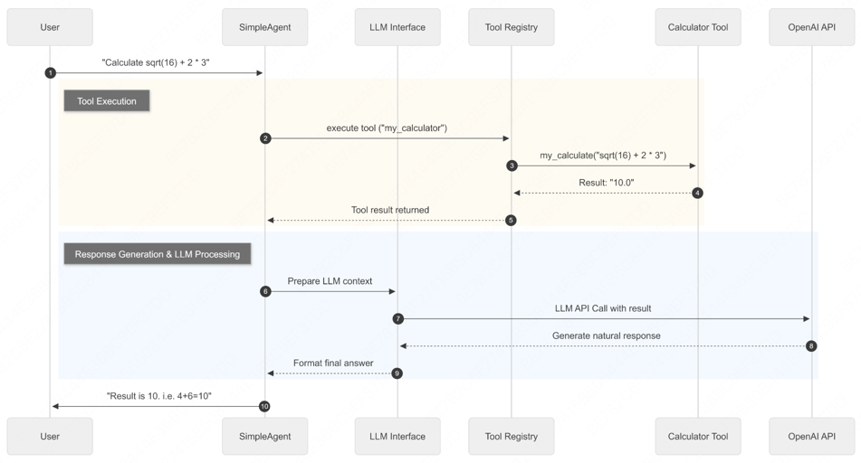

from langchain_core.messages.tool import tool_callfrom camel.environments import Observationfrom pyarrow import timestampfrom pyarrow import timestamp

# 第七章 构建你的智能体框架

## 7.1 框架整体架构设计

### 7.1.1 为何需要自建Agent框架

#### (1) 市面框架的快速迭代与局限性

+ 过度抽象的复杂性：
+ 快速迭代带来的不稳定性
+ 黑盒化的实现逻辑
+ 依赖关系的复杂性

#### (2) 从使用者到构建者的能力跃迁

+ 深度理解Agent工作原理
+ 获得完全的控制权
+ 培养系统设计能力

#### (3) 定制化需求与深度掌握的必要性

+ 特定领域的优化需求
+ 性能与资源的精确控制
+ 学习与教学的透明性要求

### 7.1.2 HelloAgents框架的设计理念

+ (1) 轻量级与教学友好的平衡
+ (2) 基于标准API的务实选择
+ (3) 渐进式学习路径的精心设计
+ (4) 统一的工具抽象：万物皆为工具

### 7.1.3 本章学习目标

```
hello-agents/
├── hello_agents/
│   │
│   ├── core/                     # 核心框架层
│   │   ├── agent.py              # Agent基类
│   │   ├── llm.py                # HelloAgentsLLM统一接口
│   │   ├── message.py            # 消息系统
│   │   ├── config.py             # 配置管理
│   │   └── exceptions.py         # 异常体系
│   │
│   ├── agents/                   # Agent实现层
│   │   ├── simple_agent.py       # SimpleAgent实现
│   │   ├── react_agent.py        # ReActAgent实现
│   │   ├── reflection_agent.py   # ReflectionAgent实现
│   │   └── plan_solve_agent.py   # PlanAndSolveAgent实现
│   │
│   ├── tools/                    # 工具系统层
│   │   ├── base.py               # 工具基类
│   │   ├── registry.py           # 工具注册机制
│   │   ├── chain.py              # 工具链管理系统
│   │   ├── async_executor.py     # 异步工具执行器
│   │   └── builtin/              # 内置工具集
│   │       ├── calculator.py     # 计算工具
│   │       └── search.py         # 搜索工具
└──

pip install "hello-agents==1.0.0"
```

+ Hello-agents构建简单智能体
+ ```python
  # 配置好同级文件夹下.env中的大模型API, 可参考code文件夹配套的.env.example，也可以拿前几章的案例的.env文件复用。
  from hello_agents import SimpleAgent, HelloAgentsLLM
  from dotenv import load_dotenv
  
  # 加载环境变量
  load_dotenv()
  
  # 创建LLM实例 - 框架自动检测provider
  llm = HelloAgentsLLM()
  
  # 创建SimpleAgent
  agent = SimpleAgent(
      name="AI助手",
      llm=llm,
      system_prompt="你是一个有用的AI助手"     
  )
  
  # 基础对话
  response = agent.run("你好！请介绍一下自己")
  print(response)
  
  # 添加工具功能（可选）
  from hello_agents.tools import CalculatorTool
  calculator = CalculatorTool()
  # 需要实现7.4.1的MySimpleAgent进行调用，后续章节会支持此类调用方式
  # agent.add_tool(calculator)

  # 现在可以使用工具了
  response = agent.run("请帮我计算 2 + 3 * 4")
  print(response)

  # 查看对话历史
  print(f"历史消息数: {len(agent.get_history())}")
  ```
  
## 7.2 HelloAgentsLLM扩展

### 7.2.1 支持多提供商

#### (1) 创建自定义LLM类并继承

```python
# my_llm.py
import os
from typing import Optional
from openai import OpenAI
from hello_agents import HelloAgentsLLM

class MyLLM(HelloAgentsLLM):
    """自定义的LLM客户端，通过继承增加了对ModelScope的支持"""
    pass
```

#### (2) 重写__init__方法以支持新供应商
```python
class MyLLM(HelloAgentsLLM):
    def __init__(
            self,
            model: Optional[str] = None,
            api_key: Optional[str] = None,
            provider: Optional[str] = "auto",
            base_url: Optional[str] = None,
            **kwargs,
    ):
        # 检查provider是否为我们想处理的'modelscope'
        if provider == "modelscope":
            print("正在使用自定义的ModelScope Provider")
            self.provider = "modelscope"

            # 解析ModelScope的凭证
            self.api_key = os.getenv("MODELSCOPE_API_KEY")
            self.base_url = os.getenv("MODELSCOPE_BASE_URL")
            
            # 验证凭证是否存在
            if not self.api_key:
                raise ValueError("ModelScope API Key not found. Please set MODELSCOPE_API_KEY environment variable.")

            # 设置默认模型和其他参数
            self.model = model or os.getenv("LLM_MODEL_ID") or "Qwen/Qwen2.5-VL-72B-Instruct"
            self.temperature = kwargs.get("temperature", 0.7)
            self.max_tokens = kwargs.get("max_tokens", 1024)
            self.timeout = kwargs.get("timeout", 60)
            
            # 使用获取的参数创建OpenAI客户端实例
            self._client = OpenAI(api_key=self.api_key, base_url=self.base_url, timeout=self.timeout)
            
        else:
            # 如果不是modelscope，则完全使用父类的原始逻辑来处理
            super().__init__(model, api_key, provider, base_url, **kwargs)
```

#### (3) 使用自定义的MyLLM类
```python
# my_main.py
from dotenv import load_dotenv
from my_llm import MyLLM

# 加载环境变量
load_dotenv()

# 实例化我们重写的客户端，并指定provider
llm = MyLLM(provider="modelscope")

# 准备消息
messages = [{"role": "user", "content": "你好，你是谁？"}]

# 调用模型
response_stream = llm.think(messages)

print("ModelScope Response:")
for chunk in response_stream:
    print(chunk)
    pass
```

### 7.2.2 本地调用模型

**VLLM**
+ VLLM是为LLM推理设计的高性能python库。通过PagedAttention技术，可以实现比标准Transformers高出数倍的吞吐量。

```
pip install vllm

# 启动vllm服务
python -m vllm.entrypoints.openai.api_server \
        --model Qwen/Qwen2.5-VL-72B-Instruct \
        --host 0.0.0.0 \
        --port 8000
        
# 启动后便会在http://0.0.0.0:8000/v1/地址上提供与OpenAI兼容的API
```

**Ollama**

+ Ollama进一步简化了本地模型的管理和部署，将模型下载、配置和服务启动等步骤封装到了一条命令中。

```
# 首次运行会自动下载模型，之后会直接启动服务
ollama run qwen-vl-72b

# 启动后默认在http://0.0.0.0:11434/v1/地址上提供与OpenAI兼容的API 


# 连接本地运行的VLLM服务，Ollama同样
llm_client = HelloAgentsLLM(
    provider="vllm",
    model="Qwen/Qwen2.5-VL-72B-Instruct",  # 需要与服务启动时指定的模型一致
    base_url="http://0.0.0.0:8000/v1",
    api_key="vllm"  # 本地服务，可以为空
)
```

### 7.2.3 自动检测机制

_auto_detect_provider负责根据环境信息推断服务商
_resolve_credentials根据推断结果完成具体的参数配置

_auto_detect_provider推断优先级顺序
+ 最高优先级：检查特定服务商的环境变量，这是最直接、最可靠的判断依据
+ 次高优先级：根据base_url进行判断，如果用户没有设置特定服务商的密钥，但设置了通用的LLM_BASE_URL，框架会转而解析这个URL
  + 域名匹配：通过检查URL中是否包含api-inference.modelscope.cn,api.openai.com等特征字符串来识别云服务商
  + 端口匹配：通过检查URL中是否包含:11434(Ollama), :8000(VLLM)等本地服务的标准端口来识别本地部署方案
+ 辅助判断：分析API密钥的格式

```python
import os


def _auto_detect_provider(self, api_key: Optional[str], base_url: Optional[str]) -> str:
    """自动检测LLM提供商"""
    # 1.检查特定供应商的环境变量(最高优先级)
    if os.getenv("MODELSCOPE_API_KEY"): return "modelscope"
    if os.getenv("OPENAI_API_KEY"): return "openai"
    if os.getenv("ZHIPU_API_KEY"): return "zhipu"

    # 获取通用的环境变量
    actual_api_key = api_key or os.getenv("LLM_API_KEY")
    actural_base_url = base_url or os.getenv("LLM_BASE_URL")

    # 2.根据base_url判断
    if actual_base_url:
        base_url_lower = actural_base_url.lower()
        if "api-inference.modelscope.cn" in base_url_lower: return "modelscope"
        if "open.bigmodel.cn" in base_url_lower: return "zhipu"
        if "localhost" in base_url_lower or "127.0.0.1" in base_url_lower:
            if ":11434" in base_url_lower: return "ollama"
            if ":8000" in base_url_lower: return "vllm"
            return "local" # 其他本地端口
    
    # 3.根据API密钥格式辅助判断
    if actual_api_key:
        if actual_api_key.startswith("ms-"): return "modelscope"

    # 4.默认返回'auto'，使用通用配置
    return 'auto'

def _resolve_credentials(self, api_key: Optional[str], base_url: Optional[str]) -> tuple[str, str]:
    """根据provider解析API密钥和base_url"""
    if self.provider == "openai":
        resolved_api_key = api_key or os.getenv("OPENAI_API_KEY") or os.getenv("LLM_API_KEY")
        resolved_base_url = base_url or os.getenv("LLM_BASE_URL") or "https://api.openai.com/v1"
        return resolved_api_key, resolved_base_url

    elif self.provider == "modelscope":
        resolved_api_key = api_key or os.getenv("MODELSCOPE_API_KEY") or os.getenv("LLM_API_KEY")
        resolved_base_url = base_url or os.getenv("LLM_BASE_URL") or "https://api-inference.modelscope.cn/v1/"
        return resolved_api_key, resolved_base_url


from dotenv import load_dotenv
from hello_agents import HelloAgentsLLM

load_dotenv()

# 无需传入 provider，框架会自动检测
llm = HelloAgentsLLM() 
# 框架内部日志会显示检测到 provider 为 'ollama'

# 后续调用方式完全不变
messages = [{"role": "user", "content": "你好！"}]
for chunk in llm.think(messages):
    print(chunk, end="")

```

## 7.3 框架接口实现

+ message.py 定义了框架内统一的消息格式，确保了智能体与模型之间信息传递的标准化。
+ config.py 提供了一个中心化的配置管理方案，使框架的恶行为易于调整和扩展。
+ agent.py 定义了所有智能体的抽象基类，为后续实现不同类型的智能体提供了统一的接口和规范。

### 7.3.1 Message类

```python
"""消息系统"""
from typing import Optional, Dict, Any, Literal
from datetime import datetime
from pydantic import BaseModel

# 定义消息角色的类型，限制其取值
MessageRole = Literal["user", "assistant", "system", "tool"]

class Message(BaseModel):
    """消息类"""
    content: str
    role: MessageRole
    timestamp: datetime = None
    metadata: Optional[Dict[str, Any]] = None

    def __init__(self, content: str, role: MessageRole, **kwargs):
        super().__init__(
            content=content,
            role=role,
            timestamp=kwargs.get("timestamp", datetime.now()),
            metadata=kwargs.get("metadata", {})
        )

    def to_dict(self) -> Dict[str, Any]:
        """转为字典格式(OpenAI API格式)"""
        return {
            "role": self.role,
            "content": self.content
        }

    def __str__(self) -> str:
        return f"[{self.role}] {self.content}"
```

### 7.3.2 config类

```python
"""配置管理"""
import os
from typing import Optional, Dict, Any
from pydantic import BaseModel

class Config(BaseModel):
    """HelloAgents配置类"""
    # LLM配置
    default_model: str = "gpt-3.5-turbo"
    default_provider: str = "openai"
    temperature: float = 0.7
    max_tokens: Optional[int] = None

    # 系统配置
    debug: bool = False
    log_level: str = "INFO"

    # 其他配置
    max_history_length: int = 100

    @classmethod
    def from_env(cls) -> "Config":
        """从环境变量创建配置"""
        return cls(
            debug=os.getenv("DEBUG", "false").lower() == "true",
            log_level=os.getenv("LOG_LEVEL", "INFO"),
            temperature=float(os.getenv("TEMPERATURE", "0.7")),
            max_tokens=int(os.getenv("MAX_TOKENS")) . if os.getenv("MAX_TOKENS") else None
        )

    def to_dict(self) -> Dict[str, Any]:
        """转换为字典"""
        return self.dict()
```

### 7.3.3 Agent抽象基类

```python
"""Agent基类"""

from abc import ABC, abstractmethod
from typing import Optional, Any
from .message import Message
from .llm import HelloAgentsLLM
from .config import Config


class Agent(ABC):
    """Agent基类"""
    def __init__(
            self,
            name: str,
            llm: HelloAgentsLLM,
            system_prompt: Optional[str] = None,
            config: Optional[Config] = None
            ):
        self.name = name
        self.llm = llm
        self.system_prompt = system_prompt
        self.config = config or Config()
        self._history: list[Message] = []

    @abstractmethod
    def run(self, input_text: str, **kwargs) -> str:
        """运行Agent"""
        pass

    def add_message(self, message: Message):
        """添加消息到历史记录"""
        self._history.append(message)

    def clear_history(self):
        """清空历史记录"""
        self._history.clear()

    def get_history(self) -> list[Message]:
        """获取历史记录"""
        return self._history.copy()

    def __str__(self) -> str:
        return f"Agent(name={self.name}, provider={self.llm.provider})"
```

## 7.4 Agent范式的框架化实现

+ 提示词工程的系统性提升
+ 接口与格式的标准化统一
+ 高度可配置的自定义能力

### 7.4.1 SimpleAgent

```python
# my_simple_agent.py
import re
from typing import Optional, Iterator
from hello_agents import SimpleAgent, HelloAgentsLLM, Config, Message


class MySimpleAgent(SimpleAgent):
    """
    重写的简单对话Agent
    展示如何基于框架基类构建自定义Agent
    """

    def __init__(
            self,
            name: str,
            llm: HelloAgentsLLM,
            system_prompt: Optional[str] = None,
            config: Optional[Config] = None,
            tool_registry: Optional["ToolRegistry"] = None,
            enable_tool_calling: bool = True
    ):
        super().__init__(name, llm, system_prompt, config)
        self.tool_registry = tool_registry
        self.enable_tool_calling = enable_tool_calling and tool_registry is not None

        print(f"{name} 初始化完成，工具调用：{'启用' if self.enable_tool_calling else '禁用'}")


    def run(self, input_text: str, max_tool_iterations: int = 3, **kwargs) -> str:
        """
        重写的运行方法 - 实现简单对话逻辑，支持可选工具调用
        """
        # 构建消息列表
        messages = []

        # 添加系统消息(可能包含工具信息)
        enhanced_system_prompt = self._get_enhanced_system_prompt()
        messages.append(Message(content=enhanced_system_prompt, role="system"))

        # 添加历史消息
        for msg in self._history:
            messages.append({"role": msg.role, "content": msg.content})

        # 添加当前用户消息
        messages.append({"role": "user", "content": input_text})

        # 如果没有启用工具调用，使用简单对话逻辑
        if not self.enable_tool_calling:
            response = self.llm.invoke(messages, **kwargs)
            self.add_message(Message(input_text, "user"))
            self.add_message(Message(response, "assistant"))
            return response
        
        # 支持多轮工具调用的逻辑
        return self._run_with_tools(messages, input_text, max_tool_iterations, **kwargs)
    
    def _get_enhanced_system_prompt(self) -> str:
        """构建增强的系统提示词，包含工具信息"""
        base_prompt = self.system_prompt or "你是一个有用的AI助手"
        
        if not self.enable_tool_calling or not self.tool_registry:
            return base_prompt
        
        # 获取工具描述
        tools_description = self.tool_registry.get_tools_description()
        if not tools_description or tools_description == "暂无可用工具":
            return base_prompt
        
        tools_section = """\n\n## 可用工具\n
你可以使用以下工具来帮助回答问题:\n
{tools_description}
\n\n## 工具调用格式\n
当需要使用工具时，请使用以下格式:\n
`[TOOL_CALL:{{tool_name}}:{{parameters}}]`\n
例如:`[TOOL_CALL:search:Python编程]` 或 `[TOOL_CALL:memory:recall=用户信息]`\n\n
工具调用结果会自动插入到对话中，然后你可以基于结果继续回答。\n
"""
        return base_prompt + tools_section.format(tools_description=tools_description)

    def _run_with_tools(self, messages: list, input_text: str, max_tool_iterations: int, **kwargs):
        """支持工具调用的运行逻辑"""
        current_iteration = 0
        final_response = ""

        while current_iteration < max_tool_iterations:
            # 调用LLM
            response = self.llm.invoke(messages, **kwargs)
            
            # 检查是否有工具调用
            tool_calls = self._parse_tool_calls(response)
            
            if tool_calls:
                # 执行所有工具调用并收集结果
                tool_results = []
                clean_response = response
                
                for call in tool_calls:
                    result = self._execute_tool_call(call["tool_name"], call["parameters"])
                    tool_results.append(result)
                    # 从响应中移除工具调用标记
                    clean_response = clean_response.replace(call["original"], "")
                    
                # 构建包含工具结果的消息
                messages.append({"role": "assistant", "content": clean_response})
                
                # 添加工具结果
                tool_results_text = "\n\n".join(tool_results)
                messages.append({"role": "user", "content": f"工具执行结果:\n{tool_results_text}\n\n请基于这些结果给出完整的回答。"})
                
                current_iteration += 1
                continue
            
            # 如果没有工具调用，这是最终回答
            final_response = response
            break
            
        # 如果超过最大迭代次数，获取最后一次回答
        if current_iteration >= max_tool_iterations and not final_response:
            final_response = self.llm.invoke(messages, **kwargs)
        
        # 保存到历史记录
        self.add_message(Message(input_text, "user"))
        self.add_message(Message(final_response, "assistant"))
        
        return final_response
     
    def _parse_tool_calls(self, text: str) -> list:
        """解析文本中的工具调用"""
        pattern = r'\[TOOL_CALL:([^:]+):([^\]]+)\]'
        matches = re.findall(pattern, text)
        
        tool_calls = []
        for tool_name, parameters in matches:
            tool_calls.append({
                "tool_name": tool_name.strip(),
                "parameters": parameters.strip(),
                "original": f"[TOOL_CALL:{tool_name}:{parameters}]"
            })

        return tool_calls

    def _execute_tool_call(self, tool_name: str, parameters: str) -> str:
        """执行工具调用"""
        if not self.tool_registry:
            return f"错误: 未配置工具注册表"

        try:
            # 智能参数解析
            if tool_name == "calculator":
                # 计算器工具直接传入表达式
                result = self.tool_registry.execute_tool(tool_name, parameters)
            else:
                # 其他工具使用智能参数解析
                param_dict = self._parse_tool_parameters(tool_name, parameters)
                tool = self.tool_registry.get_tool(tool_name)
                if not tool:
                    return f"错误：未找到工具 '{tool_name}'"
                result = tool.run(param_dict)
            return f"工具 {tool_name} 执行结果:\n{result}"
        
        except Exception as e:
            return f"工具调用失败:{str(e)}"

    def _parse_tool_parameters(self, tool_name: str, parameters: str) -> dict:
        """智能解析工具参数"""
        param_dict = {}
        
        if "=" in parameters:
            # 格式：key=value 或 action=search，query=Python
            if "," in parameters:
                # 多个参数：action=search，query=Python，limit=3
                pairs = parameters.split(",")
                for pair in pairs:
                    if "=" in pair:
                        key, value = pair.split("=", 1)
                        param_dict[key.strip()] = value.strip()
            else:
                # 单个参数：key=value
                key, value = parameters.split("=", 1)
                param_dict[key.strip()] = value.strip()
        else:
            # 直接传入参数，根据工具类型智能推断
            if tool_name == "search":
                param_dict = {"query": parameters}
            elif tool_name == "memory":
                param_dict = {"action": "search", "query": parameters}
            else:
                param_dict = {"input": parameters}
        return param_dict

    def stream_run(self, input_text: str, **kwargs) -> Iterator[str]:
        """自定义的流式运行方法"""
        print(f"{self.name} 开始流式处理：{input_text}")
        messages = []
        if self.system_prompt:
            messages.append({"role": "system", "content": self.system_prompt})

        for msg in self._history:
            messages.append({"role": msg.role, "content": msg.content})

        messages.append({"role": "user", "content": input_text})

        # 流式调用LLM
        full_response = ""
        print("实时响应: ", end="")
        for chunk in self.llm.stream_invoke(messages, **kwargs):
            full_response += chunk
            print(chunk, end="", flush=True)
            yield chunk

        print()
        
        # 保存完整对话到历史记录
        self.add_messages(Message(input_text, "user"))
        self.add_messages(Message(full_response, "assistant"))

    def add_tool(self, tool) -> None:
        """添加工具到Agent"""
        if not self.tool_registry:
            from hello_agents import ToolRegistry
            self.tool_registry = ToolRegistry()
            self.enable_tool_calling = True

        self.tool_registry.register_tool(tool)

    def has_tools(self) -> bool:
        """检查是否有可用工具"""
        return self.enable_tool_calling and self.tool_registry is not None

    def remove_tool(self, tool_name: str) -> bool:
        """移除工具"""
        if self.tool_registry:
            self.tool_registry.unregister(tool_name)
            return True
        return False

    def list_tools(self) -> list:
        """列出所有可用工具"""
        if self.tool_registry:
            return self.tool_registry.list_tools()
        return []
```
**测试**

```python
# test_simple_agent.py
from dotenv import load_dotenv
from hello_agents import HelloAgentsLLM, ToolRegistry
from hello_agents.tools import CalculatorTool
from my_simple_agent import MySimpleAgent

# 加载环境变量
load_dotenv()

# 创建LLM实例
llm = HelloAgentsLLM()

# 测试1:基础对话Agent（无工具）
print("=== 测试1:基础对话 ===")
basic_agent = MySimpleAgent(
    name="基础助手",
    llm=llm,
    system_prompt="你是一个友好的AI助手，请用简洁明了的方式回答问题。"
)

response1 = basic_agent.run("你好，请介绍一下自己")
print(f"基础对话响应: {response1}\n")

# 测试2:带工具的Agent
print("=== 测试2:工具增强对话 ===")
tool_registry = ToolRegistry()
calculator = CalculatorTool()
tool_registry.register_tool(calculator)

enhanced_agent = MySimpleAgent(
    name="增强助手",
    llm=llm,
    system_prompt="你是一个智能助手，可以使用工具来帮助用户。",
    tool_registry=tool_registry,
    enable_tool_calling=True
)

response2 = enhanced_agent.run("请帮我计算 15 * 8 + 32")
print(f"工具增强响应: {response2}\n")

# 测试3:流式响应
print("=== 测试3:流式响应 ===")
print("流式响应: ", end="")
for chunk in basic_agent.stream_run("请解释什么是人工智能"):
    pass  # 内容已在stream_run中实时打印

# 测试4:动态添加工具
print("\n=== 测试4:动态工具管理 ===")
print(f"添加工具前: {basic_agent.has_tools()}")
basic_agent.add_tool(calculator)
print(f"添加工具后: {basic_agent.has_tools()}")
print(f"可用工具: {basic_agent.list_tools()}")

# 查看对话历史
print(f"\n对话历史: {len(basic_agent.get_history())} 条消息")
```

### 7.4.2 ReActAgent

#### (1)提示词模版改进

```python
MY_REACT_PROMPT = """你是一个具备推理和行动能力的AI助手。你可以通过思考分析问题，然后调用合适的工具来获取信息，最终给出准确的答案。

## 可用工具
{tools}

## 工作流程
请严格按照以下格式进行回应，每次只能执行一个步骤:

Thought: 分析当前问题，思考需要什么信息或采取什么行动。
Action: 选择一个行动，格式必须是以下之一:
- `{{tool_name}}[{{tool_input}}]` - 调用指定工具
- `Finish[最终答案]` - 当你有足够信息给出最终答案时

## 重要提醒
1. 每次回应必须包含Thought和Action两部分
2. 工具调用的格式必须严格遵循:工具名[参数]
3. 只有当你确信有足够信息回答问题时，才使用Finish
4. 如果工具返回的信息不够，继续使用其他工具或相同工具的不同参数

## 当前任务
**Question:** {question}

## 执行历史
{history}

现在开始你的推理和行动:
"""

```

#### (2)重写ReActAgent的完整实现

```python
# my_react_agent.py

import re
from typing import Optional, List, Tuple
from hello_agents import ReActAgent, HelloAgentsLLM, Config, Message, ToolRegistry

class MyReActAgent(ReActAgent):
    """重写的ReAct Agent - 推理与行动结合的智能体"""
    def __init__(
            self,
            name: str,
            llm: HelloAgentsLLM,
            tool_registry: ToolRegistry,
            system_prompt: Optional[str] = None,
            config: Optional[Config] = None,
            max_steps: int = 5,
            custom_prompt: Optional[str] = None
    ):
        super().__init__(name, llm, system_prompt, config)
        self.tool_registry = tool_registry
        self.max_steps = max_steps
        self.current_history: List[str] = []
        self.prompt_template = custom_prompt if custom_prompt else MY_REACT_PROMPT

    def run(self, input_text: str, **kwargs) -> str:
        """运行ReAct Agent"""
        self.current_history = []
        current_step = 0

        while current_step < self.max_steps:
            current_step += 1

            # 1.构建提示词
            tools_desc = self.tool_registry.get_tools_description()
            history_str = "\n".join(self.current_history)
            prompt = self.prompt_template.format(
                tools=tools_desc,
                question=input_text,
                history=history_str
            )

            # 2.调用LLM
            messages = [{"role": "user", "content": prompt}]
            response_text = self.llm.invoke(messages, **kwargs)
            
            # 3.解析输出
            thought, action = self._parse_output(response_text)
            
            # 4.检查完成条件
            if action and action.startswith("Finish"):
                final_answer = self._parse_action_input(action)
                self.add_message(Message(input_text, "user"))
                self.add_message(Message(final_answer, "assistant"))
                return final_answer
            
            # 5.执行调用工具
            if action:
                tool_name, tool_input = self._parse_action(action)
                observation = self.tool_registry.execute_tool(tool_name, tool_input)
                self.current_history.append(f"Action: {action}")
                self.current_history.append(f"Observation: {observation}")
                
        # 达到最大步数
        final_answer = "sorry，我无法在规定步数内完成这个任务"
        self.add_message(Message(input_text, "user"))
        self.add_message(Message(final_answer, "assistant"))
        return final_answer
```

### 7.4.3 ReflectionAgent

```python
DEFAULT_PROMPTS = {
    "initial": """
请根据以下要求完成任务:

任务: {task}

请提供一个完整、准确的回答。
""",
    "reflect": """
请仔细审查以下回答，并找出可能的问题或改进空间:

# 原始任务:
{task}

# 当前回答:
{content}

请分析这个回答的质量，指出不足之处，并提出具体的改进建议。
如果回答已经很好，请回答"无需改进"。
""",
    "refine": """
请根据反馈意见改进你的回答:

# 原始任务:
{task}

# 上一轮回答:
{last_attempt}

# 反馈意见:
{feedback}

请提供一个改进后的回答。
"""
}

# test_reflection_agent.py
from dotenv import load_dotenv
from hello_agents import HelloAgentsLLM
from my_reflection_agent import MyReflectionAgent

load_dotenv()
llm = HelloAgentsLLM()

# 使用默认通用提示词
general_agent = MyReflectionAgent(name="我的反思助手", llm=llm)

# 使用自定义代码生成提示词（类似第四章）
code_prompts = {
    "initial": "你是Python专家，请编写函数:{task}",
    "reflect": "请审查代码的算法效率:\n任务:{task}\n代码:{content}",
    "refine": "请根据反馈优化代码:\n任务:{task}\n反馈:{feedback}"
}
code_agent = MyReflectionAgent(
    name="我的代码生成助手",
    llm=llm,
    custom_prompts=code_prompts
)

# 测试使用
result = general_agent.run("写一篇关于人工智能发展历程的简短文章")
print(f"最终结果: {result}")
```

### 7.4.4 PlanAndSolveAgent

```bash
# 默认规划器提示词模板
DEFAULT_PLANNER_PROMPT = """
你是一个顶级的AI规划专家。你的任务是将用户提出的复杂问题分解成一个由多个简单步骤组成的行动计划。
请确保计划中的每个步骤都是一个独立的、可执行的子任务，并且严格按照逻辑顺序排列。
你的输出必须是一个Python列表，其中每个元素都是一个描述子任务的字符串。

问题: {question}

请严格按照以下格式输出你的计划:
```python
["步骤1", "步骤2", "步骤3", ...]
\```
"""

# 默认执行器提示词模板
DEFAULT_EXECUTOR_PROMPT = """
你是一位顶级的AI执行专家。你的任务是严格按照给定的计划，一步步地解决问题。
你将收到原始问题、完整的计划、以及到目前为止已经完成的步骤和结果。
请你专注于解决"当前步骤"，并仅输出该步骤的最终答案，不要输出任何额外的解释或对话。

# 原始问题:
{question}

# 完整计划:
{plan}

# 历史步骤与结果:
{history}

# 当前步骤:
{current_step}

请仅输出针对"当前步骤"的回答:
"""
```

**测试**

```python
# test_plan_solve_agent.py
from dotenv import load_dotenv
from hello_agents.core.llm import HelloAgentsLLM
from my_plan_solve_agent import MyPlanAndSolveAgent

# 加载环境变量
load_dotenv()

# 创建LLM实例
llm = HelloAgentsLLM()

# 创建自定义PlanAndSolveAgent
agent = MyPlanAndSolveAgent(
    name="我的规划执行助手",
    llm=llm
)

# 测试复杂问题
question = "一个水果店周一卖出了15个苹果。周二卖出的苹果数量是周一的两倍。周三卖出的数量比周二少了5个。请问这三天总共卖出了多少个苹果？"

result = agent.run(question)
print(f"\n最终结果: {result}")

# 查看对话历史
print(f"对话历史: {len(agent.get_history())} 条消息")


# 创建专门用于数学问题的自定义提示词
math_prompts = {
    "planner": """
你是数学问题规划专家。请将数学问题分解为计算步骤:

问题: {question}

输出格式:
python
["计算步骤1", "计算步骤2", "求总和"]

""",
    "executor": """
你是数学计算专家。请计算当前步骤:

问题: {question}
计划: {plan}
历史: {history}
当前步骤: {current_step}

请只输出数值结果:
"""
}

# 使用自定义提示词创建数学专用Agent
math_agent = MyPlanAndSolveAgent(
    name="数学计算助手",
    llm=llm,
    custom_prompts=math_prompts
)

# 测试数学问题
math_result = math_agent.run(question)
print(f"数学专用Agent结果: {math_result}")

```

### 7.4.5 FunctionCallAgent

支持以下功能：

+ _build_tool_schemas:通过工具的description构建OpenAI的function calling schema
+ _extract_message_content:从OpenAI的响应中提取文本
+ _parse_function_call_arguments:解析模型返回的JSON字符串参数
+ _convert_parameter_types:转换参数类型

```python
def _invoke_with_tools(self, messages: list[dict[str, Any]], tools: list[dict[str, Any]], tool_choice: Union[str, dict], **kwargs):
    """调用底层OpenAI客户端执行函数调用"""
    client = getattr(self.llm, "_client", None)
    if client is None:
        raise RuntimeError("HelloAgentsLLM 未正确初始化客户端，无法执行函数调用。")

    client_kwargs = dict(kwargs)
    client_kwargs.setdefault("temperature", self.llm.temperature)
    if self.llm.max_tokens is not None:
        client_kwargs.setdefault("max_tokens", self.llm.max_tokens)

    return client.chat.completions.create(
        model=self.llm.model,
        messages=messages,
        tools=tools,
        tool_choice=tool_choice,
        **client_kwargs,
    )

# 内部逻辑是对Openai原生的function call再封装
from openai import OpenAI


client = OpenAI()
tools = [
  {
    "type": "function",
    "function": {
      "name": "get_current_weather",
      "description": "Get the current weather in a given location",
      "parameters": {
        "type": "object",
        "properties": {
          "location": {
            "type": "string",
            "description": "The city and state, e.g. San Francisco, CA",
          },
          "unit": {"type": "string", "enum": ["celsius", "fahrenheit"]},
        },
        "required": ["location"],
      },
    }
  }
]
messages = [{"role": "user", "content": "What's the weather like in Boston today?"}]
completion = client.chat.completions.create(
  model="gpt-5",
  messages=messages,
  tools=tools,
  tool_choice="auto"
)

print(completion)
```

## 7.5 工具系统

围绕三个核心方面展开：
+ 统一的工具抽象与管理
+ 实战驱动的工具开发
+ 高级整合与优化策略

### 7.5.1 工具基类与注册机制设计

#### (1) Tool基类的抽象设计

```python
class Tool(ABC):
    """工具基类"""
    def ___init(self, name: str, description: str):
        self.name = name
        self.description = description

    @abstractmethod
    def run(self, parameters: Dict[str, Any]) -> str:
        """执行工具"""
        pass

    @abstractmethod
    def get_parameters(self) -> List[ToolParameter]:
        """获取工具参数定义"""
        pass
```

#### (2) ToolParameter
```python
class ToolParameter(BaseModel):
    """工具参数定义"""
    name: str
    type: str
    description: str
    required: bool = True
    default: Any = None
```

#### (3) ToolRegistry注册表的实现

```python
class ToolRegistry:
    """HelloAgents工具注册表"""
    
    def __init__(self):
        self._tools: dict[str, Tool] = {}
        self._functions: dict[str, dict[str, Any]] = {}

    def register_tool(self, tool: Tool):
        """注册Tool对象"""
        if tool.name in self._tools:
            print(f"工具 {tool.name} 已经存在，将被覆盖")
        self._tools[tool.name] = tool
        print(f"工具 {tool.name} 已注册")

    def register_function(self, name: str, description: str, func: Callable[[str], str]):
        """
        直接注册函数作为工具
        Args:
            name: 工具名称
            description: 工具描述
            func: 工具函数，接受字符串参数，返回字符串结果
        """
        if name in self._functions:
            print(f"工具 {tool.name} 已经存在，将被覆盖")

        self._functions[name] = {
            "description": description,
            "func": func
        }
        print(f"工具 {name} 已注册。")
```

#### (4) 工具发现与管理机制

```python
def get_tools_description(self) -> str:
    """获取所有可用工具的格式化描述字符串"""
    descriptions = []
    
    # Tool对象描述
    for tool in self._tools.values():
        descriptions.append(f"- {tool.name}: {tool.description}")

    # 函数工具描述
    for name, info in self._functions.iterms():
        descriptions.append(f"- {name}: {info['description']}")

    return "\n".join(descriptions) if descriptions else "暂无可用工具"


def to_openai_schema(self) -> Dict[str, Any]:
    """
    转换为 OpenAI function calling schema 格式
    用于FunctionCallAgent，使工具能够被OpenAI原生function calling使用
    Returns:
        符合OpenAI function calling 标准的schema
    """

    parameters = self.get_parameters()
    
    # 构建properties
    properties = {}
    required = []

    for param in parameters:
        # 基础属性定义
        prop = {
            "type": param.type,
            "description": param.description
        }

        # 如果有默认值，添加到描述中(OpenAI schema 不支持default字段)
        if param.default is not None:
            prop["description"] = f"{param.description} (默认：{param.default})"

        # 如果是数组类型，添加items定义
        if param.type == "array":
            prop["items"] = {"type": "string"}  # 默认字符串数组
        
        properties[param.name] = prop

        # 收集必需参数
        if param.required:
            required.append(param.name)


    return {
        "type": "function",
        "function": {
            "name": self.name,
            "description": self.description,
            "parameters": {
                "type": "object",
                "properties": properties,
                "required": required
            }
        }
    }
```

### 7.5.2 自定义工具开发

```python
# my_calculator_tool.py

import ast
import operator
import math
from hello_agents import ToolRegistry

def my_calculate(expression: str):
    """
    简单的数学计算函数
    """
    if not expression.strip():
        return "计算表达式不能为空"
    
    # 支持的基本运算
    operators = {
        ast.Add: operator.add,
        ast.Sub: operator.sub,
        ast.Mult: operator.mul,
        ast.Div: operator.truediv
    }
    
    # 支持的基本函数
    functions = {
        "sqrt": math.sqrt,
        "pi": math.pi
    }
    
    try:
        node = ast.parse(expression, mode="eval")
        result = _eval_node(node.body, operators, functions)
        return str(result)
    except:
        return "计算失败，请检查表达式格式"

def _eval_node(node, operators, functions):
    """
    简化的表达式求值
    """
    if isinstance(node, ast.Constant):
        return node.value

    elif isinstance(node, ast.BinOp):
        left = _eval_node(node.left, operators, functions)
        right = _eval_node(node.right, operators, functions)
        op = operators.get(type(node.op))
        return op(left, right)
    elif isinstance(node, ast.Call):
        func_name = node.func.id
        if func_name in functions:
            args = [_eval_node(arg, operators, functions) for arg in node.args]
            return functions[func_name](*args)
    elif isinstance(node, ast.Name):
        if node.id in functions:
            return functions[node.id]


def create_calculator_registry():
    """
    创建包含计算器的工具注册表
    """
    registry = ToolRegistry()
    
    # 注册计算器函数
    registry.register_function(
        name="my_calculator",
        description="简单的数学计算工具，支持基本运算(+,-,*,/)和sqrt函数",
        func=my_calculate
    )
    return registry
```

**测试代码**

```python
# test_my_calculator.py
from dotenv import load_dotenv
from my_calculator_tool import create_calculator_registry

# 加载环境变量
load_dotenv()

def test_calculator_tool():
    """测试自定义计算器工具"""

    # 创建包含计算器的注册表
    registry = create_calculator_registry()

    print("🧪 测试自定义计算器工具\n")

    # 简单测试用例
    test_cases = [
        "2 + 3",           # 基本加法
        "10 - 4",          # 基本减法
        "5 * 6",           # 基本乘法
        "15 / 3",          # 基本除法
        "sqrt(16)",        # 平方根
    ]

    for i, expression in enumerate(test_cases, 1):
        print(f"测试 {i}: {expression}")
        result = registry.execute_tool("my_calculator", expression)
        print(f"结果: {result}\n")

def test_with_simple_agent():
    """测试与SimpleAgent的集成"""
    from hello_agents import HelloAgentsLLM

    # 创建LLM客户端
    llm = HelloAgentsLLM()

    # 创建包含计算器的注册表
    registry = create_calculator_registry()

    print("🤖 与SimpleAgent集成测试:")

    # 模拟SimpleAgent使用工具的场景
    user_question = "请帮我计算 sqrt(16) + 2 * 3"

    print(f"用户问题: {user_question}")

    # 使用工具计算
    calc_result = registry.execute_tool("my_calculator", "sqrt(16) + 2 * 3")
    print(f"计算结果: {calc_result}")

    # 构建最终回答
    final_messages = [
        {"role": "user", "content": f"计算结果是 {calc_result}，请用自然语言回答用户的问题:{user_question}"}
    ]

    print("\n🎯 SimpleAgent的回答:")
    response = llm.think(final_messages)
    for chunk in response:
        print(chunk, end="", flush=True)
    print("\n")

if __name__ == "__main__":
    test_calculator_tool()
    test_with_simple_agent()
```



### 7.5.3 多源搜索工具

```
pip install "hello-agents[search]==0.1.1"
```

#### (1) 搜索工具的统一接口设计

```python
class SearchTool(Tool):
    """
    智能混合搜索工具
    支持多种搜索引擎后端，智能选择最佳搜索源：
    1.混合模式(hybrid) - 智能选择TAVILY或SERPAPI
    2.Tavily API(tavily) - 专业AI搜索
    3.SerApi(serpapi) - 传统Google搜索
    """
    def __init__(self, backend: str = "hybrid", tavily_key: Optional[str] = None):
        super().__init__(
            name="search",
            description="一个智能网页搜索引擎。支持混合搜索模式，自动选择最佳搜索源。"
        )
        self.backend = backend
        self.tavily_key = tavily_key or os.getenv("TAVILY_API_KEY")
        self.serpapi_key = serpapi_key or os.getenv("SERPAPI_API_KEY")
        self.available_backends = []
        self._setup_backends()
```

#### (2) TAVILY与SERPAPI搜索源的整合策略

```python
def _search_hybrid(self, query: str) -> str:
    """混合搜索 - 智能选择最佳搜索源"""
    # 优先使用Tavily（AI优化的搜索）
    if "tavily" in self.available_backends:
        try:
            return self._search_tavily(query)
        except Exception as e:
            print(f"⚠️ Tavily搜索失败: {e}")
            # 如果Tavily失败，尝试SerpApi
            if "serpapi" in self.available_backends:
                print("🔄 切换到SerpApi搜索")
                return self._search_serpapi(query)

    # 如果Tavily不可用，使用SerpApi
    elif "serpapi" in self.available_backends:
        try:
            return self._search_serpapi(query)
        except Exception as e:
            print(f"⚠️ SerpApi搜索失败: {e}")

    # 如果都不可用，提示用户配置API
    return "❌ 没有可用的搜索源，请配置TAVILY_API_KEY或SERPAPI_API_KEY环境变量"
```

#### (3) 搜索结果的统一格式化

```python
def _search_tavily(self, query: str) -> str:
    """使用Tavily搜索"""
    response = self.tavily_client.search(
        query=query,
        search_depth="basic",
        include_answer=True,
        max_results=3
    )

    result = f"🎯 Tavily AI搜索结果:{response.get('answer', '未找到直接答案')}\n\n"

    for i, item in enumerate(response.get('results', [])[:3], 1):
        result += f"[{i}] {item.get('title', '')}\n"
        result += f"    {item.get('content', '')[:200]}...\n"
        result += f"    来源: {item.get('url', '')}\n\n"

    return result
```

创建自己的高级搜索工具
```python
# my_advanced_search.py
import os
from typing import Optional, List, Dict, Any
from hello_agents import ToolRegistry

class MyAdvancedSearchTool:
    """
    自定义高级搜索工具类
    展示多源整合和智能选择的设计模式
    """

    def __init__(self):
        self.name = "my_advanced_search"
        self.description = "智能搜索工具，支持多个搜索源，自动选择最佳结果"
        self.search_sources = []
        self._setup_search_sources()

    def _setup_search_sources(self):
        """设置可用的搜索源"""
        # 检查Tavily可用性
        if os.getenv("TAVILY_API_KEY"):
            try:
                from tavily import TavilyClient
                self.tavily_client = TavilyClient(api_key=os.getenv("TAVILY_API_KEY"))
                self.search_sources.append("tavily")
                print("✅ Tavily搜索源已启用")
            except ImportError:
                print("⚠️ Tavily库未安装")

        # 检查SerpApi可用性
        if os.getenv("SERPAPI_API_KEY"):
            try:
                import serpapi
                self.search_sources.append("serpapi")
                print("✅ SerpApi搜索源已启用")
            except ImportError:
                print("⚠️ SerpApi库未安装")

        if self.search_sources:
            print(f"🔧 可用搜索源: {', '.join(self.search_sources)}")
        else:
            print("⚠️ 没有可用的搜索源，请配置API密钥")

    def search(self, query: str) -> str:
        """执行智能搜索"""
        if not query.strip():
            return "❌ 错误:搜索查询不能为空"

        # 检查是否有可用的搜索源
        if not self.search_sources:
            return """❌ 没有可用的搜索源，请配置以下API密钥之一:

1. Tavily API: 设置环境变量 TAVILY_API_KEY
   获取地址: https://tavily.com/

2. SerpAPI: 设置环境变量 SERPAPI_API_KEY
   获取地址: https://serpapi.com/

配置后重新运行程序。"""

        print(f"🔍 开始智能搜索: {query}")

        # 尝试多个搜索源，返回最佳结果
        for source in self.search_sources:
            try:
                if source == "tavily":
                    result = self._search_with_tavily(query)
                    if result and "未找到" not in result:
                        return f"📊 Tavily AI搜索结果:\n\n{result}"

                elif source == "serpapi":
                    result = self._search_with_serpapi(query)
                    if result and "未找到" not in result:
                        return f"🌐 SerpApi Google搜索结果:\n\n{result}"

            except Exception as e:
                print(f"⚠️ {source} 搜索失败: {e}")
                continue

        return "❌ 所有搜索源都失败了，请检查网络连接和API密钥配置"

    def _search_with_tavily(self, query: str) -> str:
        """使用Tavily搜索"""
        response = self.tavily_client.search(query=query, max_results=3)

        if response.get('answer'):
            result = f"💡 AI直接答案:{response['answer']}\n\n"
        else:
            result = ""

        result += "🔗 相关结果:\n"
        for i, item in enumerate(response.get('results', [])[:3], 1):
            result += f"[{i}] {item.get('title', '')}\n"
            result += f"    {item.get('content', '')[:150]}...\n\n"

        return result

    def _search_with_serpapi(self, query: str) -> str:
        """使用SerpApi搜索"""
        import serpapi

        search = serpapi.GoogleSearch({
            "q": query,
            "api_key": os.getenv("SERPAPI_API_KEY"),
            "num": 3
        })

        results = search.get_dict()

        result = "🔗 Google搜索结果:\n"
        if "organic_results" in results:
            for i, res in enumerate(results["organic_results"][:3], 1):
                result += f"[{i}] {res.get('title', '')}\n"
                result += f"    {res.get('snippet', '')}\n\n"

        return result

def create_advanced_search_registry():
    """创建包含高级搜索工具的注册表"""
    registry = ToolRegistry()

    # 创建搜索工具实例
    search_tool = MyAdvancedSearchTool()

    # 注册搜索工具的方法作为函数
    registry.register_function(
        name="advanced_search",
        description="高级搜索工具，整合Tavily和SerpAPI多个搜索源，提供更全面的搜索结果",
        func=search_tool.search
    )

    return registry
```

**测试工具**
```python
# test_advanced_search.py
from dotenv import load_dotenv
from my_advanced_search import create_advanced_search_registry, MyAdvancedSearchTool

# 加载环境变量
load_dotenv()

def test_advanced_search():
    """测试高级搜索工具"""

    # 创建包含高级搜索工具的注册表
    registry = create_advanced_search_registry()

    print("🔍 测试高级搜索工具\n")

    # 测试查询
    test_queries = [
        "Python编程语言的历史",
        "人工智能的最新发展",
        "2024年科技趋势"
    ]

    for i, query in enumerate(test_queries, 1):
        print(f"测试 {i}: {query}")
        result = registry.execute_tool("advanced_search", query)
        print(f"结果: {result}\n")
        print("-" * 60 + "\n")

def test_api_configuration():
    """测试API配置检查"""
    print("🔧 测试API配置检查:")

    # 直接创建搜索工具实例
    search_tool = MyAdvancedSearchTool()

    # 如果没有配置API，会显示配置提示
    result = search_tool.search("机器学习算法")
    print(f"搜索结果: {result}")

def test_with_agent():
    """测试与Agent的集成"""
    print("\n🤖 与Agent集成测试:")
    print("高级搜索工具已准备就绪，可以与Agent集成使用")

    # 显示工具描述
    registry = create_advanced_search_registry()
    tools_desc = registry.get_tools_description()
    print(f"工具描述:\n{tools_desc}")

if __name__ == "__main__":
    test_advanced_search()
    test_api_configuration()
    test_with_agent()
```

### 7.5.4 工具系统的高级特性

#### (1)工具链式调用机制

```python
# tool_chain_manager.py  工具链管理器
from typing import List, Dict, Any, Optional
from hello_agents import ToolRegistry

class ToolChain:
    """工具链 - 支持多个工具的顺序执行"""
    def __init__(self, name: str, description: str):
        self.name = name
        self.description = description
        self.steps: List[Dict[str, Any]] = []

    def add_step(self, tool_name: str, input_template: str, output_key: str = None):
        """
        添加工具执行步骤
        
        Args:
            tool_name: 工具名称
            input_template: 输入模板，支持变量替换
            output_key: 输出结果的键名，用于后续步骤引用
        """

        self.steps.append({
            "tool_name": tool_name,
            "input_template": input_template,
            "output_key": output_key or f"step_{len(self.steps)}_result"
        })

    def execute(self, registry: ToolRegistry, initial_input: str, context: Dict[str, Any] = None) -> str:
        """执行工具链"""
        context = context or {}
        context["input"] = initial_input
        
        print(f"开始执行工具链：{self.name}")

        for i, step in enumerate(self.steps, 1):
            tool_name = step["tool_name"]
            input_template = step["input_template"]
            output_key = step["output_key"]

            # 替换模板中的变量
            try:
                tool_input = input_template.format(**context)
            except KeyError as e:
                return f"工具链执行失败：模板变量{e} 未找到"

            print(f"步骤{i}: 使用工具{tool_name} 处理 '{tool_input[:50]}...'")

            # 执行工具
            result = registry.execute_tool(tool_name, tool_input)
            context[output_key] = result

            print(f"步骤{i}完成，结果长度{len(result)}字符")

        # 返回最后一步的结果
        final_result = context[self.steps[-1]]["output_key"]
        print(f"工具链 '{self.name}' 执行完成")
        return final_result


class ToolChainManager:
    """工具链管理器"""
    def __init__(self, registry: ToolRegistry):
        self.registry = registry
        self.chains: Dict[str, ToolChain] = {}

    def register_chain(self, chain: ToolChain):
        """注册工具链"""
        self.chains[chain.name] = chain

    def execute_chain(self, chain_name: str, input_data: str, context: Dict[str, Any] = None) -> str:
        """执行指定的工具链"""
        if chain_name not in self.chains:
            return f"工具链 '{chain_name}' 不存在"
        
        chain = self.chains[chain_name]
        return chain.execute(self.registry, input_data, context)
    
    def list_chains(self) -> List[str]:
        """列出所有工具链"""
        return list(self.chains.keys())
    
    
# 使用示例
def create_research_chain() -> ToolChain:
    """创建一个研究工具链：搜索 -> 计算 -> 总结"""
    chain = ToolChain(
        name="research_and_calculate",
        description="搜索信息并进行相关计算"
    )
    
    # 步骤1：搜索信息
    chain.add_step(
        tool_name="search",
        input_template="{input}",
        output_key="search_result"
    )
    
    # 步骤2： 基于搜索结果进行计算(如果需要)
    chain.add_step(
        tool_name="my_calculator",
        input_template="根据以下信息计算相关数值：{search_result}",
        output_key="calculation_result"
    )
    
    return chain
```

#### (2) 异步工具执行支持

```python
# async_tool_executor.py

import asyncio
import concurrent.futures
from typing import List, Dict, Any, Callable
from hello_agents import ToolRegistry


class AsyncToolExecutor:
    """异步工具执行器"""

    def __init__(self, registry: ToolRegistry, max_workers: int = 5):
        self.registry = registry
        self.executor = concurrent.futures.ThreadPoolExecutor(max_workers=max_workers)

    async def execute_tool_async(self, tool_name: str, input_data: str) -> str:
        """异步执行单个工具"""

        loop = asyncio.get_event_loop()

        def _execute():
            return self.registry.execute_tool(tool_name, input_data)

        result = await loop.run_in_executor(self.executor, _execute)
        return result

    async def execute_tools_parallel(self, tasks: List[Dict[str, str]]) -> List:
        """并行执行多个工具"""
        
        # 创建异步任务
        async_tasks = []
        for task in tasks:
            tool_name = task["tool_name"]
            input_data = task["input_data"]
            async_task = self.execute_tool_async(tool_name, input_data)
            async_tasks.append(async_task)

        # 等待所有任务完成
        results = await asyncio.gather(*async_tasks)
        return results

    def __del__(self):
        """清理资源"""
        if hasattr(self, "executor"):
            self.executor.shutdown(wait=True)


# 使用示例
async def test_parallel_execution():
    """测试并行工具执行"""
    from hello_agents import ToolRegistry
    
    registry = ToolRegistry()
    # 假设已经注册了搜索和计算工具

    executor = AsyncToolExecutor(registry)
    
    # 定义并行任务
    tasks = [
        {"tool_name": "search", "input_data": "Python编程"},
        {"tool_name": "search", "input_data": "机器学习"},
        {"tool_name": "my_calculator", "input_data": "2 + 2"},
        {"tool_name": "my_calculator", "input_data": "sqrt(16)"},
    ]
    # 并行执行
    results = await executor.execute_tools_parallel(tasks)
    
    for i, result in enumerate(results):
        print(f"任务{i+1}结果：{result[:100]}...")
```


