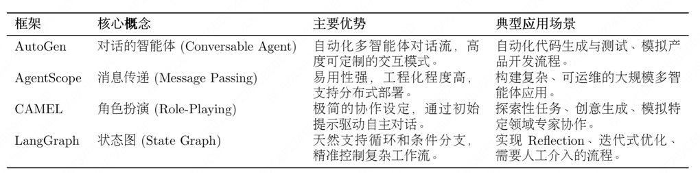
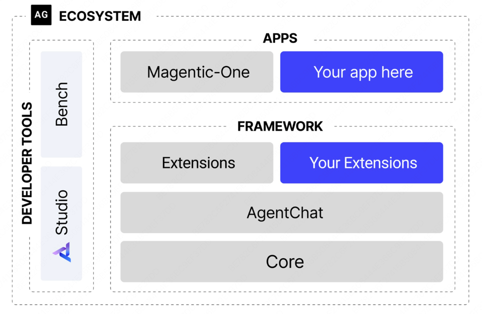
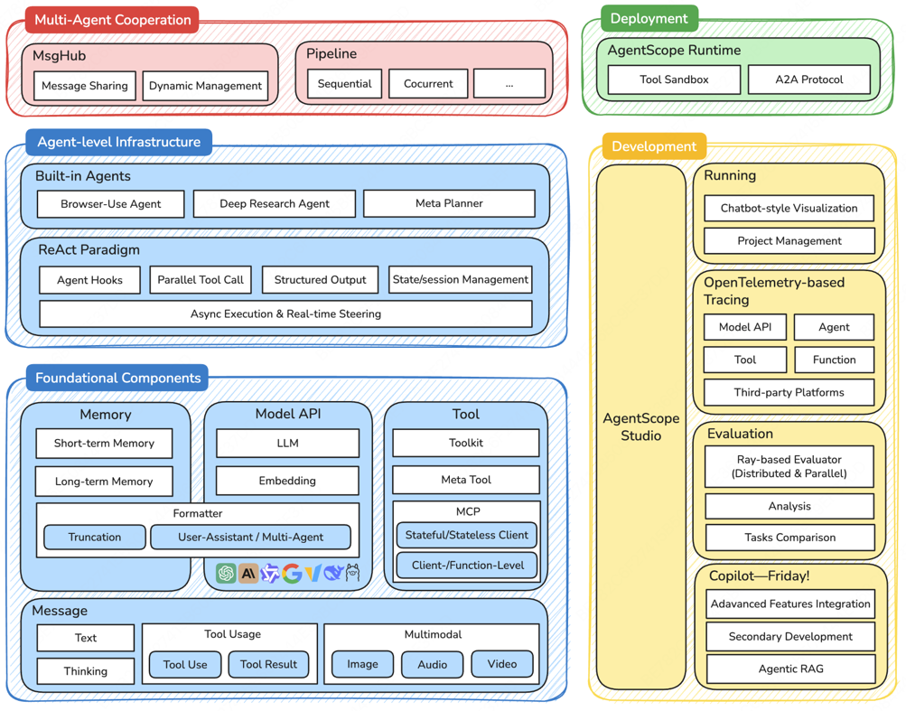

# 第六章 框架开发实践

## 6.1 从手动实现到框架开发

### 6.1.1 为何需要智能体框架

+ 提升代码复用与开发效率
+ 实现核心组件的解耦与可扩展性
  + 模型层
  + 工具层
  + 记忆层
+ 标准化复杂的状态管理
+ 简化可观测性与调试过程

### 6.1.2 主流框架的选型与对比



+ **AutoGen**：核心思想是通过对话实现协作。将多个智能体系统抽象为一个由多个可对话智能体组成的群聊。
+ **AgentScope**：专为多智能体应用设计的、功能全面的开发平台。核心特点是**易用性**和**工程化**。内置的消息传递机制和对分布式部署的支持，使其非常适合构建和运维复杂、大规模的多智能体系统。
+ **CAMEL**：提供了角色扮演的协作方法。核心理念是只需要为两个智能体设定好各自的角色和共同的任务目标，就能在**初始提示**的引导下，自主地进行多轮对话，相互启发、相互配合，共同完成任务。
+ **LangGraph**：LangChain生态的扩展，将智能体的执行流程建模为**图**。在传统的链式结构中，信息只能单向流动。LangGraph将每一步骤定义为图中的一个节点，并用边来定义节点之间的跳转逻辑。
                 天然支持循环，使得实现如Reflection的迭代、修正、自我反思的复杂工作流变得异常简单和直观。

## 6.2 框架一：AutoGen

### 6.2.1 AutoGen的核心机制



#### (1) 框架结构的演进
+ **分层设计**：框架被拆分为两个核心模块
  + autogen-core：作为框架的底层基础，封装了与语言模型交互、消息传递等核心功能。保证了框架的稳定性和扩展性
  + autogen-agentchat：构建在core之上，提供了用于开发对话式智能体应用的高级接口。简化了多智能体应用的开发流程。降低了系统的耦合度。
+ **异步优先**：新框架全面转向异步编程(async/await)。提升了并发处理能力和系统资源的利用效率。

#### (2) 核心智能体组件
+ **AssistantAgent(助理智能体)**：核心是封装了一个大型语言模型。通过不同的系统消息，为其赋予不同的专家角色。
+ **UserProxyAgent(用户代理智能体)**：AutoGen中功能独特的组件。扮演者双重角色，即是人类用户的代言人，负责发起任务和传达意图又是一个可靠的执行器。

#### (3) 从GroupChatManager到Team
+ **轮询群聊(RoundRobinGroupChat)**：明确的、顺序话的对话协调机制。会让参与的智能体按照预定义的顺序依次发言。
+ **工作流**：
  + 首先，创建一个RoundRobinGroupChat实例，并将所有参与协作的智能体(产品经理、工程师)加入其中。
  + 当一个任务开始时，群聊会按照预设的顺序，依次激活相应的智能体。
  + 被选中的智能体根据当前的对话上下文进行响应。
  + 群聊将新的回复加入对话历史，并激活下一个智能体。
  + 这个过程会持续进行，直到达到最大对话轮次或满足预设的终止条件。

### 6.2.2 软件开发团队

#### (1) 业务目标

实时显示比特币当前价格。覆盖了软件开发的典型环节：需求分析、技术选型、编码实现到代码审查和最终测试。

#### (2) 智能体团队角色

四个职责分明的智能体角色：
+ **ProductManager(产品经理)**：负责将用户的模糊需求转化为清晰、可执行的开发计划。
+ **Engineer(工程师)**：依据开发计划，负责编写具体的应用程序代码。
+ **CodeReviewer(代码审查员)**：负责审查工程师提交的代码，确保其质量、可读性和健壮性。
+ **UserProxy(用户代理)**：代表最终用户，发起初始任务，并负责执行和验证最终交付的代码。

### 6.2.3 核心代码实现

#### (1) 模型客户端配置

```python
import os
from autogen_ext.models.openai import OpenAIChatCompletionClient


def create_openai_model_client():
    """
    创建并配置OpenAI模型客户端
    """
    return OpenAIChatCompletionClient(
        model=os.getenv("LLM_MODEL_ID", "gpt-4o"),
        api_key=os.getenv("LLM_API_KEY"),
        base_url=os.getenv("LLM_BASE_URL", "https//api.openai.com/v1")
    )
```

#### (2) 智能体角色的定义

```python

def create_product_manager(model_client):
    """创建产品经理智能体"""
    system_message = """你是一位经验丰富的产品经理，专门负责软件产品的需求分析和项目规划。

你的核心职责包括：
1. **需求分析**：深入理解用户需求，识别核心功能和边界条件
2. **技术规划**：基于需求制定清晰的技术实现路径
3. **风险评估**：识别潜在的技术风险和用户体验问题
4. **协调沟通**：与工程师和其他团队成员进行有效沟通

当接到开发任务时，请按以下结构进行分析：
1. 需求理解与分析
2. 功能模块划分
3. 技术选型建议
4. 实现优先级排序
5. 验收标准定义

请简洁明了地回应，并在分析完成后说"请工程师开始实现"。"""

    return AssistantAgent(
        name="ProductManager",
        model_client=model_client,
        system_message=system_message
    )

def create_engineer(model_client):
    """创建软件工程智能体"""
    system_message = """你是一位资深的软件工程师，擅长 Python 开发和 Web 应用构建。

你的技术专长包括：
1. **Python 编程**：熟练掌握 Python 语法和最佳实践
2. **Web 开发**：精通 Streamlit、Flask、Django 等框架
3. **API 集成**：有丰富的第三方 API 集成经验
4. **错误处理**：注重代码的健壮性和异常处理

当收到开发任务时，请：
1. 仔细分析技术需求
2. 选择合适的技术方案
3. 编写完整的代码实现
4. 添加必要的注释和说明
5. 考虑边界情况和异常处理

请提供完整的可运行代码，并在完成后说"请代码审查员检查"。"""

    return AssistantAgent(
        name="Engineer",
        model_client=model_client,
        system_message=system_message
    )

def create_code_reviewer(model_client):
    """创建代码审查员智能体"""
    system_message = """你是一位经验丰富的代码审查专家，专注于代码质量和最佳实践。

你的审查重点包括：
1. **代码质量**：检查代码的可读性、可维护性和性能
2. **安全性**：识别潜在的安全漏洞和风险点
3. **最佳实践**：确保代码遵循行业标准和最佳实践
4. **错误处理**：验证异常处理的完整性和合理性

审查流程：
1. 仔细阅读和理解代码逻辑
2. 检查代码规范和最佳实践
3. 识别潜在问题和改进点
4. 提供具体的修改建议
5. 评估代码的整体质量

请提供具体的审查意见，完成后说"代码审查完成，请用户代理测试"。"""

    return AssistantAgent(
        name="CodeReviewer",
        model_client=model_client,
        system_message=system_message,
    )

def create_user_proxy():
    """创建用户代理智能体"""
    return UserProxyAgent(
        name="UserProxy",
        description="""用户代理，负责以下职责：
1. 代表用户提出开发需求
2. 执行最终的代码实现
3. 验证功能是否符合预期
4. 提供用户反馈和建议

完成测试后请回复 TERMINATE。""",
    )

```

#### (3) 定义团队协作流程
```python
from autogen_agentchat.teams import RoundRobinGroupChat
from autogen_agentchat.conditions import TextMentionTermination

# 定义团队聊天和协作规则
team_chat = RoundRobinGroupChat(
    participants=[
        product_manager,
        engineer,
        code_reviewer,
        user_proxy
    ],
    termination_condition=TextMentionTermination("TERMINATE"),
    max_turns=20
)
```
+ **参与者顺序**：participants列表的顺序决定了智能体发言的先后次序
+ **终止条件**：termination_condition是控制协作流程何时结束的关键。这个指令由UserProxy在完成最终测试后发出。
+ 最大轮次：max_turns是一个安全阀，用于防止对话陷入无限循环，避免不必要的资源消耗。

#### (4) 启动与运行

```python

# 由于AutoGen 采用异步架构，整个协作流程的启动和运行都在一个异步函数中完成
async def run_software_development_team():
    # ... 初始化客户端和智能体 ...
    
    # 定义任务描述
    task = """我们需要开发一个比特币价格显示应用，具体要求如下：
            核心功能：
            - 实时显示比特币当前价格（USD）
            - 显示24小时价格变化趋势（涨跌幅和涨跌额）
            - 提供价格刷新功能

            技术要求：
            - 使用 Streamlit 框架创建 Web 应用
            - 界面简洁美观，用户友好
            - 添加适当的错误处理和加载状态

            请团队协作完成这个任务，从需求分析到最终实现。"""
    
    # 异步执行团队协作，并流式输出对话过程
    result = await Console(team_chat.run_stream(task=task))
    return result

# 主程序入口
if __name__ == "__main__":
    result = asyncio.run(run_software_development_team())
```

### 6.2.4 AutoGen的优势与局限性

#### (1) 优势
+ 显著降低了复杂任务建模门槛。开发者可以将更多精力聚焦于定义谁做什么
+ 框架允许通过系统消息为每个智能体赋予高度专业化的角色，易维护和扩展
+ 对于流程化任务，RoundRobinGroupChat机制提供了清晰、可预测的协作流程。UserProxyAgent既可以作为任务的发起者，也可以是流程的监督者和最终的验收者。

#### (2) 局限性
+ 基于LLM的对话本质上具有不确定性。智能体可能会产生偏离预期的回复，导致对话走向意外的分支，甚至陷入循环。
+ 当智能体团队的工作结果未达到预期，调试过程可能非常棘手。需要排查一长串的历史对话

#### (3) 非OpenAI模型的配置

```python
from autogen_ext.models.openai import OpenAIChatCompletionClient

model_client = OpenAIChatCompletionClient(
    model="deepseek-chat",
    api_key=os.getenv("DEEPSEEK_API_KEY"),
    base_url="https://api.deepseek.com/v1",
    model_info={
        "function_calling": True,
        "max_tokens": 4096,
        "context_length": 32768,
        "vision": False,
        "json_output": True,
        "family": "deepseek",
        "structured_output": True,
    }
)
```

## 6.3 框架二：AgentScope
### 6.3.1 AgentScope的设计

AgentScope选择了**组合式架构**和**消息驱动**模式。提供了从开发、测试到部署的全生命周期支持。

#### (1) 分层架构体系



最底层是基础组建层，为整个框架提供了核心的构建块。message组件定义了统一的消息格式；Memory组件提供了短期和长期记忆管理；Model API层抽象了对不同大语言模型的调用；
而Tool组件则封装了智能体与外部世界交互的能力。

在基础组件之上，智能体基础设施层提供了更高级的抽象。支持**异步执行与实时控制**，包含了各种预构建的智能体，还实现了经典的ReAct范式，支持智能体钩子、并行工具调用、
状态挂历等高级特性。

多智能体协作层是AgentScope的核心创新。MsgHub作为消息中心，负责智能体间的消息路由和状态管理；Pipeline系统提供了灵活的工作流编排能力，支持顺序、并发等执行模式。

最上层的开发与部署层是工程化，AgentScope Runtime提供了生产级的运行时环境，AgentScope Studio则为开发者提供了完整的可视化开发者工具链。

#### (2) 消息驱动

AgentScope的核心创新在于其消息驱动架构。
```python
from agentscope.message import Msg

# 消息的标准结构
message = Msg(
    name="Alice",           # 发送者名称
    content="Hello, Bob!",  # 消息内容
    role="user",           # 角色类型
    metadata={             # 元数据信息
        "timestamp": "2024-01-15T10:30:00Z",
        "message_type": "text",
        "priority": "normal"
    }
)
```
将消息作为交互的基础单元的优势：
+ **异步解耦**：发送方和接收方在时间上解耦，天然支持高并发场景
+ **位置透明**：智能体无需关心另一个智能体是在本地进程还是在远程服务器上，消息系统会自动处理路由。
+ **可观测性**：每一条消息都可以被记录、追踪和分析，极大地简化了复杂系统的调试与监控。
+ **可靠性**：消息可以被持久化存储和重试，提升了系统的容错能力。

#### (3) 智能体生命周期管理

```python
from agentscope.agents import AgentBase

class CustomAgent(AgentBase):
    def __init__(self, name: str, **kwargs):
        super().__init__(name=name, **kwargs)
        # 智能体初始化逻辑
    
    def reply(self, x: Msg) -> Msg:
        # 智能体的核心响应逻辑
        response = self.model(x.content)
        return Msg(name=self.name, content=response, role="assistant")
    
    def observe(self, x: Msg) -> None:
        # 智能体的观察逻辑（可选）
        self.memory.add(x)

```

#### (4) 消息传递机制

+ 灵活的消息路由：支持点对点、广播、组播等多种通信模式，可以构建灵活复杂的交互网络
+ 消息持久化：确保了长期运行任务的状态可以被恢复。
+ 原生分布式支持：智能体背部署在不同的进程或服务器上，MsgHub会通过RPC远程过程调用自动处理跨界点的通信

### 6.3.2 三国狼人杀游戏

#### (1) 架构设计与核心组件

+ **游戏控制层**：负责维护全局状态(玩家存活列表、当前游戏阶段)、推进游戏流程(调用夜晚阶段、白天阶段)以及裁定胜负。
+ **智能体交互层**：所有智能体间的通信
+ **角色建模层**：


