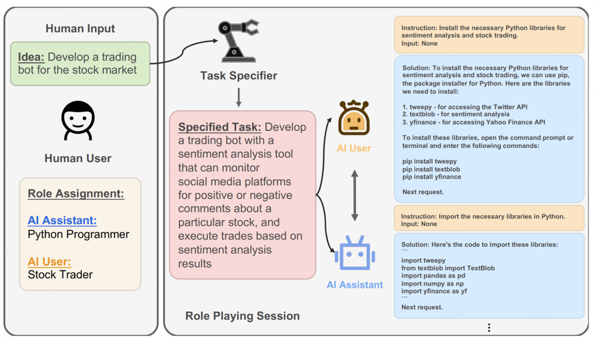

from camel.utils import print_text_animatedfrom camel.societies import RolePlayingfrom agentscope.pipeline import fanout_pipelinefrom agentscope.pipeline import fanout_pipeline

# 第六章 框架开发实践

## 6.1 从手动实现到框架开发

### 6.1.1 为何需要智能体框架

+ 提升代码复用与开发效率
+ 实现核心组件的解耦与可扩展性
  + 模型层
  + 工具层
  + 记忆层
+ 标准化复杂的状态管理
+ 简化可观测性与调试过程

### 6.1.2 主流框架的选型与对比


+ **AutoGen**：核心思想是通过对话实现协作。将多个智能体系统抽象为一个由多个可对话智能体组成的群聊。
+ **AgentScope**：专为多智能体应用设计的、功能全面的开发平台。核心特点是**易用性**和**工程化**。内置的消息传递机制和对分布式部署的支持，使其非常适合构建和运维复杂、大规模的多智能体系统。
+ **CAMEL**：提供了角色扮演的协作方法。核心理念是只需要为两个智能体设定好各自的角色和共同的任务目标，就能在**初始提示**的引导下，自主地进行多轮对话，相互启发、相互配合，共同完成任务。
+ **LangGraph**：LangChain生态的扩展，将智能体的执行流程建模为**图**。在传统的链式结构中，信息只能单向流动。LangGraph将每一步骤定义为图中的一个节点，并用边来定义节点之间的跳转逻辑。
                 天然支持循环，使得实现如Reflection的迭代、修正、自我反思的复杂工作流变得异常简单和直观。

## 6.2 框架一：AutoGen

### 6.2.1 AutoGen的核心机制


#### (1) 框架结构的演进
+ **分层设计**：框架被拆分为两个核心模块
  + autogen-core：作为框架的底层基础，封装了与语言模型交互、消息传递等核心功能。保证了框架的稳定性和扩展性
  + autogen-agentchat：构建在core之上，提供了用于开发对话式智能体应用的高级接口。简化了多智能体应用的开发流程。降低了系统的耦合度。
+ **异步优先**：新框架全面转向异步编程(async/await)。提升了并发处理能力和系统资源的利用效率。

#### (2) 核心智能体组件
+ **AssistantAgent(助理智能体)**：核心是封装了一个大型语言模型。通过不同的系统消息，为其赋予不同的专家角色。
+ **UserProxyAgent(用户代理智能体)**：AutoGen中功能独特的组件。扮演者双重角色，即是人类用户的代言人，负责发起任务和传达意图又是一个可靠的执行器。

#### (3) 从GroupChatManager到Team
+ **轮询群聊(RoundRobinGroupChat)**：明确的、顺序话的对话协调机制。会让参与的智能体按照预定义的顺序依次发言。
+ **工作流**：
  + 首先，创建一个RoundRobinGroupChat实例，并将所有参与协作的智能体(产品经理、工程师)加入其中。
  + 当一个任务开始时，群聊会按照预设的顺序，依次激活相应的智能体。
  + 被选中的智能体根据当前的对话上下文进行响应。
  + 群聊将新的回复加入对话历史，并激活下一个智能体。
  + 这个过程会持续进行，直到达到最大对话轮次或满足预设的终止条件。

### 6.2.2 软件开发团队

#### (1) 业务目标

实时显示比特币当前价格。覆盖了软件开发的典型环节：需求分析、技术选型、编码实现到代码审查和最终测试。

#### (2) 智能体团队角色

四个职责分明的智能体角色：
+ **ProductManager(产品经理)**：负责将用户的模糊需求转化为清晰、可执行的开发计划。
+ **Engineer(工程师)**：依据开发计划，负责编写具体的应用程序代码。
+ **CodeReviewer(代码审查员)**：负责审查工程师提交的代码，确保其质量、可读性和健壮性。
+ **UserProxy(用户代理)**：代表最终用户，发起初始任务，并负责执行和验证最终交付的代码。

### 6.2.3 核心代码实现

#### (1) 模型客户端配置

```python
import os
from autogen_ext.models.openai import OpenAIChatCompletionClient


def create_openai_model_client():
    """
    创建并配置OpenAI模型客户端
    """
    return OpenAIChatCompletionClient(
        model=os.getenv("LLM_MODEL_ID", "gpt-4o"),
        api_key=os.getenv("LLM_API_KEY"),
        base_url=os.getenv("LLM_BASE_URL", "https//api.openai.com/v1")
    )
```

#### (2) 智能体角色的定义

```python

def create_product_manager(model_client):
    """创建产品经理智能体"""
    system_message = """你是一位经验丰富的产品经理，专门负责软件产品的需求分析和项目规划。

你的核心职责包括：
1. **需求分析**：深入理解用户需求，识别核心功能和边界条件
2. **技术规划**：基于需求制定清晰的技术实现路径
3. **风险评估**：识别潜在的技术风险和用户体验问题
4. **协调沟通**：与工程师和其他团队成员进行有效沟通

当接到开发任务时，请按以下结构进行分析：
1. 需求理解与分析
2. 功能模块划分
3. 技术选型建议
4. 实现优先级排序
5. 验收标准定义

请简洁明了地回应，并在分析完成后说"请工程师开始实现"。"""

    return AssistantAgent(
        name="ProductManager",
        model_client=model_client,
        system_message=system_message
    )

def create_engineer(model_client):
    """创建软件工程智能体"""
    system_message = """你是一位资深的软件工程师，擅长 Python 开发和 Web 应用构建。

你的技术专长包括：
1. **Python 编程**：熟练掌握 Python 语法和最佳实践
2. **Web 开发**：精通 Streamlit、Flask、Django 等框架
3. **API 集成**：有丰富的第三方 API 集成经验
4. **错误处理**：注重代码的健壮性和异常处理

当收到开发任务时，请：
1. 仔细分析技术需求
2. 选择合适的技术方案
3. 编写完整的代码实现
4. 添加必要的注释和说明
5. 考虑边界情况和异常处理

请提供完整的可运行代码，并在完成后说"请代码审查员检查"。"""

    return AssistantAgent(
        name="Engineer",
        model_client=model_client,
        system_message=system_message
    )

def create_code_reviewer(model_client):
    """创建代码审查员智能体"""
    system_message = """你是一位经验丰富的代码审查专家，专注于代码质量和最佳实践。

你的审查重点包括：
1. **代码质量**：检查代码的可读性、可维护性和性能
2. **安全性**：识别潜在的安全漏洞和风险点
3. **最佳实践**：确保代码遵循行业标准和最佳实践
4. **错误处理**：验证异常处理的完整性和合理性

审查流程：
1. 仔细阅读和理解代码逻辑
2. 检查代码规范和最佳实践
3. 识别潜在问题和改进点
4. 提供具体的修改建议
5. 评估代码的整体质量

请提供具体的审查意见，完成后说"代码审查完成，请用户代理测试"。"""

    return AssistantAgent(
        name="CodeReviewer",
        model_client=model_client,
        system_message=system_message,
    )

def create_user_proxy():
    """创建用户代理智能体"""
    return UserProxyAgent(
        name="UserProxy",
        description="""用户代理，负责以下职责：
1. 代表用户提出开发需求
2. 执行最终的代码实现
3. 验证功能是否符合预期
4. 提供用户反馈和建议

完成测试后请回复 TERMINATE。""",
    )

```

#### (3) 定义团队协作流程
```python
from autogen_agentchat.teams import RoundRobinGroupChat
from autogen_agentchat.conditions import TextMentionTermination

# 定义团队聊天和协作规则
team_chat = RoundRobinGroupChat(
    participants=[
        product_manager,
        engineer,
        code_reviewer,
        user_proxy
    ],
    termination_condition=TextMentionTermination("TERMINATE"),
    max_turns=20
)
```
+ **参与者顺序**：participants列表的顺序决定了智能体发言的先后次序
+ **终止条件**：termination_condition是控制协作流程何时结束的关键。这个指令由UserProxy在完成最终测试后发出。
+ 最大轮次：max_turns是一个安全阀，用于防止对话陷入无限循环，避免不必要的资源消耗。

#### (4) 启动与运行

```python

# 由于AutoGen 采用异步架构，整个协作流程的启动和运行都在一个异步函数中完成
async def run_software_development_team():
    # ... 初始化客户端和智能体 ...
    
    # 定义任务描述
    task = """我们需要开发一个比特币价格显示应用，具体要求如下：
            核心功能：
            - 实时显示比特币当前价格（USD）
            - 显示24小时价格变化趋势（涨跌幅和涨跌额）
            - 提供价格刷新功能

            技术要求：
            - 使用 Streamlit 框架创建 Web 应用
            - 界面简洁美观，用户友好
            - 添加适当的错误处理和加载状态

            请团队协作完成这个任务，从需求分析到最终实现。"""
    
    # 异步执行团队协作，并流式输出对话过程
    result = await Console(team_chat.run_stream(task=task))
    return result

# 主程序入口
if __name__ == "__main__":
    result = asyncio.run(run_software_development_team())
```

### 6.2.4 AutoGen的优势与局限性

#### (1) 优势
+ 显著降低了复杂任务建模门槛。开发者可以将更多精力聚焦于定义谁做什么
+ 框架允许通过系统消息为每个智能体赋予高度专业化的角色，易维护和扩展
+ 对于流程化任务，RoundRobinGroupChat机制提供了清晰、可预测的协作流程。UserProxyAgent既可以作为任务的发起者，也可以是流程的监督者和最终的验收者。

#### (2) 局限性
+ 基于LLM的对话本质上具有不确定性。智能体可能会产生偏离预期的回复，导致对话走向意外的分支，甚至陷入循环。
+ 当智能体团队的工作结果未达到预期，调试过程可能非常棘手。需要排查一长串的历史对话

#### (3) 非OpenAI模型的配置

```python
from autogen_ext.models.openai import OpenAIChatCompletionClient

model_client = OpenAIChatCompletionClient(
    model="deepseek-chat",
    api_key=os.getenv("DEEPSEEK_API_KEY"),
    base_url="https://api.deepseek.com/v1",
    model_info={
        "function_calling": True,
        "max_tokens": 4096,
        "context_length": 32768,
        "vision": False,
        "json_output": True,
        "family": "deepseek",
        "structured_output": True,
    }
)
```

## 6.3 框架二：AgentScope
### 6.3.1 AgentScope的设计

AgentScope选择了**组合式架构**和**消息驱动**模式。提供了从开发、测试到部署的全生命周期支持。

#### (1) 分层架构体系


最底层是基础组建层，为整个框架提供了核心的构建块。message组件定义了统一的消息格式；Memory组件提供了短期和长期记忆管理；Model API层抽象了对不同大语言模型的调用；
而Tool组件则封装了智能体与外部世界交互的能力。

在基础组件之上，智能体基础设施层提供了更高级的抽象。支持**异步执行与实时控制**，包含了各种预构建的智能体，还实现了经典的ReAct范式，支持智能体钩子、并行工具调用、
状态挂历等高级特性。

多智能体协作层是AgentScope的核心创新。MsgHub作为消息中心，负责智能体间的消息路由和状态管理；Pipeline系统提供了灵活的工作流编排能力，支持顺序、并发等执行模式。

最上层的开发与部署层是工程化，AgentScope Runtime提供了生产级的运行时环境，AgentScope Studio则为开发者提供了完整的可视化开发者工具链。

#### (2) 消息驱动

AgentScope的核心创新在于其消息驱动架构。
```python
from agentscope.message import Msg

# 消息的标准结构
message = Msg(
    name="Alice",           # 发送者名称
    content="Hello, Bob!",  # 消息内容
    role="user",           # 角色类型
    metadata={             # 元数据信息
        "timestamp": "2024-01-15T10:30:00Z",
        "message_type": "text",
        "priority": "normal"
    }
)
```
将消息作为交互的基础单元的优势：
+ **异步解耦**：发送方和接收方在时间上解耦，天然支持高并发场景
+ **位置透明**：智能体无需关心另一个智能体是在本地进程还是在远程服务器上，消息系统会自动处理路由。
+ **可观测性**：每一条消息都可以被记录、追踪和分析，极大地简化了复杂系统的调试与监控。
+ **可靠性**：消息可以被持久化存储和重试，提升了系统的容错能力。

#### (3) 智能体生命周期管理

```python
from agentscope.agents import AgentBase

class CustomAgent(AgentBase):
    def __init__(self, name: str, **kwargs):
        super().__init__(name=name, **kwargs)
        # 智能体初始化逻辑
    
    def reply(self, x: Msg) -> Msg:
        # 智能体的核心响应逻辑
        response = self.model(x.content)
        return Msg(name=self.name, content=response, role="assistant")
    
    def observe(self, x: Msg) -> None:
        # 智能体的观察逻辑（可选）
        self.memory.add(x)

```

#### (4) 消息传递机制

+ 灵活的消息路由：支持点对点、广播、组播等多种通信模式，可以构建灵活复杂的交互网络
+ 消息持久化：确保了长期运行任务的状态可以被恢复。
+ 原生分布式支持：智能体背部署在不同的进程或服务器上，MsgHub会通过RPC远程过程调用自动处理跨界点的通信

### 6.3.2 三国狼人杀游戏

#### (1) 架构设计与核心组件

+ **游戏控制层**：负责维护全局状态(玩家存活列表、当前游戏阶段)、推进游戏流程(调用夜晚阶段、白天阶段)以及裁定胜负。
+ **智能体交互层**：所有智能体间的通信
+ **角色建模层**：每个玩家都是基于DialogAgent的实例，为每个智能体注入了游戏角色和三国人格的双重身份。

#### (2) 消息驱动的游戏流程

核心设计是消息驱动代替状态机来管理游戏流程。传统实现中，游戏阶段的转换通常由一个中心化的状态机控制。
在AgentScope的范式下，游戏流程被自然地建模为一系列定义好的消息交互模式。

```python
async def werewolf_phase(self, round_num: int):
    """狼人阶段 - 展示消息驱动的协作模式"""
    if not self.werewoleves:
        return None
    
    # 通过消息中心建立狼人专属通信频道
    async with MsgHub(
        self.werewoleves,
        enable_auto_broadcast=True,
        announcement=await self.moderator.announce(
            f"狼人们，请讨论今晚的击杀目标。存活玩家: {format_player_list(self.alive_players)}"
        ),
    ) as werewolves_hub:
        # 讨论阶段：狼人通过消息交换策略
        for _ in range(MAX_DISCUSSION_ROUND):
            for wolf in self.werewoleves:
                await wolf(structured_model=DiscussionModelCN)
        
        # 投票阶段：收集并统计狼人的击杀决策
        werewolves_hub.set_auto_broadcast(False)
        kill_votes = await fanout_pipeline(
            self.werewoleves,
            msg=await self.moderator.announce("请选择击杀目标"),
            structured_model=WerewolfKillModelCN,
            enable_gather=False
        )
```

#### (3) 用结构化输出约束游戏规则
```python
from pydantic import BaseModel, Field
from typing import Optional

class DiscussionModelCN(BaseModel):
    """讨论阶段的输出格式"""
    reach_agreement: bool = Field(
        description="是否已达成一致",
        default=False
    )
    confidence_level: int = Field(
        description="对当前推理的信心程度(1-10)",
        ge=1,
        le=10,
        default=5
    )
    key_evidence: Optional[str] = Field(
        description="支持你观点的关键证据",
        default=None
    )

    
class WitchActionModelCN(BaseModel):
    """女巫行动的输出格式"""
    use_antidote: bool = Field(description="是否使用解药")
    use_poison: bool = Field(description="是否使用毒药")
    target_name: bool = Field(description="毒药目标玩家姓名")

```

#### (4) 角色建模的双重挑战

```python
def get_role_prompt(role: str, character: str) -> str:
    """获取角色提示词 - 融合游戏规则与人物性格"""
    base_prompt = f"""你是{character}, 在这场三国狼人杀游戏中扮演{role}。
重要规则：
1. 你只能通过对话和推理参与游戏
2. 不要尝试调用任何外部工具或函数
3. 严格按照要求的JSON格式回复

角色特点：
"""
    if role == "狼人":
        return base_prompt + f"""
- 你是狼人阵营，目标是消灭所有好人
- 夜晚可以与其他狼人协商击杀目标
- 白天要隐藏身份，误导好人
- 以{character}的性格说话和行动
"""
```

#### (5) 并发处理与容错机制

```python
# 并行收集所有玩家的投票决策
# fanout_pipeline 允许我们并行地向所有智能体发送相同的消息，并异步收集它们的响应。
vote_msgs = await fanout_pipeline(
    self.alive_players,
    await self.moderator.announce("请投票选择要淘汰的玩家"),
    structured_model=get_vote_model_cn(self.alive_players),
    enable_gather=False
)

# 在关键环节加入容错处理
try:
    response = await wolf(
        "请分析当前局势并表达你的观点",
        structured_model=DiscussionModelCN
    )
except Exception as e:
    print(f"{wolf.name} 讨论时出错：{e}")
    # 创建默认响应，确保游戏继续进行
    default_response = DiscussionModelCN(
        reach_agreement=False,
        confidence_level=5,
        key_evidence="暂时无法分析"
    )
```

### 6.3.3 AgentScope的优势与局限性分析

以消息驱动的框架为核心，将复杂的游戏流程优雅地映射为一系列并发、异步的消息传递事件，从而避免了传统状态机的僵硬与复杂。

其消息驱动架构虽然强大，但对开发者的技术要求较高，需要理解异步编程、分布式通信等概念。对于简单的多智能体对话场景，这种架构可能显得过于复杂，存在"过度工程化"的风险。

## 6.4 框架三：CAMEL

### 6.4.1 CAMEL的自主协作

两大核心：**角色扮演**和**引导性提示**

#### (1) 角色扮演

一个任务通常由两个智能体协作完成。一个扮演AI用户，一个扮演AI助理。

#### (2) 引导性提示

引导性提示是在对话开始前，分别给两个智能体注入一段精心设计的、结构化的初始指令。

+ 明确自身角色
+ 告知协作者角色
+ 定义共同目标
+ 设定行为约束和沟通协议



### 6.4.2 AI科普电子书

#### (1) 任务设定

**场景设定**：创作一本面向普通读者的拖延症心理学科普电子书，要求既有科学严谨性，又具有良好的可读性。
**智能体角色**：
+ 心理学家：具备深厚的心理学理论基础，熟悉认知行为科学、神经科学等相关领域，能够提供专业的学术见解和实证研究支持。
+ 作家：拥有优秀的写作技巧和叙述能力，善于将复杂的学术概念转化为生动易懂的文字，注重读者体验和内容的可读性。

#### (2) 定义协作任务

```python
from colorama import Fore
from camel.societies import RolePlaying
from camel.utils import print_text_animated
from camel.models import ModelFactory
from camel.types import ModelPlatformType
from dotenv import load_dotenv
import os


load_dotenv()
LLM_API_KEY = os.getenv("LLM_API_KEY")
LLM_BASE_URL = os.getenv("LLM_BASE_URL")
LLM_MODEL = os.getenv("LLM_MODEL")

# 创建模型，以Qwen为例，调用的百炼大模型平台
model = ModelFactory.create(
    model_platform=ModelPlatformType.QWEN,
    model_type=LLM_MODEL,
    url=LLM_BASE_URL,
    api_key=LLM_API_KEY
)

# 定义协作任务
task_prompt = """
创作一本关于"拖延症心理学"的短篇电子书，目标读者是对心理学感兴趣的普通大众。
要求：
1. 内容科学严谨，基于实证研究
2. 语言通俗易懂，避免过多专业术语
3. 包含实用的改善建议和案例分析
4. 篇幅控制在8000-10000字
5. 结构清晰，包含引言、核心章节和总结
"""

print(Fore.YELLOW + f"协作任务:\n{task_prompt}\n")
```

#### (3) 初始化角色扮演社会

```python
# 初始化角色扮演会话
# AI作家作为"user"，负责提出写作结构和要求
# AI心理学家作为"assistant"，负责提供专业知识和内容
role_play_session = RolePlaying(
    assistant_role_name="心理学家",
    user_role_name="作家",
    task_prompt=task_prompt,
    model=model,
    with_task_specify=False
)
```

#### (4) 启动并运行自动化对话
```python
# 开始协作对话
chat_turn_limit,n = 30, 0
# 调用 init_chat() 来获得由AI生成初始对话消息
input_msg = role_play_session.init_chat()

while n < chat_turn_limit:
    n += 1
    # step() 方法驱动一轮完整的对话，AI用户和AI助理各发言一次
    assistant_response, user_response = role_play_session.step(input_msg)
    
    # 检查是否有消息返回，防止对话提前终止
    if assistant_response.msg is None or user_response.msg is None:
        break

    print_text_animated(Fore.BLUE + f"作家 (AI User):\n\n{user_response.msg.content}\n")
    print_text_animated(Fore.GREEN + f"心理学家 (AI Assistant):\n\n{assistant_response.msg.content}\n")

    # 检查任务完成状态
    if "<CAMEL_TASK_DONE>" in user_response.msg.content or "<CAMEL_TASK_DONE>" in assistant_response.msg.content:
        print(Fore.MAGENTA + "✅电子书创作完成")
        break
    
    # 将助理的回复作为下一轮对话的输入
    input_msg = assistant_response.msg

print(Fore.YELLOW + f"总共进行了 {n} 轮协作对话")
```

### 6.4.3 CAMEL 的优势与局限性分析

#### (1) 优势
最大的优势在于**轻架构、重提示**
具备的能力：
+ **多模态能力**
+ **工具集成**
+ **模型适配**
+ **生态联动**

#### (2) 主要局限性
1.对提示工程的高度依赖
+ 提示设计门槛：要深入理解目标领域和LLM的行为特性
+ 调试复杂性：协作效果不佳时，很难定位问题
+ 一致性挑战：不同的LLM对相同提示的理解存在差异

2.协作规模的限制
+ 对话管理：缺乏像AutoGen那样的复杂对话路由机制。
+ 状态同步：没有AgentScope那样的分布式状态管理能力
+ 冲突解决：当多个智能体意见分歧时，缺乏有效的仲裁机制

3.任务适用性的边界
+ 严格流程控制：对于需要精确步骤控制的任务，LangGraph的图结构更合适
+ 大规模并发：AgentScope的消息驱动架构在高并发场景下更有优势
+ 复杂决策树：AutoGen的群聊模式在多方决策场景下更加灵活

## 6.5 框架四：LangGraph

### 6.5.1 LangGraph 的结构梳理

LangGraph将智能体的执行流程建模为一种**状态机**，并将其表示为**有向图**。图的节点代表一个具体的计算步骤，边则定义了一个节点到另一个节点的跳转逻辑。支持循环。

```python
"""首先，是全局状态State"""
from typing import TypedDict, List

# 定义全局状态的数据结构
class AgentState(TypedDict):
    messages: List[str]     # 对话历史
    current_task: str       # 当前任务
    final_answer: str       # 最终答案


"""其次，是节点Nodes"""
# 定义一个规划者节点函数
def planner_node(state: AgentState) -> AgentState:
    """根据当前任务制定计划，并更新状态。"""
    current_task = state["current_task"]
    # ...调用LLM生成计划 ...
    plan = f"为任务 '{current_task}' 生成的计划..."

    # 将新消息追加到状态中
    state["messages"].append(plan)
    return state

# 定义一个执行者节点函数
def executor_node(state: AgentState) -> AgentState:
    """执行最新计划，并更新状态。"""
    latest_plan = state["messages"][-1]
    # ... 执行计划并获得结果 ...
    result = f"执行计划 '{latest_plan}' 的结果..."
    state["messages"].append(result)
    return state

"""最后，是边Edges"""
def should_continue(state: AgentState) -> str:
    """条件函数：根据状态决定下一步路由。"""
    # 假设如果消息少于3条，则需要继续规划
    if len(state["messages"]) < 3:
        # 返回的字符串需要与添加条件边时定义的键匹配
        return "continue_to_planner"
    else:
        state["final_answer"] = state["messages"][-1]
        return "end_workflow"

from langgraph.graph import StateGraph, END

# 初始化一个状态图，并绑定我们定义的状态结构
workflow = StateGraph(AgentState)

# 将节点函数添加到图中
workflow.add_node("planner", planner_node)
workflow.add_node("executor", executor_node)

# 设置图的入口点
workflow.set_entry_point("planner")

# 添加常规边，连接 planner 和 executor
workflow.add_edge("planner", "executor")

# 添加条件边，实现动态路由
workflow.add_conditional_edges(
    # 起始节点
    "executor",
    # 判断函数
    should_continue,
    # 路由映射：将判断函数的返回值映射到目标节点
    {
        "continue_to_planner": "planner", # 如果返回"continue_to_planner"，则跳回planner节点
        "end_workflow": END               # 如果返回"end_workflow"，则结束流程
    }
)

# 编译图，生成可执行的应用
app = workflow.compile()

# 运行图
inputs = {"current_task": "分析最近的AI行业新闻", "messages": []}
for event in app.stream(inputs):
    print(event)
```

### 6.5.2 三步问答助手

+ **理解**：分析用户的查询意图
+ **搜索**：模拟搜索与意图相关的信息
+ **回答**：基于意图和搜索到的信息，生成最终答案

#### (1) 定义全局状态


